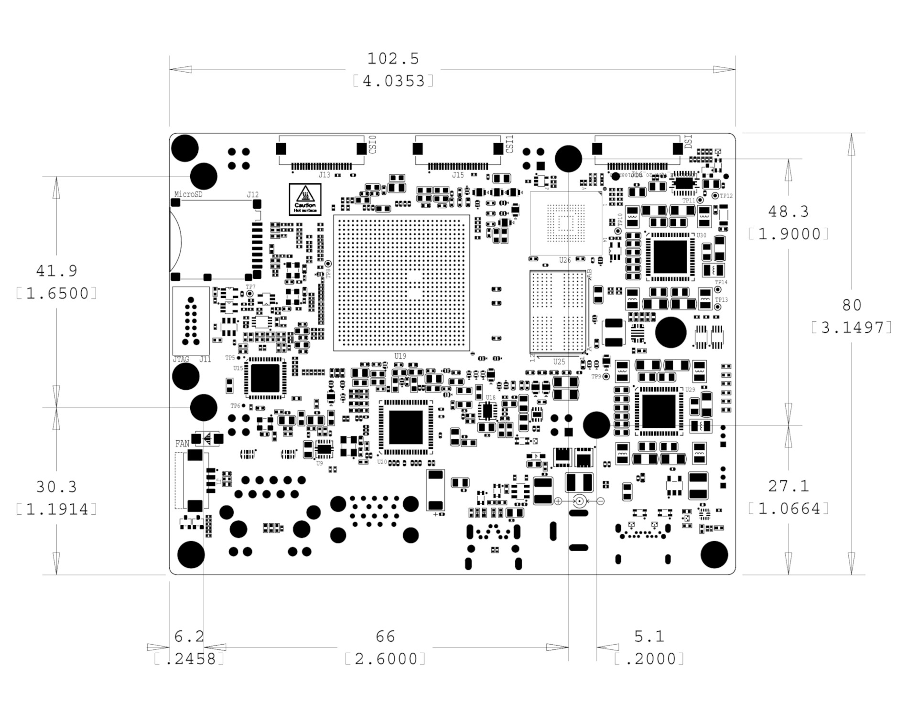

.. _section-9,Section 9.0 BeagleBone AI-64 Mechanical:

BeagleBone AI-64 Mechanical
#############################

.. _dimensions-and-weight:

Dimensions and Weight
------------------------------------

Size: 102.5 x 80 (4" x 3.15")

Max height: #TODO#

PCB Layers: #TODO#

PCB thickness: 2mm (0.08")

RoHS Compliant: Yes

Weight: 192gm

.. _silkscreen-and-component-locations:

Silkscreen and Component Locations
------------------------------------

   Fig: Board Dimensions

.. figure:: images/ch09/top-silkscreen.png
   :width: 400px
   :align: center 
   :alt: Fig: Top silkscreen

   Fig: Top silkscreen

.. figure:: images/ch09/bottom-silkscreen.png
   :width: 400px
   :align: center 
   :alt: Fig: Bottom silkscreen

   Fig: Bottom silkscreen
