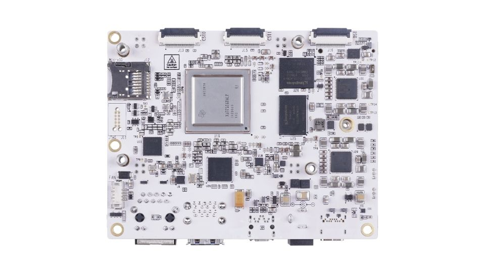
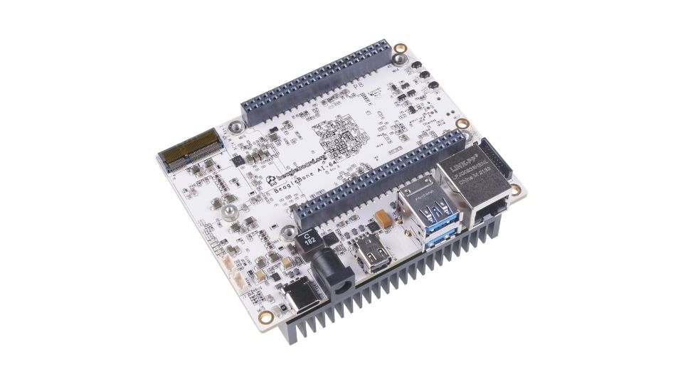
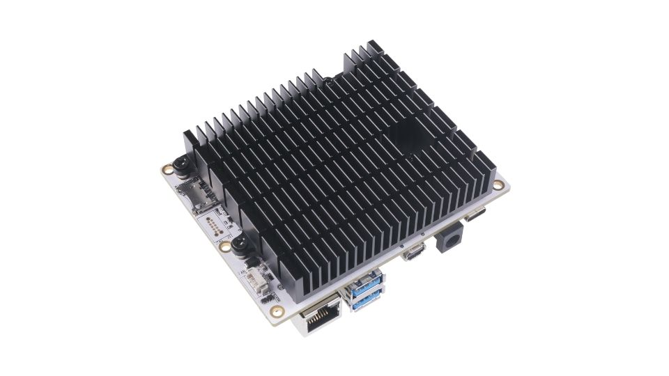

.. _pictures:

Pictures
##########

.. figure:: images/ch10/front.jpg
   :width: 400px
   :align: center 
   :alt: Fig: BeagleBone AI-64 front

   Fig: BeagleBone AI-64 front

   Fig: BeagleBone AI-64 back

.. figure:: images/ch10/back-heatsink.jpg
   :width: 400px
   :align: center 
   :alt: Fig: BeagleBone AI-64 back with heatsink

   Fig: BeagleBone AI-64 back with heatsink

   Fig: BeagleBone AI-64 front at 45° angle

.. figure:: images/ch10/45-back.jpg
   :width: 400px
   :align: center 
   :alt: Fig: BeagleBone AI-64 back at 45° angle

   Fig: BeagleBone AI-64 back at 45° angle

   Fig: BeagleBone AI-64 back with heatsink at 45° angle

.. figure:: images/ch10/feature.jpg
   :width: 400px
   :align: center 
   :alt: Fig: BeagleBone AI-64 ports

   Fig: BeagleBone AI-64 ports

