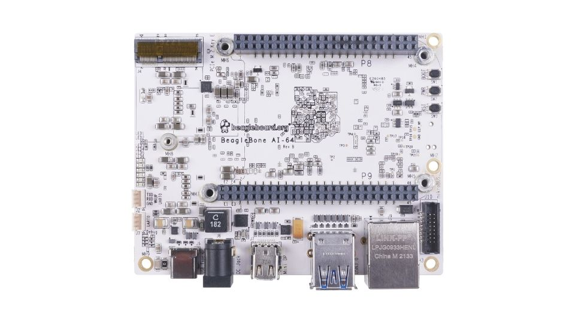
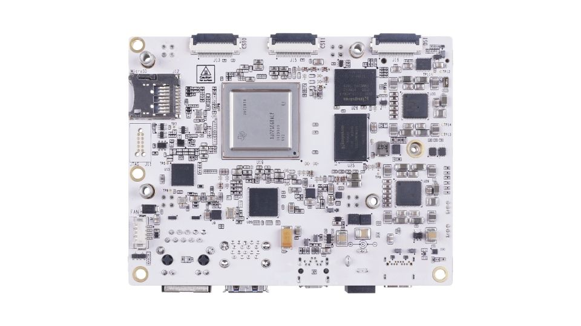
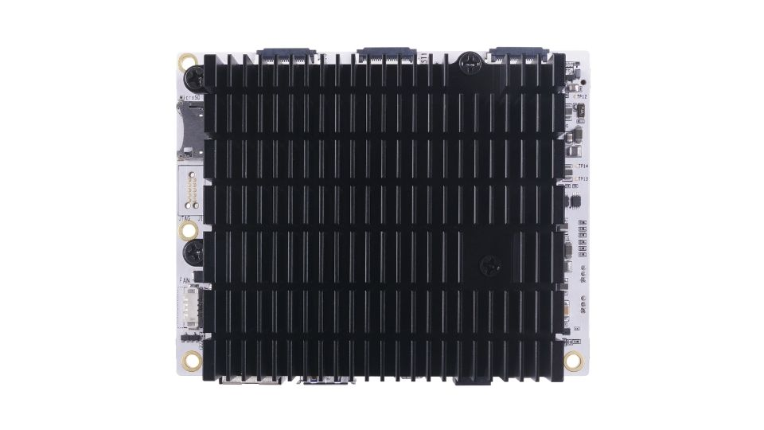
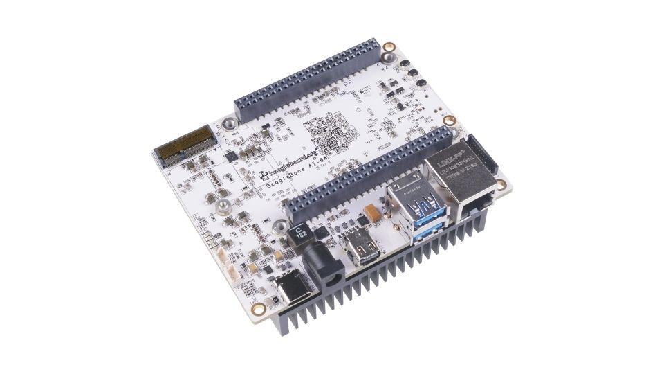
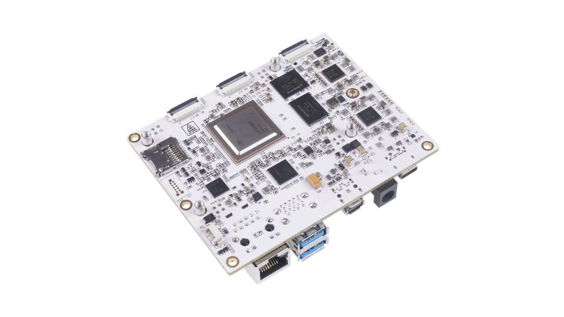
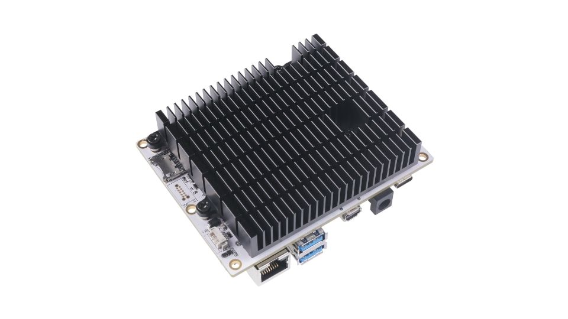
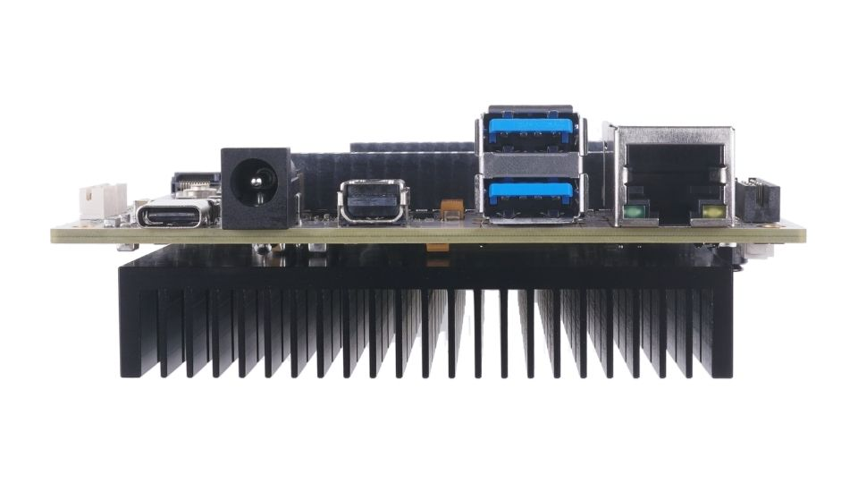

.. _pictures:

Pictures
##########

   Fig: BeagleBone AI-64 front

   Fig: BeagleBone AI-64 back

   Fig: BeagleBone AI-64 back with heatsink

   Fig: BeagleBone AI-64 front at 45° angle

   Fig: BeagleBone AI-64 back at 45° angle

   Fig: BeagleBone AI-64 back with heatsink at 45° angle

   Fig: BeagleBone AI-64 ports

