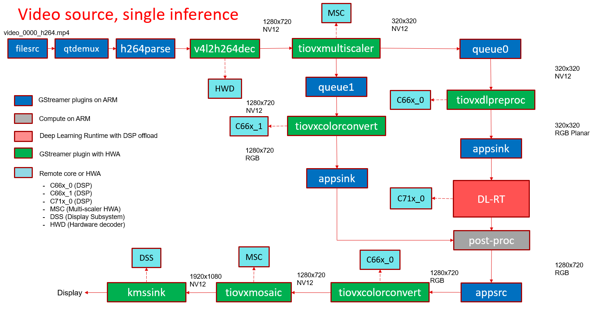

.. _ai_64_edgeai_datasheet:

Datasheet
##########

This chapter describes the performance measurements of the Edge AI Inference
demos.

Performance data of the demos can be auto generated by running following
command on target:

.. code-block:: bash

    debian@beaglebone:/opt/edge_ai_apps/tests# ./gen_data_sheet.sh

The performence measurements includes the following

#. **FPS** : Effective framerate at which the application runs
#. **Total time** : Average time taken to process each frame, which includes
   pre-processing, inference and post-processing time
#. **Inference time** : Average time taken to infer each frame
#. **CPU loading** : Loading on different CPU cores present
#. **DDR BW** : DDR read and write BW used
#. **HWA Loading** : Loading on different Hardware accelerators present

Following are the latest performance numbers of the C++ demos:

Source             : **USB Camera**
====================================

Capture Framerate  : **30 fps**
Resolution         : **720p**
format             : **JPEG**

.. figure:: ./images/edgeai_object_detection.png
   :scale: 60
   :align: center

   GStreamer based data-flow pipeline with USB camera input and display output

.. csv-table::
    :header: "Model", "FPS", "Total time (ms)", "Inference time (ms)", "A72 Load (%)", "DDR Read BW (MB/s)", "DDR Write BW (MB/s)", "DDR Total BW (MB/s)", "C71 Load (%)", "C66_1 Load (%)", "C66_2 Load (%) ", "MCU2_0 Load (%)", "MCU2_1 Load (%)", "MSC_0 (%)", "MSC_1 (%)", "VISS (%)", "NF (%)", "LDC (%)", "SDE (%)", "DOF (%)"

    ONR-CL-6150-mobileNetV2-1p4-qat,30.80,33.22,3.02,21.60,1596,619,2215,9.0,20.0,9.0,6.0,1.0,22.17,0,0,0,0,0,0
    TFL-CL-0000-mobileNetV1-mlperf,30.69,33.19,1.04,15.93,1425,563,1988,5.0,22.0,9.0,6.0,1.0,21.90,0,0,0,0,0,0
    TFL-OD-2020-ssdLite-mobDet-DSP-coco-320x320,30.69,33.25,5.00,10.24,1534,570,2104,15.0,29.0,9.0,6.0,1.0,22.67,0,0,0,0,0,0
    TVM-CL-3410-gluoncv-mxnet-mobv2,30.58,33.21,2.02,22.80,1522,617,2139,6.0,20.0,9.0,6.0,1.0,21.84,0,0,0,0,0,0

Source             : **Video**
==============================

Video Framerate    : **30 fps**
Resolution         : **720p**
Encoding           : **h264**

   GStreamer based data-flow pipeline with video file input source and display output

.. csv-table::
    :header: "Model", "FPS", "Total time (ms)", "Inference time (ms)", "A72 Load (%)", "DDR Read BW (MB/s)", "DDR Write BW (MB/s)", "DDR Total BW (MB/s)", "C71 Load (%)", "C66_1 Load (%)", "C66_2 Load (%) ", "MCU2_0 Load (%)", "MCU2_1 Load (%)", "MSC_0 (%)", "MSC_1 (%)", "VISS (%)", "NF (%)", "LDC (%)", "SDE (%)", "DOF (%)"

    ONR-CL-6150-mobileNetV2-1p4-qat,30.52,33.46,3.03,14.28,990,403,1393,2.0,7.0,4.0,1.0,1.0,10.27,0,0,0,0,0,0
    TFL-CL-0000-mobileNetV1-mlperf,30.77,33.47,1.07,30.76,746,97,843,2.0,2.0,1.0,1.0,1.0,15.76,0,0,0,0,0,0
    TFL-OD-2020-ssdLite-mobDet-DSP-coco-320x320,30.56,33.54,5.06,22.58,736,92,828,2.0,2.0,1.0,1.0,1.0,16.9,0,0,0,0,0,0
    TVM-CL-3410-gluoncv-mxnet-mobv2,30.64,33.47,2.01,33.33,712,110,822,1.0,1.0,0.0,1.0,1.0,15.3,0,0,0,0,0,0

Source             : **CSI Camera (ov5640)**
============================================

Capture Framerate  : **30 fps**
Resolution         : **720p**
format             : **YUYV**

.. figure:: ./images/edgeai_ov5640_camera_source.png
   :scale: 60
   :align: center

   GStreamer based data-flow pipeline for with CSI camera (OV5640) input and display output

.. csv-table::
    :header: "Model", "FPS", "Total time (ms)", "Inference time (ms)", "A72 Load (%)", "DDR Read BW (MB/s)", "DDR Write BW (MB/s)", "DDR Total BW (MB/s)", "C71 Load (%)", "C66_1 Load (%)", "C66_2 Load (%) ", "MCU2_0 Load (%)", "MCU2_1 Load (%)", "MSC_0 (%)", "MSC_1 (%)", "VISS (%)", "NF (%)", "LDC (%)", "SDE (%)", "DOF (%)"

    ONR-CL-6150-mobileNetV2-1p4-qat,29.57,34.09,3.02,12.21,1671,699,2370,8.0,45.0,9.0,6.0,1.0,21.35,0,0,0,0,0,0
    TFL-CL-0000-mobileNetV1-mlperf,29.41,34.15,1.01,10.27,1502,645,2147,5.0,47.0,9.0,6.0,1.0,20.96,0,0,0,0,0,0
    TFL-OD-2020-ssdLite-mobDet-DSP-coco-320x320,29.36,34.65,5.00,10.5,1610,655,2265,14.0,53.0,9.0,6.0,1.0,21.47,0,0,0,0,0,0
    TVM-CL-3410-gluoncv-mxnet-mobv2,29.38,34.17,2.01,11.66,1596,698,2294,6.0,45.0,9.0,5.0,1.0,21.10,0,0,0,0,0,0

Source             : **CSI Camera with VISS (imx219)**
======================================================

Capture Framerate  : **30 fps**
Resolution         : **1080p**
format             : **SRGGB8**

.. figure:: ./images/edgeai_rpi_camera_source.png
   :scale: 60
   :align: center

   GStreamer based data-flow pipeline with IMX219 sensor, ISP and display

.. csv-table::
    :header: "Model", "FPS", "Total time (ms)", "Inference time (ms)", "A72 Load (%)", "DDR Read BW (MB/s)", "DDR Write BW (MB/s)", "DDR Total BW (MB/s)", "C71 Load (%)", "C66_1 Load (%)", "C66_2 Load (%) ", "MCU2_0 Load (%)", "MCU2_1 Load (%)", "MSC_0 (%)", "MSC_1 (%)", "VISS (%)", "NF (%)", "LDC (%)", "SDE (%)", "DOF (%)"

    ONR-CL-6150-mobileNetV2-1p4-qat,30.64,33.19,3.01,15.72,1781,853,2634,9.0,16.0,9.0,13.0,1.0,31.78,0,22.37,0,0,0,0
    TFL-CL-0000-mobileNetV1-mlperf,30.59,33.14,1.04,12.78,1612,798,2410,5.0,18.0,9.0,13.0,1.0,31.65,0,22.31,0,0,0,0
    TFL-OD-2020-ssdLite-mobDet-DSP-coco-320x320,30.56,33.07,5.00,13.30,1730,809,2539,15.0,25.0,9.0,13.0,1.0,32.6,0,22.19,0,0,0,0
    TVM-CL-3410-gluoncv-mxnet-mobv2,30.48,33.14,2.01,12.91,1708,852,2560,7.0,16.0,9.0,13.0,1.0,31.83,0,22.26,0,0,0,0

Source             : **IMX390 over FPD-Link**
=============================================

Capture Framerate  : **30 fps**
Resolution         : **1080p**
format             : **SRGGB12**

.. figure:: ./images/edgeai_imx390_camera_source.png
   :scale: 60
   :align: center

   GStreamer based data-flow pipeline with IMX390 sensor, ISP, LDC and display

.. csv-table::
    :header: "Model", "FPS", "Total time (ms)", "Inference time (ms)", "A72 Load (%)", "DDR Read BW (MB/s)", "DDR Write BW (MB/s)", "DDR Total BW (MB/s)", "C71 Load (%)", "C66_1 Load (%)", "C66_2 Load (%) ", "MCU2_0 Load (%)", "MCU2_1 Load (%)", "MSC_0 (%)", "MSC_1 (%)", "VISS (%)", "NF (%)", "LDC (%)", "SDE (%)", "DOF (%)"

    ONR-CL-6150-mobileNetV2-1p4-qat,30.59,33.15,3.09,25.18,2207,1102,3309,10.0,16.0,9.0,14.0,1.0,31.73,0,22.94,0,10.8,0,0
    TFL-CL-0000-mobileNetV1-mlperf,30.53,33.15,1.21,16.20,2019,1040,3059,5.0,18.0,9.0,15.0,1.0,32.80,0,23.34,0,10.10,0,0
    TFL-OD-2020-ssdLite-mobDet-DSP-coco-320x320,30.43,33.13,5.02,23.7,2201,1067,3268,15.0,25.0,9.0,14.0,1.0,32.80,0,22.88,0,9.95,0
    TVM-CL-3410-gluoncv-mxnet-mobv2,30.44,33.16,2.12,21.50,2111,1100,3211,7.0,16.0,9.0,15.0,1.0,32.28,0,22.88,0,10.6,0,0
