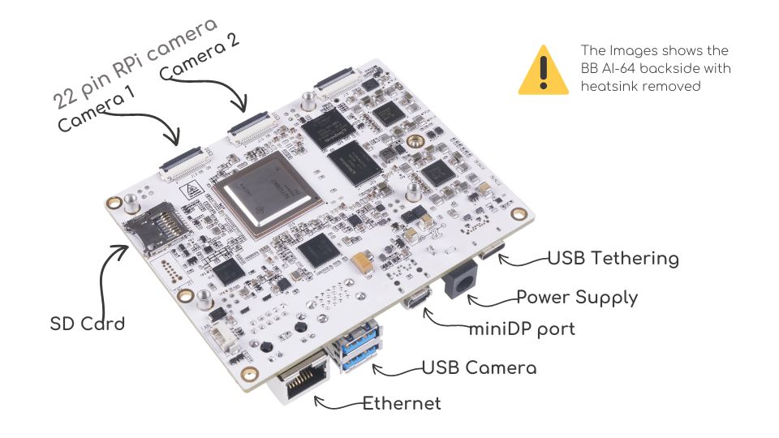
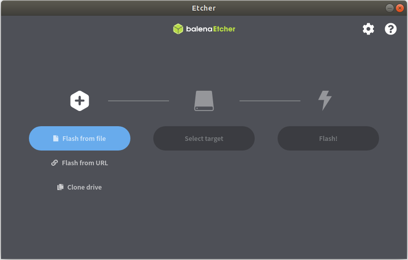

.. _ai_64_edgeai_getting_started:

Getting Started
#################

.. _ai_64_edgeai_getting_started_harware:

Hardware setup
===============

BeagleBone® AI-64 has TI's TDA4VM SoC which houses dual core A72, high performance vision
accelerators, video codec accelerators, latest C71x and C66x DSP, high bandwidth
realtime IPs for capture and display, GPU, dedicated safety island and security
accelerators. The SoC is power optimized to provide best in class performance
for perception, sensor fusion, localization and path planning tasks in robotics,
industrial and automotive applications.

For more details visit https://www.ti.com/product/TDA4VM

.. _ai_64_edgeai_hw_requirements_eaik:

BeagleBone® AI-64
-----------------

BeagleBone® AI-64 brings a complete system for developing artificial intelligence (AI) 
and machine learning solutions with the convenience and expandability of the BeagleBone® 
platform and the peripherals on board to get started right away learning and building 
applications. With locally hosted, ready-to-use, open-source focused tool chains and 
development environment, a simple web browser, power source and network connection 
are all that need to be added to start building performance-optimized embedded 
applications. Industry-leading expansion possibilities are enabled through 
familiar BeagleBone® cape headers, with hundreds of open-source hardware examples 
and dozens of readily available embedded expansion options available off-the-shelf.

To run the demos on BeagleBone® AI-64 you will require,

    - BeagleBone® AI-64
    - USB camera (Any V4L2 compliant 1MP/2MP camera, Eg. Logitech C270/C920/C922)
    - Full HD eDP/HDMI display
    - Minimum 16GB high performance SD card
    - 100Base-T Ethernet cable connected to internet
    - UART cable
    - External Power Supply or Power Accessory Requirements

        a. Nominal Output Voltage: 5VDC
        b. Maximum Output Current: 5000 mA

Connect the components to the SK as shown in the image.

   BeagleBone® AI-64 for Edge AI connections

.. _ai_64_edgeai_usb_camera:

USB Camera
----------

UVC (USB video class) compliant USB cameras are supported on the BeagleBone® AI-64.
The driver for the same is enabled in linux image. The linux image has been tested with
C270/C920/C922 versions of Logitech USB cameras. Please refer to
:ref:`pub_edgeai_multiple_usb_cams` to stream from multiple USB cameras
simultaneously.

.. _ai_64_edgeai_imx219_sensor:

IMX219 Raw sensor
------------------

**IMX219 camera module** from **Raspberry pi / Arducam** is supported by BeagleBone® AI-64. 
It is a 8MP sensor with no ISP, which can transmit raw SRGGB8 frames over CSI lanes at 1080p 60 fps.
This camera module can be ordered from
https://www.amazon.com/Raspberry-Pi-Camera-Module-Megapixel/dp/B01ER2SKFS
The camera can be connected to any of the 2 RPi zero 22 pin camera headers on BB AI-64 as
shown below

.. figure:: 
   :scale: 20
   :align: center

   TODO: IMX219 CSI sensor connection with BeagleBone® AI-64 for Edge AI

Note that the headers have to be lifted up to connect the cameras

.. note:: To be updated
    By default IMX219 is disabled. After connecting the camera you can enable it
    by specifying the dtb overlay file in
    ``/run/media/mmcblk0p1/uenv.txt`` as below,

    ``name_overlays=k3-j721e-edgeai-apps.dtbo k3-j721e-sk-rpi-cam-imx219.dtbo``

    Reboot the board after editing and saving the file.

Two RPi cameras can be connected to 2 headers for multi camera usecases

Please refer :ref:`pub_edgeai_camera_sources` to know how to list all the cameras
connected and select which one to use for the demo.

By default imx219 will be configured to capture at 8 bit, but it also supports
10 bit capture in 16 bit container. To use it in 10 bit mode, below steps are
required:

    - Modify the ``/opt/edge_ai_apps/scripts/setup_cameras.sh`` to set the
      format to 10 bit like below

    .. code-block:: bash

           CSI_CAM_0_FMT='[fmt:SRGGB8_1X10/1920x1080]'
           CSI_CAM_1_FMT='[fmt:SRGGB8_1X10/1920x1080]'

    - Change the imaging binaries to use 10 bit versions

    .. code-block:: bash

           mv /opt/imaging/imx219/dcc_2a.bin /opt/imaging/imx219/dcc_2a_8b.bin
           mv /opt/imaging/imx219/dcc_viss.bin /opt/imaging/imx219/dcc_viss_8b.bin
           mv /opt/imaging/imx219/dcc_2a_10b.bin /opt/imaging/imx219/dcc_2a.bin
           mv /opt/imaging/imx219/dcc_viss_10b.bin /opt/imaging/imx219/dcc_viss.bin

    - Set the input format in the ``/opt/edge_ai_apps/configs/rpiV2_cam_example.yaml``
      as ``rggb10``

Software setup
==============

.. _ai_64_edgeai_prepare_sd_card:

Preparing SD card image
-----------------------

Download the ``bullseye-xfce-edgeai-arm64`` image from the links below and
flash it to SD card using `Balena etcher <https://www.balena.io/etcher/>`_ tool.

- To use via SD card: `bbai64-debian-11.4-xfce-edgeai-arm64-2022-08-02-10gb.img.xz <bbai64-debian-11.4-xfce-edgeai-arm64-2022-08-02-10gb.img.xz>`_
- To flash on eMMC: `bbai64-emmc-flasher-debian-11.4-xfce-edgeai-arm64-2022-08-02-10gb.img.xz <https://rcn-ee.net/rootfs/bb.org/testing/2022-08-02/bullseye-xfce-edgeai-arm64/bbai64-emmc-flasher-debian-11.4-xfce-edgeai-arm64-2022-08-02-10gb.img.xz>`_

The Balena etcher tool can be installed either on Windows/Linux. Just download the
etcher image and follow the instructions to prepare the SD card.

   Balena Etcher tool to flash SD card with Processor linux image Linux for Edge AI

The etcher image is created for 16 GB SD cards, if you are using larger SD card,
it is possible to expand the root filesystem to use the full SD card capacity
using below steps

.. code-block:: bash

   #find the SD card device entry using lsblk (Eg: /dev/sdc)
   #use the following commands to expand the filesystem
   #Make sure you have write permission to SD card or run the commands as root

   #Unmount the BOOT and rootfs partition before using parted tool
   umount /dev/sdX1
   umount /dev/sdX2

   #Use parted tool to resize the rootfs partition to use
   #the entire remaining space on the SD card
   #You might require sudo permissions to execute these steps
   parted -s /dev/sdX resizepart 2 '100%'
   e2fsck -f /dev/sdX2
   resize2fs /dev/sdX2

   #replace /dev/sdX in above commands with SD card device entry

.. _ai_64_edgeai_poweron_boot:

Power ON and Boot
-----------------
Ensure that the power supply is disconnected before inserting the SD card.
Once the SD card is firmly inserted in its slot and the board is powered ON,
the board will take less than 20sec to boot and display a wallpaper as
shown in the image below.

.. figure:: 
   :scale: 25
   :align: center

   TODO: BeagleBone® AI-64 wallpaper upon boot

You can also view the boot log by connecting the UART cable to your PC and
use a serial port communications program.

For **Linux OS minicom** works well.
Please refer to the below documentation on 'minicom' for more details.

https://help.ubuntu.com/community/Minicom

When starting minicom, turn on the colors options like below:

.. code-block:: bash

   sudo minicom -D /dev/ttyUSB2 -c on

For **Windows OS Tera Term** works well.
Please refer to the below documentation on 'TeraTerm' for more details

https://learn.sparkfun.com/tutorials/terminal-basics/tera-term-windows

.. note::
    Baud rate should be configured to 115200 bps in serial port communication
    program. You may not see any log in the UART console if you connect to it
    after the booting is complete or login prompt may get lost in between boot
    logs, press ENTER to get login prompt

As part of the linux systemd ``/opt/edge_ai_apps/init_script.sh`` is executed
which does the below,

    - This kills weston compositor which holds the display pipe. This step will
      make the wallpaper showing on the display disappear and come back
    - The display pipe can now be used by 'kmssink' GStreamer element while
      running the demo applications.
    - The script can also be used to setup proxies if connected behind a
      firewall.

Once Linux boots login as ``root`` user with no password.

.. _ai_64_edgeai_connecting_remotely:

Connect remotely
----------------
If you don't prefer the UART console, you can also access the device with the
IP address that is shown on the display.

With the IP address one can ssh directly to the board, view the contents and run
the demos.

For best experience we recommend using VSCode which can be downloaded from
here.

https://code.visualstudio.com/download

You also require the "Remote development extension pack" installed in VSCode
as mentioned here:

https://code.visualstudio.com/docs/remote/ssh

.. figure:: 
   :scale: 90
   :align: center

   TODO: Microsoft Visual Studio Code for connecting to BeagleBone® AI-64 for Edge AI via SSH
