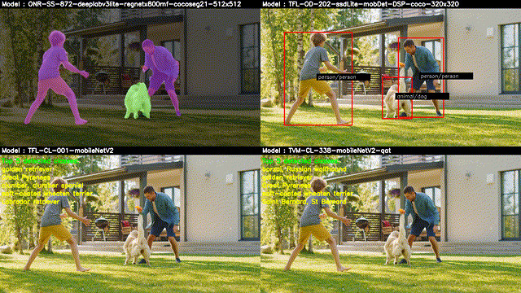

.. _ai_64_edgeai_running_advance_demos:

Running Advance demos
#######################

The same Python and C++ demo applications can be used to run multiple inference
models and also work with multiple inputs with just simple changes in the config
file.

From a repo of input sources, output sources and models one can define advance
dataflows which connect them in various configurations. Details on configuration
file parameters can be found in :ref:`pub_edgeai_configuration`

Single input multi inference demo
---------------------------------

Here is an example of a single-input, multi-inference demo which takes a camera
input and run multiple networks on each of them.

.. code-block:: bash

    debian@beaglebone:/opt/edge_ai_apps/apps_python# ./app_edgeai.py ../configs/single_input_multi_infer.yaml

Sample output for single input, multi inference demo is as shown below,

   Sample output showing single input, mutli-inference output

We can specify the output window location and sizes as shown in the
configuration file,

.. code-block:: yaml

    flows:
        flow0:
            input: input0
            models: [model0, model1, model2, model3]
            outputs: [output0, output0, output0, output0]
            mosaic:
                mosaic0:
                    width:  800
                    height: 450
                    pos_x:  160
                    pos_y:  90
                mosaic1:
                    width:  800
                    height: 450
                    pos_x:  960
                    pos_y:  90
                mosaic2:
                    width:  800
                    height: 450
                    pos_x:  160
                    pos_y:  540
                mosaic3:
                    width:  800
                    height: 450
                    pos_x:  960
                    pos_y:  540

Multi input multi inference demo
--------------------------------

Here is an example of a multi-input, multi-inference demo which takes a camera
input and video input and runs multiple networks on each of them.

.. code-block:: bash

    debian@beaglebone:/opt/edge_ai_apps/apps_python# ./app_edgeai.py ../configs/multi_input_multi_infer.yaml

Sample output for multi input, multi inference demo is as shown below,

   Sample output showing multi-input, mutli-inference output

We can specify the output window location and sizes as shown in the
configuration file,

.. code-block:: yaml

    flows:
        flow0:
            input: input0
            models: [model1, model2]
            outputs: [output0, output0]
            mosaic:
                mosaic0:
                    width:  800
                    height: 450
                    pos_x:  160
                    pos_y:  90
                mosaic1:
                    width:  800
                    height: 450
                    pos_x:  960
                    pos_y:  90
        flow1:
            input: input1
            models: [model0, model3]
            outputs: [output0, output0]
            mosaic:
                mosaic0:
                    width:  800
                    height: 450
                    pos_x:  160
                    pos_y:  540
                mosaic1:
                    width:  800
                    height: 450
                    pos_x:  960
                    pos_y:  540
