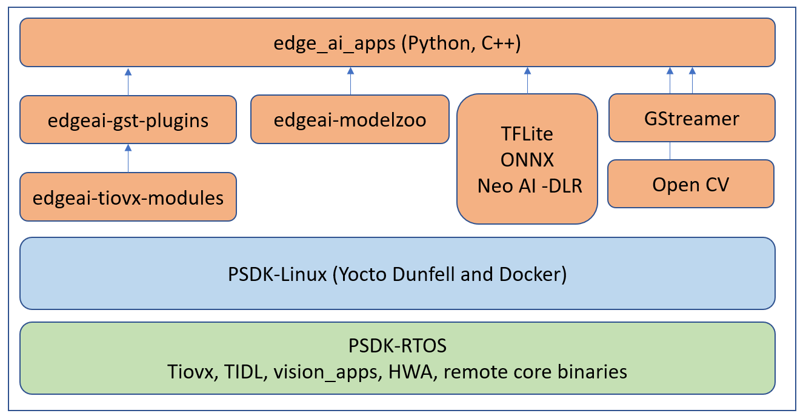

.. _ai_64_edgeai_sdk_components:

SDK Components
################

The BeagleBone® AI-64 Linux for Edge AI can be divided into 3 parts, Applications,
BeagleBone® AI-64 Linux and Processor SDK RTOS. Users can get the latest application
updates and bug fixes from the public repositories (GitHub and git.ti.com)
which aligns with the SDK releases done quarterly. One can also build every component
from source by following the steps here, :ref:`pub_edgeai_sdk_development_flow`

   BeagleBone® AI-64 Linux for Edge AI components

.. _ai_64_edgeai_applications:

Edge AI Applications
====================

The edge AI applications are designed for users to quickly evaluate various Deep Learning
networks on TDA4 SoC. The user can run standalone examples and Jupyter notebook applications
to evaluate inference models either from `TI Edge AI Model Zoo <https://github.com/TexasInstruments/edgeai-modelzoo>`_
or a custom network.
Once a network is finalized for performance and accuracy it can also be
easily integrated in a typical capture-inference-display usecase using example
GStreamer based applications for rapid prototyping and deployment.

.. _ai_64_edgeai_tidl_tools:

edgeai-tidl-tools
-----------------

This application repository provides standalone Python and C/C++ examples to
quickly evaluate inference models using TFLite, ONNX and NeoAI-DLR runtime
using file based inputs. It also houses the Jupyter notebooks similar to
`TI Edge AI Cloud <https://dev.ti.com/edgeai/>`_ which can be executed right on
the TDA4VM Starter Kit.

For more details on using this application repo please refer to the documentation
and source code found here: https://github.com/TexasInstruments/edgeai-tidl-tools

.. _ai_64_edgeai_modelzoo:

edgeai-modelzoo
---------------

This repo provides collection of example Deep Neural Network (DNN) Models
for various computer vision tasks. A few example models are packaged as part of
the SDK to run out-of-box demos. More can be downloaded using a download script
made available in the edge_ai_apps repo.

For more details on the the pre-imported models and related documentation please visit:
https://github.com/TexasInstruments/edgeai-modelzoo

.. _ai_64_edgeai_apps:

edge_ai_apps
------------
These are plug-and-play Deep Learning applications which support running open
source runtime frameworks such as TFLite, ONNX and NeoAI-DLR with a live camera
and display. They help connect realtime camera, video or RTSP sources to DL
inference to live display, bitstream or RTSP sinks.

The latest source code with fixes can be pulled from: https://git.ti.com/cgit/edgeai/edge_ai_apps

.. _ai_64_edgeai_gst_plugins:

edgeai-gst-plugins
------------------
This repo provides the source of custom GStreamer plugins which helps offload
tasks to TDA4 hardware accelerators and advanced DSPs with the help of
edgeai-tiovx-modules. The repo gets downloaded, built and installed as part
of the :ref:`pub_edgeai_install_dependencies` step.

Source code and documentation: https://github.com/TexasInstruments/edgeai-gst-plugins

.. _ai_64_edgeai_tiovx_modules:

edgeai-tiovx-modules
--------------------
This repo provides OpenVx modules which help access underlying hardware
accelerators in the  TDA4 SoC and serves as a bridge between GStreamer
custom elements and underlying OpenVx custom kernels. The repo gets downloaded,
built and installed as part of the :ref:`pub_edgeai_install_dependencies` step.

Source code and documentation: https://github.com/TexasInstruments/edgeai-tiovx-modules

.. _ai_64_edgeai_psdk_rtos:

Processor SDK RTOS
==================

The BeagleBone® AI-64 Linux for Edge AI gets all the HWA drivers, optimized libraries, OpenVx framework
and more from Processor SDK RTOS

For more information visit `Processor SDK RTOS Getting Started Guide <https://software-dl.ti.com/processor-sdk-rtos/esd/docs/latest/rtos/index_overview.html>`_.

.. _ai_64_edgeai_psdk_linux:

BeagleBone® AI-64 Linux
===================

The BeagleBone® AI-64 Linux for Edge AI  gets all the Linux kernel, filesystem, device-drivers and more
from BeagleBone® AI-64 Linux

For more information visit `BeagleBone® AI-64 Linux Software Developer's Guide <https://software-dl.ti.com/jacinto7/esd/processor-sdk-linux-jacinto7/08_02_00_03/exports/docs/devices/J7/linux/index.html>`_.
