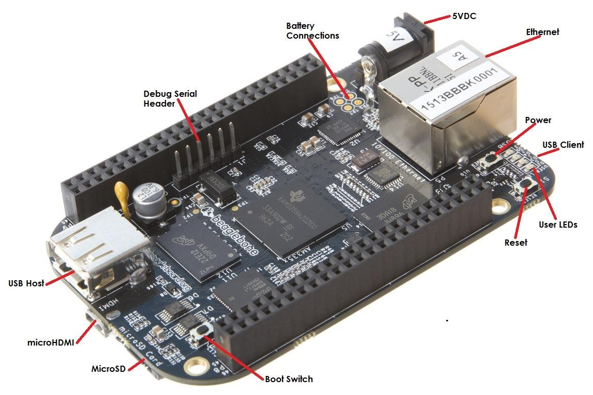
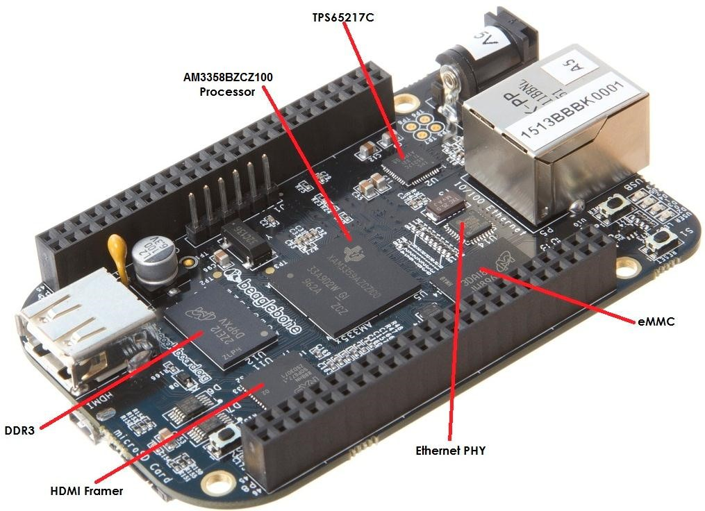

.. _beagleboneblack-overview:

BeagleBone Black Overview
#############################

The BeagleBone Black is the latest addition to the BeagleBoard.org
family and like its predecessors, is designed to address the Open Source
Community, early adopters, and anyone interested in a low cost ARM
Cortex-A8 based processor.

It has been equipped with a minimum set of features to allow the user to
experience the power of the processor and is not intended as a full
development platform as many of the features and interfaces supplied by
the processor are not accessible from the BeagleBone Black via onboard
support of some interfaces. It is not a complete product designed to do
any particular function. It is a foundation for experimentation and
learning how to program the processor and to access the peripherals by
the creation of your own software and hardware.

It also offers access to many of the interfaces and allows for the use
of add-on boards called capes, to add many different combinations of
features. A user may also develop their own board or add their own
circuitry.

BeagleBone Black is manufactured and warranted by partners listed at `https://beagleboard.org/logo <https://beagleboard.org/logo>`_
for the benefit of the community and its supporters.

Jason Kridner of Texas Instruments handles the community promotions and is the spokesman for BeagleBoard.org.

The board is designed by Gerald Coley of EmProDesign, a charter member of the BeagleBoard.org community.

The PCB layout up through PCB revision B was done by Circuitco and
Circuitco is the sole funder of its development and transition to
production. Later PCB revisions have been made by Embest, a subsidiary
of Avent.

The Software is written and supported by the thousands of community
members, including Jason Kridner, employee of Texas Instruments, and
Robert Nelson, employee of DigiKey.

BeagleBone Compatibility
----------------------------

The board is intended to be compatible with the original BeagleBone as
much as possible. There are several areas where there are differences
between the two designs. These differences are listed below, along with
the reasons for the differences.

* Sitara AM3358BZCZ100, 1GHZ, processor.
  
  * Sorry, we just had to make it faster.

* 512MB DDR3L
  
  * *Cost reduction*
  * Performance boost
  * Memory size increase
  * Lower power
  
* No Serial port by default
  
  * *Cost reduction*
  * Can be added by buying a TTL to USB Cable that is widely available
  * Single largest cost reduction action taken
  
* No JTAG emulation over USB

  * *Cost reduction* JTAG header is not populated, but can easily be mounted.
  * EEPROM Reduced from 32KB to 4KB
  * *Cost Reduction*
  
* Onboard Managed NAND (eMMC)
  
  * 4GB
  * *Cost reduction*
  * Performance boost x8 vs. x4 bits
  * Performance boost due to deterministic properties vs. microSD card

* GPMC bus may not be accessible from the expansion headers in some cases

  * Result of eMMC on the main board
  * Signals are still routed to the expansion connector
  * If eMMC is not used, signals can be used via expansion if eMMC is held in reset

* There may be 10 less GPIO pins available
  
  * Result of eMMC
  * If eMMC is not used, could still be used

* The power expansion header, for battery and backlight, has been removed

  * _*Cost reduction* , space reduction
  * Four pins were added to provide access to the battery charger function.

* HDMI interface onboard
  
  * Feature addition
  * Audio and video capable
  * Micro HDMI

* No three function USB cable
  
  * *Cost reduction*

* GPIO3_21 has a 24.576 MHZ clock on it.
  
  * This is required by the HDMI Framer for Audio purposes. 
    We needed to run a clock into the processor to generate the correct clock frequency. 
    The pin on the processor was already routed to the expansion header. In order not 
    to remove this feature on the expansion header, it was left connected. In order to 
    use the pin as a GPIO pin, you need to disable the clock. While this disables audio 
    to the HDMI, the fact that you want to use this pin for something else, does the 
    same thing.

BeagleBone Black Features and Specification
-----------------------------------------------

This section covers the specifications and features of the board and
provides a high level description of the major components and interfaces
that make up the board. table below provides a list of the features.

.. list-table:: BeagleBone Black Features
   :header-rows: 1
   :widths: 20 80
   :class: longtable

   * -
     - Feature
   * - **Processor** 
     - Sitara AM3358BZCZ100 1GHz, 2000 MIPS
   * - **Graphics Engine** 
     - SGX530 3D, 20M Polygons/S
   * - **SDRAM Memory**
     - 512MB DDR3L 800MHZ
   * - **Onboard Flash** 
     - 4GB, 8bit Embedded MMC
   * - **PMIC**
     - TPS65217C PMIC regulator and one additional LDO.
   * - **Debug Support** 
     - Optional Onboard 20-pin CTI JTAG, Serial Header
   * - **Power Source** 
     - miniUSB USB or DC Jack
   * - **PCB** 
     - 3.4” x 2.1”
   * - **Indicators** 
     - 1-Power, 2-Ethernet, 4-User Controllable LEDs
   * - **HS USB 2.0 Client Port** 
     - Access to USB0, Client mode via miniUSB
   * - **HS USB 2.0 Host Port** 
     - Access to USB1, Type A Socket, 500mA LS/FS/HS
   * - **Serial Port** 
     - UART0 access via 6 pin 3.3V TTL Header. Header is populated
   * - **Ethernet** 
     - 10/100, RJ45
   * - **SD/MMC Connector** 
     - microSD , 3.3V
   * - **User Input** 
     -
       1. Reset Button 
       2. Boot Button 
       3. Power Button
   * - **Video Out** 
     -
       1. 16b HDMI, 1280x1024 (MAX) 
       2. 1024x768,1280x720,1440x900 ,1920x1080@24Hz w/EDID Support
   * - **Audio** 
     - Via HDMI Interface, Stereo
   * - **Expansion Connectors** 
     -
       1. Power 5V, 3.3V , VDD_ADC(1.8V) 
       2. 3.3V I/O on all signals 
       3. McASP0, SPI1, I2C, GPIO(69 max), LCD, GPMC, MMC1, MMC2, 7 
       4. AIN _(1.8V MAX)_, 4 Timers, 4 Serial Ports, CAN0, 
       5. EHRPWM(0,2),XDMA Interrupt, Power button, Expansion Board ID (Up to 4 can be stacked)
   * - **Weight** 
     - 1.4 oz (39.68 grams)
   * - **Power** 
     - Refer to *section-6-1-7*

Board Component Locations
-----------------------------

This section describes the key components on the board. It provides
information on their location and function. Familiarize yourself with
the various components on the board.

Connectors, LEDs, and Switches
************************************

figure below shows the locations of the connectors, LEDs, and
switches on the PCB layout of the board.

   Connectors, LEDs and Switches

* *DC Power* is the main DC input that accepts 5V power.
* *Power Button* alerts the processor to initiate the power down sequence and is used to power down the board.
* *10/100 Ethernet* is the connection to the LAN.
* *Serial Debug* is the serial debug port.
* *USB Client* is a miniUSB connection to a PC that can also power the board.
* *BOOT switch* can be used to force a boot from the microSD card if the power is cycled on the board, removing power and reapplying the power to the board..
* There are four blue **LED**'s  that can be used by the user.
* *Reset Button* allows the user to reset the processor.
* *microSD* slot is where a microSD card can be installed.
* *microHDMI* connector is where the display is connected to.
* *USB Host* can be connected different USB interfaces such as Wi-Fi, BT, Keyboard, etc.

Key Components
********************

figure below shows the locations of the key components on the PCB
layout of the board.

   Key Components

* *Sitara AM3358BZCZ100* is the processor for the board.
* *Micron 512MB DDR3L* or**Kingston 512mB DDR3** is the Dual Data Rate RAM memory.
* *TPS65217C PMIC* provides the power rails to the various components on the board.
* *SMSC Ethernet PHY* is the physical interface to the network.
* *Micron eMMC* is an onboard MMC chip that holds up to 4GB of data.
* *HDMI* Framer provides control for an HDMI or DVI-D display with an adapter.
