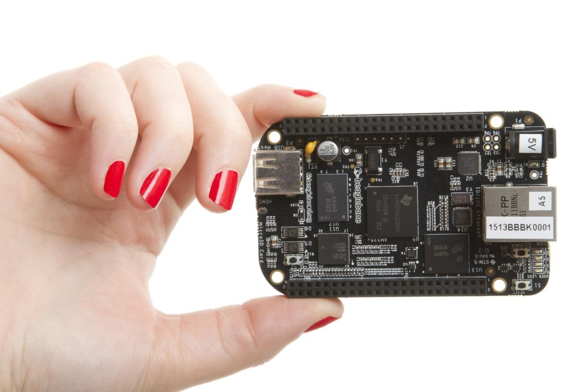

.. _beagleboneblack-home:

BeagleBone Black
###################

BeagleBone Black is a low-cost, community-supported development platform for developers and hobbyists. 
Boot Linux in under 10 seconds and get started on development in less than 5 minutes with just a single USB cable.

.. toctree::
   :maxdepth: 1

   ch01.rst
   ch02.rst
   ch03.rst
   ch04.rst
   ch05.rst
   ch06.rst
   ch07.rst
   ch08.rst
   ch09.rst
   ch10.rst
   ch11.rst

