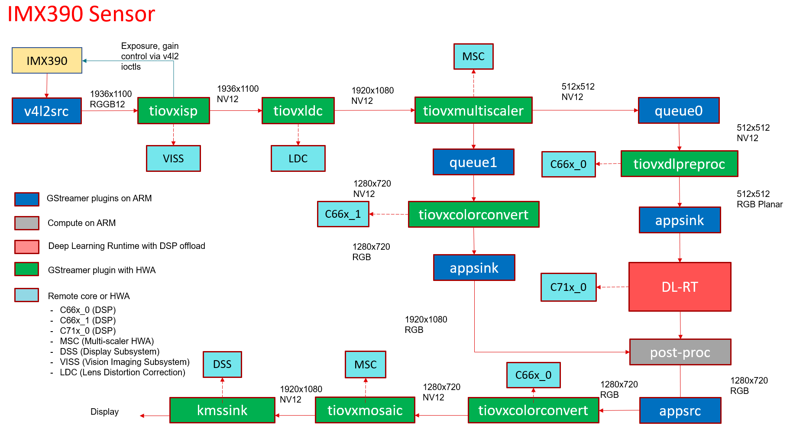

.. _ai_64_data_flows:

Data Flows
###########

The **app_edgeai** application at a high level can be split into 3 parts,

 - Input pipeline - Grabs a frame from camera, video, image or RTSP source
 - Output pipeline - Sends the output to display or a file
 - Compute pipeline - Performs pre-processing, inference and post-processing

Here are the data flows for each reference demo and the corresponding GStreamer
launch strings that **app_edgeai** application generates. User can interact with
the application via the :ref:`pub_edgeai_configuration`

.. _ai_64_edgeai_image_classification_data_flow:

Image classification
====================

In this demo, a frame is grabbed from an input source and split into two paths.
The "analytics" path resizes the input maintaining the aspect ratio and crops
the input to match the resolution required to run the deep learning network.
The "visualization" path is provided to the post-processing module which
overlays the detected classes. Post-processed output is given to HW mosaic plugin
which positions and resizes the output window on an empty background before
sending to display.

GStreamer input pipeline:

.. code-block:: bash

    v4l2src device=/dev/video18 io-mode=2 ! image/jpeg, width=1280, height=720 ! jpegdec ! tiovxdlcolorconvert ! video/x-raw, format=NV12 ! tiovxmultiscaler name=split_01
    split_01. ! queue ! video/x-raw, width=454, height=256 ! tiovxdlcolorconvert out-pool-size=4 ! video/x-raw, format=RGB ! videobox left=115 right=115 top=16 bottom=16 ! tiovxdlpreproc data-type=10 channel-order=0 mean-0=123.675000 mean-1=116.280000 mean-2=103.530000 scale-0=0.017125 scale-1=0.017507 scale-2=0.017429 tensor-format=rgb out-pool-size=4 ! application/x-tensor-tiovx ! appsink name=pre_0 max-buffers=2 drop=true
    split_01. ! queue ! video/x-raw, width=1280, height=720 ! tiovxdlcolorconvert target=1 out-pool-size=4 ! video/x-raw, format=RGB ! appsink name=sen_0 max-buffers=2 drop=true

GStreamer output pipeline:

.. code-block:: bash

	appsrc format=GST_FORMAT_TIME is-live=true block=true do-timestamp=true name=post_0 ! tiovxdlcolorconvert ! video/x-raw,format=NV12, width=1280, height=720 ! queue ! mosaic_0.sink_0
	appsrc format=GST_FORMAT_TIME block=true num-buffers=1 name=background_0 ! tiovxdlcolorconvert ! video/x-raw,format=NV12, width=1920, height=1080 ! queue ! mosaic_0.background
	tiovxmosaic name=mosaic_0
	sink_0::startx=320  sink_0::starty=180  sink_0::width=1280   sink_0::height=720
	! video/x-raw,format=NV12, width=1920, height=1080 ! kmssink sync=false driver-name=tidss

.. figure:: ./images/edgeai_image_classification.png
   :scale: 60
   :align: center

   GStreamer based data-flow pipeline for image classification demo with USB camera and display

.. _ai_64_edgeai_object_detection_data_flow:

Object Detection
================

In this demo, a frame is grabbed from an input source and split into two paths.
The "analytics" path resizes the input to match the resolution required to run
the deep learning network. The "visualization" path is provided to the
post-processing module which overlays rectangles around detected objects.
Post-processed output is given to HW mosaic plugin which positions and resizes
the output window on an empty background before sending to display.

GStreamer input pipeline:

.. code-block:: bash

	v4l2src device=/dev/video18 io-mode=2 ! image/jpeg, width=1280, height=720 ! jpegdec ! tiovxdlcolorconvert ! video/x-raw, format=NV12 ! tiovxmultiscaler name=split_01
	split_01. ! queue ! video/x-raw, width=320, height=320 ! tiovxdlpreproc data-type=10 channel-order=1 mean-0=128.000000 mean-1=128.000000 mean-2=128.000000 scale-0=0.007812 scale-1=0.007812 scale-2=0.007812 tensor-format=rgb out-pool-size=4 ! application/x-tensor-tiovx ! appsink name=pre_0 max-buffers=2 drop=true
	split_01. ! queue ! video/x-raw, width=1280, height=720 ! tiovxdlcolorconvert target=1 out-pool-size=4 ! video/x-raw, format=RGB ! appsink name=sen_0 max-buffers=2 drop=true

GStreamer output pipeline:

.. code-block:: bash

	appsrc format=GST_FORMAT_TIME is-live=true block=true do-timestamp=true name=post_0 ! tiovxdlcolorconvert ! video/x-raw,format=NV12, width=1280, height=720 ! queue ! mosaic_0.sink_0
	appsrc format=GST_FORMAT_TIME block=true num-buffers=1 name=background_0 ! tiovxdlcolorconvert ! video/x-raw,format=NV12, width=1920, height=1080 ! queue ! mosaic_0.background
	tiovxmosaic name=mosaic_0
	sink_0::startx=320  sink_0::starty=180  sink_0::width=1280   sink_0::height=720
	! video/x-raw,format=NV12, width=1920, height=1080 ! kmssink sync=false driver-name=tidss

.. figure:: ./images/edgeai_object_detection.png
   :scale: 60
   :align: center

   GStreamer based data-flow pipeline for object detection demo with USB camera and display

.. _ai_64_edgeai_semantic_segmentation_data_flow:

Semantic Segmentation
=====================

In this demo, a frame is grabbed from an input source and split into two paths.
The "analytics" path resize the input to match the resolution required to run
the deep learning network. The "visualization" path is provided to the
post-processing module which blends each segmented pixel to a color map.
Post-processed output is given to HW mosaic plugin which positions and resizes
the output window on an empty background before sending to display.

GStreamer input pipeline:

.. code-block:: bash

	v4l2src device=/dev/video18 io-mode=2 ! image/jpeg, width=1280, height=720 ! jpegdec ! tiovxdlcolorconvert ! video/x-raw, format=NV12 ! tiovxmultiscaler name=split_01
	split_01. ! queue ! video/x-raw, width=512, height=512 ! tiovxdlpreproc data-type=10 channel-order=0 mean-0=128.000000 mean-1=128.000000 mean-2=128.000000 scale-0=0.015625 scale-1=0.015625 scale-2=0.015625 tensor-format=rgb out-pool-size=4 ! application/x-tensor-tiovx ! appsink name=pre_0 max-buffers=2 drop=true
	split_01. ! queue ! video/x-raw, width=1280, height=720 ! tiovxdlcolorconvert target=1 out-pool-size=4 ! video/x-raw, format=RGB ! appsink name=sen_0 max-buffers=2 drop=true

GStreamer output pipeline:

.. code-block:: bash

	appsrc format=GST_FORMAT_TIME is-live=true block=true do-timestamp=true name=post_0 ! tiovxdlcolorconvert ! video/x-raw,format=NV12, width=1280, height=720 ! queue ! mosaic_0.sink_0
	appsrc format=GST_FORMAT_TIME block=true num-buffers=1 name=background_0 ! tiovxdlcolorconvert ! video/x-raw,format=NV12, width=1920, height=1080 ! queue ! mosaic_0.background
	tiovxmosaic name=mosaic_0
	sink_0::startx=320  sink_0::starty=180  sink_0::width=1280   sink_0::height=720
	! video/x-raw,format=NV12, width=1920, height=1080 ! kmssink sync=false driver-name=tidss

.. figure:: ./images/edgeai_semantic_segmentation.png
   :scale: 60
   :align: center

   GStreamer based data-flow pipeline for semantic segmentation demo with USB camera and display

.. _ai_64_edgeai_human_pose_estimation_data_flow:

Human Pose Estimation
=====================

In this demo, a frame is grabbed from an input source and split into two paths.
The "analytics" path resize the input to match the resolution required to run
the deep learning network. The "visualization" path is provided to the
post-processing module which overlays the keypoints and lines to draw the pose.
Post-processed output is given to HW mosaic plugin which positions and resizes
the output window on an empty background before sending to display.

GStreamer input pipeline:

.. code-block:: bash

    v4l2src device=/dev/video2 io-mode=2 ! image/jpeg, width=1280, height=720 ! jpegdec ! tiovxdlcolorconvert ! video/x-raw, format=NV12 ! tiovxmultiscaler name=split_01
    split_01. ! queue ! video/x-raw, width=640, height=640 ! tiovxdlpreproc data-type=10 target=0 channel-order=0 mean-0=0.000000 mean-1=0.000000 mean-2=0.000000 scale-0=1.000000 scale-1=1.000000 scale-2=1.000000 tensor-format=bgr out-pool-size=4 ! application/x-tensor-tiovx ! appsink name=pre_0 max-buffers=2 drop=true
    split_01. ! queue ! video/x-raw, width=1280, height=720 ! tiovxdlcolorconvert target=1 out-pool-size=4 ! video/x-raw, format=RGB ! appsink name=sen_0 max-buffers=2 drop=true
    GStreamer output pipeline:

.. code-block:: bash

    appsrc format=GST_FORMAT_TIME is-live=true block=true do-timestamp=true name=post_0 ! tiovxdlcolorconvert ! video/x-raw,format=NV12, width=1280, height=720 ! queue ! mosaic_0.sink_0
    tiovxmosaic name=mosaic_0 background=/tmp/background_0
    sink_0::startx=320  sink_0::starty=180  sink_0::width=1280   sink_0::height=720
    ! video/x-raw,format=NV12, width=1920, height=1080 ! kmssink sync=false driver-name=tidss

.. figure:: ./images/edgeai_human_pose.png
   :scale: 60
   :align: center

   GStreamer based data-flow pipeline for Human Pose Estimation demo with USB camera and display

.. _ai_64_edgeai_video_source_data_flow:

Video source
============

In this demo, a video file is read from a known location and passed to a
de-muxer to extract audio and video streams, the video stream is parsed
and raw encoded information is passed to a HW video decoder. Note that H.264 and
H.265 encoded videos are supported, making use of the respective HW decoders.
The resulting output is split into two paths. The "analytics" path resizes the
input to match the resolution required to run the deep learning network. The
"visualization" path is provided to the post-processing module which does the
required post process required by the model. Post-processed output is given to
HW mosaic plugin which positions and resizes the output window on an empty
background before sending to display.

GStreamer input pipeline:

.. code-block:: bash

	filesrc location=/opt/edge_ai_apps/data/videos/video_0000_h264.mp4 ! qtdemux ! h264parse ! v4l2h264dec ! video/x-raw, format=NV12  ! tiovxmultiscaler name=split_01
	split_01. ! queue ! video/x-raw, width=320, height=320 ! tiovxdlpreproc data-type=10 channel-order=1 mean-0=128.000000 mean-1=128.000000 mean-2=128.000000 scale-0=0.007812 scale-1=0.007812 scale-2=0.007812 tensor-format=rgb out-pool-size=4 ! application/x-tensor-tiovx ! appsink name=pre_0 max-buffers=2 drop=true
	split_01. ! queue ! video/x-raw, width=1280, height=720 ! tiovxdlcolorconvert target=1 out-pool-size=4 ! video/x-raw, format=RGB ! appsink name=sen_0 max-buffers=2 drop=true

GStreamer output pipeline:

.. code-block:: bash

	appsrc format=GST_FORMAT_TIME is-live=true block=true do-timestamp=true name=post_0 ! tiovxdlcolorconvert ! video/x-raw,format=NV12, width=1280, height=720 ! queue ! mosaic_0.sink_0
	appsrc format=GST_FORMAT_TIME block=true num-buffers=1 name=background_0 ! tiovxdlcolorconvert ! video/x-raw,format=NV12, width=1920, height=1080 ! queue ! mosaic_0.background
	tiovxmosaic name=mosaic_0
	sink_0::startx=320  sink_0::starty=180  sink_0::width=1280   sink_0::height=720
	! video/x-raw,format=NV12, width=1920, height=1080 ! kmssink sync=false driver-name=tidss

.. figure:: ./images/edgeai_video_source.png
   :scale: 60
   :align: center

   GStreamer based data-flow pipeline with video file input source and display

.. _ai_64_edgeai_rtsp_source_data_flow:

RTSP source
============

In this demo, a video file is read from a RTSP source and passed to a
de-muxer to extract audio and video streams, the video stream is parsed
and raw encoded information is passed to a video decoder and the resulting
output is split into two paths. The "analytics" path resizes the input to match
the resolution required to run the deep learning network. The "visualization"
path is provided to the post-processing module which does the required post
process required by the model. Post-processed output is given to HW mosaic plugin
which positions and resizes the output window on an empty background before
sending to display.

GStreamer input pipeline:

.. code-block:: bash

	rtspsrc location=rtsp://172.24.145.220:8554/test latency=0 buffer-mode=auto ! rtph264depay ! h264parse ! v4l2h264dec ! video/x-raw, format=NV12 !tiovxmultiscaler name=split_01
	split_01. ! queue ! video/x-raw, width=320, height=320 ! tiovxdlpreproc data-type=10 channel-order=1 mean-0=128.000000 mean-1=128.000000 mean-2=128.000000 scale-0=0.007812 scale-1=0.007812 scale-2=0.007812 tensor-format=rgb out-pool-size=4 ! application/x-tensor-tiovx ! appsink name=pre_0 max-buffers=2 drop=true
	split_01. ! queue ! video/x-raw, width=1280, height=720 ! tiovxdlcolorconvert target=1 out-pool-size=4 ! video/x-raw, format=RGB ! appsink name=sen_0 max-buffers=2 drop=true

GStreamer output pipeline:

.. code-block:: bash

	appsrc format=GST_FORMAT_TIME is-live=true block=true do-timestamp=true name=post_0 ! tiovxdlcolorconvert ! video/x-raw,format=NV12, width=1280, height=720 ! queue ! mosaic_0.sink_0
	appsrc format=GST_FORMAT_TIME block=true num-buffers=1 name=background_0 ! tiovxdlcolorconvert ! video/x-raw,format=NV12, width=1920, height=1080 ! queue ! mosaic_0.background
	tiovxmosaic name=mosaic_0
	sink_0::startx=320  sink_0::starty=180  sink_0::width=1280   sink_0::height=720
	! video/x-raw,format=NV12, width=1920, height=1080 ! kmssink sync=false driver-name=tidss

.. figure:: ./images/edgeai_rtsp_source.png
   :scale: 60
   :align: center

   GStreamer based data-flow pipeline with RTSP based video file source and display

.. _ai_64_edgeai_rpi_camera_data_flow:

RPiV2 Camera Sensor (IMX219)
============================

In this demo, raw frames in SRGGB8 format are captured form RPiV2 (imx219)
camera sensor. VISS (Vision Imaging Subsystem) is used to process the raw frames
and get the output in NV12, VISS also cotrols the sensor parameters like
exposure, gain etc.. via v4l2 ioctls. The NV12 output is split into two paths.
The "analytics" path resizes the input to match the resolution required to run
the deep learning network. The "visualization" path is provided to the
post-processing module which does the required post process required by the
model. Post-processed output is given to HW mosaic plugin which positions and
resizes the output window on an empty background before sending to display.

GStreamer input pipeline:

.. code-block:: bash

   v4l2src device=/dev/video2 io-mode=5 ! video/x-bayer, width=1920, height=1080, format=rggb ! tiovxisp device=/dev/v4l-subdev2 dcc-isp-file=/opt/imaging/imx219/dcc_viss.bin dcc-2a-file=/opt/imaging/imx219/dcc_2a.bin format-msb=7 ! video/x-raw, format=NV12 ! tiovxmultiscaler ! video/x-raw, width=1280, height=720 ! tiovxmultiscaler name=split_01
   split_01. ! queue ! video/x-raw, width=320, height=320 ! tiovxdlpreproc data-type=10 channel-order=1 mean-0=128.000000 mean-1=128.000000 mean-2=128.000000 scale-0=0.007812 scale-1=0.007812 scale-2=0.007812 tensor-format=rgb out-pool-size=4 ! application/x-tensor-tiovx ! appsink name=pre_0 max-buffers=2 drop=true
   split_01. ! queue ! video/x-raw, width=1280, height=720 ! tiovxdlcolorconvert target=1 out-pool-size=4 ! video/x-raw, format=RGB ! appsink name=sen_0 max-buffers=2 drop=true

GStreamer output pipeline:

.. code-block:: bash

   appsrc format=GST_FORMAT_TIME is-live=true block=true do-timestamp=true name=post_0 ! tiovxdlcolorconvert ! video/x-raw,format=NV12, width=1280, height=720 ! queue ! mosaic_0.sink_0
   appsrc format=GST_FORMAT_TIME block=true num-buffers=1 name=background_0 ! tiovxdlcolorconvert ! video/x-raw,format=NV12, width=1920, height=1080 ! queue ! mosaic_0.background
   tiovxmosaic name=mosaic_0
   sink_0::startx=320  sink_0::starty=180  sink_0::width=1280   sink_0::height=720
   ! video/x-raw,format=NV12, width=1920, height=1080 ! kmssink sync=false driver-name=tidss

.. figure:: ./images/edgeai_rpi_camera_source.png
   :scale: 60
   :align: center

   GStreamer based data-flow pipeline with IMX219 sensor, ISP and display

.. _ai_64_edgeai_imx390_camera_data_flow:

IMX390 Camera Sensor
============================
In this demo, raw frames in SRGGB12 format are captured from IMX390 camera
sensor. VISS (Vision Imaging Subsystem) is used to process the raw frames
and get the output in NV12, VISS also controls the sensor parameters like
exposure, gain etc.. via v4l2 ioctls. This is followed by LDC (Lens Distortion
Correction) required due to the fisheye lens. The NV12 output is split into two paths.
The "analytics" path resizes the input to match the resolution required to run
the deep learning network. The "visualization" path is provided to the
post-processing module which does the required post process required by the
model. Post-processed output is given to HW mosaic plugin which positions and
resizes the output window on an empty background before sending to display.

GStreamer input pipeline:

.. code-block:: bash

	v4l2src device=/dev/video18 ! queue leaky=2 ! video/x-bayer, width=1936, height=1100, format=rggb12 ! tiovxisp sink_0::device=/dev/v4l-subdev7 sensor-name=IMX390-UB953_D3 dcc-isp-file=/opt/imaging/imx390/dcc_viss.bin sink_0::dcc-2a-file=/opt/imaging/imx390/dcc_2a.bin format-msb=11 ! video/x-raw, format=NV12 ! tiovxldc dcc-file=/opt/imaging/imx390/dcc_ldc.bin sensor-name=IMX390-UB953_D3 ! video/x-raw, format=NV12, width=1920, height=1080 !tiovxmultiscaler name=split_01 
	split_01. ! queue ! video/x-raw, width=512, height=512 ! tiovxdlpreproc data-type=3 target=0 channel-order=0 tensor-format=bgr out-pool-size=4 ! application/x-tensor-tiovx ! appsink name=pre_0 max-buffers=2 drop=true 
	split_01. ! queue ! video/x-raw, width=1280, height=720 ! tiovxdlcolorconvert target=1 out-pool-size=4 ! video/x-raw, format=RGB ! appsink name=sen_0 max-buffers=2 drop=true 

GStreamer output pipeline:

.. code-block:: bash

	appsrc format=GST_FORMAT_TIME is-live=true block=true do-timestamp=true name=post_0 ! tiovxdlcolorconvert ! video/x-raw,format=NV12, width=1280, height=720 ! queue ! mosaic_0.sink_0 
	tiovxmosaic name=mosaic_0 background=/tmp/background_0
	sink_0::startx=320  sink_0::starty=180  sink_0::width=1280   sink_0::height=720  
	! video/x-raw,format=NV12, width=1920, height=1080 ! kmssink sync=false driver-name=tidss 

   GStreamer based data-flow pipeline with IMX390 sensor, ISP, LDC and display

.. _ai_64_edgeai_video_output_data_flow:

Video output
============

In this demo, a frame is grabbed from an input source and split into two paths.
The "analytics" path resizes the input to match the resolution required to run
the deep learning network. The "visualization" path is provided to the
post-processing module which does the required post process required by the
model. Post-processed output is given to HW mosaic plugin which positions and
resizes the output window on an empty background. Finally the video is encoded
using the H.264 HW encoder and written to a video file.

GStreamer input pipeline:

.. code-block:: bash

	v4l2src device=/dev/video18 io-mode=2 ! image/jpeg, width=1280, height=720 ! jpegdec ! tiovxdlcolorconvert ! video/x-raw, format=NV12 ! tiovxmultiscaler name=split_01
	split_01. ! queue ! video/x-raw, width=320, height=320 ! tiovxdlpreproc data-type=10 channel-order=1 mean-0=128.000000 mean-1=128.000000 mean-2=128.000000 scale-0=0.007812 scale-1=0.007812 scale-2=0.007812 tensor-format=rgb out-pool-size=4 ! application/x-tensor-tiovx ! appsink name=pre_0 max-buffers=2 drop=true
	split_01. ! queue ! video/x-raw, width=1280, height=720 ! tiovxdlcolorconvert target=1 out-pool-size=4 ! video/x-raw, format=RGB ! appsink name=sen_0 max-buffers=2 drop=true

GStreamer output pipeline:

.. code-block:: bash

	appsrc format=GST_FORMAT_TIME is-live=true block=true do-timestamp=true name=post_0 ! tiovxdlcolorconvert ! video/x-raw,format=NV12, width=1280, height=720 ! queue ! mosaic_0.sink_0
	appsrc format=GST_FORMAT_TIME block=true num-buffers=1 name=background_0 ! tiovxdlcolorconvert ! video/x-raw,format=NV12, width=1920, height=1080 ! queue ! mosaic_0.background
	tiovxmosaic name=mosaic_0
	sink_0::startx=320  sink_0::starty=180  sink_0::width=1280   sink_0::height=720
	! video/x-raw,format=NV12, width=1920, height=1080 ! v4l2h264enc bitrate=10000000 ! h264parse ! matroskamux !  filesink location=/opt/edge_ai_apps/data/output/videos/output_video.mkv

.. figure:: ./images/edgeai_video_output.png
   :scale: 60
   :align: center

   GStreamer based data-flow pipeline with video file input source and display

.. _ai_64_edgeai_single_input_multi_inference_data_flow:

Single Input Multi inference
============================

In this demo, a frame is grabbed from an input source and split into multiple
paths. Each path is further split into two sub-paths one for analytics and
another for visualization. Each path can run any type of network, image
classification, object detection, semantic segmentation and using any
supported run-time.

For example the below GStreamer pipeline splits the input into 4 paths for
running 4 deep learning networks. First is a semantic segmentation network,
followed by object detection network, followed by two image classification
networks. If we look at the image classification path, the analytics sub-path
resizes the input to maintain the aspect ratio and crops the input to match
the resolution required to run the deep learning network. The visualization
sub-path is provided to the post-processing module which overlays the detected
classes. Post-processed output from all the 4 paths is given to HW mosaic plugin
which positions and resizes the output windows on an empty background before
sending to display.

GStreamer input pipeline:

.. code-block:: bash

	v4l2src device=/dev/video18 io-mode=2 ! image/jpeg, width=1280, height=720 ! jpegdec ! tiovxdlcolorconvert ! video/x-raw, format=NV12 ! tee name=tee_split0
	tee_split0. ! queue ! tiovxmultiscaler name=split_01
	tee_split0. ! queue ! tiovxmultiscaler name=split_02
	tee_split0. ! queue ! tiovxmultiscaler name=split_03
	tee_split0. ! queue ! tiovxmultiscaler name=split_04
	split_01. ! queue ! video/x-raw, width=512, height=512 ! tiovxdlpreproc data-type=10 channel-order=0 mean-0=128.000000 mean-1=128.000000 mean-2=128.000000 scale-0=0.015625 scale-1=0.015625 scale-2=0.015625 tensor-format=rgb out-pool-size=4 ! application/x-tensor-tiovx ! appsink name=pre_0 max-buffers=2 drop=true
	split_01. ! queue ! video/x-raw, width=640, height=360 ! tiovxdlcolorconvert target=1 out-pool-size=4 ! video/x-raw, format=RGB ! appsink name=sen_0 max-buffers=2 drop=true
	split_02. ! queue ! video/x-raw, width=320, height=320 ! tiovxdlpreproc data-type=10 channel-order=1 mean-0=128.000000 mean-1=128.000000 mean-2=128.000000 scale-0=0.007812 scale-1=0.007812 scale-2=0.007812 tensor-format=rgb out-pool-size=4 ! application/x-tensor-tiovx ! appsink name=pre_1 max-buffers=2 drop=true
	split_02. ! queue ! video/x-raw, width=640, height=360 ! tiovxdlcolorconvert target=1 out-pool-size=4 ! video/x-raw, format=RGB ! appsink name=sen_1 max-buffers=2 drop=true
	split_03. ! queue ! video/x-raw, width=454, height=256 ! tiovxdlcolorconvert out-pool-size=4 ! video/x-raw, format=RGB ! videobox left=115 right=115 top=16 bottom=16 ! tiovxdlpreproc data-type=10 channel-order=1 mean-0=128.000000 mean-1=128.000000 mean-2=128.000000 scale-0=0.007812 scale-1=0.007812 scale-2=0.007812 tensor-format=rgb out-pool-size=4 ! application/x-tensor-tiovx ! appsink name=pre_2 max-buffers=2 drop=true
	split_03. ! queue ! video/x-raw, width=640, height=360 ! tiovxdlcolorconvert target=1 out-pool-size=4 ! video/x-raw, format=RGB ! appsink name=sen_2 max-buffers=2 drop=true
	split_04. ! queue ! video/x-raw, width=454, height=256 ! tiovxdlcolorconvert out-pool-size=4 ! video/x-raw, format=RGB ! videobox left=115 right=115 top=16 bottom=16 ! tiovxdlpreproc data-type=10 channel-order=0 mean-0=123.675000 mean-1=116.280000 mean-2=103.530000 scale-0=0.017125 scale-1=0.017507 scale-2=0.017429 tensor-format=rgb out-pool-size=4 ! application/x-tensor-tiovx ! appsink name=pre_3 max-buffers=2 drop=true
	split_04. ! queue ! video/x-raw, width=640, height=360 ! tiovxdlcolorconvert target=1 out-pool-size=4 ! video/x-raw, format=RGB ! appsink name=sen_3 max-buffers=2 drop=true

GStreamer output pipeline:

.. code-block:: bash

	appsrc format=GST_FORMAT_TIME is-live=true block=true do-timestamp=true name=post_0 ! tiovxdlcolorconvert ! video/x-raw,format=NV12, width=640, height=360 ! queue ! mosaic_0.sink_0
	appsrc format=GST_FORMAT_TIME is-live=true block=true do-timestamp=true name=post_1 ! tiovxdlcolorconvert ! video/x-raw,format=NV12, width=640, height=360 ! queue ! mosaic_0.sink_1
	appsrc format=GST_FORMAT_TIME is-live=true block=true do-timestamp=true name=post_2 ! tiovxdlcolorconvert ! video/x-raw,format=NV12, width=640, height=360 ! queue ! mosaic_0.sink_2
	appsrc format=GST_FORMAT_TIME is-live=true block=true do-timestamp=true name=post_3 ! tiovxdlcolorconvert ! video/x-raw,format=NV12, width=640, height=360 ! queue ! mosaic_0.sink_3
	appsrc format=GST_FORMAT_TIME block=true num-buffers=1 name=background_0 ! tiovxdlcolorconvert ! video/x-raw,format=NV12, width=1920, height=1080 ! queue ! mosaic_0.background
	tiovxmosaic name=mosaic_0
	sink_0::startx=320  sink_0::starty=180  sink_0::width=640   sink_0::height=360
	sink_1::startx=960  sink_1::starty=180  sink_1::width=640   sink_1::height=360
	sink_2::startx=320  sink_2::starty=560  sink_2::width=640   sink_2::height=360
	sink_3::startx=960  sink_3::starty=560  sink_3::width=640   sink_3::height=360
	! video/x-raw,format=NV12, width=1920, height=1080 ! kmssink sync=false driver-name=tidss

.. _ai_64_edgeai_multi_input_multi_inference_data_flow:

Multi Input Multi inference
===========================

In this demo, a frame is grabbed from multiple input sources and split into
multiple paths. The multiple input sources could be either multiple cameras or
a combination of camera, video, image, RTSP source. Each path is further split
into two sub-paths one for analytics and another for visualization. Each path
can run any type of network, image classification, object detection,
semantic segmentation and using any supported run-time.

For example the below GStreamer pipeline splits two inputs into 4 paths for
running 2 deep learning networks. First is a object detection network, followed by
image classification networks. If we look at the image classification path,
the analytics sub-path resizes the input to maintain the aspect ratio and crops
the input to match the resolution required to run the deep learning network.
The visualization sub-path is provided to the post-processing module which
overlays the detected classes. Post-processed output from all the 4 paths is
given to HW mosaic plugin which positions and resizes the output windows on an
empty background before sending to display.

GStreamer input pipeline:

.. code-block:: bash

	v4l2src device=/dev/video18 io-mode=2 ! image/jpeg, width=1280, height=720 ! jpegdec ! tiovxdlcolorconvert ! video/x-raw, format=NV12 ! tee name=tee_split0
	tee_split0. ! queue ! tiovxmultiscaler name=split_01
	tee_split0. ! queue ! tiovxmultiscaler name=split_02
	split_01. ! queue ! video/x-raw, width=320, height=320 ! tiovxdlpreproc data-type=10 channel-order=1 mean-0=128.000000 mean-1=128.000000 mean-2=128.000000 scale-0=0.007812 scale-1=0.007812 scale-2=0.007812 tensor-format=rgb out-pool-size=4 ! application/x-tensor-tiovx ! appsink name=pre_0 max-buffers=2 drop=true
	split_01. ! queue ! video/x-raw, width=640, height=360 ! tiovxdlcolorconvert target=1 out-pool-size=4 ! video/x-raw, format=RGB ! appsink name=sen_0 max-buffers=2 drop=true
	split_02. ! queue ! video/x-raw, width=454, height=256 ! tiovxdlcolorconvert out-pool-size=4 ! video/x-raw, format=RGB ! videobox left=115 right=115 top=16 bottom=16 ! tiovxdlpreproc data-type=10 channel-order=1 mean-0=128.000000 mean-1=128.000000 mean-2=128.000000 scale-0=0.007812 scale-1=0.007812 scale-2=0.007812 tensor-format=rgb out-pool-size=4 ! application/x-tensor-tiovx ! appsink name=pre_1 max-buffers=2 drop=true
	split_02. ! queue ! video/x-raw, width=640, height=360 ! tiovxdlcolorconvert target=1 out-pool-size=4 ! video/x-raw, format=RGB ! appsink name=sen_1 max-buffers=2 drop=true

	filesrc location=/opt/edge_ai_apps/data/videos/video_0000_h264.mp4 ! qtdemux ! h264parse ! v4l2h264dec ! video/x-raw, format=NV12  ! tee name=tee_split1
	tee_split1. ! queue ! tiovxmultiscaler name=split_11
	tee_split1. ! queue ! tiovxmultiscaler name=split_12
	split_11. ! queue ! video/x-raw, width=512, height=512 ! tiovxdlpreproc data-type=10 channel-order=0 mean-0=128.000000 mean-1=128.000000 mean-2=128.000000 scale-0=0.015625 scale-1=0.015625 scale-2=0.015625 tensor-format=rgb out-pool-size=4 ! application/x-tensor-tiovx ! appsink name=pre_2 max-buffers=2 drop=true
	split_11. ! queue ! video/x-raw, width=640, height=360 ! tiovxdlcolorconvert target=1 out-pool-size=4 ! video/x-raw, format=RGB ! appsink name=sen_2 max-buffers=2 drop=true
	split_12. ! queue ! video/x-raw, width=454, height=256 ! tiovxdlcolorconvert out-pool-size=4 ! video/x-raw, format=RGB ! videobox left=115 right=115 top=16 bottom=16 ! tiovxdlpreproc data-type=10 channel-order=0 mean-0=123.675000 mean-1=116.280000 mean-2=103.530000 scale-0=0.017125 scale-1=0.017507 scale-2=0.017429 tensor-format=rgb out-pool-size=4 ! application/x-tensor-tiovx ! appsink name=pre_3 max-buffers=2 drop=true
	split_12. ! queue ! video/x-raw, width=640, height=360 ! tiovxdlcolorconvert target=1 out-pool-size=4 ! video/x-raw, format=RGB ! appsink name=sen_3 max-buffers=2 drop=true

GStreamer output pipeline:

.. code-block:: bash

	appsrc format=GST_FORMAT_TIME is-live=true block=true do-timestamp=true name=post_0 ! tiovxdlcolorconvert ! video/x-raw,format=NV12, width=640, height=360 ! queue ! mosaic_0.sink_0
	appsrc format=GST_FORMAT_TIME is-live=true block=true do-timestamp=true name=post_1 ! tiovxdlcolorconvert ! video/x-raw,format=NV12, width=640, height=360 ! queue ! mosaic_0.sink_1
	appsrc format=GST_FORMAT_TIME is-live=true block=true do-timestamp=true name=post_2 ! tiovxdlcolorconvert ! video/x-raw,format=NV12, width=640, height=360 ! queue ! mosaic_0.sink_2
	appsrc format=GST_FORMAT_TIME is-live=true block=true do-timestamp=true name=post_3 ! tiovxdlcolorconvert ! video/x-raw,format=NV12, width=640, height=360 ! queue ! mosaic_0.sink_3
	appsrc format=GST_FORMAT_TIME block=true num-buffers=1 name=background_0 ! tiovxdlcolorconvert ! video/x-raw,format=NV12, width=1920, height=1080 ! queue ! mosaic_0.background
	tiovxmosaic name=mosaic_0
	sink_0::startx=320  sink_0::starty=180  sink_0::width=640   sink_0::height=360
	sink_1::startx=960  sink_1::starty=180  sink_1::width=640   sink_1::height=360
	sink_2::startx=320  sink_2::starty=560  sink_2::width=640   sink_2::height=360
	sink_3::startx=960  sink_3::starty=560  sink_3::width=640   sink_3::height=360
	! video/x-raw,format=NV12, width=1920, height=1080 ! kmssink sync=false driver-name=tidss
