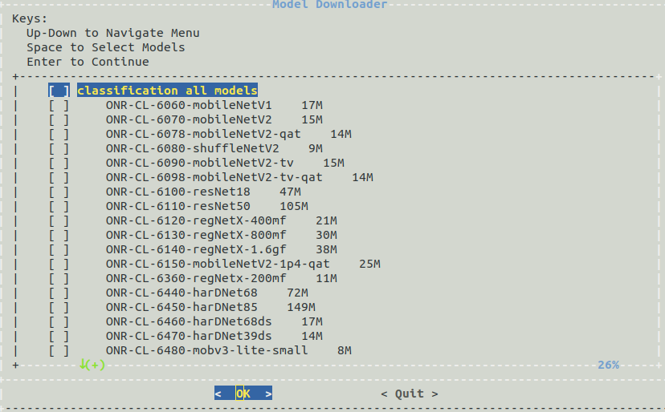

.. _ai_64_edgeai_inference_models:

DL models for Edge Inference
##############################

Model Downloader Tool
=====================

`TI Model Zoo <https://github.com/TexasInstruments/edgeai-modelzoo>`_
is a large collection of deep learning models validated to work on TI processors
for edge AI. It hosts several pre-compiled model artifacts for TI hardware.

Use the **Model Downloader Tool** to download more models on target as shown,

.. code-block:: bash

   debian@beaglebone:/opt/edge_ai_apps# ./download_models.sh

The script will launch an interactive menu showing the list of available,
pre-imported models for download. The downloaded models will be placed
under ``/opt/model_zoo/`` directory

   Model downloader tool menu option to download models

The script can also be used in a non-interactive way as shown below:

.. code-block:: bash

   debian@beaglebone:/opt/edge_ai_apps# ./download_models.sh --help

.. _ai_64_edgeai_import_custom_models:

Import Custom Models
====================

The BeagleBone® AI-64 Linux for Edge AI also supports importing pre-trained custom
models to run inference on target.

The SDK makes use of pre-compiled DNN (Deep Neural Network) models and performs
inference using various OSRT (open source runtime) such as TFLite runtime,
ONNX runtime and Neo AI-DLR. In order to infer a DNN, SDK expects the DNN and
associated artifacts in the below directory structure.

.. code-block:: bash

    TFL-OD-2010-ssd-mobV2-coco-mlperf-300x300
    │
    ├── param.yaml
    │
    ├── artifacts
    │   ├── 264_tidl_io_1.bin
    │   ├── 264_tidl_net.bin
    │   ├── 264_tidl_net.bin.layer_info.txt
    │   ├── 264_tidl_net.bin_netLog.txt
    │   ├── 264_tidl_net.bin.svg
    │   ├── allowedNode.txt
    │   └── runtimes_visualization.svg
    │
    └── model
        └── ssd_mobilenet_v2_300_float.tflite

DNN directory structure
-----------------------

Each DNN must have the following 3 components:

#. **model**: This directory contains the DNN being targeted to infer
#. **artifacts**: This directory contains the artifacts generated after the
   compilation of DNN for SDK, and described in :ref:`pub_edgeai_compile_artifacts`
#. **param.yaml**: A configuration file in yaml format to provide basic
   information about DNN, and associated pre and post processing parameters.
   More details can be find :ref:`pub_edgeai_params`

.. _ai_64_edgeai_params:

Param file format
-----------------

Each DNN has it’s own pre-process, inference and post-process
parameters to get the correct output. This information is typically available in
the training software that was used to train the model. In order to convey this
information to the SDK in a standardized fashion, we have defined a set of
parameters that describe these operations. These parameters are in the
param.yaml file.

Please see sample yaml files for various tasks such as image classification,
semantic segmentation and object detection in
`edgeai-benchmark examples <https://github.com/TexasInstruments/edgeai-benchmark/tree/master/examples/configs/yaml>`_.
Descriptions of various parameters are also in the yaml files. If users want to
bring their own model to the SDK, then they need to prepare this information
offline and get to the SDK. In next section we explain how to prepare this
information

.. _ai_64_edgeai_compile_artifacts:

DNN compilation for SDK – Basic Instructions
--------------------------------------------

The BeagleBone® AI-64 Linux for Edge AI supports three different runtimes to infer
a DNN, and user can choose a run time depending on the format of DNN.
We recommend users to use different run times and compare the performance and
select the one which provides best performance. User can find the steps to
generate the artifacts directory at
`Edge AI TIDL Tools <https://github.com/TexasInstruments/edgeai-tidl-tools/blob/master/examples/osrt_python/README.md#model-compilation-on-pc>`_

DNN compilation for SDK – Advanced Instructions
-----------------------------------------------

For beginners who are trying to compile models for the SDK, we recommend the
basic instructions given in the previous section. However, DNNs have lot of
variety and some models may need a different kind of preprocessing or postprocessing
operations. In order to help customers deal with different kinds of models, we
have prepared a model zoo in the repository
`edgeai-modelzoo <https://github.com/TexasInstruments/edgeai-modelzoo>`_

For the DNNs which are part of TI’s model zoo, one can find the compilation
settings and pre-compiled model artifacts in
`edgeai-benchmark <https://github.com/TexasInstruments/edgeai-benchmark>`_
repository. Instructions are also given to compile custom models.
When using `edgeai-benchmark`_ for model compilation, the yaml file is automatically
generated and artifacts are packaged in the way SDK understands. Please
follow the instructions in the repository to get started.
