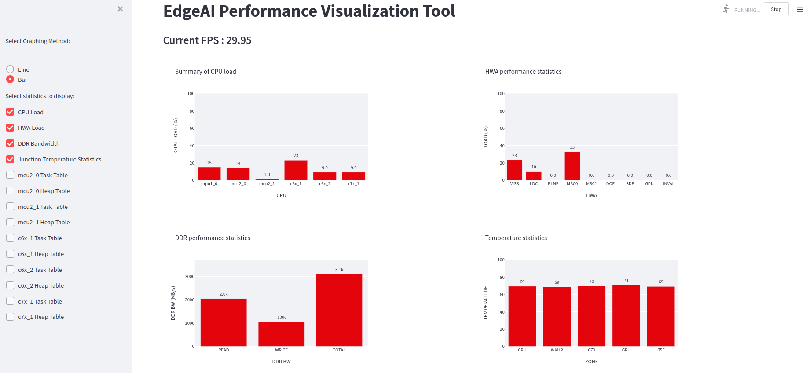

.. _ai_64_edgeai_perf_viz_tool:

Performance Visualization Tool
==============================

The performance visualization tool can be used to view all the performance
statistics recorded when running the edge AI C++ demo application. This includes
the CPU and HWA loading, DDR bandwidth, Junction Temperatures and FPS obtained.
Refer to :ref:`pub_edgeai_available_statistics` for details on the performance 
metrics available to be plotted.

This tool works as follows:

    - Logging: When running the application, the performance statistics can be
      recorded and stored in log files. This is done automatically when running
      the C++ application, but the Python application does not generate logs.
      However a standalone binary executable is provided that can be run in parallel
      with the Python application, which will generate these performance logs.
    - Visualization: There is a Python script which parses these logs and plots graphs,
      which can be easily viewed by a visiting a URL in any browser. This script uses
      Streamlit package to update the graphs in real-time, as the Edge AI application
      runs in parallel. However, since Streamlit is not supported in the SDK out of box,
      this script needs to run on docker. Please refer to :ref:`pub_edgeai_docker_env`
      for building and running a docker container.

Generating Performance Logs
===========================
Each log file contains real-time values for some performance metrics, averaged
over a 2s window. The temperature sensor values are sampled in real time, every 2s.
The performance visualization tool then parses these log files one by one based on
the modification timestamps.

The edge AI C++ demo will automatically generate log files and store them in the directory
``../perf_logs``, that is, one level up from where the C++ app is run. For
example, if the app is run from ``edge_ai_apps/apps_cpp``, the logs will be
stored in ``edge_ai_apps/perf_logs``.

Similarly, there is a binary executable that can be compiled that does the same logging
standalone. The source for this is available under ``edge_ai_apps/scripts/perf_stats/``.
The README.md file has simple instructions to build and run this standalone logger binary.
After building it, use following command to print the statistics on the terminal as well
as save them in log files that can be parsed.

.. code-block:: bash
    
    debian@beaglebone:/opt/edge_ai_apps/scripts/perf_stats/build# ../bin/Release/ti_perfstats -l

Running the Visualization tool
==============================

To use this tool, simply start a docker session and then run the command given
below. This script expects some log files to be present in the directory 
``edge_ai_apps/perf_logs`` after running any C++ demo. One can also bring up this
tool while running the demo but it might affect the performance of the demo itself
as it consumes a bit of ARM cycles during launch but stabilizes over a certain
duration.

.. code-block:: bash

    [docker] debian@beaglebone:/opt/edge_ai_apps# streamlit run scripts/perf_vis.py --theme.base="light"

This script also accepts the log directory as a command line argument as follows:

.. code-block:: bash

    [docker] debian@beaglebone:/opt/edge_ai_apps# streamlit run scripts/perf_vis.py --theme.base="light" -- -D <path/to/logs/directory/>

A network URL can be seen in the terminal output. The graphs can be viewed by
visiting this URL in any browser. The plotted graphs will keep updating based
on the available log files.

    Performance visualizer dashboard showing CPU and HWA loading, DDR bandwidth,
    Junction Temperatures and the FPS obtained

To exit press Ctrl+C in the terminal.

.. _ai_64_edgeai_available_statistics:

Available options
-----------------

Average frames per second (FPS) recorded by the application is displayed by
default. Using the checkboxes in the sidebar, one can select which performance
metrics to view. There are 14 metrics available to be plotted, as seen from
the above image:

    - CPU Load: Total loading for the A72(mpu1_0), R5F(mcu2_0/1), C66x(c6x_1/2) and C71x(c7x_1) DSPs.
    - HWA Load: Loading (percentage) for the various available hardware accelerators.
    - DDR Bandwidth: Average read, write and total bandwidth recorded in the previous 2s interval.
    - Junction Temperatures: The live temperatures recorded at various junctions
    - Task Table: A separate graph for each cpu showing the loading due to various tasks running on it.
    - Heap Table: A separate graph for each cpu showing the heap memory usage statistics.

For the first three metrics, there is a choice to view line graphs with a 30s
history or bar graphs with only the real-time values. The remaining eleven have
real-time bar graphs as the only option.