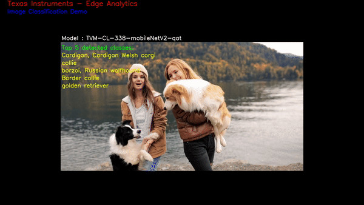
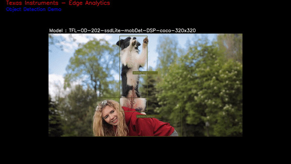

.. _ai_64_edgeai_running_simple_demos:

Running Simple demos
#####################

This chapter describes how to run Python and C++ demo applications in
`edge_ai_apps <https://git.ti.com/cgit/edgeai/edge_ai_apps>`_ with live
camera and display.

.. note::

    Please note that the Python demos are useful for quick prototyping
    while C++ demos are similar by design but tuned for performance.

.. _ai_64_edgeai_python_demos:

Running Python based demo applications
======================================

Python based demos are simple executable scripts written for image
classification, object detection and semantic segmentation. Demos are
configured using a YAML file. Details on configuration file parameters can
be found in :ref:`pub_edgeai_configuration`

Sample configuration files for out of the box demos can be found in
``edge_ai_apps/configs`` this folder also contains a template config file
which has brief info on each configurable parameter ``edge_ai_apps/configs/app_config_template.yaml``

Here is how a Python based image classification demo can be run,

.. code-block:: bash
    :linenos:

    # go to edge-ai-apps folder
    debian@beaglebone:~$ cd /opt/edge_ai_apps/apps_python

    # enable root (password: temppwd)
    debian@beaglebone:~$ sudo su
    [sudo] password for beaglebone:

    # use edge-ai-apps
    debian@beaglebone:/opt/edge_ai_apps/apps_cpp# sudo ./app_edgeai.py ../configs/image_classification.yaml

The demo captures the input frames from connected USB camera and passes
through pre-processing, inference and post-processing before sent to display.
Sample output for image classification and object detection demos are as below,

+---------+---------+
| |logo1| | |logo2| |
+---------+---------+

To exit the demo press Ctrl+C.

.. _ai_64_edgeai_cpp_demos:

Building and running C++ based demo applications
================================================

C++ apps needs to be built directly on target and requires header files of
different deep-learning runtime framework and its dependencies which are
installed in the setup script. The setup script builds the C++ apps when
executed. However one can also follow below steps to clean build C++ apps

.. code-block:: bash

    debian@beaglebone:/opt/edge_ai_apps/apps_cpp# rm -rf build bin lib
    debian@beaglebone:/opt/edge_ai_apps/apps_cpp# mkdir build
    debian@beaglebone:/opt/edge_ai_apps/apps_cpp# cd build
    debian@beaglebone:/opt/edge_ai_apps/apps_cpp/build# cmake ..
    debian@beaglebone:/opt/edge_ai_apps/apps_cpp/build# make -j2

Run the demo once the application is successfully built

.. code-block:: bash

    debian@beaglebone:/opt/edge_ai_apps/apps_cpp# ./bin/Release/app_edgeai ../configs/image_classification.yaml

To exit the demo press Ctrl+C.

.. note::

   Both Python and C++ applications are similar by construction and can accept
   the same config file and command line arguments

.. note::
   The C++ apps built on Yocto Linux may not run in Docker as there could be
   a mismatch in Glib and other related tools. So its **highly recommended** to
   rebuild the C++ apps within the Docker environment.

