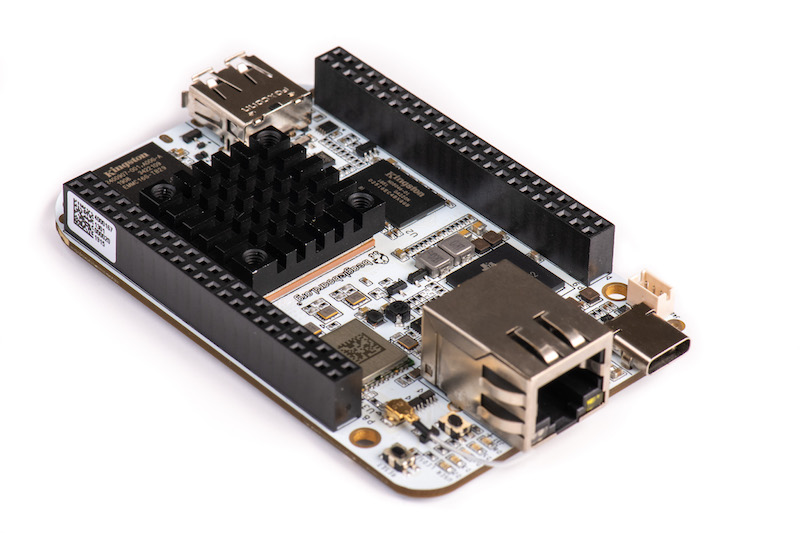

.. _beaglebone-ai-intro:

Introduction
##############

Built on the proven BeagleBoard.org® open source Linux approach,
BeagleBone® AI fills the gap between small SBCs and more powerful
industrial computers. Based on the Texas Instruments AM5729, developers
have access to the powerful SoC with the ease of BeagleBone® Black
header and mechanical compatibility. BeagleBone® AI makes it easy to
explore how artificial intelligence (AI) can be used in everyday life
via TI C66x digital-signal-processor (DSP) cores and
embedded-vision-engine (EVE) cores supported through an optimized TIDL
machine learning OpenCL API with pre-installed tools. Focused on
everyday automation in industrial, commercial and home applications.

