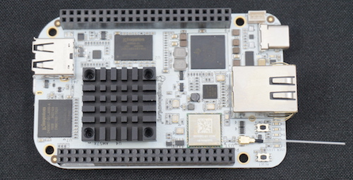
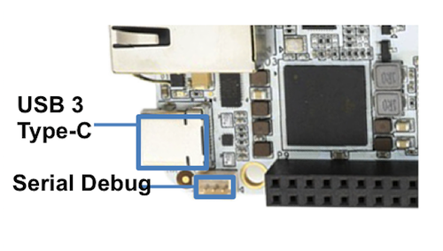
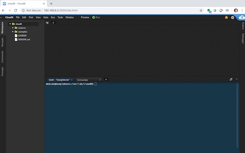
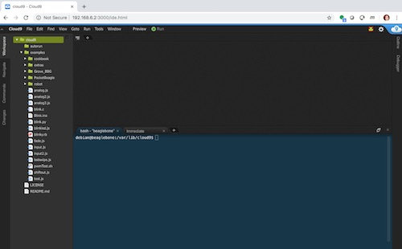
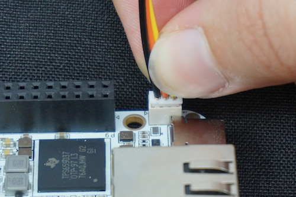

.. _beaglebone-ai-connecting:

Connecting Up Your BeagleBone AI
####################################

What’s In the Box
*******************

BeagleBone® AI comes in the box with the heat sink and antenna already
attached. Developers can get up and running in five minutes with no
microSD card needed. BeagleBone® AI comes preloaded with a Linux
distribution. In the box you will find:

-  BeagleBone® AI
-  Quick Start Guide

TODO: Add links to the design materials for both

What’s Not in the Box
=========================

You will need to purchase:

-  USB C cable or USB C to USB A cable
-  MicroSD Card (optional)
-  `Serial cable <https://github.com/beagleboard/beaglebone-ai/wiki/Frequently-Asked-Questions#serial-cable>`_ (optional)

More information or to purchase a replacement heat sink or antenna, please go to these web sites:

-  `Antenna <https://bit.ly/2kmXAzF>`_
-  `Heat Sink <https://bit.ly/2klxxJa>`_

Fans
===========

The pre-attached heat sink has M3 holes spaced 20x20 mm. The height of
the heat sink clears the USB type A socket, and all other components on
the board except the 46-way header sockets and the Ethernet socket.

If you run all of the accelerators or have an older software image,
you’ll likely need fan. To find a fan, visit the link to `fans in the
FAQ <https://github.com/beagleboard/beaglebone-ai/wiki/Frequently-Asked-Questions#fans>`_.

.. caution::

   BeagleBone AI can run **HOT**! Even without running the accelerators,
   getting up to 70C is not uncommon.

Official BeagleBone Fan Cape:
https://www.newark.com/element14/6100310/beaglebone-ai-fan-cape/dp/50AH3704

TODO: create short-links for any long URLs so that text works.

Main Connection Scenarios
******************************

This section will describe how to connect the board for use. The board
can be configured in several different ways. Below we will walk through
the most common scenarios. NOTE: These connection scenarios are
dependent on the software image presently on your BeagleBone® AI. When
all else fails, follow the instructions at
https://beagleboard.org/upgrade

-  `Tethered to a PC via USB C cable <#tethered-to-a-pc>`__
-  `Standalone Desktop with powered USB hub, display, keyboard and
   mouse <#standalone-wdisplay-and-keyboardmouse>`__
-  `Wireless Connection to BeagleBone® AI <#wireless-connection>`__

Tethered to a PC
========================

The most common way to program BeagleBone® AI is via a USB connection to
a PC. If your computer has a USB C type port, BeagleBone® AI will both
communicate and receive power directly from the PC. If your computer
does not support USB C type, you can utilize a powered USB C hub to
power and connect to BeagleBone® AI which in turn will connect to your
PC. You can also use a powered USB C hub to power and connect peripheral
devices such as a USB camera. After booting, the board is accessed
either as a USB storage device or via the browser on the PC. You will
need Chrome or Firefox on the PC.

NOTE:Start with this image "am57xx-eMMC-flasher-debian-10.3-iot-tidl-armhf-2020-04-06-6gb.img.xz"
loaded on your BeagleBone® AI.

1.  Locate the USB Type-C connector on BeagleBone® AI 

2.  Connect a USB type-C cable to BeagleBone® AI USB type-C port.

.. image:: images/BB_AI_connectingUSBC_500px.jpg

3.  Connect the other end of the USB cable to the PC USB 3 port.

.. image:: images/BB_AI_PlugIn_500px.jpg

4.  BeagleBone® AI will boot.

5.  You will notice some of the 5 user LEDs flashing

6.  Look for a new mass storage drive to appear on the PC.

.. image:: images/BB_AI_asadrive_500px.jpg

7.  Open the drive and open START.HTM with your web browser.

.. image:: images/BB_AI_starthtm_500px.png

.. image:: images/BB_AI_connectedscreen_500px.jpg

8.  Follow the instructions in the browser window.

9.  Go to Cloud9 IDE.

10. Open the directories in the left navigation of Cloud9.

Standalone w/Display and Keyboard/Mouse
==============================================

.. image:: images/BB_AI_Standalone_setup_750px.jpg
   :alt: BeagleBone AI Overview

.. note::

    This configuration requires loading the latest debian 9 image from
    https://elinux.org/Beagleboard:Latest-images-testing

Load "am57xx-eMMC-flasher-debian-9.13-lxqt-tidl-armhf-2020-08-25-6gb.img.xz"
image on the BeagleBone® AI

Presently, the "Cloud 9" application is broken in debian 10 only for
this configuration. We re working on a better solution.

1. Connect a combo keyboard and mouse to BeagleBone® AI’s USB host port.
2. Connect a microHDMI-to-HDMI cable to BeagleBone® AI’s microHDMI port.
3. Connect the microHDMI-to-HDMI cable to an HDMI monitor.
4. Plug a 5V 3A USB type-C power supply into BeagleBone® AI’s USB type-C port.
5. BeagleBone® AI will boot. No need to enter any passwords.
6. Depending on which software image is loaded, either a Desktop or a login shell will appear on the monitor.
7. Follow the instructions at https://beagleboard.org/upgrade

Wireless Connection
===========================

NOTE:Start with this image "am57xx-eMMC-flasher-debian-10.3-iot-tidl-armhf-2020-04-06-6gb.img.xz"
loaded on your BeagleBone® AI.

1. Plug a 5V 3A USB type-C power supply into BeagleBone® AI’s USB type-C port.
2. BeagleBone® AI will boot.
3. Connect your PC’s WiFi to SSID "BeagleBone-XXXX" where XXXX varies for your BeagleBone® AI.
4. Use password "BeagleBone" to complete the WiFi connection.
5. Open http://192.168.8.1 in your web browser.
6. Follow the instructions in the browser window.

Connecting a 3 PIN Serial Debug Cable
*****************************************

A 3 PIN serial debug cable can be helpful to debug when you need to view
the boot messages through a terminal program such as putty on your host
PC. This cable is not needed for most BeagleBone® AI boot up scenarios.

Cables: https://github.com/beagleboard/beaglebone-ai/wiki/Frequently-Asked-Questions#serial-cable

Locate the 3 PIN debug header on BeagleBone® AI, near the USB C connection.

Press the small white connector into the 3 PIN debug header. The pinout is:

- Pin 1 (the pin closest to the screw-hole in the board. It is also marked with a shape on the silkscreen): GND
- Pin 2: UART1_RX (i.e. this is a BB-AI input pin)
- Pin 3: UART1_TX (i.e. BB-AI transmits out on this pin)

