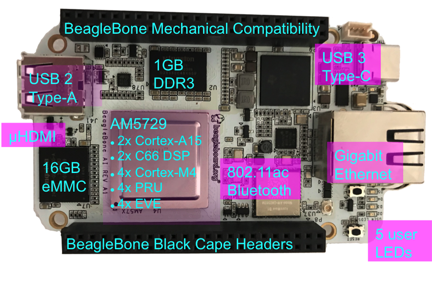
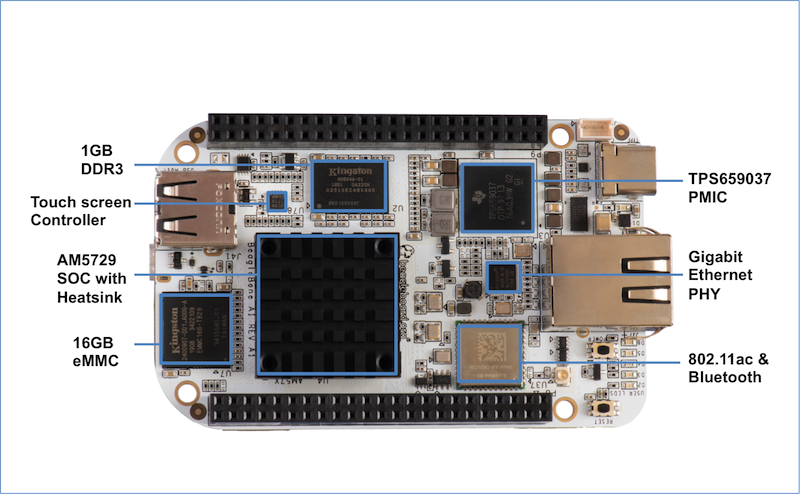

.. _beaglebone-ai-overview:

BeagleBone AI Overview
########################

BeagleBone® AI Features
************************

**Main Processor Features of the AM5729 Within BeagleBone® AI**

-  Dual 1.5GHz ARM® Cortex®-A15 with out-of-order speculative issue
   3-way superscalar execution pipeline for the fastest execution of
   existing 32-bit code
-  2 C66x Floating-Point VLIW DSP supported by OpenCL
-  4 Embedded Vision Engines (EVEs) supported by TIDL machine learning
   library
-  2x Dual-Core Programmable Real-Time Unit (PRU) subsystems (4 PRUs
   total) for ultra low-latency control and software generated
   peripherals
-  2x Dual ARM® Cortex®-M4 co-processors for real-time control
-  IVA-HD subsystem with support for 4K @ 15fps H.264 encode/decode and
   other codecs @ 1080p60
-  Vivante® GC320 2D graphics accelerator
-  Dual-Core PowerVR® SGX544™ 3D GPU

**Communications**

-  BeagleBone Black header and mechanical compatibility
-  16-bit LCD interfaces
-  4+ UARTs
-  2 I2C ports
-  2 SPI ports
-  Lots of PRU I/O pins

**Memory**

-  1GB DDR3L
-  16GB on-board eMMC flash

**Connectors**

-  USB Type-C connector for power and SuperSpeed dual-role controller
-  Gigabit Ethernet
-  802.11ac 2.4/5GHz WiFi via the AzureWave AW-CM256SM

**Out of Box Software**

-  Zero-download out of box software environment

Board Component Locations
*******************************

