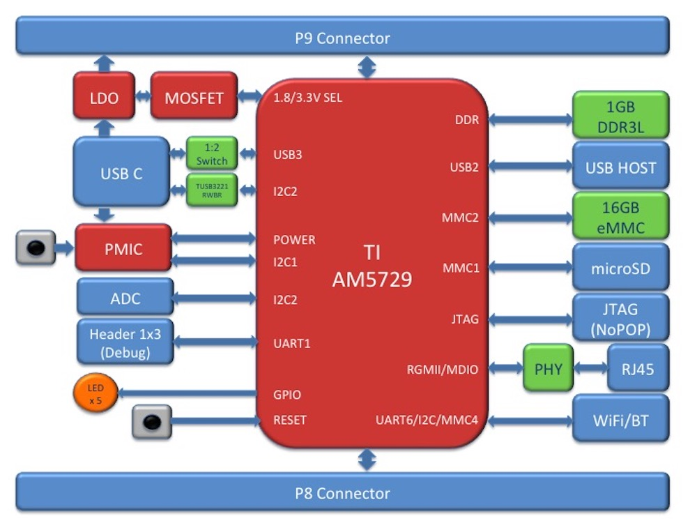
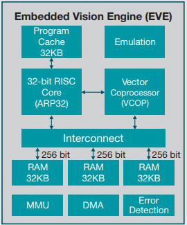

.. _beaglebone-ai-specs:

BeagleBone AI High Level Specification
###########################################

This section provides the high level specification of BeagleBone® AI

Block Diagram
******************

The figure below is the high level block diagram of BeagleBone® AI. For
detailed layout information please check the schematics.

AM572x Sitara™ Processor
**************************

The Texas Instruments AM572x Sitara™ processor family of SOC devices
brings high processing performance through the maximum flexibility of a
fully integrated mixed processor solution. The devices also combine
programmable video processing with a highly integrated peripheral set
ideal for AI applications. The AM5729 used on BeagleBone® AI is the
super-set device of the family.

Programmability is provided by dual-core ARM® Cortex®-A15 RISC CPUs with
Arm® Neon™ extension, and two TI C66x VLIW floating-point DSP core, and
Vision AccelerationPac (with 4x EVEs). The Arm allows developers to keep
control functions separate from other algorithms programmed on the DSPs
and coprocessors, thus reducing the complexity of the system software.

Texas Instruments AM572x Sitara™ Processor Family Block Diagram\*

**MPU Subsystem** The Dual Cortex-A15 MPU subsystem integrates the
following submodules:

-  ARM Cortex-A15 MPCore

   -  Two central processing units (CPUs)

   -  ARM Version 7 ISA: Standard ARM instruction set plus Thumb®-2,
      Jazelle® RCT Java™ accelerator, hardware virtualization support,
      and large physical address extensions (LPAE)

   -  Neon™ SIMD coprocessor and VFPv4 per CPU

   -  Interrupt controller with up to 160 interrupt requests

   -  One general-purpose timer and one watchdog timer per CPU – Debug
      and trace features

   -  32-KiB instruction and 32-KiB data level 1 (L1) cache per CPU

-  Shared 2-MiB level 2 (L2) cache

-  48-KiB bootable ROM

-  Local power, reset, and clock management (PRCM) module

-  Emulation features

-  Digital phase-locked loop (DPLL)

**DSP Subsystems** There are two DSP subsystems in the device. Each DSP
subsystem contains the following submodules:

-  TMS320C66x™ Floating-Point VLIW DSP core for audio processing, and
   general-purpose imaging and video processing. It extends the
   performance of existing C64x+™ and C647x™ DSPs through enhancements
   and new features.

   -  32-KiB L1D and 32-KiB L1P cache or addressable SRAM

   -  288-KiB L2 cache

-  256-KiB configurable as cache or SRAM

-  32-KiB SRAM

-  Enhanced direct memory access (EDMA) engine for video and audio data
   transfer

-  Memory management units (MMU) for address management.

-  Interrupt controller (INTC)

-  Emulation capabilities

-  Supported by OpenCL

**EVE Subsystems**

-  4 Embedded Vision Engines (EVEs) supported by TIDL machine learning
   library

The Embedded Vision Engine (EVE) module is a programmable imaging and
vision processing engine. Software support for the EVE module is
available through OpenCL Custom Device model with fixed set of
functions. More information is available
http://www.ti.com/lit/wp/spry251/spry251.pdf

**PRU-ICSS Subsystems**

-  2x Dual-Core Programmable Real-Time Unit (PRU) subsystems (4 PRUs
   total) for ultra low-latency control and software generated
   peripherals. Access to these powerful subsystems is available through
   through the P8 and P9 headers. These are detailed in Section 7.

**IPU Subsystems** There are two Dual Cortex-M4 IPU subsystems in the
device available for general purpose usage, particularly real-time
control. Each IPU subsystem includes the following components:

-  Two Cortex-M4 CPUs

-  ARMv7E-M and Thumb-2 instruction set architectures

-  Hardware division and single-cycle multiplication acceleration

-  Dedicated INTC with up to 63 physical interrupt events with 16-level
   priority

-  Two-level memory subsystem hierarchy

   -  L1 (32-KiB shared cache memory)

   -  L2 ROM + RAM

-  64-KiB RAM

-  16-KiB bootable ROM

-  MMU for address translation

-  Integrated power management

-  Emulation feature embedded in the Cortex-M4

**IVA-HD Subsystem**

-  IVA-HD subsystem with support for 4K @ 15fps H.264 encode/decode and
   other codecs @ 1080p60 The IVA-HD subsystem is a set of video encoder
   and decoder hardware accelerators. The list of supported codecs can
   be found in the software development kit (SDK) documentation.

**BB2D Graphics Accelerator Subsystem** The Vivante® GC320 2D graphics
accelerator is the 2D BitBlt (BB2D) graphics accelerator subsystem on
the device with the following features:

-  API support:

   -  OpenWF™, DirectFB

   -  GDI/DirectDraw

-  BB2D architecture:

   -  BitBlt and StretchBlt

   -  DirectFB hardware acceleration

   -  ROP2, ROP3, ROP4 full alpha blending and transparency

   -  Clipping rectangle support

   -  Alpha blending includes Java 2 Porter-Duff compositing rules

   -  90-, 180-, 270-degree rotation on every primitive

   -  YUV-to-RGB color space conversion

   -  Programmable display format conversion with 14 source and 7
      destination formats

   -  High-quality, 9-tap, 32-phase filter for image and video scaling
      at 1080p

   -  Monochrome expansion for text rendering

   -  32K × 32K coordinate system

**Dual-Core PowerVR® SGX544™ 3D GPU** The 3D graphics processing unit
(GPU) subsystem is based on POWERVR® SGX544 subsystem from Imagination
Technologies. It supports general embedded applications. The GPU can
process different data types simultaneously, such as: pixel data, vertex
data, video data, and general-purpose data. The GPU subsystem has the
following features:

-  Multicore GPU architecture: two SGX544 cores.

-  Shared system level cache of 128 KiB

-  Tile-based deferred rendering architecture

-  Second-generation universal scalable shader engines (USSE2),
   multithreaded engines incorporating pixel and vertex shader
   functionality

-  Present and texture load accelerators

   -  Enables to move, rotate, twiddle, and scale texture surfaces.

   -  Supports RGB, ARGB, YUV422, and YUV420 surface formats.

   -  Supports bilinear upscale.

   -  Supports source colorkey.

-  Fine-grained task switching, load balancing, and power management

-  Programmable high-quality image antialiasing

-  Bilinear, trilinear, anisotropic texture filtering

-  Advanced geometry DMA driven operation for minimum CPU interaction

-  Fully virtualized memory addressing for OS operation in a unified
   memory architecture (MMU)

Memory
************

.. __5_3_1_1gb_ddr3l:

1GB DDR3L
============

Dual 256M x 16 DDR3L memory devices are used, one on each side of the
board, for a total of 1 GB. They will each operate at a clock frequency
of up to 533 MHz yielding an effective rate of 1066Mb/s on the DDR3L bus
allowing for 4GB/s of DDR3L memory bandwidth.

16GB Embedded MMC
===================

A single 16GB embedded MMC (eMMC) device is on the board.

microSD Connector
==================

The board is equipped with a single microSD connector to act as a
secondary boot source for the board and, if selected as such, can be the
primary booth source. The connector will support larger capacity microSD
cards. The microSD card is not provided with the board.

Boot Modes
*************

Power Management
******************

Connectivity
******************

TODO: Add WiFi/Bluetooth/Ethernet

BeagleBone® AI supports the majority of the functions of the AM5729 SOC
through connectors or expansion header pin accessibility. See section 7
for more information on expansion header pinouts. There are a few
functions that are not accessible which are: (TBD)

TODO: This text needs to go somewhere.

On-board I2C Devices
***********************

+--------+--------+-----------------+
| A      | Iden   | Description     |
| ddress | tifier |                 |
+========+========+=================+
| 0x12   | U3     | TPS6590379 PMIC |
|        |        | DVS             |
+--------+--------+-----------------+
| 0x41   | U78    | STMPE811Q ADC   |
|        |        | and GPIO        |
|        |        | expander        |
+--------+--------+-----------------+
| 0x47   | U13    | HD3SS3220 USB   |
|        |        | Type-C DRP port |
|        |        | controller      |
+--------+--------+-----------------+
| 0x50   | U9     | 24LC32 board ID |
|        |        | EEPROM          |
+--------+--------+-----------------+
| 0x58   | U3     | TPS6590379 PMIC |
|        |        | power registers |
+--------+--------+-----------------+
| 0x5a   | U3     | TPS6590379 PMIC |
|        |        | interfaces and  |
|        |        | auxilaries      |
+--------+--------+-----------------+
| 0x5c   | U3     | TPS6590379 PMIC |
|        |        | trimming and    |
|        |        | test            |
+--------+--------+-----------------+
| 0x5e   | U3     | TPS6590379 PMIC |
|        |        | OTP             |
+--------+--------+-----------------+
