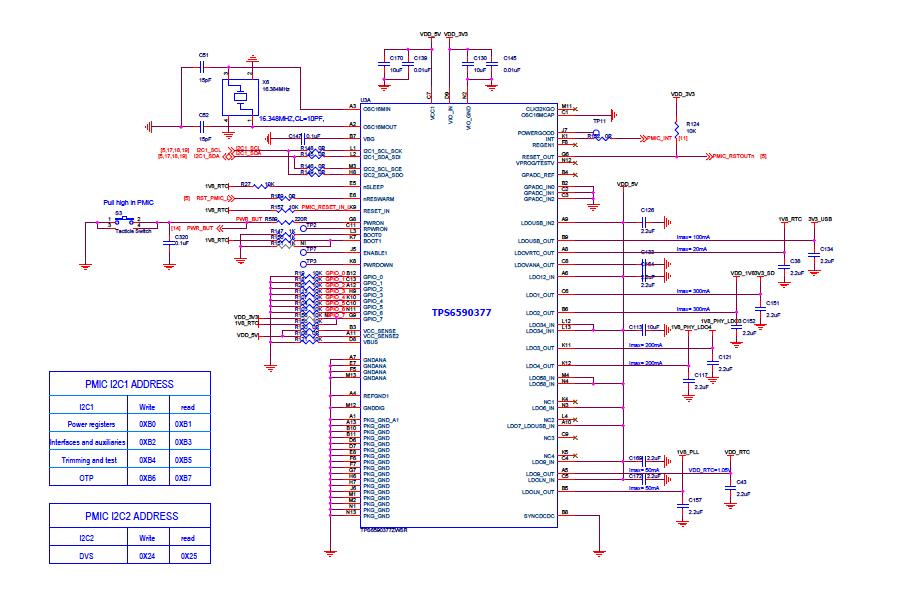
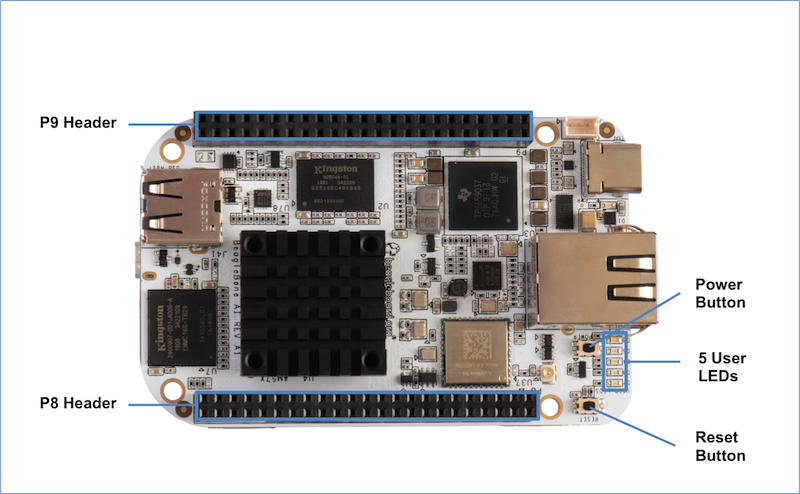
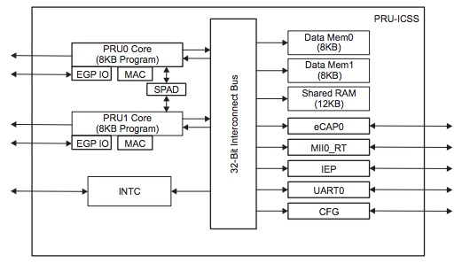

.. _beaglebone-ai-specs:

Detailed Hardware Design
#########################

This section provides a detailed description of the Hardware design.
This can be useful for interfacing, writing drivers, or using it to help
modify specifics of your own design.

The figure below is the high level block diagram of BeagleBone® AI. For
those who may be concerned, this is the same figure found in section 5.
It is placed here again for convenience so it is closer to the topics to
follow.

.. image:: images/BB_AI_Blockdiagram_1000px.jpg
   :alt: beaglebone ai component placement

Power Section
**************************

**Figure ?** is the high level block diagram of the power section of the
board.

(Block Diagram for Power)

TPS6590379 PMIC
====================

The Texas Instruments TPS6590379ZWSR device is an integrated
power-management IC (PMIC) specifically designed to work well ARM Cortex
A15 Processors, such as the AM5729 used on BeagleBone® AI. The datasheet
is located here https://www.ti.com/lit/ds/symlink/tps659037.pdf

The device provides seven configurable step-down converters with up to 6
A of output current for memory, processor core, input-output (I/O), or
preregulation of LDOs. One of these configurable step-down converters
can be combined with another 3-A regulator to allow up to 9 A of output
current. All of the step-down converters can synchronize to an external
clock source between 1.7 MHz and 2.7 MHz, or an internal fallback clock
at 2.2 MHz.

The TPS659037 device contains seven LDO regulators for external use.
These LDO regulators can be supplied from either a system supply or a
preregulated supply. The power-up and power-down controller is
configurable and supports any power-up and power-down sequences (OTP
based). The TPS659037 device includes a 32-kHz RC oscillator to sequence
all resources during power up and power down. In cases where a fast
start up is needed, a 16-MHz crystal oscillator is also included to
quickly generate a stable 32-kHz for the system. All LDOs and SMPS
converters can be controlled by the SPI or I2C interface, or by power
request signals. In addition, voltage scaling registers allow
transitioning the SMPS to different voltages by SPI, I2C, or roof and
floor control.

One dedicated pin in each package can be configured as part of the
power-up sequence to control external resources. General-purpose
input-output (GPIO) functionality is available and two GPIOs can be
configured as part of the power-up sequence to control external
resources. Power request signals enable power mode control for power
optimization. The device includes a general-purpose sigma-delta
analog-to-digital converter (GPADC) with three external input channels.

6.1.2 USB-C Power
====================

**Figure 23** below shows how the USB-C power input is connected to the
**TPS6590379**.

TODO: (Schematic screenshoot)

Power Button
==============

.. _eMMC-flash-memory:

eMMC Flash Memory (16GB)
**********************************

eMMC Device
==================

eMMC Circuit Design
=====================

Board ID
=============

A board identifier is placed on the eMMC in the second linear boot
partition (/dev/mmcblk1boot1). Reserved bytes up to 32k (0x8000) are
filled with “FF”.

+----------------+----------------+----------------------------------+
| Name           | Size (bytes)   | Contents                         |
+================+================+==================================+
| Header         | 4              | MSB 0xEE3355AA LSB (stored LSB   |
|                |                | first)                           |
+----------------+----------------+----------------------------------+
| Board Name     | 8              | Name for board in ASCII          |
|                |                | “BBONE-AI” = BeagleBone AI       |
+----------------+----------------+----------------------------------+
| Version        | 4              | Hardware version code for board  |
|                |                | in ASCII “00A1” = rev. A1        |
+----------------+----------------+----------------------------------+
| Serial Number  | 14             | Serial number of the board. This |
|                |                | is a 14 character string which   |
|                |                | is:                              |
|                |                |                                  |
|                |                | WWYYEMAInnnnnn                   |
|                |                |                                  |
|                |                | where:                           |
|                |                |                                  |
|                |                | -  WW = 2 digit week of the year |
|                |                |    of production                 |
|                |                |                                  |
|                |                | -  YY = 2 digit year of          |
|                |                |    production                    |
|                |                |                                  |
|                |                | -  EM = Embest                   |
|                |                |                                  |
|                |                | -  AI = BeagleBone AI            |
|                |                |                                  |
|                |                | -  nnnnnn = incrementing board   |
|                |                |    number                        |
+----------------+----------------+----------------------------------+

Example:

::

   debian@beaglebone:/var/lib/cloud9$ sudo hexdump -C /dev/mmcblk1boot1
   00000000  aa 55 33 ee 42 42 4f 4e  45 2d 41 49 30 30 41 31  |.U3.BBONE-AI00A1|
   00000010  31 39 33 33 45 4d 41 49  30 30 30 38 30 33 ff ff  |1933EMAI000803..|
   00000020  ff ff ff ff ff ff ff ff  ff ff ff ff ff ff ff ff  |................|
   *
   00008000  00 00 00 00 00 00 00 00  00 00 00 00 00 00 00 00  |................|
   *
   00400000

Wireless Communication: 802.11 ac & Bluetooth: AzureWave AW-CM256SM
*********************************************************************

Datasheet
https://storage.googleapis.com/wzukusers/user-26561200/documents/5b7d0fe3c3f29Ct6k0QI/AW-CM256SM_DS_Rev%2015_CYW.pdf
Wireless connectivity is provided on BeagleBone® AI via the AzureWave
Technologies AW-CM256SM IEEE 802.11a/b/g/n/ac Wi-Fi with Bluetooth 4.2
Combo Stamp Module.

This highly integrated wireless local area network (WLAN) solution
combines Bluetooth 4.2 and provides a complete 2.4GHz Bluetooth system
which is fully compliant to Bluetooth 4.2 and v2.1 that supports EDR of
2Mbps and 3Mbps for data and audio communications. It enables a high
performance, cost effective, low power, compact solution that easily
fits onto the SDIO and UART combo stamp module.

Compliant with the IEEE 802.11a/b/g/n/ac standard, AW-CM256SM uses
Direct Sequence Spread Spectrum (DSSS), Orthogonal Frequency Division
Multiplexing (OFDM), BPSK, QPSK, CCK and QAM baseband modulation
technologies. Compare to 802.11n technology, 802.11ac provides a big
improvement on speed and range.

The AW-CM256SM module adopts a Cypress solution. The module design is
based on the Cypress CYP43455 single chip.

WLAN on the AzureWave AW-CM256SM
==================================

High speed wireless connection up to 433.3Mbps transmit/receive PHY rate using 80MHz bandwidth,

* 1 antennas to support 1(Transmit) and 1(Receive) technology and Bluetooth 
* WCS (Wireless Coexistence System)
* Low power consumption and high performance 
* Enhanced wireless security 
* Fully speed operation with Piconet and Scatternet support 
* 12mm(L) x 12mm(W) x1.65mm(H) LGA package 
* Dual - band 2.4 GHz and 5GHz 802.11 a/b/g/n/ac 
* External Crystal

6.9.2 Bluetooth on the AzureWave AW-CM256S
=============================================

-  1 antennas to support 1(Transmit) and 1(Receive) technology and Bluetooth

-  Fully qualified Bluetooth BT4.2

-  Enhanced Data Rate(EDR) compliant for both 2Mbps and 3Mbps supported

-  High speed UART and PCM for Bluetooth

HDMI
*******

The HDMI interface is aligned with the HDMI TMDS single stream standard
v1.4a (720p @60Hz to 1080p @24Hz) and the HDMI v1.3 (1080p @60Hz): 3
data channels, plus 1 clock channel is supported (differential).

TODO: Verify it isn’t better than this. Doesn’t seem right.

PRU-ICSS
***********

The Texas Instruments AM5729 Sitara™ provides 2 Programmable Real-Time
Unit Subsystem and Industrial Communciation Subsystems. (PRU-ICSS1 and
PRU-ICSS2).

Within each PRU-ICSS are dual 32-bit Load / Store RISC CPU cores:
Programmable Real-Time Units (PRU0 and PRU1), shared data and
instruction memories, internal peripheral modules and an interrupt
controller. Therefore the SoC is providing a total of 4 PRU 32-bit RISC
CPU’s:

-  PRU-ICSS1 PRU0

-  PRU-ICSS1 PRU1

-  PRU-ICSS2 PRU0

-  PRU-ICSS2 PRU1

The programmable nature of the PRUs, along with their access to pins,
events and all SoC resources, provides flexibility in implmenting fast
real-time responses, specialized data handling operations, peripheral
interfaces and in off-loading tasks from the other processor cores of
the SoC.

PRU-ICSS Features
===================

Each of the 2 PRU-ICSS (PRU-ICSS1 and PRU-ICSS2) includes the following main features: 

* 2 Independent programmable real-time (PRU) cores (PRU0 and PRU1) 
* 21x Enhanced GPIs (EGPIs) and 21x Enhanced GPOs (EGPOs) with asynchronous capture and serial support per each PRU CPU core
* One Ethernet MII_RT module (PRU-ICSS_MII_RT) with two MII ports and configurable connections to PRUs 
* 1 MDIO Port (PRU-ICSS_MII_MDIO) 
* One Industrial Ethernet Peripheral (IEP) to manage/generate Industrial Ethernet functions 
* 1 x 16550-compatible UART with a dedicated 192 MHz clock to support 12Mbps Profibus 
* 1 Industrial Ethernet timer with 7/9 capture and 8 compare events 
* 1 Enhanced Capture Module (ECAP) 
* 1 Interrupt Controller (PRU-ICSS_INTC) 
* A flexible power management support 
* Integrated switched central resource with programmable priority 
* Parity control supported by all memories

PRU-ICSS Block Diagram
========================

Below is a high level block diagram of one of the PRU-ICSS Subsystems

PRU-ICSS Resources and FAQ’s
*****************************

Resources

-  Great resources for PRU and BeagleBone® has been compiled here https://beagleboard.org/pru
-  The PRU Cookbook provides examples and getting started information https://github.com/MarkAYoder/PRUCookbook
-  Detailed specification is availble at http://processors.wiki.ti.com/index.php/PRU-ICSS

FAQ

-  Q: Is it possible to configure the Ethernet MII to be accessed via a
   PRU MII?

-  A: TBD

PRU-ICSS1 Pin Access
======================

The table below shows which PRU-ICSS1 signals can be accessed on
BeagleBone® AI and on which connector and pins they are accessible from.
Some signals are accessible on the same pins. Signal Names reveal which
PRU-ICSS Subsystem is being addressed. pr1 is PRU-ICSS1 and pr2 is
PRU-ICSS2

+-------------------+----------------+---+---+------+---+------+---+
| SIGNAL NAME       | DESCRIPTION    | T | P | HE   | M | HE   | M |
|                   |                | Y | R | ADER | O | ADER | O |
|                   |                | P | O | _PIN | D | _PIN | D |
|                   |                | E | C |      | E |      | E |
+===================+================+===+===+======+===+======+===+
| pr1_pru0_gpo0     | PRU0           | O | A | NA   |   |      |   |
|                   | G              |   | H |      |   |      |   |
|                   | eneral-Purpose |   | 6 |      |   |      |   |
|                   | Output         |   |   |      |   |      |   |
+-------------------+----------------+---+---+------+---+------+---+
| pr1_pru0_gpo1     | PRU0           | O | A | NA   |   |      |   |
|                   | G              |   | H |      |   |      |   |
|                   | eneral-Purpose |   | 3 |      |   |      |   |
|                   | Output         |   |   |      |   |      |   |
+-------------------+----------------+---+---+------+---+------+---+
| pr1_pru0_gpo2     | PRU0           | O | A | NA   |   |      |   |
|                   | G              |   | H |      |   |      |   |
|                   | eneral-Purpose |   | 5 |      |   |      |   |
|                   | Output         |   |   |      |   |      |   |
+-------------------+----------------+---+---+------+---+------+---+
| pr1_pru0_gpo3     | PRU0           | O | A | P    | M |      |   |
|                   | G              |   | G | 8_12 | O |      |   |
|                   | eneral-Purpose |   | 6 |      | D |      |   |
|                   | Output         |   |   |      | E |      |   |
|                   |                |   |   |      | 1 |      |   |
|                   |                |   |   |      | 3 |      |   |
+-------------------+----------------+---+---+------+---+------+---+
| pr1_pru0_gpo4     | PRU0           | O | A | P    | M |      |   |
|                   | G              |   | H | 8_11 | O |      |   |
|                   | eneral-Purpose |   | 4 |      | D |      |   |
|                   | Output         |   |   |      | E |      |   |
|                   |                |   |   |      | 1 |      |   |
|                   |                |   |   |      | 3 |      |   |
+-------------------+----------------+---+---+------+---+------+---+
| pr1_pru0_gpo5     | PRU0           | O | A | P    | M |      |   |
|                   | G              |   | G | 9_15 | O |      |   |
|                   | eneral-Purpose |   | 4 |      | D |      |   |
|                   | Output         |   |   |      | E |      |   |
|                   |                |   |   |      | 1 |      |   |
|                   |                |   |   |      | 3 |      |   |
+-------------------+----------------+---+---+------+---+------+---+
| pr1_pru0_gpo6     | PRU0           | O | A | NA   |   |      |   |
|                   | G              |   | G |      |   |      |   |
|                   | eneral-Purpose |   | 2 |      |   |      |   |
|                   | Output         |   |   |      |   |      |   |
+-------------------+----------------+---+---+------+---+------+---+
| pr1_pru0_gpo7     | PRU0           | O | A | NA   |   |      |   |
|                   | G              |   | G |      |   |      |   |
|                   | eneral-Purpose |   | 3 |      |   |      |   |
|                   | Output         |   |   |      |   |      |   |
+-------------------+----------------+---+---+------+---+------+---+
| pr1_pru0_gpo8     | PRU0           | O | A | NA   |   |      |   |
|                   | G              |   | G |      |   |      |   |
|                   | eneral-Purpose |   | 5 |      |   |      |   |
|                   | Output         |   |   |      |   |      |   |
+-------------------+----------------+---+---+------+---+------+---+
| pr1_pru0_gpo9     | PRU0           | O | A | NA   |   |      |   |
|                   | G              |   | F |      |   |      |   |
|                   | eneral-Purpose |   | 2 |      |   |      |   |
|                   | Output         |   |   |      |   |      |   |
+-------------------+----------------+---+---+------+---+------+---+
| pr1_pru0_gpo10    | PRU0           | O | A | NA   |   |      |   |
|                   | G              |   | F |      |   |      |   |
|                   | eneral-Purpose |   | 6 |      |   |      |   |
|                   | Output         |   |   |      |   |      |   |
+-------------------+----------------+---+---+------+---+------+---+
| pr1_pru0_gpo11    | PRU0           | O | A | NA   |   |      |   |
|                   | G              |   | F |      |   |      |   |
|                   | eneral-Purpose |   | 3 |      |   |      |   |
|                   | Output         |   |   |      |   |      |   |
+-------------------+----------------+---+---+------+---+------+---+
| pr1_pru0_gpo12    | PRU0           | O | A | NA   |   |      |   |
|                   | G              |   | F |      |   |      |   |
|                   | eneral-Purpose |   | 4 |      |   |      |   |
|                   | Output         |   |   |      |   |      |   |
+-------------------+----------------+---+---+------+---+------+---+
| pr1_pru0_gpo13    | PRU0           | O | A | NA   |   |      |   |
|                   | G              |   | F |      |   |      |   |
|                   | eneral-Purpose |   | 1 |      |   |      |   |
|                   | Output         |   |   |      |   |      |   |
+-------------------+----------------+---+---+------+---+------+---+
| pr1_pru0_gpo14    | PRU0           | O | A | NA   |   |      |   |
|                   | G              |   | E |      |   |      |   |
|                   | eneral-Purpose |   | 3 |      |   |      |   |
|                   | Output         |   |   |      |   |      |   |
+-------------------+----------------+---+---+------+---+------+---+
| pr1_pru0_gpo15    | PRU0           | O | A | NA   |   |      |   |
|                   | G              |   | E |      |   |      |   |
|                   | eneral-Purpose |   | 5 |      |   |      |   |
|                   | Output         |   |   |      |   |      |   |
+-------------------+----------------+---+---+------+---+------+---+
| pr1_pru0_gpo16    | PRU0           | O | A | NA   |   |      |   |
|                   | G              |   | E |      |   |      |   |
|                   | eneral-Purpose |   | 1 |      |   |      |   |
|                   | Output         |   |   |      |   |      |   |
+-------------------+----------------+---+---+------+---+------+---+
| pr1_pru0_gpo17    | PRU0           | O | A | P    | M |      |   |
|                   | G              |   | E | 9_26 | O |      |   |
|                   | eneral-Purpose |   | 2 |      | D |      |   |
|                   | Output         |   |   |      | E |      |   |
|                   |                |   |   |      | 1 |      |   |
|                   |                |   |   |      | 3 |      |   |
+-------------------+----------------+---+---+------+---+------+---+
| pr1_pru0_gpo18    | PRU0           | O | A | NA   |   |      |   |
|                   | G              |   | E |      |   |      |   |
|                   | eneral-Purpose |   | 6 |      |   |      |   |
|                   | Output         |   |   |      |   |      |   |
+-------------------+----------------+---+---+------+---+------+---+
| pr1_pru0_gpo19    | PRU0           | O | A | NA   |   |      |   |
|                   | G              |   | D |      |   |      |   |
|                   | eneral-Purpose |   | 2 |      |   |      |   |
|                   | Output         |   |   |      |   |      |   |
+-------------------+----------------+---+---+------+---+------+---+
| pr1_pru0_gpo20    | PRU0           | O | A | NA   |   |      |   |
|                   | G              |   | D |      |   |      |   |
|                   | eneral-Purpose |   | 3 |      |   |      |   |
|                   | Output         |   |   |      |   |      |   |
+-------------------+----------------+---+---+------+---+------+---+
| pr1_pru0_gpi0     | PRU0           | I | A | NA   |   |      |   |
|                   | G              |   | H |      |   |      |   |
|                   | eneral-Purpose |   | 6 |      |   |      |   |
|                   | Input          |   |   |      |   |      |   |
+-------------------+----------------+---+---+------+---+------+---+
| pr1_pru0_gpi1     | PRU0           | I | A | NA   |   |      |   |
|                   | G              |   | H |      |   |      |   |
|                   | eneral-Purpose |   | 3 |      |   |      |   |
|                   | Input          |   |   |      |   |      |   |
+-------------------+----------------+---+---+------+---+------+---+
| pr1_pru0_gpi2     | PRU0           | I | A | NA   |   |      |   |
|                   | G              |   | H |      |   |      |   |
|                   | eneral-Purpose |   | 5 |      |   |      |   |
|                   | Input          |   |   |      |   |      |   |
+-------------------+----------------+---+---+------+---+------+---+
| pr1_pru0_gpi3     | PRU0           | I | A | P    | M |      |   |
|                   | G              |   | G | 8_12 | O |      |   |
|                   | eneral-Purpose |   | 6 |      | D |      |   |
|                   | Input          |   |   |      | E |      |   |
|                   |                |   |   |      | 1 |      |   |
|                   |                |   |   |      | 2 |      |   |
+-------------------+----------------+---+---+------+---+------+---+
| pr1_pru0_gpi4     | PRU0           | I | A | P    | M |      |   |
|                   | G              |   | H | 8_11 | O |      |   |
|                   | eneral-Purpose |   | 4 |      | D |      |   |
|                   | Input          |   |   |      | E |      |   |
|                   |                |   |   |      | 1 |      |   |
|                   |                |   |   |      | 2 |      |   |
+-------------------+----------------+---+---+------+---+------+---+
| pr1_pru0_gpi5     | PRU0           | I | A | P    | M |      |   |
|                   | G              |   | G | 9_15 | O |      |   |
|                   | eneral-Purpose |   | 4 |      | D |      |   |
|                   | Input          |   |   |      | E |      |   |
|                   |                |   |   |      | 1 |      |   |
|                   |                |   |   |      | 2 |      |   |
+-------------------+----------------+---+---+------+---+------+---+
| pr1_pru0_gpi6     | PRU0           | I | A | NA   |   |      |   |
|                   | G              |   | G |      |   |      |   |
|                   | eneral-Purpose |   | 2 |      |   |      |   |
|                   | Input          |   |   |      |   |      |   |
+-------------------+----------------+---+---+------+---+------+---+
| pr1_pru0_gpi7     | PRU0           | I | A | NA   |   |      |   |
|                   | G              |   | G |      |   |      |   |
|                   | eneral-Purpose |   | 3 |      |   |      |   |
|                   | Input          |   |   |      |   |      |   |
+-------------------+----------------+---+---+------+---+------+---+
| pr1_pru0_gpi8     | PRU0           | I | A | NA   |   |      |   |
|                   | G              |   | G |      |   |      |   |
|                   | eneral-Purpose |   | 5 |      |   |      |   |
|                   | Input          |   |   |      |   |      |   |
+-------------------+----------------+---+---+------+---+------+---+
| pr1_pru0_gpi9     | PRU0           | I | A | NA   |   |      |   |
|                   | G              |   | F |      |   |      |   |
|                   | eneral-Purpose |   | 2 |      |   |      |   |
|                   | Input          |   |   |      |   |      |   |
+-------------------+----------------+---+---+------+---+------+---+
| pr1_pru0_gpi10    | PRU0           | I | A | NA   |   |      |   |
|                   | G              |   | F |      |   |      |   |
|                   | eneral-Purpose |   | 6 |      |   |      |   |
|                   | Input          |   |   |      |   |      |   |
+-------------------+----------------+---+---+------+---+------+---+
| pr1_pru0_gpi11    | PRU0           | I | A | NA   |   |      |   |
|                   | G              |   | F |      |   |      |   |
|                   | eneral-Purpose |   | 3 |      |   |      |   |
|                   | Input          |   |   |      |   |      |   |
+-------------------+----------------+---+---+------+---+------+---+
| pr1_pru0_gpi12    | PRU0           | I | A | NA   |   |      |   |
|                   | G              |   | F |      |   |      |   |
|                   | eneral-Purpose |   | 4 |      |   |      |   |
|                   | Input          |   |   |      |   |      |   |
+-------------------+----------------+---+---+------+---+------+---+
| pr1_pru0_gpi13    | PRU0           | I | A | NA   |   |      |   |
|                   | G              |   | F |      |   |      |   |
|                   | eneral-Purpose |   | 1 |      |   |      |   |
|                   | Input          |   |   |      |   |      |   |
+-------------------+----------------+---+---+------+---+------+---+
| pr1_pru0_gpi14    | PRU0           | I | A | NA   |   |      |   |
|                   | G              |   | E |      |   |      |   |
|                   | eneral-Purpose |   | 3 |      |   |      |   |
|                   | Input          |   |   |      |   |      |   |
+-------------------+----------------+---+---+------+---+------+---+
| pr1_pru0_gpi15    | PRU0           | I | A | NA   |   |      |   |
|                   | G              |   | E |      |   |      |   |
|                   | eneral-Purpose |   | 5 |      |   |      |   |
|                   | Input          |   |   |      |   |      |   |
+-------------------+----------------+---+---+------+---+------+---+
| pr1_pru0_gpi16    | PRU0           | I | A | NA   |   |      |   |
|                   | G              |   | E |      |   |      |   |
|                   | eneral-Purpose |   | 1 |      |   |      |   |
|                   | Input          |   |   |      |   |      |   |
+-------------------+----------------+---+---+------+---+------+---+
| pr1_pru0_gpi17    | PRU0           | I | A | P    | M |      |   |
|                   | G              |   | E | 9_26 | O |      |   |
|                   | eneral-Purpose |   | 2 |      | D |      |   |
|                   | Input          |   |   |      | E |      |   |
|                   |                |   |   |      | 1 |      |   |
|                   |                |   |   |      | 2 |      |   |
+-------------------+----------------+---+---+------+---+------+---+
| pr1_pru0_gpi18    | PRU0           | I | A | NA   |   |      |   |
|                   | G              |   | E |      |   |      |   |
|                   | eneral-Purpose |   | 6 |      |   |      |   |
|                   | Input          |   |   |      |   |      |   |
+-------------------+----------------+---+---+------+---+------+---+
| pr1_pru0_gpi19    | PRU0           | I | A | NA   |   |      |   |
|                   | G              |   | D |      |   |      |   |
|                   | eneral-Purpose |   | 2 |      |   |      |   |
|                   | Input          |   |   |      |   |      |   |
+-------------------+----------------+---+---+------+---+------+---+
| pr1_pru0_gpi20    | PRU0           | I | A | NA   |   |      |   |
|                   | G              |   | D |      |   |      |   |
|                   | eneral-Purpose |   | 3 |      |   |      |   |
|                   | Input          |   |   |      |   |      |   |
+-------------------+----------------+---+---+------+---+------+---+
| pr1_pru1_gpo0     | PRU1           | O | E | NA   |   |      |   |
|                   | G              |   | 2 |      |   |      |   |
|                   | eneral-Purpose |   |   |      |   |      |   |
|                   | Output         |   |   |      |   |      |   |
+-------------------+----------------+---+---+------+---+------+---+
| pr1_pru1_gpo1     | PRU1           | O | D | P    | M |      |   |
|                   | G              |   | 2 | 9_20 | O |      |   |
|                   | eneral-Purpose |   |   |      | D |      |   |
|                   | Output         |   |   |      | E |      |   |
|                   |                |   |   |      | 1 |      |   |
|                   |                |   |   |      | 3 |      |   |
+-------------------+----------------+---+---+------+---+------+---+
| pr1_pru1_gpo2     | PRU1           | O | F | P    | M |      |   |
|                   | G              |   | 4 | 9_19 | O |      |   |
|                   | eneral-Purpose |   |   |      | D |      |   |
|                   | Output         |   |   |      | E |      |   |
|                   |                |   |   |      | 1 |      |   |
|                   |                |   |   |      | 3 |      |   |
+-------------------+----------------+---+---+------+---+------+---+
| pr1_pru1_gpo3     | PRU1           | O | C | P    | M |      |   |
|                   | G              |   | 1 | 9_41 | O |      |   |
|                   | eneral-Purpose |   |   |      | D |      |   |
|                   | Output         |   |   |      | E |      |   |
|                   |                |   |   |      | 1 |      |   |
|                   |                |   |   |      | 3 |      |   |
+-------------------+----------------+---+---+------+---+------+---+
| pr1_pru1_gpo4     | PRU1           | O | E | NA   |   |      |   |
|                   | G              |   | 4 |      |   |      |   |
|                   | eneral-Purpose |   |   |      |   |      |   |
|                   | Output         |   |   |      |   |      |   |
+-------------------+----------------+---+---+------+---+------+---+
| pr1_pru1_gpo5     | PRU1           | O | F | P    | M |      |   |
|                   | G              |   | 5 | 8_18 | O |      |   |
|                   | eneral-Purpose |   |   |      | D |      |   |
|                   | Output         |   |   |      | E |      |   |
|                   |                |   |   |      | 1 |      |   |
|                   |                |   |   |      | 3 |      |   |
+-------------------+----------------+---+---+------+---+------+---+
| pr1_pru1_gpo6     | PRU1           | O | E | P    | M |      |   |
|                   | G              |   | 6 | 8_19 | O |      |   |
|                   | eneral-Purpose |   |   |      | D |      |   |
|                   | Output         |   |   |      | E |      |   |
|                   |                |   |   |      | 1 |      |   |
|                   |                |   |   |      | 3 |      |   |
+-------------------+----------------+---+---+------+---+------+---+
| pr1_pru1_gpo7     | PRU1           | O | D | P    | M |      |   |
|                   | G              |   | 3 | 8_13 | O |      |   |
|                   | eneral-Purpose |   |   |      | D |      |   |
|                   | Output         |   |   |      | E |      |   |
|                   |                |   |   |      | 1 |      |   |
|                   |                |   |   |      | 3 |      |   |
+-------------------+----------------+---+---+------+---+------+---+
| pr1_pru1_gpo8     | PRU1           | O | F | NA   |   |      |   |
|                   | G              |   | 6 |      |   |      |   |
|                   | eneral-Purpose |   |   |      |   |      |   |
|                   | Output         |   |   |      |   |      |   |
+-------------------+----------------+---+---+------+---+------+---+
| pr1_pru1_gpo9     | PRU1           | O | D | P    | M |      |   |
|                   | G              |   | 5 | 8_14 | O |      |   |
|                   | eneral-Purpose |   |   |      | D |      |   |
|                   | Output         |   |   |      | E |      |   |
|                   |                |   |   |      | 1 |      |   |
|                   |                |   |   |      | 3 |      |   |
+-------------------+----------------+---+---+------+---+------+---+
| pr1_pru1_gpo10    | PRU1           | O | C | P    | M |      |   |
|                   | G              |   | 2 | 9_42 | O |      |   |
|                   | eneral-Purpose |   |   |      | D |      |   |
|                   | Output         |   |   |      | E |      |   |
|                   |                |   |   |      | 1 |      |   |
|                   |                |   |   |      | 3 |      |   |
+-------------------+----------------+---+---+------+---+------+---+
| pr1_pru1_gpo11    | PRU1           | O | C | P    | M |      |   |
|                   | G              |   | 3 | 9_27 | O |      |   |
|                   | eneral-Purpose |   |   |      | D |      |   |
|                   | Output         |   |   |      | E |      |   |
|                   |                |   |   |      | 1 |      |   |
|                   |                |   |   |      | 3 |      |   |
+-------------------+----------------+---+---+------+---+------+---+
| pr1_pru1_gpo12    | PRU1           | O | C | NA   |   |      |   |
|                   | G              |   | 4 |      |   |      |   |
|                   | eneral-Purpose |   |   |      |   |      |   |
|                   | Output         |   |   |      |   |      |   |
+-------------------+----------------+---+---+------+---+------+---+
| pr1_pru1_gpo13    | PRU1           | O | B | NA   |   |      |   |
|                   | G              |   | 2 |      |   |      |   |
|                   | eneral-Purpose |   |   |      |   |      |   |
|                   | Output         |   |   |      |   |      |   |
+-------------------+----------------+---+---+------+---+------+---+
| pr1_pru1_gpo14    | PRU1           | O | D | P    | M |      |   |
|                   | G              |   | 6 | 9_14 | O |      |   |
|                   | eneral-Purpose |   |   |      | D |      |   |
|                   | Output         |   |   |      | E |      |   |
|                   |                |   |   |      | 1 |      |   |
|                   |                |   |   |      | 3 |      |   |
+-------------------+----------------+---+---+------+---+------+---+
| pr1_pru1_gpo15    | PRU1           | O | C | P    | M |      |   |
|                   | G              |   | 5 | 9_16 | O |      |   |
|                   | eneral-Purpose |   |   |      | D |      |   |
|                   | Output         |   |   |      | E |      |   |
|                   |                |   |   |      | 1 |      |   |
|                   |                |   |   |      | 3 |      |   |
+-------------------+----------------+---+---+------+---+------+---+
| pr1_pru1_gpo16    | PRU1           | O | A | P    | M |      |   |
|                   | G              |   | 3 | 8_15 | O |      |   |
|                   | eneral-Purpose |   |   |      | D |      |   |
|                   | Output         |   |   |      | E |      |   |
|                   |                |   |   |      | 1 |      |   |
|                   |                |   |   |      | 3 |      |   |
+-------------------+----------------+---+---+------+---+------+---+
| pr1_pru1_gpo17    | PRU1           | O | B | P    | M |      |   |
|                   | G              |   | 3 | 8_26 | O |      |   |
|                   | eneral-Purpose |   |   |      | D |      |   |
|                   | Output         |   |   |      | E |      |   |
|                   |                |   |   |      | 1 |      |   |
|                   |                |   |   |      | 3 |      |   |
+-------------------+----------------+---+---+------+---+------+---+
| pr1_pru1_gpo18    | PRU1           | O | B | P    | M |      |   |
|                   | G              |   | 4 | 8_16 | O |      |   |
|                   | eneral-Purpose |   |   |      | D |      |   |
|                   | Output         |   |   |      | E |      |   |
|                   |                |   |   |      | 1 |      |   |
|                   |                |   |   |      | 3 |      |   |
+-------------------+----------------+---+---+------+---+------+---+
| pr1_pru1_gpo19    | PRU1           | O | B | NA   |   |      |   |
|                   | G              |   | 5 |      |   |      |   |
|                   | eneral-Purpose |   |   |      |   |      |   |
|                   | Output         |   |   |      |   |      |   |
+-------------------+----------------+---+---+------+---+------+---+
| pr1_pru1_gpo20    | PRU1           | O | A | NA   |   |      |   |
|                   | G              |   | 4 |      |   |      |   |
|                   | eneral-Purpose |   |   |      |   |      |   |
|                   | Output         |   |   |      |   |      |   |
+-------------------+----------------+---+---+------+---+------+---+
| pr1_pru1_gpi0     | PRU1           | I | E | NA   |   |      |   |
|                   | G              |   | 2 |      |   |      |   |
|                   | eneral-Purpose |   |   |      |   |      |   |
|                   | Input          |   |   |      |   |      |   |
+-------------------+----------------+---+---+------+---+------+---+
| pr1_pru1_gpi1     | PRU1           | I | D | P    | M |      |   |
|                   | G              |   | 2 | 9_20 | O |      |   |
|                   | eneral-Purpose |   |   |      | D |      |   |
|                   | Input          |   |   |      | E |      |   |
|                   |                |   |   |      | 1 |      |   |
|                   |                |   |   |      | 2 |      |   |
+-------------------+----------------+---+---+------+---+------+---+
| pr1_pru1_gpi2     | PRU1           | I | F | P    | M |      |   |
|                   | G              |   | 4 | 9_19 | O |      |   |
|                   | eneral-Purpose |   |   |      | D |      |   |
|                   | Input          |   |   |      | E |      |   |
|                   |                |   |   |      | 1 |      |   |
|                   |                |   |   |      | 2 |      |   |
+-------------------+----------------+---+---+------+---+------+---+
| pr1_pru1_gpi3     | PRU1           | I | C | P    | M |      |   |
|                   | G              |   | 1 | 9_41 | O |      |   |
|                   | eneral-Purpose |   |   |      | D |      |   |
|                   | Input          |   |   |      | E |      |   |
|                   |                |   |   |      | 1 |      |   |
|                   |                |   |   |      | 2 |      |   |
+-------------------+----------------+---+---+------+---+------+---+
| pr1_pru1_gpi4     | PRU1           | I | E | NA   |   |      |   |
|                   | G              |   | 4 |      |   |      |   |
|                   | eneral-Purpose |   |   |      |   |      |   |
|                   | Input          |   |   |      |   |      |   |
+-------------------+----------------+---+---+------+---+------+---+
| pr1_pru1_gpi5     | PRU1           | I | F | P    | M |      |   |
|                   | G              |   | 5 | 8_18 | O |      |   |
|                   | eneral-Purpose |   |   |      | D |      |   |
|                   | Input          |   |   |      | E |      |   |
|                   |                |   |   |      | 1 |      |   |
|                   |                |   |   |      | 2 |      |   |
+-------------------+----------------+---+---+------+---+------+---+
| pr1_pru1_gpi6     | PRU1           | I | E | P    | M |      |   |
|                   | G              |   | 6 | 8_19 | O |      |   |
|                   | eneral-Purpose |   |   |      | D |      |   |
|                   | Input          |   |   |      | E |      |   |
|                   |                |   |   |      | 1 |      |   |
|                   |                |   |   |      | 2 |      |   |
+-------------------+----------------+---+---+------+---+------+---+
| pr1_pru1_gpi7     | PRU1           | I | D | P    | M |      |   |
|                   | G              |   | 3 | 8_13 | O |      |   |
|                   | eneral-Purpose |   |   |      | D |      |   |
|                   | Input          |   |   |      | E |      |   |
|                   |                |   |   |      | 1 |      |   |
|                   |                |   |   |      | 2 |      |   |
+-------------------+----------------+---+---+------+---+------+---+
| pr1_pru1_gpi8     | PRU1           | I | F | NA   |   |      |   |
|                   | G              |   | 6 |      |   |      |   |
|                   | eneral-Purpose |   |   |      |   |      |   |
|                   | Input          |   |   |      |   |      |   |
+-------------------+----------------+---+---+------+---+------+---+
| pr1_pru1_gpi9     | PRU1           | I | D | P    | M |      |   |
|                   | G              |   | 5 | 8_14 | O |      |   |
|                   | eneral-Purpose |   |   |      | D |      |   |
|                   | Input          |   |   |      | E |      |   |
|                   |                |   |   |      | 1 |      |   |
|                   |                |   |   |      | 2 |      |   |
+-------------------+----------------+---+---+------+---+------+---+
| pr1_pru1_gpi10    | PRU1           | I | C | P    | M |      |   |
|                   | G              |   | 2 | 9_42 | O |      |   |
|                   | eneral-Purpose |   |   |      | D |      |   |
|                   | Input          |   |   |      | E |      |   |
|                   |                |   |   |      | 1 |      |   |
|                   |                |   |   |      | 2 |      |   |
+-------------------+----------------+---+---+------+---+------+---+
| pr1_pru1_gpi11    | PRU1           | I | C | P    | M |      |   |
|                   | G              |   | 3 | 9_27 | O |      |   |
|                   | eneral-Purpose |   |   |      | D |      |   |
|                   | Input          |   |   |      | E |      |   |
|                   |                |   |   |      | 1 |      |   |
|                   |                |   |   |      | 2 |      |   |
+-------------------+----------------+---+---+------+---+------+---+
| pr1_pru1_gpi12    | PRU1           | I | C | NA   |   |      |   |
|                   | G              |   | 4 |      |   |      |   |
|                   | eneral-Purpose |   |   |      |   |      |   |
|                   | Input          |   |   |      |   |      |   |
+-------------------+----------------+---+---+------+---+------+---+
| pr1_pru1_gpi13    | PRU1           | I | B | NA   |   |      |   |
|                   | G              |   | 2 |      |   |      |   |
|                   | eneral-Purpose |   |   |      |   |      |   |
|                   | Input          |   |   |      |   |      |   |
+-------------------+----------------+---+---+------+---+------+---+
| pr1_pru1_gpi14    | PRU1           | I | D | P    | M |      |   |
|                   | G              |   | 6 | 9_14 | O |      |   |
|                   | eneral-Purpose |   |   |      | D |      |   |
|                   | Input          |   |   |      | E |      |   |
|                   |                |   |   |      | 1 |      |   |
|                   |                |   |   |      | 2 |      |   |
+-------------------+----------------+---+---+------+---+------+---+
| pr1_pru1_gpi15    | PRU1           | I | C | P    | M |      |   |
|                   | G              |   | 5 | 9_16 | O |      |   |
|                   | eneral-Purpose |   |   |      | D |      |   |
|                   | Input          |   |   |      | E |      |   |
|                   |                |   |   |      | 1 |      |   |
|                   |                |   |   |      | 2 |      |   |
+-------------------+----------------+---+---+------+---+------+---+
| pr1_pru1_gpi16    | PRU1           | I | A | P    | M |      |   |
|                   | G              |   | 3 | 8_15 | O |      |   |
|                   | eneral-Purpose |   |   |      | D |      |   |
|                   | Input          |   |   |      | E |      |   |
|                   |                |   |   |      | 1 |      |   |
|                   |                |   |   |      | 2 |      |   |
+-------------------+----------------+---+---+------+---+------+---+
| pr1_pru1_gpi17    | PRU1           | I | B | P    | M |      |   |
|                   | G              |   | 3 | 8_26 | O |      |   |
|                   | eneral-Purpose |   |   |      | D |      |   |
|                   | Input          |   |   |      | E |      |   |
|                   |                |   |   |      | 1 |      |   |
|                   |                |   |   |      | 2 |      |   |
+-------------------+----------------+---+---+------+---+------+---+
| pr1_pru1_gpi18    | PRU1           | I | B | P    | M |      |   |
|                   | G              |   | 4 | 8_16 | O |      |   |
|                   | eneral-Purpose |   |   |      | D |      |   |
|                   | Input          |   |   |      | E |      |   |
|                   |                |   |   |      | 1 |      |   |
|                   |                |   |   |      | 2 |      |   |
+-------------------+----------------+---+---+------+---+------+---+
| pr1_pru1_gpi19    | PRU1           | I | B | NA   |   |      |   |
|                   | G              |   | 5 |      |   |      |   |
|                   | eneral-Purpose |   |   |      |   |      |   |
|                   | Input          |   |   |      |   |      |   |
+-------------------+----------------+---+---+------+---+------+---+
| pr1_pru1_gpi20    | PRU1           | I | A | NA   |   |      |   |
|                   | G              |   | 4 |      |   |      |   |
|                   | eneral-Purpose |   |   |      |   |      |   |
|                   | Input          |   |   |      |   |      |   |
+-------------------+----------------+---+---+------+---+------+---+
| pr1_mii_mt0_clk   | MII0 Transmit  | I | U | NA   |   |      |   |
|                   | Clock          |   | 5 |      |   |      |   |
+-------------------+----------------+---+---+------+---+------+---+
| pr1_mii0_txen     | MII0 Transmit  | O | V | NA   |   |      |   |
|                   | Enable         |   | 3 |      |   |      |   |
+-------------------+----------------+---+---+------+---+------+---+
| pr1_mii0_txd3     | MII0 Transmit  | O | V | NA   |   |      |   |
|                   | Data           |   | 5 |      |   |      |   |
+-------------------+----------------+---+---+------+---+------+---+
| pr1_mii0_txd2     | MII0 Transmit  | O | V | NA   |   |      |   |
|                   | Data           |   | 4 |      |   |      |   |
+-------------------+----------------+---+---+------+---+------+---+
| pr1_mii0_txd1     | MII0 Transmit  | O | Y | NA   |   |      |   |
|                   | Data           |   | 2 |      |   |      |   |
+-------------------+----------------+---+---+------+---+------+---+
| pr1_mii0_txd0     | MII0 Transmit  | O | W | NA   |   |      |   |
|                   | Data           |   | 2 |      |   |      |   |
+-------------------+----------------+---+---+------+---+------+---+
| pr1_mii0_rxdv     | MII0 Data      | I | V | NA   |   |      |   |
|                   | Valid          |   | 2 |      |   |      |   |
+-------------------+----------------+---+---+------+---+------+---+
| pr1_mii_mr0_clk   | MII0 Receive   | I | Y | NA   |   |      |   |
|                   | Clock          |   | 1 |      |   |      |   |
+-------------------+----------------+---+---+------+---+------+---+
| pr1_mii0_rxd3     | MII0 Receive   | I | W | NA   |   |      |   |
|                   | Data           |   | 9 |      |   |      |   |
+-------------------+----------------+---+---+------+---+------+---+
| pr1_mii0_rxd2     | MII0 Receive   | I | V | NA   |   |      |   |
|                   | Data           |   | 9 |      |   |      |   |
+-------------------+----------------+---+---+------+---+------+---+
| pr1_mii0_crs      | MII0 Carrier   | I | V | NA   |   |      |   |
|                   | Sense          |   | 7 |      |   |      |   |
+-------------------+----------------+---+---+------+---+------+---+
| pr1_mii0_rxer     | MII0 Receive   | I | U | NA   |   |      |   |
|                   | Error          |   | 7 |      |   |      |   |
+-------------------+----------------+---+---+------+---+------+---+
| pr1_mii0_rxd1     | MII0 Receive   | I | V | NA   |   |      |   |
|                   | Data           |   | 6 |      |   |      |   |
+-------------------+----------------+---+---+------+---+------+---+
| pr1_mii0_rxd0     | MII0 Receive   | I | U | NA   |   |      |   |
|                   | Data           |   | 6 |      |   |      |   |
+-------------------+----------------+---+---+------+---+------+---+
| pr1_mii0_col      | MII0 Collision | I | V | NA   |   |      |   |
|                   | Detect         |   | 1 |      |   |      |   |
+-------------------+----------------+---+---+------+---+------+---+
| pr1_mii0_rxlink   | MII0 Receive   | I | U | NA   |   |      |   |
|                   | Link           |   | 4 |      |   |      |   |
+-------------------+----------------+---+---+------+---+------+---+
| pr1_mii_mt1_clk   | MII1 Transmit  | I | C | P    | M |      |   |
|                   | Clock          |   | 1 | 9_41 | O |      |   |
|                   |                |   |   |      | D |      |   |
|                   |                |   |   |      | E |      |   |
|                   |                |   |   |      | 1 |      |   |
|                   |                |   |   |      | 1 |      |   |
+-------------------+----------------+---+---+------+---+------+---+
| pr1_mii1_txen     | MII1 Transmit  | O | E | NA   |   |      |   |
|                   | Enable         |   | 4 |      |   |      |   |
+-------------------+----------------+---+---+------+---+------+---+
| pr1_mii1_txd3     | MII1 Transmit  | O | F | P    | M |      |   |
|                   | Data           |   | 5 | 8_18 | O |      |   |
|                   |                |   |   |      | D |      |   |
|                   |                |   |   |      | E |      |   |
|                   |                |   |   |      | 1 |      |   |
|                   |                |   |   |      | 1 |      |   |
+-------------------+----------------+---+---+------+---+------+---+
| pr1_mii1_txd2     | MII1 Transmit  | O | E | P    | M |      |   |
|                   | Data           |   | 6 | 8_19 | O |      |   |
|                   |                |   |   |      | D |      |   |
|                   |                |   |   |      | E |      |   |
|                   |                |   |   |      | 1 |      |   |
|                   |                |   |   |      | 1 |      |   |
+-------------------+----------------+---+---+------+---+------+---+
| pr1_mii1_txd1     | MII1 Transmit  | O | D | P    | M |      |   |
|                   | Data           |   | 5 | 8_14 | O |      |   |
|                   |                |   |   |      | D |      |   |
|                   |                |   |   |      | E |      |   |
|                   |                |   |   |      | 1 |      |   |
|                   |                |   |   |      | 1 |      |   |
+-------------------+----------------+---+---+------+---+------+---+
| pr1_mii1_txd0     | MII1 Transmit  | O | C | P    | M |      |   |
|                   | Data           |   | 2 | 9_42 | O |      |   |
|                   |                |   |   |      | D |      |   |
|                   |                |   |   |      | E |      |   |
|                   |                |   |   |      | 1 |      |   |
|                   |                |   |   |      | 1 |      |   |
+-------------------+----------------+---+---+------+---+------+---+
| pr1_mii_mr1_clk   | MII1 Receive   | I | C | P    | M |      |   |
|                   | Clock          |   | 3 | 9_27 | O |      |   |
|                   |                |   |   |      | D |      |   |
|                   |                |   |   |      | E |      |   |
|                   |                |   |   |      | 1 |      |   |
|                   |                |   |   |      | 1 |      |   |
+-------------------+----------------+---+---+------+---+------+---+
| pr1_mii1_rxdv     | MII1 Data      | I | C | NA   |   |      |   |
|                   | Valid          |   | 4 |      |   |      |   |
+-------------------+----------------+---+---+------+---+------+---+
| pr1_mii1_rxd3     | MII1 Receive   | I | B | NA   |   |      |   |
|                   | Data           |   | 2 |      |   |      |   |
+-------------------+----------------+---+---+------+---+------+---+
| pr1_mii1_rxd2     | MII1 Receive   | I | D | P    | M |      |   |
|                   | Data           |   | 6 | 9_14 | O |      |   |
|                   |                |   |   |      | D |      |   |
|                   |                |   |   |      | E |      |   |
|                   |                |   |   |      | 1 |      |   |
|                   |                |   |   |      | 1 |      |   |
+-------------------+----------------+---+---+------+---+------+---+
| pr1_mii1_rxd1     | MII1 Receive   | I | C | P    | M |      |   |
|                   | Data           |   | 5 | 9_16 | O |      |   |
|                   |                |   |   |      | D |      |   |
|                   |                |   |   |      | E |      |   |
|                   |                |   |   |      | 1 |      |   |
|                   |                |   |   |      | 1 |      |   |
+-------------------+----------------+---+---+------+---+------+---+
| pr1_mii1_rxd0     | MII1 Receive   | I | A | P    | M |      |   |
|                   | Data           |   | 3 | 8_15 | O |      |   |
|                   |                |   |   |      | D |      |   |
|                   |                |   |   |      | E |      |   |
|                   |                |   |   |      | 1 |      |   |
|                   |                |   |   |      | 1 |      |   |
+-------------------+----------------+---+---+------+---+------+---+
| pr1_mii1_rxer     | MII1 Receive   | I | B | P    | M |      |   |
|                   | Error          |   | 3 | 8_26 | O |      |   |
|                   |                |   |   |      | D |      |   |
|                   |                |   |   |      | E |      |   |
|                   |                |   |   |      | 1 |      |   |
|                   |                |   |   |      | 1 |      |   |
+-------------------+----------------+---+---+------+---+------+---+
| pr1_mii1_rxlink   | MII1 Receive   | I | B | P    | M |      |   |
|                   | Link           |   | 4 | 8_16 | O |      |   |
|                   |                |   |   |      | D |      |   |
|                   |                |   |   |      | E |      |   |
|                   |                |   |   |      | 1 |      |   |
|                   |                |   |   |      | 1 |      |   |
+-------------------+----------------+---+---+------+---+------+---+
| pr1_mii1_col      | MII1 Collision | I | B | NA   |   |      |   |
|                   | Detect         |   | 5 |      |   |      |   |
+-------------------+----------------+---+---+------+---+------+---+
| pr1_mii1_crs      | MII1 Carrier   | I | A | NA   |   |      |   |
|                   | Sense          |   | 4 |      |   |      |   |
+-------------------+----------------+---+---+------+---+------+---+
| pr1_mdio_mdclk    | MDIO Clock     | O | D | P    | M |      |   |
|                   |                |   | 3 | 8_13 | O |      |   |
|                   |                |   |   |      | D |      |   |
|                   |                |   |   |      | E |      |   |
|                   |                |   |   |      | 1 |      |   |
|                   |                |   |   |      | 1 |      |   |
+-------------------+----------------+---+---+------+---+------+---+
| pr1_mdio_data     | MDIO Data      | I | F | NA   |   |      |   |
|                   |                | O | 6 |      |   |      |   |
+-------------------+----------------+---+---+------+---+------+---+
| pr1_edc_latch0_in | Latch Input 0  | I | A | NA   |   |      |   |
|                   |                |   | G |      |   |      |   |
|                   |                |   | 3 |      |   |      |   |
|                   |                |   | / |      |   |      |   |
|                   |                |   | E |      |   |      |   |
|                   |                |   | 2 |      |   |      |   |
+-------------------+----------------+---+---+------+---+------+---+
| pr1_edc_latch1_in | Latch Input 1  | I | A | NA   |   |      |   |
|                   |                |   | G |      |   |      |   |
|                   |                |   | 5 |      |   |      |   |
+-------------------+----------------+---+---+------+---+------+---+
| pr1_edc_sync0_out | SYNC0 Output   | O | A | P    | M |      |   |
|                   |                |   | F | 9_20 | O |      |   |
|                   |                |   | 2 |      | D |      |   |
|                   |                |   | / |      | E |      |   |
|                   |                |   | D |      | 1 |      |   |
|                   |                |   | 2 |      | 1 |      |   |
+-------------------+----------------+---+---+------+---+------+---+
| pr1_edc_sync1_out | SYNC1 Output   | O | A | NA   |   |      |   |
|                   |                |   | F |      |   |      |   |
|                   |                |   | 6 |      |   |      |   |
+-------------------+----------------+---+---+------+---+------+---+
| pr1_edio_latch_in | Latch Input    | I | A | NA   |   |      |   |
|                   |                |   | F |      |   |      |   |
|                   |                |   | 3 |      |   |      |   |
+-------------------+----------------+---+---+------+---+------+---+
| pr1_edio_sof      | Start Of Frame | O | A | P    | M |      |   |
|                   |                |   | F | 9_19 | O |      |   |
|                   |                |   | 4 |      | D |      |   |
|                   |                |   | / |      | E |      |   |
|                   |                |   | F |      | 1 |      |   |
|                   |                |   | 4 |      | 1 |      |   |
+-------------------+----------------+---+---+------+---+------+---+
| pr1_edio_data_in0 | Ethernet       | I | A | NA   |   |      |   |
|                   | Digital Input  |   | F |      |   |      |   |
|                   |                |   | 1 |      |   |      |   |
|                   |                |   | / |      |   |      |   |
|                   |                |   | E |      |   |      |   |
|                   |                |   | 1 |      |   |      |   |
+-------------------+----------------+---+---+------+---+------+---+
| pr1_edio_data_in1 | Ethernet       | I | A | NA   |   |      |   |
|                   | Digital Input  |   | E |      |   |      |   |
|                   |                |   | 3 |      |   |      |   |
|                   |                |   | / |      |   |      |   |
|                   |                |   | G |      |   |      |   |
|                   |                |   | 2 |      |   |      |   |
+-------------------+----------------+---+---+------+---+------+---+
| pr1_edio_data_in2 | Ethernet       | I | A | NA   |   |      |   |
|                   | Digital Input  |   | E |      |   |      |   |
|                   |                |   | 5 |      |   |      |   |
|                   |                |   | / |      |   |      |   |
|                   |                |   | H |      |   |      |   |
|                   |                |   | 7 |      |   |      |   |
+-------------------+----------------+---+---+------+---+------+---+
| pr1_edio_data_in3 | Ethernet       | I | A | NA   |   |      |   |
|                   | Digital Input  |   | E |      |   |      |   |
|                   |                |   | 1 |      |   |      |   |
|                   |                |   | / |      |   |      |   |
|                   |                |   | G |      |   |      |   |
|                   |                |   | 1 |      |   |      |   |
+-------------------+----------------+---+---+------+---+------+---+
| pr1_edio_data_in4 | Ethernet       | I | A | P    | M | P    | M |
|                   | Digital Input  |   | E | 9_26 | O | 8_34 | O |
|                   |                |   | 2 |      | D |      | D |
|                   |                |   | / |      | E |      | E |
|                   |                |   | G |      | 1 |      | 1 |
|                   |                |   | 6 |      | 0 |      | 2 |
+-------------------+----------------+---+---+------+---+------+---+
| pr1_edio_data_in5 | Ethernet       | I | A | P    | M |      |   |
|                   | Digital Input  |   | E | 8_36 | O |      |   |
|                   |                |   | 6 |      | D |      |   |
|                   |                |   | / |      | E |      |   |
|                   |                |   | F |      | 1 |      |   |
|                   |                |   | 2 |      | 2 |      |   |
+-------------------+----------------+---+---+------+---+------+---+
| pr1_edio_data_in6 | Ethernet       | I | A | NA   |   |      |   |
|                   | Digital Input  |   | D |      |   |      |   |
|                   |                |   | 2 |      |   |      |   |
|                   |                |   | / |      |   |      |   |
|                   |                |   | F |      |   |      |   |
|                   |                |   | 3 |      |   |      |   |
+-------------------+----------------+---+---+------+---+------+---+
| pr1_edio_data_in7 | Ethernet       | I | A | P    | M |      |   |
|                   | Digital Input  |   | D | 8_15 | O |      |   |
|                   |                |   | 3 |      | D |      |   |
|                   |                |   | / |      | E |      |   |
|                   |                |   | D |      | 1 |      |   |
|                   |                |   | 1 |      | 2 |      |   |
+-------------------+----------------+---+---+------+---+------+---+
| p                 | Ethernet       | O | A | NA   |   |      |   |
| r1_edio_data_out0 | Digital Output |   | F |      |   |      |   |
|                   |                |   | 1 |      |   |      |   |
|                   |                |   | / |      |   |      |   |
|                   |                |   | E |      |   |      |   |
|                   |                |   | 1 |      |   |      |   |
+-------------------+----------------+---+---+------+---+------+---+
| p                 | Ethernet       | O | A | NA   |   |      |   |
| r1_edio_data_out1 | Digital Output |   | E |      |   |      |   |
|                   |                |   | 3 |      |   |      |   |
|                   |                |   | / |      |   |      |   |
|                   |                |   | G |      |   |      |   |
|                   |                |   | 2 |      |   |      |   |
+-------------------+----------------+---+---+------+---+------+---+
| p                 | Ethernet       | O | A | NA   |   |      |   |
| r1_edio_data_out2 | Digital Output |   | E |      |   |      |   |
|                   |                |   | 5 |      |   |      |   |
|                   |                |   | / |      |   |      |   |
|                   |                |   | H |      |   |      |   |
|                   |                |   | 7 |      |   |      |   |
+-------------------+----------------+---+---+------+---+------+---+
| p                 | Ethernet       | O | A | NA   |   |      |   |
| r1_edio_data_out3 | Digital Output |   | E |      |   |      |   |
|                   |                |   | 1 |      |   |      |   |
|                   |                |   | / |      |   |      |   |
|                   |                |   | G |      |   |      |   |
|                   |                |   | 1 |      |   |      |   |
+-------------------+----------------+---+---+------+---+------+---+
| p                 | Ethernet       | O | A | P    | M | P    | M |
| r1_edio_data_out4 | Digital Output |   | E | 9_26 | O | 8_34 | O |
|                   |                |   | 2 |      | D |      | D |
|                   |                |   | / |      | E |      | E |
|                   |                |   | G |      | 1 |      | 1 |
|                   |                |   | 6 |      | 1 |      | 3 |
+-------------------+----------------+---+---+------+---+------+---+
| p                 | Ethernet       | O | A | P    | M |      |   |
| r1_edio_data_out5 | Digital Output |   | E | 8_36 | O |      |   |
|                   |                |   | 6 |      | D |      |   |
|                   |                |   | / |      | E |      |   |
|                   |                |   | F |      | 1 |      |   |
|                   |                |   | 2 |      | 3 |      |   |
+-------------------+----------------+---+---+------+---+------+---+
| p                 | Ethernet       | O | A | NA   |   |      |   |
| r1_edio_data_out6 | Digital Output |   | D |      |   |      |   |
|                   |                |   | 2 |      |   |      |   |
|                   |                |   | / |      |   |      |   |
|                   |                |   | F |      |   |      |   |
|                   |                |   | 3 |      |   |      |   |
+-------------------+----------------+---+---+------+---+------+---+
| p                 | Ethernet       | O | A | P    | M |      |   |
| r1_edio_data_out7 | Digital Output |   | D | 8_15 | O |      |   |
|                   |                |   | 3 |      | D |      |   |
|                   |                |   | / |      | E |      |   |
|                   |                |   | D |      | 1 |      |   |
|                   |                |   | 1 |      | 3 |      |   |
+-------------------+----------------+---+---+------+---+------+---+
| pr1_uart0_cts_n   | UART           | I | G | P    | M |      |   |
|                   | Clear-To-Send  |   | 1 | 8_45 | O |      |   |
|                   |                |   | / |      | D |      |   |
|                   |                |   | F |      | E |      |   |
|                   |                |   | 1 |      | 1 |      |   |
|                   |                |   | 1 |      | 0 |      |   |
+-------------------+----------------+---+---+------+---+------+---+
| pr1_uart0_rts_n   | UART           | O | G | P    | M | P    | M |
|                   | Ready-To-Send  |   | 6 | 8_34 | O | 8_46 | O |
|                   |                |   | / |      | D |      | D |
|                   |                |   | G |      | E |      | E |
|                   |                |   | 1 |      | 1 |      | 1 |
|                   |                |   | 0 |      | 1 |      | 0 |
+-------------------+----------------+---+---+------+---+------+---+
| pr1_uart0_rxd     | UART Receive   | I | F | P    | M | P    | M |
|                   | Data           |   | 2 | 8_36 | O | 8_43 | O |
|                   |                |   | / |      | D |      | D |
|                   |                |   | F |      | E |      | E |
|                   |                |   | 1 |      | 1 |      | 1 |
|                   |                |   | 0 |      | 1 |      | 0 |
+-------------------+----------------+---+---+------+---+------+---+
| pr1_uart0_txd     | UART Transmit  | O | F | P    | M |      |   |
|                   | Data           |   | 3 | 8_44 | O |      |   |
|                   |                |   | / |      | D |      |   |
|                   |                |   | G |      | E |      |   |
|                   |                |   | 1 |      | 1 |      |   |
|                   |                |   | 1 |      | 0 |      |   |
+-------------------+----------------+---+---+------+---+------+---+
| pr1_ecap0_        | Capture        | I | D | P    | M | P    | M |
| ecap_capin_apwm_o | Input/PWM      | O | 1 | 8_15 | O | 8_41 | O |
|                   | Output         |   | / |      | D |      | D |
|                   |                |   | E |      | E |      | E |
|                   |                |   | 9 |      | 1 |      | 1 |
|                   |                |   |   |      | 1 |      | 0 |
+-------------------+----------------+---+---+------+---+------+---+

PRU-ICSS2 Pin Access
======================

The table below shows which PRU-ICSS2 signals can be accessed on
BeagleBone® AI and on which connector and pins they are accessible from.
Some signals are accessible on the same pins. Signal Names reveal which
PRU-ICSS Subsystem is being addressed. pr1 is PRU-ICSS1 and pr2 is
PRU-ICSS2

+--------+--------+--------+--------+--------+--------+--------+--------+
| SIGNAL | DESCR  | TYPE   | PROC   | HEAD   | MODE   | HEAD   | MODE   |
| NAME   | IPTION |        |        | ER_PIN |        | ER_PIN |        |
+========+========+========+========+========+========+========+========+
| p      | PRU0   | O      | G      | P8_44  | MODE13 |        |        |
| r2_pru | Gen    |        | 11/AC5 |        |        |        |        |
| 0_gpo0 | eral-P |        |        |        |        |        |        |
|        | urpose |        |        |        |        |        |        |
|        | Output |        |        |        |        |        |        |
+--------+--------+--------+--------+--------+--------+--------+--------+
| p      | PRU0   | O      | E9/AB4 | P8_41  | MODE13 |        |        |
| r2_pru | Gen    |        |        |        |        |        |        |
| 0_gpo1 | eral-P |        |        |        |        |        |        |
|        | urpose |        |        |        |        |        |        |
|        | Output |        |        |        |        |        |        |
+--------+--------+--------+--------+--------+--------+--------+--------+
| p      | PRU0   | O      | F9/AD4 | P8_42  | MODE13 | P8_21  | MODE13 |
| r2_pru | Gen    |        |        |        |        |        |        |
| 0_gpo2 | eral-P |        |        |        |        |        |        |
|        | urpose |        |        |        |        |        |        |
|        | Output |        |        |        |        |        |        |
+--------+--------+--------+--------+--------+--------+--------+--------+
| p      | PRU0   | O      | F8/AC4 | P8_39  | MODE13 | P8_20  | MODE13 |
| r2_pru | Gen    |        |        |        |        |        |        |
| 0_gpo3 | eral-P |        |        |        |        |        |        |
|        | urpose |        |        |        |        |        |        |
|        | Output |        |        |        |        |        |        |
+--------+--------+--------+--------+--------+--------+--------+--------+
| p      | PRU0   | O      | E7/AC7 | P8_40  | MODE13 | P8_25  | MODE13 |
| r2_pru | Gen    |        |        |        |        |        |        |
| 0_gpo4 | eral-P |        |        |        |        |        |        |
|        | urpose |        |        |        |        |        |        |
|        | Output |        |        |        |        |        |        |
+--------+--------+--------+--------+--------+--------+--------+--------+
| p      | PRU0   | O      | E8/AC6 | P8_37  | MODE13 | P8_24  | MODE13 |
| r2_pru | Gen    |        |        |        |        |        |        |
| 0_gpo5 | eral-P |        |        |        |        |        |        |
|        | urpose |        |        |        |        |        |        |
|        | Output |        |        |        |        |        |        |
+--------+--------+--------+--------+--------+--------+--------+--------+
| p      | PRU0   | O      | D9/AC9 | P8_38  | MODE13 | P8_5   | MODE13 |
| r2_pru | Gen    |        |        |        |        |        |        |
| 0_gpo6 | eral-P |        |        |        |        |        |        |
|        | urpose |        |        |        |        |        |        |
|        | Output |        |        |        |        |        |        |
+--------+--------+--------+--------+--------+--------+--------+--------+
| p      | PRU0   | O      | D7/AC3 | P8_36  | MODE13 | P8_6   | MODE13 |
| r2_pru | Gen    |        |        |        |        |        |        |
| 0_gpo7 | eral-P |        |        |        |        |        |        |
|        | urpose |        |        |        |        |        |        |
|        | Output |        |        |        |        |        |        |
+--------+--------+--------+--------+--------+--------+--------+--------+
| p      | PRU0   | O      | D8/AC8 | P8_34  | MODE13 | P8_23  | MODE13 |
| r2_pru | Gen    |        |        |        |        |        |        |
| 0_gpo8 | eral-P |        |        |        |        |        |        |
|        | urpose |        |        |        |        |        |        |
|        | Output |        |        |        |        |        |        |
+--------+--------+--------+--------+--------+--------+--------+--------+
| p      | PRU0   | O      | A5/AD6 | P8_35  | MODE13 | P8_22  | MODE13 |
| r2_pru | Gen    |        |        |        |        |        |        |
| 0_gpo9 | eral-P |        |        |        |        |        |        |
|        | urpose |        |        |        |        |        |        |
|        | Output |        |        |        |        |        |        |
+--------+--------+--------+--------+--------+--------+--------+--------+
| pr     | PRU0   | O      | C6/AB8 | P8_33  | MODE13 | P8_3   | MODE13 |
| 2_pru0 | Gen    |        |        |        |        |        |        |
| _gpo10 | eral-P |        |        |        |        |        |        |
|        | urpose |        |        |        |        |        |        |
|        | Output |        |        |        |        |        |        |
+--------+--------+--------+--------+--------+--------+--------+--------+
| pr     | PRU0   | O      | C8/AB5 | P8_31  | MODE13 | P8_4   | MODE13 |
| 2_pru0 | Gen    |        |        |        |        |        |        |
| _gpo11 | eral-P |        |        |        |        |        |        |
|        | urpose |        |        |        |        |        |        |
|        | Output |        |        |        |        |        |        |
+--------+--------+--------+--------+--------+--------+--------+--------+
| pr     | PRU0   | O      | C7/B18 | P8_32  | MODE13 |        |        |
| 2_pru0 | Gen    |        |        |        |        |        |        |
| _gpo12 | eral-P |        |        |        |        |        |        |
|        | urpose |        |        |        |        |        |        |
|        | Output |        |        |        |        |        |        |
+--------+--------+--------+--------+--------+--------+--------+--------+
| pr     | PRU0   | O      | B7/F15 | P8_45  | MODE13 |        |        |
| 2_pru0 | Gen    |        |        |        |        |        |        |
| _gpo13 | eral-P |        |        |        |        |        |        |
|        | urpose |        |        |        |        |        |        |
|        | Output |        |        |        |        |        |        |
+--------+--------+--------+--------+--------+--------+--------+--------+
| pr     | PRU0   | O      | B8/B19 | P9_11  | MODE13 | P9_11  | MODE13 |
| 2_pru0 | Gen    |        |        |        |        |        |        |
| _gpo14 | eral-P |        |        |        |        |        |        |
|        | urpose |        |        |        |        |        |        |
|        | Output |        |        |        |        |        |        |
+--------+--------+--------+--------+--------+--------+--------+--------+
| pr     | PRU0   | O      | A7/C17 | P8_17  | MODE13 | P9_13  | MODE13 |
| 2_pru0 | Gen    |        |        |        |        |        |        |
| _gpo15 | eral-P |        |        |        |        |        |        |
|        | urpose |        |        |        |        |        |        |
|        | Output |        |        |        |        |        |        |
+--------+--------+--------+--------+--------+--------+--------+--------+
| pr     | PRU0   | O      | A8/C15 | P8_27  | MODE13 |        |        |
| 2_pru0 | Gen    |        |        |        |        |        |        |
| _gpo16 | eral-P |        |        |        |        |        |        |
|        | urpose |        |        |        |        |        |        |
|        | Output |        |        |        |        |        |        |
+--------+--------+--------+--------+--------+--------+--------+--------+
| pr     | PRU0   | O      | C9/A16 | P8_28  | MODE13 |        |        |
| 2_pru0 | Gen    |        |        |        |        |        |        |
| _gpo17 | eral-P |        |        |        |        |        |        |
|        | urpose |        |        |        |        |        |        |
|        | Output |        |        |        |        |        |        |
+--------+--------+--------+--------+--------+--------+--------+--------+
| pr     | PRU0   | O      | A9/A19 | P8_29  | MODE13 |        |        |
| 2_pru0 | Gen    |        |        |        |        |        |        |
| _gpo18 | eral-P |        |        |        |        |        |        |
|        | urpose |        |        |        |        |        |        |
|        | Output |        |        |        |        |        |        |
+--------+--------+--------+--------+--------+--------+--------+--------+
| pr     | PRU0   | O      | B9/A18 | P8_30  | MODE13 |        |        |
| 2_pru0 | Gen    |        |        |        |        |        |        |
| _gpo19 | eral-P |        |        |        |        |        |        |
|        | urpose |        |        |        |        |        |        |
|        | Output |        |        |        |        |        |        |
+--------+--------+--------+--------+--------+--------+--------+--------+
| pr     | PRU0   | O      | A      | P8_46  | MODE13 | P8_8   | MODE13 |
| 2_pru0 | Gen    |        | 10/F14 |        |        |        |        |
| _gpo20 | eral-P |        |        |        |        |        |        |
|        | urpose |        |        |        |        |        |        |
|        | Output |        |        |        |        |        |        |
+--------+--------+--------+--------+--------+--------+--------+--------+
| p      | PRU0   | I      | G      | P8_44  | MODE12 |        |        |
| r2_pru | Gen    |        | 11/AC5 |        |        |        |        |
| 0_gpi0 | eral-P |        |        |        |        |        |        |
|        | urpose |        |        |        |        |        |        |
|        | Input  |        |        |        |        |        |        |
+--------+--------+--------+--------+--------+--------+--------+--------+
| p      | PRU0   | I      | E9/AB4 | P8_41  | MODE12 |        |        |
| r2_pru | Gen    |        |        |        |        |        |        |
| 0_gpi1 | eral-P |        |        |        |        |        |        |
|        | urpose |        |        |        |        |        |        |
|        | Input  |        |        |        |        |        |        |
+--------+--------+--------+--------+--------+--------+--------+--------+
| p      | PRU0   | I      | F9/AD4 | P8_42  | MODE12 | P8_21  | MODE12 |
| r2_pru | Gen    |        |        |        |        |        |        |
| 0_gpi2 | eral-P |        |        |        |        |        |        |
|        | urpose |        |        |        |        |        |        |
|        | Input  |        |        |        |        |        |        |
+--------+--------+--------+--------+--------+--------+--------+--------+
| p      | PRU0   | I      | F8/AC4 | P8_39  | MODE12 | P8_20  | MODE12 |
| r2_pru | Gen    |        |        |        |        |        |        |
| 0_gpi3 | eral-P |        |        |        |        |        |        |
|        | urpose |        |        |        |        |        |        |
|        | Input  |        |        |        |        |        |        |
+--------+--------+--------+--------+--------+--------+--------+--------+
| p      | PRU0   | I      | E7/AC7 | P8_40  | MODE12 | P8_25  | MODE12 |
| r2_pru | Gen    |        |        |        |        |        |        |
| 0_gpi4 | eral-P |        |        |        |        |        |        |
|        | urpose |        |        |        |        |        |        |
|        | Input  |        |        |        |        |        |        |
+--------+--------+--------+--------+--------+--------+--------+--------+
| p      | PRU0   | I      | E8/AC6 | P8_37  | MODE12 | P8_24  | MODE12 |
| r2_pru | Gen    |        |        |        |        |        |        |
| 0_gpi5 | eral-P |        |        |        |        |        |        |
|        | urpose |        |        |        |        |        |        |
|        | Input  |        |        |        |        |        |        |
+--------+--------+--------+--------+--------+--------+--------+--------+
| p      | PRU0   | I      | D9/AC9 | P8_38  | MODE12 | P8_5   | MODE12 |
| r2_pru | Gen    |        |        |        |        |        |        |
| 0_gpi6 | eral-P |        |        |        |        |        |        |
|        | urpose |        |        |        |        |        |        |
|        | Input  |        |        |        |        |        |        |
+--------+--------+--------+--------+--------+--------+--------+--------+
| p      | PRU0   | I      | D7/AC3 | P8_36  | MODE12 | P8_6   | MODE12 |
| r2_pru | Gen    |        |        |        |        |        |        |
| 0_gpi7 | eral-P |        |        |        |        |        |        |
|        | urpose |        |        |        |        |        |        |
|        | Input  |        |        |        |        |        |        |
+--------+--------+--------+--------+--------+--------+--------+--------+
| p      | PRU0   | I      | D8/AC8 | P8_34  | MODE12 | P8_23  | MODE12 |
| r2_pru | Gen    |        |        |        |        |        |        |
| 0_gpi8 | eral-P |        |        |        |        |        |        |
|        | urpose |        |        |        |        |        |        |
|        | Input  |        |        |        |        |        |        |
+--------+--------+--------+--------+--------+--------+--------+--------+
| p      | PRU0   | I      | A5/AD6 | P8_35  | MODE12 | P8_22  | MODE12 |
| r2_pru | Gen    |        |        |        |        |        |        |
| 0_gpi9 | eral-P |        |        |        |        |        |        |
|        | urpose |        |        |        |        |        |        |
|        | Input  |        |        |        |        |        |        |
+--------+--------+--------+--------+--------+--------+--------+--------+
| pr     | PRU0   | I      | C6/AB8 | P8_33  | MODE12 | P8_3   | MODE12 |
| 2_pru0 | Gen    |        |        |        |        |        |        |
| _gpi10 | eral-P |        |        |        |        |        |        |
|        | urpose |        |        |        |        |        |        |
|        | Input  |        |        |        |        |        |        |
+--------+--------+--------+--------+--------+--------+--------+--------+
| pr     | PRU0   | I      | C8/AB5 | P8_31  | MODE12 | P8_4   | MODE12 |
| 2_pru0 | Gen    |        |        |        |        |        |        |
| _gpi11 | eral-P |        |        |        |        |        |        |
|        | urpose |        |        |        |        |        |        |
|        | Input  |        |        |        |        |        |        |
+--------+--------+--------+--------+--------+--------+--------+--------+
| pr     | PRU0   | I      | C7/B18 | P8_32  | MODE12 |        |        |
| 2_pru0 | Gen    |        |        |        |        |        |        |
| _gpi12 | eral-P |        |        |        |        |        |        |
|        | urpose |        |        |        |        |        |        |
|        | Input  |        |        |        |        |        |        |
+--------+--------+--------+--------+--------+--------+--------+--------+
| pr     | PRU0   | I      | B7/F15 | P8_45  | MODE12 |        |        |
| 2_pru0 | Gen    |        |        |        |        |        |        |
| _gpi13 | eral-P |        |        |        |        |        |        |
|        | urpose |        |        |        |        |        |        |
|        | Input  |        |        |        |        |        |        |
+--------+--------+--------+--------+--------+--------+--------+--------+
| pr     | PRU0   | I      | B8/B19 | P9_11  | MODE12 | P9_11  | MODE12 |
| 2_pru0 | Gen    |        |        |        |        |        |        |
| _gpi14 | eral-P |        |        |        |        |        |        |
|        | urpose |        |        |        |        |        |        |
|        | Input  |        |        |        |        |        |        |
+--------+--------+--------+--------+--------+--------+--------+--------+
| pr     | PRU0   | I      | A7/C17 | P8_17  | MODE12 | P9_13  | MODE12 |
| 2_pru0 | Gen    |        |        |        |        |        |        |
| _gpi15 | eral-P |        |        |        |        |        |        |
|        | urpose |        |        |        |        |        |        |
|        | Input  |        |        |        |        |        |        |
+--------+--------+--------+--------+--------+--------+--------+--------+
| pr     | PRU0   | I      | A8/C15 | P8_27  | MODE12 |        |        |
| 2_pru0 | Gen    |        |        |        |        |        |        |
| _gpi16 | eral-P |        |        |        |        |        |        |
|        | urpose |        |        |        |        |        |        |
|        | Input  |        |        |        |        |        |        |
+--------+--------+--------+--------+--------+--------+--------+--------+
| pr     | PRU0   | I      | C9/A16 | P8_28  | MODE12 |        |        |
| 2_pru0 | Gen    |        |        |        |        |        |        |
| _gpi17 | eral-P |        |        |        |        |        |        |
|        | urpose |        |        |        |        |        |        |
|        | Input  |        |        |        |        |        |        |
+--------+--------+--------+--------+--------+--------+--------+--------+
| pr     | PRU0   | I      | A9/A19 | P8_29  | MODE12 |        |        |
| 2_pru0 | Gen    |        |        |        |        |        |        |
| _gpi18 | eral-P |        |        |        |        |        |        |
|        | urpose |        |        |        |        |        |        |
|        | Input  |        |        |        |        |        |        |
+--------+--------+--------+--------+--------+--------+--------+--------+
| pr     | PRU0   | I      | B9/A18 | P8_30  | MODE12 |        |        |
| 2_pru0 | Gen    |        |        |        |        |        |        |
| _gpi19 | eral-P |        |        |        |        |        |        |
|        | urpose |        |        |        |        |        |        |
|        | Input  |        |        |        |        |        |        |
+--------+--------+--------+--------+--------+--------+--------+--------+
| pr     | PRU0   | I      | A      | P8_46  | MODE12 | P8_8   | MODE12 |
| 2_pru0 | Gen    |        | 10/F14 |        |        |        |        |
| _gpi20 | eral-P |        |        |        |        |        |        |
|        | urpose |        |        |        |        |        |        |
|        | Input  |        |        |        |        |        |        |
+--------+--------+--------+--------+--------+--------+--------+--------+
| p      | PRU1   | O      | V1/D17 | P8_32  | MODE13 |        |        |
| r2_pru | Gen    |        |        |        |        |        |        |
| 1_gpo0 | eral-P |        |        |        |        |        |        |
|        | urpose |        |        |        |        |        |        |
|        | Output |        |        |        |        |        |        |
+--------+--------+--------+--------+--------+--------+--------+--------+
| p      | PRU1   | O      | U4/AA3 | NA     |        |        |        |
| r2_pru | Gen    |        |        |        |        |        |        |
| 1_gpo1 | eral-P |        |        |        |        |        |        |
|        | urpose |        |        |        |        |        |        |
|        | Output |        |        |        |        |        |        |
+--------+--------+--------+--------+--------+--------+--------+--------+
| p      | PRU1   | O      | U3/AB9 | NA     |        |        |        |
| r2_pru | Gen    |        |        |        |        |        |        |
| 1_gpo2 | eral-P |        |        |        |        |        |        |
|        | urpose |        |        |        |        |        |        |
|        | Output |        |        |        |        |        |        |
+--------+--------+--------+--------+--------+--------+--------+--------+
| p      | PRU1   | O      | V2/AB3 | NA     |        |        |        |
| r2_pru | Gen    |        |        |        |        |        |        |
| 1_gpo3 | eral-P |        |        |        |        |        |        |
|        | urpose |        |        |        |        |        |        |
|        | Output |        |        |        |        |        |        |
+--------+--------+--------+--------+--------+--------+--------+--------+
| p      | PRU1   | O      | Y1/AA4 | NA     |        |        |        |
| r2_pru | Gen    |        |        |        |        |        |        |
| 1_gpo4 | eral-P |        |        |        |        |        |        |
|        | urpose |        |        |        |        |        |        |
|        | Output |        |        |        |        |        |        |
+--------+--------+--------+--------+--------+--------+--------+--------+
| p      | PRU1   | O      | W9/D18 | P9_25  | MODE13 |        |        |
| r2_pru | Gen    |        |        |        |        |        |        |
| 1_gpo5 | eral-P |        |        |        |        |        |        |
|        | urpose |        |        |        |        |        |        |
|        | Output |        |        |        |        |        |        |
+--------+--------+--------+--------+--------+--------+--------+--------+
| p      | PRU1   | O      | V9/E17 | P8_9   | MODE13 |        |        |
| r2_pru | Gen    |        |        |        |        |        |        |
| 1_gpo6 | eral-P |        |        |        |        |        |        |
|        | urpose |        |        |        |        |        |        |
|        | Output |        |        |        |        |        |        |
+--------+--------+--------+--------+--------+--------+--------+--------+
| p      | PRU1   | O      | V7/C14 | P9_31  | MODE13 |        |        |
| r2_pru | Gen    |        |        |        |        |        |        |
| 1_gpo7 | eral-P |        |        |        |        |        |        |
|        | urpose |        |        |        |        |        |        |
|        | Output |        |        |        |        |        |        |
+--------+--------+--------+--------+--------+--------+--------+--------+
| p      | PRU1   | O      | U7/G12 | P9_18  | MODE13 |        |        |
| r2_pru | Gen    |        |        |        |        |        |        |
| 1_gpo8 | eral-P |        |        |        |        |        |        |
|        | urpose |        |        |        |        |        |        |
|        | Output |        |        |        |        |        |        |
+--------+--------+--------+--------+--------+--------+--------+--------+
| p      | PRU1   | O      | V6/F12 | P9_17  | MODE13 |        |        |
| r2_pru | Gen    |        |        |        |        |        |        |
| 1_gpo9 | eral-P |        |        |        |        |        |        |
|        | urpose |        |        |        |        |        |        |
|        | Output |        |        |        |        |        |        |
+--------+--------+--------+--------+--------+--------+--------+--------+
| pr     | PRU1   | O      | U6/B12 | P9_31  | MODE13 |        |        |
| 2_pru1 | Gen    |        |        |        |        |        |        |
| _gpo10 | eral-P |        |        |        |        |        |        |
|        | urpose |        |        |        |        |        |        |
|        | Output |        |        |        |        |        |        |
+--------+--------+--------+--------+--------+--------+--------+--------+
| pr     | PRU1   | O      | U5/A11 | P9_29  | MODE13 |        |        |
| 2_pru1 | Gen    |        |        |        |        |        |        |
| _gpo11 | eral-P |        |        |        |        |        |        |
|        | urpose |        |        |        |        |        |        |
|        | Output |        |        |        |        |        |        |
+--------+--------+--------+--------+--------+--------+--------+--------+
| pr     | PRU1   | O      | V5/B13 | P9_30  | MODE13 |        |        |
| 2_pru1 | Gen    |        |        |        |        |        |        |
| _gpo12 | eral-P |        |        |        |        |        |        |
|        | urpose |        |        |        |        |        |        |
|        | Output |        |        |        |        |        |        |
+--------+--------+--------+--------+--------+--------+--------+--------+
| pr     | PRU1   | O      | V4/A12 | P9_26  | MODE13 |        |        |
| 2_pru1 | Gen    |        |        |        |        |        |        |
| _gpo13 | eral-P |        |        |        |        |        |        |
|        | urpose |        |        |        |        |        |        |
|        | Output |        |        |        |        |        |        |
+--------+--------+--------+--------+--------+--------+--------+--------+
| pr     | PRU1   | O      | V3/E14 | P9_42  | MODE13 |        |        |
| 2_pru1 | Gen    |        |        |        |        |        |        |
| _gpo14 | eral-P |        |        |        |        |        |        |
|        | urpose |        |        |        |        |        |        |
|        | Output |        |        |        |        |        |        |
+--------+--------+--------+--------+--------+--------+--------+--------+
| pr     | PRU1   | O      | Y2/A13 | P8_10  | MODE13 |        |        |
| 2_pru1 | Gen    |        |        |        |        |        |        |
| _gpo15 | eral-P |        |        |        |        |        |        |
|        | urpose |        |        |        |        |        |        |
|        | Output |        |        |        |        |        |        |
+--------+--------+--------+--------+--------+--------+--------+--------+
| pr     | PRU1   | O      | W2/G14 | P8_7   | MODE13 |        |        |
| 2_pru1 | Gen    |        |        |        |        |        |        |
| _gpo16 | eral-P |        |        |        |        |        |        |
|        | urpose |        |        |        |        |        |        |
|        | Output |        |        |        |        |        |        |
+--------+--------+--------+--------+--------+--------+--------+--------+
| pr     | PRU1   | O      | E11    | P8_27  | MODE13 |        |        |
| 2_pru1 | Gen    |        |        |        |        |        |        |
| _gpo17 | eral-P |        |        |        |        |        |        |
|        | urpose |        |        |        |        |        |        |
|        | Output |        |        |        |        |        |        |
+--------+--------+--------+--------+--------+--------+--------+--------+
| pr     | PRU1   | O      | F11    | P8_45  | MODE13 |        |        |
| 2_pru1 | Gen    |        |        |        |        |        |        |
| _gpo18 | eral-P |        |        |        |        |        |        |
|        | urpose |        |        |        |        |        |        |
|        | Output |        |        |        |        |        |        |
+--------+--------+--------+--------+--------+--------+--------+--------+
| pr     | PRU1   | O      | G10    | P8_46  | MODE13 |        |        |
| 2_pru1 | Gen    |        |        |        |        |        |        |
| _gpo19 | eral-P |        |        |        |        |        |        |
|        | urpose |        |        |        |        |        |        |
|        | Output |        |        |        |        |        |        |
+--------+--------+--------+--------+--------+--------+--------+--------+
| pr     | PRU1   | O      | F10    | P8_43  | MODE13 |        |        |
| 2_pru1 | Gen    |        |        |        |        |        |        |
| _gpo20 | eral-P |        |        |        |        |        |        |
|        | urpose |        |        |        |        |        |        |
|        | Output |        |        |        |        |        |        |
+--------+--------+--------+--------+--------+--------+--------+--------+
| p      | PRU1   | I      | V1/D17 | P8_32  | MODE12 |        |        |
| r2_pru | Gen    |        |        |        |        |        |        |
| 1_gpi0 | eral-P |        |        |        |        |        |        |
|        | urpose |        |        |        |        |        |        |
|        | Input  |        |        |        |        |        |        |
+--------+--------+--------+--------+--------+--------+--------+--------+
| p      | PRU1   | I      | U4/AA3 | NA     |        |        |        |
| r2_pru | Gen    |        |        |        |        |        |        |
| 1_gpi1 | eral-P |        |        |        |        |        |        |
|        | urpose |        |        |        |        |        |        |
|        | Input  |        |        |        |        |        |        |
+--------+--------+--------+--------+--------+--------+--------+--------+
| p      | PRU1   | I      | U3/AB9 | NA     |        |        |        |
| r2_pru | Gen    |        |        |        |        |        |        |
| 1_gpi2 | eral-P |        |        |        |        |        |        |
|        | urpose |        |        |        |        |        |        |
|        | Input  |        |        |        |        |        |        |
+--------+--------+--------+--------+--------+--------+--------+--------+
| p      | PRU1   | I      | V2/AB3 | NA     |        |        |        |
| r2_pru | Gen    |        |        |        |        |        |        |
| 1_gpi3 | eral-P |        |        |        |        |        |        |
|        | urpose |        |        |        |        |        |        |
|        | Input  |        |        |        |        |        |        |
+--------+--------+--------+--------+--------+--------+--------+--------+
| p      | PRU1   | I      | Y1/AA4 | NA     |        |        |        |
| r2_pru | Gen    |        |        |        |        |        |        |
| 1_gpi4 | eral-P |        |        |        |        |        |        |
|        | urpose |        |        |        |        |        |        |
|        | Input  |        |        |        |        |        |        |
+--------+--------+--------+--------+--------+--------+--------+--------+
| p      | PRU1   | I      | W9/D18 | P9_25  | MODE12 |        |        |
| r2_pru | Gen    |        |        |        |        |        |        |
| 1_gpi5 | eral-P |        |        |        |        |        |        |
|        | urpose |        |        |        |        |        |        |
|        | Input  |        |        |        |        |        |        |
+--------+--------+--------+--------+--------+--------+--------+--------+
| p      | PRU1   | I      | V9/E17 | P8_9   | MODE12 |        |        |
| r2_pru | Gen    |        |        |        |        |        |        |
| 1_gpi6 | eral-P |        |        |        |        |        |        |
|        | urpose |        |        |        |        |        |        |
|        | Input  |        |        |        |        |        |        |
+--------+--------+--------+--------+--------+--------+--------+--------+
| p      | PRU1   | I      | V7/C14 | P9_31  | MODE12 |        |        |
| r2_pru | Gen    |        |        |        |        |        |        |
| 1_gpi7 | eral-P |        |        |        |        |        |        |
|        | urpose |        |        |        |        |        |        |
|        | Input  |        |        |        |        |        |        |
+--------+--------+--------+--------+--------+--------+--------+--------+
| p      | PRU1   | I      | U7/G12 | P9_18  | MODE12 |        |        |
| r2_pru | Gen    |        |        |        |        |        |        |
| 1_gpi8 | eral-P |        |        |        |        |        |        |
|        | urpose |        |        |        |        |        |        |
|        | Input  |        |        |        |        |        |        |
+--------+--------+--------+--------+--------+--------+--------+--------+
| p      | PRU1   | I      | V6/F12 | P9_17  | MODE12 |        |        |
| r2_pru | Gen    |        |        |        |        |        |        |
| 1_gpi9 | eral-P |        |        |        |        |        |        |
|        | urpose |        |        |        |        |        |        |
|        | Input  |        |        |        |        |        |        |
+--------+--------+--------+--------+--------+--------+--------+--------+
| pr     | PRU1   | I      | U6/B12 | P9_31  | MODE12 |        |        |
| 2_pru1 | Gen    |        |        |        |        |        |        |
| _gpi10 | eral-P |        |        |        |        |        |        |
|        | urpose |        |        |        |        |        |        |
|        | Input  |        |        |        |        |        |        |
+--------+--------+--------+--------+--------+--------+--------+--------+
| pr     | PRU1   | I      | U5/A11 | P9_29  | MODE12 |        |        |
| 2_pru1 | Gen    |        |        |        |        |        |        |
| _gpi11 | eral-P |        |        |        |        |        |        |
|        | urpose |        |        |        |        |        |        |
|        | Input  |        |        |        |        |        |        |
+--------+--------+--------+--------+--------+--------+--------+--------+
| pr     | PRU1   | I      | V5/B13 | P9_30  | MODE12 |        |        |
| 2_pru1 | Gen    |        |        |        |        |        |        |
| _gpi12 | eral-P |        |        |        |        |        |        |
|        | urpose |        |        |        |        |        |        |
|        | Input  |        |        |        |        |        |        |
+--------+--------+--------+--------+--------+--------+--------+--------+
| pr     | PRU1   | I      | V4/A12 | P9_28  | MODE12 |        |        |
| 2_pru1 | Gen    |        |        |        |        |        |        |
| _gpi13 | eral-P |        |        |        |        |        |        |
|        | urpose |        |        |        |        |        |        |
|        | Input  |        |        |        |        |        |        |
+--------+--------+--------+--------+--------+--------+--------+--------+
| pr     | PRU1   | I      | V3/E14 | P9_42  | MODE12 |        |        |
| 2_pru1 | Gen    |        |        |        |        |        |        |
| _gpi14 | eral-P |        |        |        |        |        |        |
|        | urpose |        |        |        |        |        |        |
|        | Input  |        |        |        |        |        |        |
+--------+--------+--------+--------+--------+--------+--------+--------+
| pr     | PRU1   | I      | Y2/A13 | P8_10  | MODE12 |        |        |
| 2_pru1 | Gen    |        |        |        |        |        |        |
| _gpi15 | eral-P |        |        |        |        |        |        |
|        | urpose |        |        |        |        |        |        |
|        | Input  |        |        |        |        |        |        |
+--------+--------+--------+--------+--------+--------+--------+--------+
| pr     | PRU1   | I      | W2/G14 | P8_7   | MODE12 |        |        |
| 2_pru1 | Gen    |        |        |        |        |        |        |
| _gpi16 | eral-P |        |        |        |        |        |        |
|        | urpose |        |        |        |        |        |        |
|        | Input  |        |        |        |        |        |        |
+--------+--------+--------+--------+--------+--------+--------+--------+
| pr     | PRU1   | I      | E11    | P8_27  | MODE12 |        |        |
| 2_pru1 | Gen    |        |        |        |        |        |        |
| _gpi17 | eral-P |        |        |        |        |        |        |
|        | urpose |        |        |        |        |        |        |
|        | Input  |        |        |        |        |        |        |
+--------+--------+--------+--------+--------+--------+--------+--------+
| pr     | PRU1   | I      | F11    | P8_45  | MODE12 |        |        |
| 2_pru1 | Gen    |        |        |        |        |        |        |
| _gpi18 | eral-P |        |        |        |        |        |        |
|        | urpose |        |        |        |        |        |        |
|        | Input  |        |        |        |        |        |        |
+--------+--------+--------+--------+--------+--------+--------+--------+
| pr     | PRU1   | I      | G10    | P8_46  | MODE12 |        |        |
| 2_pru1 | Gen    |        |        |        |        |        |        |
| _gpi19 | eral-P |        |        |        |        |        |        |
|        | urpose |        |        |        |        |        |        |
|        | Input  |        |        |        |        |        |        |
+--------+--------+--------+--------+--------+--------+--------+--------+
| pr     | PRU1   | I      | F10    | P8_43  | MODE12 |        |        |
| 2_pru1 | Gen    |        |        |        |        |        |        |
| _gpi20 | eral-P |        |        |        |        |        |        |
|        | urpose |        |        |        |        |        |        |
|        | Input  |        |        |        |        |        |        |
+--------+--------+--------+--------+--------+--------+--------+--------+
| pr2_e  | Latch  | I      | F9     | P8_42  | MODE10 |        |        |
| dc_lat | Input  |        |        |        |        |        |        |
| ch0_in | 0      |        |        |        |        |        |        |
+--------+--------+--------+--------+--------+--------+--------+--------+
| pr2_e  | Latch  | I      | F8     | P8_39  | MODE10 |        |        |
| dc_lat | Input  |        |        |        |        |        |        |
| ch1_in | 1      |        |        |        |        |        |        |
+--------+--------+--------+--------+--------+--------+--------+--------+
| pr2_e  | SYNC0  | O      | E7     | P8_40  | MODE10 |        |        |
| dc_syn | Output |        |        |        |        |        |        |
| c0_out |        |        |        |        |        |        |        |
+--------+--------+--------+--------+--------+--------+--------+--------+
| pr2_e  | SYNC1  | O      | E8     | P8_37  | MODE10 |        |        |
| dc_syn | Output |        |        |        |        |        |        |
| c1_out |        |        |        |        |        |        |        |
+--------+--------+--------+--------+--------+--------+--------+--------+
| pr2_e  | Latch  | I      | D9     | P8_38  | MODE10 |        |        |
| dio_la | Input  |        |        |        |        |        |        |
| tch_in |        |        |        |        |        |        |        |
+--------+--------+--------+--------+--------+--------+--------+--------+
| pr2_ed | Start  | O      | D7     | P8_36  | MODE10 |        |        |
| io_sof | Of     |        |        |        |        |        |        |
|        | Frame  |        |        |        |        |        |        |
+--------+--------+--------+--------+--------+--------+--------+--------+
| pr2    | UART   | I      | D8     | P8_34  | MODE10 |        |        |
| _uart0 | C      |        |        |        |        |        |        |
| _cts_n | lear-T |        |        |        |        |        |        |
|        | o-Send |        |        |        |        |        |        |
+--------+--------+--------+--------+--------+--------+--------+--------+
| pr2    | UART   | O      | A5     | P8_35  | MODE10 |        |        |
| _uart0 | R      |        |        |        |        |        |        |
| _rts_n | eady-T |        |        |        |        |        |        |
|        | o-Send |        |        |        |        |        |        |
+--------+--------+--------+--------+--------+--------+--------+--------+
| p      | UART   | I      | C6     | P8_33  | MODE10 |        |        |
| r2_uar | R      |        |        |        |        |        |        |
| t0_rxd | eceive |        |        |        |        |        |        |
|        | Data   |        |        |        |        |        |        |
+--------+--------+--------+--------+--------+--------+--------+--------+
| p      | UART   | O      | C8     | P8_31  | MODE10 |        |        |
| r2_uar | Tr     |        |        |        |        |        |        |
| t0_txd | ansmit |        |        |        |        |        |        |
|        | Data   |        |        |        |        |        |        |
+--------+--------+--------+--------+--------+--------+--------+--------+
| pr2    | C      | IO     | C7     | P8_32  | MODE10 |        |        |
| _ecap0 | apture |        |        |        |        |        |        |
| _ecap_ | Inp    |        |        |        |        |        |        |
| capin_ | ut/PWM |        |        |        |        |        |        |
| apwm_o | output |        |        |        |        |        |        |
+--------+--------+--------+--------+--------+--------+--------+--------+
| pr2_e  | Et     | I      | B7     | P8_45  | MODE10 |        |        |
| dio_da | hernet |        |        |        |        |        |        |
| ta_in0 | D      |        |        |        |        |        |        |
|        | igital |        |        |        |        |        |        |
|        | Input  |        |        |        |        |        |        |
+--------+--------+--------+--------+--------+--------+--------+--------+
| pr2_e  | Et     | I      | B8     | P9_11  | MODE10 |        |        |
| dio_da | hernet |        |        |        |        |        |        |
| ta_in1 | D      |        |        |        |        |        |        |
|        | igital |        |        |        |        |        |        |
|        | Input  |        |        |        |        |        |        |
+--------+--------+--------+--------+--------+--------+--------+--------+
| pr2_e  | Et     | I      | A7     | P8_17  | MODE10 |        |        |
| dio_da | hernet |        |        |        |        |        |        |
| ta_in2 | D      |        |        |        |        |        |        |
|        | igital |        |        |        |        |        |        |
|        | Input  |        |        |        |        |        |        |
+--------+--------+--------+--------+--------+--------+--------+--------+
| pr2_e  | Et     | I      | A8     | P8_27  | MODE10 |        |        |
| dio_da | hernet |        |        |        |        |        |        |
| ta_in3 | D      |        |        |        |        |        |        |
|        | igital |        |        |        |        |        |        |
|        | Input  |        |        |        |        |        |        |
+--------+--------+--------+--------+--------+--------+--------+--------+
| pr2_e  | Et     | I      | C9     | P8_28  | MODE10 |        |        |
| dio_da | hernet |        |        |        |        |        |        |
| ta_in4 | D      |        |        |        |        |        |        |
|        | igital |        |        |        |        |        |        |
|        | Input  |        |        |        |        |        |        |
+--------+--------+--------+--------+--------+--------+--------+--------+
| pr2_e  | Et     | I      | A9     | P8_29  | MODE10 |        |        |
| dio_da | hernet |        |        |        |        |        |        |
| ta_in5 | D      |        |        |        |        |        |        |
|        | igital |        |        |        |        |        |        |
|        | Input  |        |        |        |        |        |        |
+--------+--------+--------+--------+--------+--------+--------+--------+
| pr2_e  | Et     | I      | B9     | P8_30  | MODE10 |        |        |
| dio_da | hernet |        |        |        |        |        |        |
| ta_in6 | D      |        |        |        |        |        |        |
|        | igital |        |        |        |        |        |        |
|        | Input  |        |        |        |        |        |        |
+--------+--------+--------+--------+--------+--------+--------+--------+
| pr2_e  | Et     | I      | A10    | P8_46  | MODE10 |        |        |
| dio_da | hernet |        |        |        |        |        |        |
| ta_in7 | D      |        |        |        |        |        |        |
|        | igital |        |        |        |        |        |        |
|        | Input  |        |        |        |        |        |        |
+--------+--------+--------+--------+--------+--------+--------+--------+
| pr2_ed | Et     | O      | B7     | P8_45  | MODE11 |        |        |
| io_dat | hernet |        |        |        |        |        |        |
| a_out0 | D      |        |        |        |        |        |        |
|        | igital |        |        |        |        |        |        |
|        | Output |        |        |        |        |        |        |
+--------+--------+--------+--------+--------+--------+--------+--------+
| pr2_ed | Et     | O      | B8     | P9_11  | MODE11 |        |        |
| io_dat | hernet |        |        |        |        |        |        |
| a_out1 | D      |        |        |        |        |        |        |
|        | igital |        |        |        |        |        |        |
|        | Output |        |        |        |        |        |        |
+--------+--------+--------+--------+--------+--------+--------+--------+
| pr2_ed | Et     | O      | A7     | P8_17  | MODE11 |        |        |
| io_dat | hernet |        |        |        |        |        |        |
| a_out2 | D      |        |        |        |        |        |        |
|        | igital |        |        |        |        |        |        |
|        | Output |        |        |        |        |        |        |
+--------+--------+--------+--------+--------+--------+--------+--------+
| pr2_ed | Et     | O      | A8     | P8_27  | MODE11 |        |        |
| io_dat | hernet |        |        |        |        |        |        |
| a_out3 | D      |        |        |        |        |        |        |
|        | igital |        |        |        |        |        |        |
|        | Output |        |        |        |        |        |        |
+--------+--------+--------+--------+--------+--------+--------+--------+
| pr2_ed | Et     | O      | C9     | P8_28  | MODE11 |        |        |
| io_dat | hernet |        |        |        |        |        |        |
| a_out4 | D      |        |        |        |        |        |        |
|        | igital |        |        |        |        |        |        |
|        | Output |        |        |        |        |        |        |
+--------+--------+--------+--------+--------+--------+--------+--------+
| pr2_ed | Et     | O      | A9     | P8_29  | MODE11 |        |        |
| io_dat | hernet |        |        |        |        |        |        |
| a_out5 | D      |        |        |        |        |        |        |
|        | igital |        |        |        |        |        |        |
|        | Output |        |        |        |        |        |        |
+--------+--------+--------+--------+--------+--------+--------+--------+
| pr2_ed | Et     | O      | B9     | P8_30  | MODE11 |        |        |
| io_dat | hernet |        |        |        |        |        |        |
| a_out6 | D      |        |        |        |        |        |        |
|        | igital |        |        |        |        |        |        |
|        | Output |        |        |        |        |        |        |
+--------+--------+--------+--------+--------+--------+--------+--------+
| pr2_ed | Et     | O      | A10    | P8_46  | MODE11 |        |        |
| io_dat | hernet |        |        |        |        |        |        |
| a_out7 | D      |        |        |        |        |        |        |
|        | igital |        |        |        |        |        |        |
|        | Output |        |        |        |        |        |        |
+--------+--------+--------+--------+--------+--------+--------+--------+
| pr2_mi | MII1   | I      | D18    | P9_25  | MODE11 |        |        |
| i1_col | Col    |        |        |        |        |        |        |
|        | lision |        |        |        |        |        |        |
|        | Detect |        |        |        |        |        |        |
+--------+--------+--------+--------+--------+--------+--------+--------+
| pr2_mi | MII1   | I      | E17    | P8_9   | MODE11 |        |        |
| i1_crs | C      |        |        |        |        |        |        |
|        | arrier |        |        |        |        |        |        |
|        | Sense  |        |        |        |        |        |        |
+--------+--------+--------+--------+--------+--------+--------+--------+
| pr     | MDIO   | O      | C      | P9_31  | MODE11 |        |        |
| 2_mdio | Clock  |        | 14/AB3 |        |        |        |        |
| _mdclk |        |        |        |        |        |        |        |
+--------+--------+--------+--------+--------+--------+--------+--------+
| p      | MDIO   | IO     | D      | P9_29  | MODE11 |        |        |
| r2_mdi | Data   |        | 14/AA4 |        |        |        |        |
| o_data |        |        |        |        |        |        |        |
+--------+--------+--------+--------+--------+--------+--------+--------+
| p      | MII0   | I      | G12    | P9_18  | MODE11 |        |        |
| r2_mii | R      |        |        |        |        |        |        |
| 0_rxer | eceive |        |        |        |        |        |        |
|        | Error  |        |        |        |        |        |        |
+--------+--------+--------+--------+--------+--------+--------+--------+
| pr2    | MII0   | I      | F12    | P9_17  | MODE11 |        |        |
| _mii_m | Tr     |        |        |        |        |        |        |
| t0_clk | ansmit |        |        |        |        |        |        |
|        | Clock  |        |        |        |        |        |        |
+--------+--------+--------+--------+--------+--------+--------+--------+
| p      | MII0   | O      | B12    | P9_31  | MODE11 |        |        |
| r2_mii | Tr     |        |        |        |        |        |        |
| 0_txen | ansmit |        |        |        |        |        |        |
|        | Enable |        |        |        |        |        |        |
+--------+--------+--------+--------+--------+--------+--------+--------+
| p      | MII0   | O      | A11    | P9_29  | MODE11 |        |        |
| r2_mii | Tr     |        |        |        |        |        |        |
| 0_txd3 | ansmit |        |        |        |        |        |        |
|        | Data   |        |        |        |        |        |        |
+--------+--------+--------+--------+--------+--------+--------+--------+
| p      | MII0   | O      | B13    | P9_30  | MODE11 |        |        |
| r2_mii | Tr     |        |        |        |        |        |        |
| 0_txd2 | ansmit |        |        |        |        |        |        |
|        | Data   |        |        |        |        |        |        |
+--------+--------+--------+--------+--------+--------+--------+--------+
| p      | MII0   | O      | A12    | P9_28  | MODE11 |        |        |
| r2_mii | Tr     |        |        |        |        |        |        |
| 0_txd1 | ansmit |        |        |        |        |        |        |
|        | Data   |        |        |        |        |        |        |
+--------+--------+--------+--------+--------+--------+--------+--------+
| p      | MII0   | O      | E14    | P9_42  | MODE11 |        |        |
| r2_mii | Tr     |        |        |        |        |        |        |
| 0_txd0 | ansmit |        |        |        |        |        |        |
|        | Data   |        |        |        |        |        |        |
+--------+--------+--------+--------+--------+--------+--------+--------+
| pr2    | MII0   | I      | A13    | P8_10  | MODE11 |        |        |
| _mii_m | R      |        |        |        |        |        |        |
| r0_clk | eceive |        |        |        |        |        |        |
|        | Clock  |        |        |        |        |        |        |
+--------+--------+--------+--------+--------+--------+--------+--------+
| p      | MII0   | I      | G14    | P8_7   | MODE11 |        |        |
| r2_mii | Data   |        |        |        |        |        |        |
| 0_rxdv | Valid  |        |        |        |        |        |        |
+--------+--------+--------+--------+--------+--------+--------+--------+
| p      | MII0   | I      | F14    | P8_8   | MODE11 |        |        |
| r2_mii | R      |        |        |        |        |        |        |
| 0_rxd3 | eceive |        |        |        |        |        |        |
|        | Data   |        |        |        |        |        |        |
+--------+--------+--------+--------+--------+--------+--------+--------+
| p      | MII0   | I      | A19    | NA     |        |        |        |
| r2_mii | R      |        |        |        |        |        |        |
| 0_rxd2 | eceive |        |        |        |        |        |        |
|        | Data   |        |        |        |        |        |        |
+--------+--------+--------+--------+--------+--------+--------+--------+
| p      | MII0   | I      | A18    | NA     |        |        |        |
| r2_mii | R      |        |        |        |        |        |        |
| 0_rxd1 | eceive |        |        |        |        |        |        |
|        | Data   |        |        |        |        |        |        |
+--------+--------+--------+--------+--------+--------+--------+--------+
| p      | MII0   | I      | C15    | NA     |        |        |        |
| r2_mii | R      |        |        |        |        |        |        |
| 0_rxd0 | eceive |        |        |        |        |        |        |
|        | Data   |        |        |        |        |        |        |
+--------+--------+--------+--------+--------+--------+--------+--------+
| pr2    | MII0   | I      | A16    | NA     |        |        |        |
| _mii0_ | R      |        |        |        |        |        |        |
| rxlink | eceive |        |        |        |        |        |        |
|        | Link   |        |        |        |        |        |        |
+--------+--------+--------+--------+--------+--------+--------+--------+
| pr2_mi | MII0   | I      | B18    | NA     |        |        |        |
| i0_crs | C      |        |        |        |        |        |        |
|        | arrier |        |        |        |        |        |        |
|        | Sense  |        |        |        |        |        |        |
+--------+--------+--------+--------+--------+--------+--------+--------+
| pr2_mi | MII0   | I      | F15    | NA     |        |        |        |
| i0_col | Col    |        |        |        |        |        |        |
|        | lision |        |        |        |        |        |        |
|        | Detect |        |        |        |        |        |        |
+--------+--------+--------+--------+--------+--------+--------+--------+
| p      | MII1   | I      | B19    | P9_11  | MODE11 |        |        |
| r2_mii | R      |        |        |        |        |        |        |
| 1_rxer | eceive |        |        |        |        |        |        |
|        | Error  |        |        |        |        |        |        |
+--------+--------+--------+--------+--------+--------+--------+--------+
| pr2    | MII1   | I      | C17    | P9_13  | MODE11 |        |        |
| _mii1_ | R      |        |        |        |        |        |        |
| rxlink | eceive |        |        |        |        |        |        |
|        | Link   |        |        |        |        |        |        |
+--------+--------+--------+--------+--------+--------+--------+--------+
| pr2    | MII1   | I      | AC5    | NA     |        |        |        |
| _mii_m | Tr     |        |        |        |        |        |        |
| t1_clk | ansmit |        |        |        |        |        |        |
|        | Clock  |        |        |        |        |        |        |
+--------+--------+--------+--------+--------+--------+--------+--------+
| p      | MII1   | O      | AB4    | NA     |        |        |        |
| r2_mii | Tr     |        |        |        |        |        |        |
| 1_txen | ansmit |        |        |        |        |        |        |
|        | Enable |        |        |        |        |        |        |
+--------+--------+--------+--------+--------+--------+--------+--------+
| p      | MII1   | O      | AD4    | P8_21  | MODE11 |        |        |
| r2_mii | Tr     |        |        |        |        |        |        |
| 1_txd3 | ansmit |        |        |        |        |        |        |
|        | Data   |        |        |        |        |        |        |
+--------+--------+--------+--------+--------+--------+--------+--------+
| p      | MII1   | O      | AC4    | P8_20  | MODE11 |        |        |
| r2_mii | Tr     |        |        |        |        |        |        |
| 1_txd2 | ansmit |        |        |        |        |        |        |
|        | Data   |        |        |        |        |        |        |
+--------+--------+--------+--------+--------+--------+--------+--------+
| p      | MII1   | O      | AC7    | P8_25  | MODE11 |        |        |
| r2_mii | Tr     |        |        |        |        |        |        |
| 1_txd1 | ansmit |        |        |        |        |        |        |
|        | Data   |        |        |        |        |        |        |
+--------+--------+--------+--------+--------+--------+--------+--------+
| p      | MII1   | O      | AC6    | P8_24  | MODE11 |        |        |
| r2_mii | Tr     |        |        |        |        |        |        |
| 1_txd0 | ansmit |        |        |        |        |        |        |
|        | Data   |        |        |        |        |        |        |
+--------+--------+--------+--------+--------+--------+--------+--------+
| pr2    | MII1   | I      | AC9    | P8_5   | MODE11 |        |        |
| _mii_m | R      |        |        |        |        |        |        |
| r1_clk | eceive |        |        |        |        |        |        |
|        | Clock  |        |        |        |        |        |        |
+--------+--------+--------+--------+--------+--------+--------+--------+
| p      | MII1   | I      | AC3    | P8_6   | MODE11 |        |        |
| r2_mii | Data   |        |        |        |        |        |        |
| 1_rxdv | Valid  |        |        |        |        |        |        |
+--------+--------+--------+--------+--------+--------+--------+--------+
| p      | MII1   | I      | AC8    | P8_23  | MODE11 |        |        |
| r2_mii | R      |        |        |        |        |        |        |
| 1_rxd3 | eceive |        |        |        |        |        |        |
|        | Data   |        |        |        |        |        |        |
+--------+--------+--------+--------+--------+--------+--------+--------+
| p      | MII1   | I      | AD6    | P8_22  | MODE11 |        |        |
| r2_mii | R      |        |        |        |        |        |        |
| 1_rxd2 | eceive |        |        |        |        |        |        |
|        | Data   |        |        |        |        |        |        |
+--------+--------+--------+--------+--------+--------+--------+--------+
| p      | MII1   | I      | AB8    | P8_3   | MODE11 |        |        |
| r2_mii | R      |        |        |        |        |        |        |
| 1_rxd1 | eceive |        |        |        |        |        |        |
|        | Data   |        |        |        |        |        |        |
+--------+--------+--------+--------+--------+--------+--------+--------+
| p      | MII1   | I      | AB5    | P8_4   | MODE11 |        |        |
| r2_mii | R      |        |        |        |        |        |        |
| 1_rxd0 | eceive |        |        |        |        |        |        |
|        | Data   |        |        |        |        |        |        |
+--------+--------+--------+--------+--------+--------+--------+--------+
| end    | end    | end    | end    | end    | end    | end    | end    |
+--------+--------+--------+--------+--------+--------+--------+--------+

User LEDs
***********

There are 5 User Programmable LEDs on BeagleBone® AI. These are
connected to GPIO pins on the processor. 

The table shows the signals used to control the LEDs from the processor.
Each LED is user programmable. However, there is a Default Functions
assigned in the device tree for BeagleBone® AI:

+-----------------------+-----------------------+-----------------------+
| LED                   | GPIO SIGNAL           | DEFAULT FUNCTION      |
+=======================+=======================+=======================+
| D2                    | GPIO3_17              | Heartbeat When Linux  |
|                       |                       | is Running            |
+-----------------------+-----------------------+-----------------------+
| D3                    | GPIO5_5               | microSD Activity      |
+-----------------------+-----------------------+-----------------------+
| D4                    | GPIO3_15              | CPU Activity          |
+-----------------------+-----------------------+-----------------------+
| D5                    | GPIO3_14              | eMMC Activity         |
+-----------------------+-----------------------+-----------------------+
| D8                    | GPIO3_7               | WiFi/Bluetooth        |
|                       |                       | Activity              |
+-----------------------+-----------------------+-----------------------+
