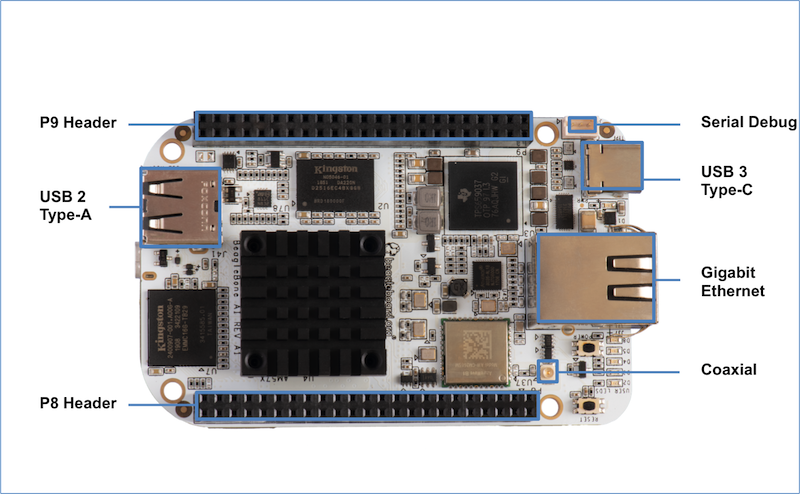
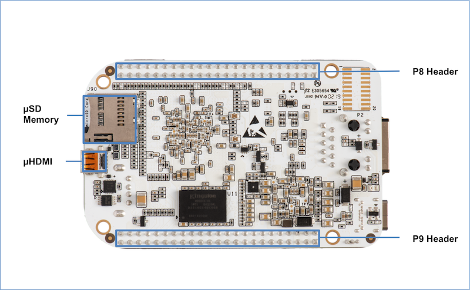
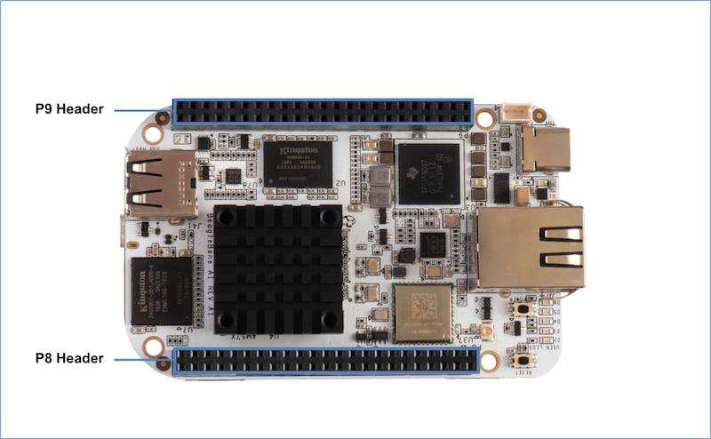

.. _beaglebone-ai-connectors:

Connectors
############

Expansion Connectors
***********************

The expansion interface on the board is comprised of two 46 pin
connectors, the P8 and P9 Headers. All signals on the expansion headers
are **3.3V** unless otherwise indicated.

.. note::
    Do not connect 5V logic level signals to these pins or the board will be damaged.

.. note:: 
    DO NOT APPLY VOLTAGE TO ANY I/O PIN WHEN POWER IS NOT SUPPLIED TO THE BOARD. 
    IT WILL DAMAGE THE PROCESSOR AND VOID THE WARRANTY.

**NO PINS ARE TO BE DRIVEN UNTIL AFTER THE SYS_RESET LINE GOES HIGH.**

**Figure ?** shows the location of the expansion connectors.

The location and spacing of the expansion headers are the same as on
BeagleBone Black.

Connector P8
===============

The following tables show the pinout of the **P8** expansion header. The
SW is responsible for setting the default function of each pin. Refer to
the processor documentation for more information on these pins and
detailed descriptions of all of the pins listed. In some cases there may
not be enough signals to complete a group of signals that may be
required to implement a total interface.

The column heading is the pin number on the expansion header.

The **GPIO** row is the expected gpio identifier number in the Linux
kernel.

The **BALL** row is the pin number on the processor.

The **REG** row is the offset of the control register for the processor
pin.

The **MODE #** rows are the mode setting for each pin. Setting each mode
to align with the mode column will give that function on that pin.

If included, the **2nd BALL** row is the pin number on the processor for
a second processor pin connected to the same pin on the expansion
header. Similarly, all row headings starting with **2nd** refer to data
for this second processor pin.

**NOTES**:

**DO NOT APPLY VOLTAGE TO ANY I/O PIN WHEN POWER IS NOT SUPPLIED TO THE
BOARD. IT WILL DAMAGE THE PROCESSOR AND VOID THE WARRANTY.**

**NO PINS ARE TO BE DRIVEN UNTIL AFTER THE SYS_RESET LINE GOES HIGH.**

P8.01-P8.02
--------------

P8.01 and P8.02 are ground pins.

+--------+--------+
| P8.01  | P8.02  |
+========+========+
| GND    | GND    |
+--------+--------+

P8.03-P8.05
--------------

+-------------+-------------------------+--------------------+------------------+
|             | P8.03                   | P8.04              | P8.05            |
+=============+=========================+====================+==================+
| **GPIO**    | 24                      | 25                 | 193              |
+-------------+-------------------------+--------------------+------------------+
| **BALL**    | AB8                     | AB5                | AC9              |
+-------------+-------------------------+--------------------+------------------+
| **REG**     | 0x179C                  | 0x17A0             | 0x178C           |
+-------------+-------------------------+--------------------+------------------+
| **MODE 0**  | mmc3_dat6               | mmc3_dat7          | mmc3_dat2        |
+-------------+-------------------------+--------------------+------------------+
| **1**       | spi4_d0                 | spi4_cs0           | spi3_cs0         |
+-------------+-------------------------+--------------------+------------------+
| **2**       | uart10_ctsn             | uart10_rtsn        | uart5_ctsn       |
+-------------+-------------------------+--------------------+------------------+
| **3**       |                         |                    |                  |
+-------------+-------------------------+--------------------+------------------+
| **4**       | vin2b_de1               | vin2b_clk1         | vin2b_d3         |
+-------------+-------------------------+--------------------+------------------+
| **5**       |                         |                    |                  |
+-------------+-------------------------+--------------------+------------------+
| **6**       |                         |                    |                  |
+-------------+-------------------------+--------------------+------------------+
| **7**       |                         |                    |                  |
+-------------+-------------------------+--------------------+------------------+
| **8**       |                         |                    |                  |
+-------------+-------------------------+--------------------+------------------+
| **9**       | vin5a_hsync0            | vin5a_vsync0       | vin5a_d3         |
+-------------+-------------------------+--------------------+------------------+
| **10**      | ehrpwm3_tripzone_input  | eCAP3_in_PWM3_out  | eQEP3_index      |
+-------------+-------------------------+--------------------+------------------+
| **11**      | pr2_mii1_rxd1           | pr2_mii1_rxd0      | pr2_mii_mr1_clk  |
+-------------+-------------------------+--------------------+------------------+
| **12**      | pr2_pru0_gpi10          | pr2_pru0_gpi11     | pr2_pru0_gpi6    |
+-------------+-------------------------+--------------------+------------------+
| **13**      | pr2_pru0_gpo10          | pr2_pru0_gpo11     | pr2_pru0_gpo6    |
+-------------+-------------------------+--------------------+------------------+
| **14**      | gpio1_24                | gpio1_25           | gpio7_1          |
+-------------+-------------------------+--------------------+------------------+
| **15**      | Driver off              | Driver off         | Driver off       |
+-------------+-------------------------+--------------------+------------------+

P8.06-P8.09
---------------

+-----------+---------------+-----------------+-----------------+----------------+
|           | P8.06         | P8.07           | P8.08           | P8.09          |
+===========+===============+=================+=================+================+
| **GPIO**  | 194           | 165             | 166             | 178            |
+-----------+---------------+-----------------+-----------------+----------------+
| **BALL**  | AC3           | G14             | F14             | E17            |
+-----------+---------------+-----------------+-----------------+----------------+
| **REG**   | 0x1790        | 0x16EC          | 0x16F0          | 0x1698         |
+-----------+---------------+-----------------+-----------------+----------------+
| **MODE0** | mmc3_dat3     | mcasp1_axr14    | mcasp1_axr15    | xref_clk1      |
+-----------+---------------+-----------------+-----------------+----------------+
| **1**     | spi3_cs1      | mcasp7_aclkx    | mcasp7_fsx      | mcasp2_axr9    |
+-----------+---------------+-----------------+-----------------+----------------+
| **2**     | uart5_rtsn    | mcasp7_aclkr    | mcasp7_fsr      | mcasp1_axr5    |
+-----------+---------------+-----------------+-----------------+----------------+
| **3**     |               |                 |                 | mcasp2_ahclkx  |
+-----------+---------------+-----------------+-----------------+----------------+
| **4**     | vin2b_d2      |                 |                 | mcasp6_ahclkx  |
+-----------+---------------+-----------------+-----------------+----------------+
| **5**     |               |                 |                 |                |
+-----------+---------------+-----------------+-----------------+----------------+
| **6**     |               |                 |                 |                |
+-----------+---------------+-----------------+-----------------+----------------+
| **7**     |               | vin6a_d9        | vin6a_d8        | vin6a_clk0     |
+-----------+---------------+-----------------+-----------------+----------------+
| **8**     |               |                 |                 |                |
+-----------+---------------+-----------------+-----------------+----------------+
| **9**     | vin5a_d2      |                 |                 |                |
+-----------+---------------+-----------------+-----------------+----------------+
| **10**    | eQEP3_strobe  | timer11         | timer12         | timer14        |
+-----------+---------------+-----------------+-----------------+----------------+
| **11**    | pr2_mii1_rxdv | pr2_mii0_rxdv   | pr2_mii0_rxd3   | pr2_mii1_crs   |
+-----------+---------------+-----------------+-----------------+----------------+
| **12**    | pr2_pru0_gpi7 | pr2_pru1_gpi16  | pr2_pru0_gpi20  | pr2_pru1_gpi6  |
+-----------+---------------+-----------------+-----------------+----------------+
| **13**    | pr2_pru0_gpo7 | pr2_pru1_gpo16  | pr2_pru0_gpo20  | pr2_pru1_gpo6  |
+-----------+---------------+-----------------+-----------------+----------------+
| **14**    | gpio7_2       | gpio6_5         | gpio6_6         | gpio6_18       |
+-----------+---------------+-----------------+-----------------+----------------+
| **15**    | Driver off    | Driver off      | Driver off      | Driver off     |
+-----------+---------------+-----------------+-----------------+----------------+

P8.10-P8.13
--------------

+-------------+------------------+----------------+----------------+-----------------+
|             | P8.10            | P8.11          | P8.12          | P8.13           |
+=============+==================+================+================+=================+
| **GPIO**    | 164              | 75             | 74             | 107             |
+-------------+------------------+----------------+----------------+-----------------+
| **BALL**    | A13              | AH4            | AG6            | D3              |
+-------------+------------------+----------------+----------------+-----------------+
| **REG**     | 0x16E8           | 0x1510         | 0x150C         | 0x1590          |
+-------------+------------------+----------------+----------------+-----------------+
| **MODE 0**  | mcasp1_axr13     | vin1a_d7       | vin1a_d6       | vin2a_d10       |
+-------------+------------------+----------------+----------------+-----------------+
| **1**       | mcasp7_axr1      |                |                |                 |
+-------------+------------------+----------------+----------------+-----------------+
| **2**       |                  |                |                |                 |
+-------------+------------------+----------------+----------------+-----------------+
| **3**       |                  | vout3_d0       | vout3_d1       | mdio_mclk       |
+-------------+------------------+----------------+----------------+-----------------+
| **4**       |                  | vout3_d16      | vout3_d17      | vout2_d13       |
+-------------+------------------+----------------+----------------+-----------------+
| **5**       |                  |                |                |                 |
+-------------+------------------+----------------+----------------+-----------------+
| **6**       |                  |                |                |                 |
+-------------+------------------+----------------+----------------+-----------------+
| **7**       | vin6a_d10        |                |                |                 |
+-------------+------------------+----------------+----------------+-----------------+
| **8**       |                  |                |                |                 |
+-------------+------------------+----------------+----------------+-----------------+
| **9**       |                  |                |                | kbd_col7        |
+-------------+------------------+----------------+----------------+-----------------+
| **10**      | timer10          | eQEP2B_in      | eQEP2A_in      | ehrpwm2B        |
+-------------+------------------+----------------+----------------+-----------------+
| **11**      | pr2_mii_mr0_clk  |                |                | pr1_mdio_mdclk  |
+-------------+------------------+----------------+----------------+-----------------+
| **12**      | pr2_pru1_gpi15   | pr1_pru0_gpi4  | pr1_pru0_gpi3  | pr1_pru1_gpi7   |
+-------------+------------------+----------------+----------------+-----------------+
| **13**      | pr2_pru1_gpo15   | pr1_pru0_gpo4  | pr1_pru0_gpo3  | pr1_pru1_gpo7   |
+-------------+------------------+----------------+----------------+-----------------+
| **14**      | gpio6_4          | gpio3_11       | gpio3_10       | gpio4_11        |
+-------------+------------------+----------------+----------------+-----------------+
| **15**      | Driver off       | Driver off     | Driver off     | Driver off      |
+-------------+------------------+----------------+----------------+-----------------+

P8.14-P8.16
--------------

+-----------------+--------------------+------------------------------+------------------+
|                 | P8.14              | P8.15                        | P8.16            |
+=================+====================+==============================+==================+
| **GPIO**        | 109                | 99                           | 125              |
+-----------------+--------------------+------------------------------+------------------+
| **BALL**        | D5                 | D1                           | B4               |
+-----------------+--------------------+------------------------------+------------------+
| **REG**         | 0x1598             | 0x1570                       | 0x15BC           |
+-----------------+--------------------+------------------------------+------------------+
| **MODE 0**      | vin2a_d12          | vin2a_d2                     | vin2a_d21        |
+-----------------+--------------------+------------------------------+------------------+
| **1**           |                    |                              |                  |
+-----------------+--------------------+------------------------------+------------------+
| **2**           |                    |                              | vin2b_d2         |
+-----------------+--------------------+------------------------------+------------------+
| **3**           | rgmii1_txc         |                              | rgmii1_rxd2      |
+-----------------+--------------------+------------------------------+------------------+
| **4**           | vout2_d11          | vout2_d21                    | vout2_d2         |
+-----------------+--------------------+------------------------------+------------------+
| **5**           |                    | emu12                        | vin3a_fld0       |
+-----------------+--------------------+------------------------------+------------------+
| **6**           |                    |                              | vin3a_d13        |
+-----------------+--------------------+------------------------------+------------------+
| **7**           |                    |                              |                  |
+-----------------+--------------------+------------------------------+------------------+
| **8**           | mii1_rxclk         | uart10_rxd                   | mii1_col         |
+-----------------+--------------------+------------------------------+------------------+
| **9**           | kbd_col8           | kbd_row6                     |                  |
+-----------------+--------------------+------------------------------+------------------+
| **10**          | eCAP2_in_PWM2_out  | eCAP1_in_PWM1_out            |                  |
+-----------------+--------------------+------------------------------+------------------+
| **11**          | pr1_mii1_txd1      | pr1_ecap0_ecap_capin_apwm_o  | pr1_mii1_rxlink  |
+-----------------+--------------------+------------------------------+------------------+
| **12**          | pr1_pru1_gpi9      | pr1_edio_data_in7            | pr1_pru1_gpi18   |
+-----------------+--------------------+------------------------------+------------------+
| **13**          | pr1_pru1_gpo9      | pr1_edio_data_out7           | pr1_pru1_gpo18   |
+-----------------+--------------------+------------------------------+------------------+
| **14**          | gpio4_13           | gpio4_3                      | gpio4_29         |
+-----------------+--------------------+------------------------------+------------------+
| **15**          | Driver off         | Driver off                   | Driver off       |
+-----------------+--------------------+------------------------------+------------------+
| **2nd BALL**    |                    | A3                           |                  |
+-----------------+--------------------+------------------------------+------------------+
| **2nd REG**     |                    | 0x15B4                       |                  |
+-----------------+--------------------+------------------------------+------------------+
| **2nd MODE 0**  |                    | vin2a_d19                    |                  |
+-----------------+--------------------+------------------------------+------------------+
| **2nd 1**       |                    |                              |                  |
+-----------------+--------------------+------------------------------+------------------+
| **2nd 2**       |                    | vin2b_d4                     |                  |
+-----------------+--------------------+------------------------------+------------------+
| **2nd 3**       |                    | rgmii1_rxctl                 |                  |
+-----------------+--------------------+------------------------------+------------------+
| **2nd 4**       |                    | vout2_d4                     |                  |
+-----------------+--------------------+------------------------------+------------------+
| **2nd 5**       |                    |                              |                  |
+-----------------+--------------------+------------------------------+------------------+
| **2nd 6**       |                    | vin3a_d11                    |                  |
+-----------------+--------------------+------------------------------+------------------+
| **2nd 7**       |                    |                              |                  |
+-----------------+--------------------+------------------------------+------------------+
| **2nd 8**       |                    | mii1_txer                    |                  |
+-----------------+--------------------+------------------------------+------------------+
| **2nd 9**       |                    |                              |                  |
+-----------------+--------------------+------------------------------+------------------+
| **2nd 10**      |                    | ehrpwm3_tripzone_input       |                  |
+-----------------+--------------------+------------------------------+------------------+
| **2nd 11**      |                    | pr1_mii1_rxd0                |                  |
+-----------------+--------------------+------------------------------+------------------+
| **2nd 12**      |                    | pr1_pru1_gpi16               |                  |
+-----------------+--------------------+------------------------------+------------------+
| **2nd 13**      |                    | pr1_pru1_gpo16               |                  |
+-----------------+--------------------+------------------------------+------------------+
| **2nd 14**      |                    | gpio4_27                     |                  |
+-----------------+--------------------+------------------------------+------------------+
| **2nd 15**      |                    | Driver off                   |                  |
+-----------------+--------------------+------------------------------+------------------+

P8.17-P8.19
-------------

+-------------+--------------------+---------------+----------------+
|             | P8.17              | P8.18         | P8.19          |
+=============+====================+===============+================+
| **GPIO**    | 242                | 105           | 106            |
+-------------+--------------------+---------------+----------------+
| **BALL**    | A7                 | F5            | E6             |
+-------------+--------------------+---------------+----------------+
| **REG**     | 0x1624             | 0x1588        | 0x158C         |
+-------------+--------------------+---------------+----------------+
| **MODE 0**  | vout1_d18          | vin2a_d8      | vin2a_d9       |
+-------------+--------------------+---------------+----------------+
| **1**       |                    |               |                |
+-------------+--------------------+---------------+----------------+
| **2**       | emu4               |               |                |
+-------------+--------------------+---------------+----------------+
| **3**       | vin4a_d2           |               |                |
+-------------+--------------------+---------------+----------------+
| **4**       | vin3a_d2           | vout2_d15     | vout2_d14      |
+-------------+--------------------+---------------+----------------+
| **5**       | obs11              | emu18         | emu19          |
+-------------+--------------------+---------------+----------------+
| **6**       | obs27              |               |                |
+-------------+--------------------+---------------+----------------+
| **7**       |                    |               |                |
+-------------+--------------------+---------------+----------------+
| **8**       |                    | mii1_rxd3     | mii1_rxd0      |
+-------------+--------------------+---------------+----------------+
| **9**       |                    | kbd_col5      | kbd_col6       |
+-------------+--------------------+---------------+----------------+
| **10**      | pr2_edio_data_in2  | eQEP2_strobe  | ehrpwm2A       |
+-------------+--------------------+---------------+----------------+
| **11**      | pr2_edio_data_out2 | pr1_mii1_txd3 | pr1_mii1_txd2  |
+-------------+--------------------+---------------+----------------+
| **12**      | pr2_pru0_gpi15     | pr1_pru1_gpi5 | pr1_pru1_gpi6  |
+-------------+--------------------+---------------+----------------+
| **13**      | pr2_pru0_gpo15     | pr1_pru1_gpo5 | pr1_pru1_gpo6  |
+-------------+--------------------+---------------+----------------+
| **14**      | gpio8_18           | gpio4_9       | gpio4_10       |
+-------------+--------------------+---------------+----------------+
| **15**      | Driver off         | Driver off    | Driver off     |
+-------------+--------------------+---------------+----------------+

P8.20-P8.22
------------

+-------------+--------------------+-------------------------+----------------+
|             | P8.20              | P8.21                   | P8.22          |
+=============+====================+=========================+================+
| **GPIO**    | 190                | 189                     | 23             |
+-------------+--------------------+-------------------------+----------------+
| **BALL**    | AC4                | AD4                     | AD6            |
+-------------+--------------------+-------------------------+----------------+
| **REG**     | 0x1780             | 0x177C                  | 0x1798         |
+-------------+--------------------+-------------------------+----------------+
| **MODE 0**  | mmc3_cmd           | mmc3_clk                | mmc3_dat5      |
+-------------+--------------------+-------------------------+----------------+
| **1**       | spi3_sclk          |                         | spi4_d1        |
+-------------+--------------------+-------------------------+----------------+
| **2**       |                    |                         | uart10_txd     |
+-------------+--------------------+-------------------------+----------------+
| **3**       |                    |                         |                |
+-------------+--------------------+-------------------------+----------------+
| **4**       | vin2b_d6           | vin2b_d7                | vin2b_d0       |
+-------------+--------------------+-------------------------+----------------+
| **5**       |                    |                         |                |
+-------------+--------------------+-------------------------+----------------+
| **6**       |                    |                         |                |
+-------------+--------------------+-------------------------+----------------+
| **7**       |                    |                         |                |
+-------------+--------------------+-------------------------+----------------+
| **8**       |                    |                         |                |
+-------------+--------------------+-------------------------+----------------+
| **9**       | vin5a_d6           | vin5a_d7                | vin5a_d0       |
+-------------+--------------------+-------------------------+----------------+
| **10**      | eCAP2_in_PWM2_out  | ehrpwm2_tripzone_input  | ehrpwm3B       |
+-------------+--------------------+-------------------------+----------------+
| **11**      | pr2_mii1_txd2      | pr2_mii1_txd3           | pr2_mii1_rxd2  |
+-------------+--------------------+-------------------------+----------------+
| **12**      | pr2_pru0_gpi3      | pr2_pru0_gpi2           | pr2_pru0_gpi9  |
+-------------+--------------------+-------------------------+----------------+
| **13**      | pr2_pru0_gpo3      | pr2_pru0_gpo2           | pr2_pru0_gpo9  |
+-------------+--------------------+-------------------------+----------------+
| **14**      | gpio6_30           | gpio6_29                | gpio1_23       |
+-------------+--------------------+-------------------------+----------------+
| **15**      | Driver off         | Driver off              | Driver off     |
+-------------+--------------------+-------------------------+----------------+

P8.23-P8.26
-------------

+-------------+----------------+----------------+----------------+--------------------+
|             | P8.23          | P8.24          | P8.25          | P8.26              |
+=============+================+================+================+====================+
| **GPIO**    | 22             | 192            | 191            | 124                |
+-------------+----------------+----------------+----------------+--------------------+
| **BALL**    | AC8            | AC6            | AC7            | B3                 |
+-------------+----------------+----------------+----------------+--------------------+
| **REG**     | 0x1794         | 0x1788         | 0x1784         | 0x15B8             |
+-------------+----------------+----------------+----------------+--------------------+
| **MODE 0**  | mmc3_dat4      | mmc3_dat1      | mmc3_dat0      | vin2a_d20          |
+-------------+----------------+----------------+----------------+--------------------+
| **1**       | spi4_sclk      | spi3_d0        | spi3_d1        |                    |
+-------------+----------------+----------------+----------------+--------------------+
| **2**       | uart10_rxd     | uart5_txd      | uart5_rxd      | vin2b_d3           |
+-------------+----------------+----------------+----------------+--------------------+
| **3**       |                |                |                | rgmii1_rxd3        |
+-------------+----------------+----------------+----------------+--------------------+
| **4**       | vin2b_d1       | vin2b_d4       | vin2b_d5       | vout2_d3           |
+-------------+----------------+----------------+----------------+--------------------+
| **5**       |                |                |                | vin3a_de0          |
+-------------+----------------+----------------+----------------+--------------------+
| **6**       |                |                |                | vin3a_d12          |
+-------------+----------------+----------------+----------------+--------------------+
| **7**       |                |                |                |                    |
+-------------+----------------+----------------+----------------+--------------------+
| **8**       |                |                |                | mii1_rxer          |
+-------------+----------------+----------------+----------------+--------------------+
| **9**       | vin5a_d1       | vin5a_d4       | vin5a_d5       |                    |
+-------------+----------------+----------------+----------------+--------------------+
| **10**      | ehrpwm3A       | eQEP3B_in      | eQEP3A_in      | eCAP3_in_PWM3_out  |
+-------------+----------------+----------------+----------------+--------------------+
| **11**      | pr2_mii1_rxd3  | pr2_mii1_txd0  | pr2_mii1_txd1  | pr1_mii1_rxer      |
+-------------+----------------+----------------+----------------+--------------------+
| **12**      | pr2_pru0_gpi8  | pr2_pru0_gpi5  | pr2_pru0_gpi4  | pr1_pru1_gpi17     |
+-------------+----------------+----------------+----------------+--------------------+
| **13**      | pr2_pru0_gpo8  | pr2_pru0_gpo5  | pr2_pru0_gpo4  | pr1_pru1_gpo17     |
+-------------+----------------+----------------+----------------+--------------------+
| **14**      | gpio1_22       | gpio7_0        | gpio6_31       | gpio4_28           |
+-------------+----------------+----------------+----------------+--------------------+
| **15**      | Driver off     | Driver off     | Driver off     | Driver off         |
+-------------+----------------+----------------+----------------+--------------------+

P8.27-P8.29
-------------

+---------------+--------------------+--------------------+--------------------+
|               | P8.27              | P8.28              | P8.29              |
+===============+====================+====================+====================+
| **GPIO**      | 119                | 115                | 118                |
+---------------+--------------------+--------------------+--------------------+
| **BALL**      | E11                | D11                | C11                |
+---------------+--------------------+--------------------+--------------------+
| **REG**       | 0x15D8             | 0x15C8             | 0x15D4             |
+---------------+--------------------+--------------------+--------------------+
| **MODE 0**    | vout1_vsync        | vout1_clk          | vout1_hsync        |
+---------------+--------------------+--------------------+--------------------+
| **1**         |                    |                    |                    |
+---------------+--------------------+--------------------+--------------------+
| **2**         |                    |                    |                    |
+---------------+--------------------+--------------------+--------------------+
| **3**         | vin4a_vsync0       | vin4a_fld0         | vin4a_hsync0       |
+---------------+--------------------+--------------------+--------------------+
| **4**         | vin3a_vsync0       | vin3a_fld0         | vin3a_hsync0       |
+---------------+--------------------+--------------------+--------------------+
| **5**         |                    |                    |                    |
+---------------+--------------------+--------------------+--------------------+
| **6**         |                    |                    |                    |
+---------------+--------------------+--------------------+--------------------+
| **7**         |                    |                    |                    |
+---------------+--------------------+--------------------+--------------------+
| **8**         | spi3_sclk          | spi3_cs0           | spi3_d0            |
+---------------+--------------------+--------------------+--------------------+
| **9**         |                    |                    |                    |
+---------------+--------------------+--------------------+--------------------+
| **10**        |                    |                    |                    |
+---------------+--------------------+--------------------+--------------------+
| **11**        |                    |                    |                    |
+---------------+--------------------+--------------------+--------------------+
| **12**        | pr2_pru1_gpi17     |                    |                    |
+---------------+--------------------+--------------------+--------------------+
| **13**        | pr2_pru1_gpo17     |                    |                    |
+---------------+--------------------+--------------------+--------------------+
| **14**        | gpio4_23           | gpio4_19           | gpio4_22           |
+---------------+--------------------+--------------------+--------------------+
| **15**        | Driver off         | Driver off         | Driver off         |
+---------------+--------------------+--------------------+--------------------+
| **2nd BALL**  | A8                 | C9                 | A9                 |
+---------------+--------------------+--------------------+--------------------+
| **2nd REG**   | 0x1628             | 0x162C             | 0x1630             |
+---------------+--------------------+--------------------+--------------------+
| **2nd MODE0** | vout1_d19          | vout1_d20          | vout1_d21          |
+---------------+--------------------+--------------------+--------------------+
| **2nd 1**     |                    |                    |                    |
+---------------+--------------------+--------------------+--------------------+
| **2nd 2**     | emu15              | emu16              | emu17              |
+---------------+--------------------+--------------------+--------------------+
| **2nd 3**     | vin4a_d3           | vin4a_d4           | vin4a_d5           |
+---------------+--------------------+--------------------+--------------------+
| **2nd 4**     | vin3a_d3           | vin3a_d4           | vin3a_d5           |
+---------------+--------------------+--------------------+--------------------+
| **2nd 5**     | obs12              | obs13              | obs14              |
+---------------+--------------------+--------------------+--------------------+
| **2nd 6**     | obs28              | obs29              | obs30              |
+---------------+--------------------+--------------------+--------------------+
| **2nd 7**     |                    |                    |                    |
+---------------+--------------------+--------------------+--------------------+
| **2nd 8**     |                    |                    |                    |
+---------------+--------------------+--------------------+--------------------+
| **2nd 9**     |                    |                    |                    |
+---------------+--------------------+--------------------+--------------------+
| **2nd 10**    | pr2_edio_data_in3  | pr2_edio_data_in4  | pr2_edio_data_in5  |
+---------------+--------------------+--------------------+--------------------+
| **2nd 11**    | pr2_edio_data_out3 | pr2_edio_data_out4 | pr2_edio_data_out5 |
+---------------+--------------------+--------------------+--------------------+
| **2nd 12**    | pr2_pru0_gpi16     | pr2_pru0_gpi17     | pr2_pru0_gpi18     |
+---------------+--------------------+--------------------+--------------------+
| **2nd 13**    | pr2_pru0_gpo16     | pr2_pru0_gpo17     | pr2_pru0_gpo18     |
+---------------+--------------------+--------------------+--------------------+
| **2nd 14**    | gpio8_19           | gpio8_20           | gpio8_21           |
+---------------+--------------------+--------------------+--------------------+
| **2nd 15**    | Driver off         | Driver off         | Driver off         |
+---------------+--------------------+--------------------+--------------------+

P8.30-P8.32
-------------

+-----------------+--------------------+----------------+------------------------------+
|                 | P8.30              | P8.31          | P8.32                        |
+=================+====================+================+==============================+
| **GPIO**        | 116                | 238            | 239                          |
+-----------------+--------------------+----------------+------------------------------+
| **BALL**        | B10                | C8             | C7                           |
+-----------------+--------------------+----------------+------------------------------+
| **REG**         | 0x15CC             | 0x1614         | 0x1618                       |
+-----------------+--------------------+----------------+------------------------------+
| **MODE 0**      | vout1_de           | vout1_d14      | vout1_d15                    |
+-----------------+--------------------+----------------+------------------------------+
| **1**           |                    |                |                              |
+-----------------+--------------------+----------------+------------------------------+
| **2**           |                    | emu13          | emu14                        |
+-----------------+--------------------+----------------+------------------------------+
| **3**           | vin4a_de0          | vin4a_d14      | vin4a_d15                    |
+-----------------+--------------------+----------------+------------------------------+
| **4**           | vin3a_de0          | vin3a_d14      | vin3a_d15                    |
+-----------------+--------------------+----------------+------------------------------+
| **5**           |                    | obs9           | obs10                        |
+-----------------+--------------------+----------------+------------------------------+
| **6**           |                    | obs25          | obs26                        |
+-----------------+--------------------+----------------+------------------------------+
| **7**           |                    |                |                              |
+-----------------+--------------------+----------------+------------------------------+
| **8**           | spi3_d1            |                |                              |
+-----------------+--------------------+----------------+------------------------------+
| **9**           |                    |                |                              |
+-----------------+--------------------+----------------+------------------------------+
| **10**          |                    | pr2_uart0_txd  | pr2_ecap0_ecap_capin_apwm_o  |
+-----------------+--------------------+----------------+------------------------------+
| **11**          |                    |                |                              |
+-----------------+--------------------+----------------+------------------------------+
| **12**          |                    | pr2_pru0_gpi11 | pr2_pru0_gpi12               |
+-----------------+--------------------+----------------+------------------------------+
| **13**          |                    | pr2_pru0_gpo11 | pr2_pru0_gpo12               |
+-----------------+--------------------+----------------+------------------------------+
| **14**          | gpio4_20           | gpio8_14       | gpio8_15                     |
+-----------------+--------------------+----------------+------------------------------+
| **15**          | Driver off         | Driver off     | Driver off                   |
+-----------------+--------------------+----------------+------------------------------+
| **2nd BALL**    | B9                 | G16            | D17                          |
+-----------------+--------------------+----------------+------------------------------+
| **2nd REG**     | 0x1634             | 0x173C         | 0x1740                       |
+-----------------+--------------------+----------------+------------------------------+
| **2nd MODE 0**  | vout1_d22          | mcasp4_axr0    | mcasp4_axr1                  |
+-----------------+--------------------+----------------+------------------------------+
| **2nd 1**       |                    |                |                              |
+-----------------+--------------------+----------------+------------------------------+
| **2nd 2**       | emu18              | spi3_d0        | spi3_cs0                     |
+-----------------+--------------------+----------------+------------------------------+
| **2nd 3**       | vin4a_d6           | uart8_ctsn     | uart8_rtsn                   |
+-----------------+--------------------+----------------+------------------------------+
| **2nd 4**       | vin3a_d6           | uart4_rxd      | uart4_txd                    |
+-----------------+--------------------+----------------+------------------------------+
| **2nd 5**       | obs15              |                |                              |
+-----------------+--------------------+----------------+------------------------------+
| **2nd 6**       | obs31              | vout2_d18      | vout2_d19                    |
+-----------------+--------------------+----------------+------------------------------+
| **2nd 7**       |                    |                |                              |
+-----------------+--------------------+----------------+------------------------------+
| **2nd 8**       |                    | vin4a_d18      | vin4a_d19                    |
+-----------------+--------------------+----------------+------------------------------+
| **2nd 9**       |                    | vin5a_d13      | vin5a_d12                    |
+-----------------+--------------------+----------------+------------------------------+
| **2nd 10**      | pr2_edio_data_in6  |                |                              |
+-----------------+--------------------+----------------+------------------------------+
| **2nd 11**      | pr2_edio_data_out6 |                |                              |
+-----------------+--------------------+----------------+------------------------------+
| **2nd 12**      | pr2_pru0_gpi19     |                | pr2_pru1_gpi0                |
+-----------------+--------------------+----------------+------------------------------+
| **2nd 13**      | pr2_pru0_gpo19     |                | pr2_pru1_gpo0                |
+-----------------+--------------------+----------------+------------------------------+
| **2nd 14**      | gpio8_22           |                |                              |
+-----------------+--------------------+----------------+------------------------------+
| **2nd 15**      | Driver off         | Driver off     | Driver off                   |
+-----------------+--------------------+----------------+------------------------------+

P8.33-P8.35
-------------

+---------------+----------------+--------------------+------------------+
|               | P8.33          | P8.34              | P8.35            |
+===============+================+====================+==================+
| **GPIO**      | 237            | 235                | 236              |
+---------------+----------------+--------------------+------------------+
| **BALL**      | C6             | D8                 | A5               |
+---------------+----------------+--------------------+------------------+
| **REG**       | 0x1610         | 0x1608             | 0x160C           |
+---------------+----------------+--------------------+------------------+
| **MODE 0**    | vout1_d13      | vout1_d11          | vout1_d12        |
+---------------+----------------+--------------------+------------------+
| **1**         |                |                    |                  |
+---------------+----------------+--------------------+------------------+
| **2**         | emu12          | emu10              | emu11            |
+---------------+----------------+--------------------+------------------+
| **3**         | vin4a_d13      | vin4a_d11          | vin4a_d12        |
+---------------+----------------+--------------------+------------------+
| **4**         | vin3a_d13      | vin3a_d11          | vin3a_d12        |
+---------------+----------------+--------------------+------------------+
| **5**         | obs8           | obs6               | obs7             |
+---------------+----------------+--------------------+------------------+
| **6**         | obs24          | obs22              | obs23            |
+---------------+----------------+--------------------+------------------+
| **7**         |                | obs_dmarq2         |                  |
+---------------+----------------+--------------------+------------------+
| **8**         |                |                    |                  |
+---------------+----------------+--------------------+------------------+
| **9**         |                |                    |                  |
+---------------+----------------+--------------------+------------------+
| **10**        | pr2_uart0_rxd  | pr2_uart0_cts_n    | pr2_uart0_rts_n  |
+---------------+----------------+--------------------+------------------+
| **11**        |                |                    |                  |
+---------------+----------------+--------------------+------------------+
| **12**        | pr2_pru0_gpi10 | pr2_pru0_gpi8      | pr2_pru0_gpi9    |
+---------------+----------------+--------------------+------------------+
| **13**        | pr2_pru0_gpo10 | pr2_pru0_gpo8      | pr2_pru0_gpo9    |
+---------------+----------------+--------------------+------------------+
| **14**        | gpio8_13       | gpio8_11           | gpio8_12         |
+---------------+----------------+--------------------+------------------+
| **15**        | Driver off     | Driver off         | Driver off       |
+---------------+----------------+--------------------+------------------+
| **2nd BALL**  | AF9            | G6                 | AD9              |
+---------------+----------------+--------------------+------------------+
| **2nd REG**   | 0x14E8         | 0x1564             | 0x14E4           |
+---------------+----------------+--------------------+------------------+
| **2nd MODE0** | vin1a_fld0     | vin2a_vsync0       | vin1a_de0        |
+---------------+----------------+--------------------+------------------+
| **2nd 1**     | vin1b_vsync1   |                    | vin1b_hsync1     |
+---------------+----------------+--------------------+------------------+
| **2nd 2**     |                |                    |                  |
+---------------+----------------+--------------------+------------------+
| **2nd 3**     |                | vin2b_vsync1       | vout3_d17        |
+---------------+----------------+--------------------+------------------+
| **2nd 4**     | vout3_clk      | vout2_vsync        | vout3_de         |
+---------------+----------------+--------------------+------------------+
| **2nd 5**     | uart7_txd      | emu9               | uart7_rxd        |
+---------------+----------------+--------------------+------------------+
| **2nd 6**     |                |                    |                  |
+---------------+----------------+--------------------+------------------+
| **2nd 7**     | timer15        | uart9_txd          | timer16          |
+---------------+----------------+--------------------+------------------+
| **2nd 8**     | spi3_d1        | spi4_d1            | spi3_sclk        |
+---------------+----------------+--------------------+------------------+
| **2nd 9**     | kbd_row1       | kbd_row3           | kbd_row0         |
+---------------+----------------+--------------------+------------------+
| **2nd 10**    | eQEP1B_in      | ehrpwm1A           | eQEP1A_in        |
+---------------+----------------+--------------------+------------------+
| **2nd 11**    |                | pr1_uart0_rts_n    |                  |
+---------------+----------------+--------------------+------------------+
| **2nd 12**    |                | pr1_edio_data_in4  |                  |
+---------------+----------------+--------------------+------------------+
| **2nd 13**    |                | pr1_edio_data_out4 |                  |
+---------------+----------------+--------------------+------------------+
| **2nd 14**    | gpio3_1        | gpio4_0            | gpio3_0          |
+---------------+----------------+--------------------+------------------+
| **2nd 15**    | Driver off     | Driver off         | Driver off       |
+---------------+----------------+--------------------+------------------+

P8.36-P8.38
--------------

+-----------------+--------------------+--------------------+--------------------+
|                 | P8.36              | P8.37              | P8.38              |
+=================+====================+====================+====================+
| **GPIO**        | 234                | 232                | 233                |
+-----------------+--------------------+--------------------+--------------------+
| **BALL**        | D7                 | E8                 | D9                 |
+-----------------+--------------------+--------------------+--------------------+
| **REG**         | 0x1604             | 0x15FC             | 0x1600             |
+-----------------+--------------------+--------------------+--------------------+
| **MODE 0**      | vout1_d10          | vout1_d8           | vout1_d9           |
+-----------------+--------------------+--------------------+--------------------+
| **1**           |                    |                    |                    |
+-----------------+--------------------+--------------------+--------------------+
| **2**           | emu3               | uart6_rxd          | uart6_txd          |
+-----------------+--------------------+--------------------+--------------------+
| **3**           | vin4a_d10          | vin4a_d8           | vin4a_d9           |
+-----------------+--------------------+--------------------+--------------------+
| **4**           | vin3a_d10          | vin3a_d8           | vin3a_d9           |
+-----------------+--------------------+--------------------+--------------------+
| **5**           | obs5               |                    |                    |
+-----------------+--------------------+--------------------+--------------------+
| **6**           | obs21              |                    |                    |
+-----------------+--------------------+--------------------+--------------------+
| **7**           | obs_irq2           |                    |                    |
+-----------------+--------------------+--------------------+--------------------+
| **8**           |                    |                    |                    |
+-----------------+--------------------+--------------------+--------------------+
| **9**           |                    |                    |                    |
+-----------------+--------------------+--------------------+--------------------+
| **10**          | pr2_edio_sof       | pr2_edc_sync1_out  | pr2_edio_latch_in  |
+-----------------+--------------------+--------------------+--------------------+
| **11**          |                    |                    |                    |
+-----------------+--------------------+--------------------+--------------------+
| **12**          | pr2_pru0_gpi7      | pr2_pru0_gpi5      | pr2_pru0_gpi6      |
+-----------------+--------------------+--------------------+--------------------+
| **13**          | pr2_pru0_gpo7      | pr2_pru0_gpo5      | pr2_pru0_gpo6      |
+-----------------+--------------------+--------------------+--------------------+
| **14**          | gpio8_10           | gpio8_8            | gpio8_9            |
+-----------------+--------------------+--------------------+--------------------+
| **15**          | Driver off         | Driver off         | Driver off         |
+-----------------+--------------------+--------------------+--------------------+
| **2nd BALL**    | F2                 | A21                | C18                |
+-----------------+--------------------+--------------------+--------------------+
| **2nd REG**     | 0x1568             | 0x1738             | 0x1734             |
+-----------------+--------------------+--------------------+--------------------+
| **2nd MODE 0**  | vin2a_d0           | mcasp4_fsx         | mcasp4_aclkx       |
+-----------------+--------------------+--------------------+--------------------+
| **2nd 1**       |                    | mcasp4_fsr         | mcasp4_aclkr       |
+-----------------+--------------------+--------------------+--------------------+
| **2nd 2**       |                    | spi3_d1            | spi3_sclk          |
+-----------------+--------------------+--------------------+--------------------+
| **2nd 3**       |                    | uart8_txd          | uart8_rxd          |
+-----------------+--------------------+--------------------+--------------------+
| **2nd 4**       | vout2_d23          | i2c4_scl           | i2c4_sda           |
+-----------------+--------------------+--------------------+--------------------+
| **2nd 5**       | emu10              |                    |                    |
+-----------------+--------------------+--------------------+--------------------+
| **2nd 6**       |                    | vout2_d17          | vout2_d16          |
+-----------------+--------------------+--------------------+--------------------+
| **2nd 7**       | uart9_ctsn         |                    |                    |
+-----------------+--------------------+--------------------+--------------------+
| **2nd 8**       | spi4_d0            | vin4a_d17          | vin4a_d16          |
+-----------------+--------------------+--------------------+--------------------+
| **2nd 9**       | kbd_row4           | vin5a_d14          | vin5a_d15          |
+-----------------+--------------------+--------------------+--------------------+
| **2nd 10**      | ehrpwm1B           |                    |                    |
+-----------------+--------------------+--------------------+--------------------+
| **2nd 11**      | pr1_uart0_rxd      |                    |                    |
+-----------------+--------------------+--------------------+--------------------+
| **2nd 12**      | pr1_edio_data_in5  |                    |                    |
+-----------------+--------------------+--------------------+--------------------+
| **2nd 13**      | pr1_edio_data_out5 |                    |                    |
+-----------------+--------------------+--------------------+--------------------+
| **2nd 14**      | gpio4_1            |                    |                    |
+-----------------+--------------------+--------------------+--------------------+
| **2nd 15**      | Driver off         | Driver off         | Driver off         |
+-----------------+--------------------+--------------------+--------------------+

P8.39-P8.41
-------------

+-------------+--------------------+--------------------+------------------------------+
|             | P8.39              | P8.40              | P8.41                        |
+=============+====================+====================+==============================+
| **GPIO**    | 230                | 231                | 228                          |
+-------------+--------------------+--------------------+------------------------------+
| **BALL**    | F8                 | E7                 | E9                           |
+-------------+--------------------+--------------------+------------------------------+
| **REG**     | 0x15F4             | 0x15F8             | 0x15EC                       |
+-------------+--------------------+--------------------+------------------------------+
| **MODE 0**  | vout1_d6           | vout1_d7           | vout1_d4                     |
+-------------+--------------------+--------------------+------------------------------+
| **1**       |                    |                    |                              |
+-------------+--------------------+--------------------+------------------------------+
| **2**       | emu8               | emu9               | emu6                         |
+-------------+--------------------+--------------------+------------------------------+
| **3**       | vin4a_d22          | vin4a_d23          | vin4a_d20                    |
+-------------+--------------------+--------------------+------------------------------+
| **4**       | vin3a_d22          | vin3a_d23          | vin3a_d20                    |
+-------------+--------------------+--------------------+------------------------------+
| **5**       | obs4               |                    | obs2                         |
+-------------+--------------------+--------------------+------------------------------+
| **6**       | obs20              |                    | obs18                        |
+-------------+--------------------+--------------------+------------------------------+
| **7**       |                    |                    |                              |
+-------------+--------------------+--------------------+------------------------------+
| **8**       |                    |                    |                              |
+-------------+--------------------+--------------------+------------------------------+
| **9**       |                    |                    |                              |
+-------------+--------------------+--------------------+------------------------------+
| **10**      | pr2_edc_latch1_in  | pr2_edc_sync0_out  | pr1_ecap0_ecap_capin_apwm_o  |
+-------------+--------------------+--------------------+------------------------------+
| **11**      |                    |                    |                              |
+-------------+--------------------+--------------------+------------------------------+
| **12**      | pr2_pru0_gpi3      | pr2_pru0_gpi4      | pr2_pru0_gpi1                |
+-------------+--------------------+--------------------+------------------------------+
| **13**      | pr2_pru0_gpo3      | pr2_pru0_gpo4      | pr2_pru0_gpo1                |
+-------------+--------------------+--------------------+------------------------------+
| **14**      | gpio8_6            | gpio8_7            | gpio8_4                      |
+-------------+--------------------+--------------------+------------------------------+
| **15**      | Driver off         | Driver off         | Driver off                   |
+-------------+--------------------+--------------------+------------------------------+

P8.42-P8.44
-------------

+-------------+--------------------+----------------+----------------+
|             | P8.42              | P8.43          | P8.44          |
+=============+====================+================+================+
| **GPIO**    | 229                | 226            | 227            |
+-------------+--------------------+----------------+----------------+
| **BALL**    | F9                 | F10            | G11            |
+-------------+--------------------+----------------+----------------+
| **REG**     | 0x15F0             | 0x15E4         | 0x15E8         |
+-------------+--------------------+----------------+----------------+
| **MODE 0**  | vout1_d5           | vout1_d2       | vout1_d3       |
+-------------+--------------------+----------------+----------------+
| **1**       |                    |                |                |
+-------------+--------------------+----------------+----------------+
| **2**       | emu7               | emu2           | emu5           |
+-------------+--------------------+----------------+----------------+
| **3**       | vin4a_d21          | vin4a_d18      | vin4a_d19      |
+-------------+--------------------+----------------+----------------+
| **4**       | vin3a_d21          | vin3a_d18      | vin3a_d19      |
+-------------+--------------------+----------------+----------------+
| **5**       | obs3               | obs0           | obs1           |
+-------------+--------------------+----------------+----------------+
| **6**       | obs19              | obs16          | obs17          |
+-------------+--------------------+----------------+----------------+
| **7**       |                    | obs_irq1       | obs_dmarq1     |
+-------------+--------------------+----------------+----------------+
| **8**       |                    |                |                |
+-------------+--------------------+----------------+----------------+
| **9**       |                    |                |                |
+-------------+--------------------+----------------+----------------+
| **10**      | pr2_edc_latch0_in  | pr1_uart0_rxd  | pr1_uart0_txd  |
+-------------+--------------------+----------------+----------------+
| **11**      |                    |                |                |
+-------------+--------------------+----------------+----------------+
| **12**      | pr2_pru0_gpi2      | pr2_pru1_gpi20 | pr2_pru0_gpi0  |
+-------------+--------------------+----------------+----------------+
| **13**      | pr2_pru0_gpo2      | pr2_pru1_gpo20 | pr2_pru0_gpo0  |
+-------------+--------------------+----------------+----------------+
| **14**      | gpio8_5            | gpio8_2        | gpio8_3        |
+-------------+--------------------+----------------+----------------+
| **15**      | Driver off         | Driver off     | Driver off     |
+-------------+--------------------+----------------+----------------+

P8.45-P8.46
------------

+-----------------+--------------------+--------------------+
|                 | P8.45              | P8.46              |
+=================+====================+====================+
| **GPIO**        | 224                | 225                |
+-----------------+--------------------+--------------------+
| **BALL**        | F11                | G10                |
+-----------------+--------------------+--------------------+
| **REG**         | 0x15DC             | 0x15E0             |
+-----------------+--------------------+--------------------+
| **MODE 0**      | vout1_d0           | vout1_d1           |
+-----------------+--------------------+--------------------+
| **1**           |                    |                    |
+-----------------+--------------------+--------------------+
| **2**           | uart5_rxd          | uart5_txd          |
+-----------------+--------------------+--------------------+
| **3**           | vin4a_d16          | vin4a_d17          |
+-----------------+--------------------+--------------------+
| **4**           | vin3a_d16          | vin3a_d17          |
+-----------------+--------------------+--------------------+
| **5**           |                    |                    |
+-----------------+--------------------+--------------------+
| **6**           |                    |                    |
+-----------------+--------------------+--------------------+
| **7**           |                    |                    |
+-----------------+--------------------+--------------------+
| **8**           | spi3_cs2           |                    |
+-----------------+--------------------+--------------------+
| **9**           |                    |                    |
+-----------------+--------------------+--------------------+
| **10**          | pr1_uart0_cts_n    | pr1_uart0_rts_n    |
+-----------------+--------------------+--------------------+
| **11**          |                    |                    |
+-----------------+--------------------+--------------------+
| **12**          | pr2_pru1_gpi18     | pr2_pru1_gpi19     |
+-----------------+--------------------+--------------------+
| **13**          | pr2_pru1_gpo18     | pr2_pru1_gpo19     |
+-----------------+--------------------+--------------------+
| **14**          | gpio8_0            | gpio8_1            |
+-----------------+--------------------+--------------------+
| **15**          | Driver off         | Driver off         |
+-----------------+--------------------+--------------------+
| **2nd BALL**    | B7                 | A10                |
+-----------------+--------------------+--------------------+
| **2nd REG**     | 0x161C             | 0x1638             |
+-----------------+--------------------+--------------------+
| **2nd MODE 0**  | vout1_d16          | vout1_d23          |
+-----------------+--------------------+--------------------+
| **2nd 1**       |                    |                    |
+-----------------+--------------------+--------------------+
| **2nd 2**       | uart7_rxd          | emu19              |
+-----------------+--------------------+--------------------+
| **2nd 3**       | vin4a_d0           | vin4a_d7           |
+-----------------+--------------------+--------------------+
| **2nd 4**       | vin3a_d0           | vin3a_d7           |
+-----------------+--------------------+--------------------+
| **2nd 5**       |                    |                    |
+-----------------+--------------------+--------------------+
| **2nd 6**       |                    |                    |
+-----------------+--------------------+--------------------+
| **2nd 7**       |                    |                    |
+-----------------+--------------------+--------------------+
| **2nd 8**       |                    | spi3_cs3           |
+-----------------+--------------------+--------------------+
| **2nd 9**       |                    |                    |
+-----------------+--------------------+--------------------+
| **2nd 10**      | pr2_edio_data_in0  | pr2_edio_data_in7  |
+-----------------+--------------------+--------------------+
| **2nd 11**      | pr2_edio_data_out0 | pr2_edio_data_out7 |
+-----------------+--------------------+--------------------+
| **2nd 12**      | pr2_pru0_gpi13     | pr2_pru0_gpi20     |
+-----------------+--------------------+--------------------+
| **2nd 13**      | pr2_pru0_gpo13     | pr2_pru0_gpo20     |
+-----------------+--------------------+--------------------+
| **2nd 14**      | gpio8_16           | gpio8_23           |
+-----------------+--------------------+--------------------+
| **2nd 15**      | Driver off         | Driver off         |
+-----------------+--------------------+--------------------+

TODO: Notes regarding the resistors on muxed pins.

Connector P9
==============

The following tables show the pinout of the **P9** expansion header. The
SW is responsible for setting the default function of each pin. Refer to
the processor documentation for more information on these pins and
detailed descriptions of all of the pins listed. In some cases there may
not be enough signals to complete a group of signals that may be
required to implement a total interface.

The column heading is the pin number on the expansion header.

The **GPIO** row is the expected gpio identifier number in the Linux
kernel.

The **BALL** row is the pin number on the processor.

The **REG** row is the offset of the control register for the processor
pin.

The **MODE #** rows are the mode setting for each pin. Setting each mode
to align with the mode column will give that function on that pin.

If included, the **2nd BALL** row is the pin number on the processor for
a second processor pin connected to the same pin on the expansion
header. Similarly, all row headings starting with **2nd** refer to data
for this second processor pin.

**NOTES**:

**DO NOT APPLY VOLTAGE TO ANY I/O PIN WHEN POWER IS NOT SUPPLIED TO THE
BOARD. IT WILL DAMAGE THE PROCESSOR AND VOID THE WARRANTY.**

**NO PINS ARE TO BE DRIVEN UNTIL AFTER THE SYS_RESET LINE GOES HIGH.**

In the table are the following notations:

**PWR_BUT** is a 5V level as pulled up internally by the TPS6590379. It
is activated by pulling the signal to GND.

TODO: (Actually, on BeagleBone AI, I believe PWR_BUT is pulled to 3.3V,
but activation is still done by pulling the signal to GND. Also, a quick
grounding of PWR_BUT will trigger a system event where shutdown can
occur, but there is no hardware power-off function like on BeagleBone
Black via this signal. It does, however, act as a hardware power-on.)

TODO: (On BeagleBone Black, SYS_RESET was a bi-directional signal, but
it is only an output from BeagleBone AI to capes on BeagleBone AI.)

P9.01-P9.04
-------------

P9.05-P9.08
------------

P9.09-P9.10
-------------

P9.11-P9.13
-------------

+-----------------+--------------------+---------------+------------------+
|                 | P9.11              | P9.12         | P9.13            |
+=================+====================+===============+==================+
| **GPIO**        | 241                | 128           | 172              |
+-----------------+--------------------+---------------+------------------+
| **BALL**        | B19                | B14           | C17              |
+-----------------+--------------------+---------------+------------------+
| **REG**         | 0x172C             | 0x16AC        | 0x1730           |
+-----------------+--------------------+---------------+------------------+
| **MODE 0**      | mcasp3_axr0        | mcasp1_aclkr  | mcasp3_axr1      |
+-----------------+--------------------+---------------+------------------+
| **1**           |                    | mcasp7_axr2   |                  |
+-----------------+--------------------+---------------+------------------+
| **2**           | mcasp2_axr14       |               | mcasp2_axr15     |
+-----------------+--------------------+---------------+------------------+
| **3**           | uart7_ctsn         |               | uart7_rtsn       |
+-----------------+--------------------+---------------+------------------+
| **4**           | uart5_rxd          |               | uart5_txd        |
+-----------------+--------------------+---------------+------------------+
| **5**           |                    |               |                  |
+-----------------+--------------------+---------------+------------------+
| **6**           |                    | vout2_d0      |                  |
+-----------------+--------------------+---------------+------------------+
| **7**           | vin6a_d1           |               | vin6a_d0         |
+-----------------+--------------------+---------------+------------------+
| **8**           |                    | vin4a_d0      |                  |
+-----------------+--------------------+---------------+------------------+
| **9**           |                    |               | vin5a_fld0       |
+-----------------+--------------------+---------------+------------------+
| **10**          |                    | i2c4_sda      |                  |
+-----------------+--------------------+---------------+------------------+
| **11**          | pr2_mii1_rxer      |               | pr2_mii1_rxlink  |
+-----------------+--------------------+---------------+------------------+
| **12**          | pr2_pru0_gpi14     |               | pr2_pru0_gpi15   |
+-----------------+--------------------+---------------+------------------+
| **13**          | pr2_pru0_gpo14     |               | pr2_pru0_gpo15   |
+-----------------+--------------------+---------------+------------------+
| **14**          |                    | gpio5_0       |                  |
+-----------------+--------------------+---------------+------------------+
| **15**          | Driver off         | Driver off    | Driver off       |
+-----------------+--------------------+---------------+------------------+
| **2nd BALL**    | B8                 |               | AB10**           |
+-----------------+--------------------+---------------+------------------+
| **2nd REG**     | 0x1620             |               | 0x1680           |
+-----------------+--------------------+---------------+------------------+
| **2nd MODE 0**  | vout1_d17          |               | usb1_drvvbus     |
+-----------------+--------------------+---------------+------------------+
| **2nd 1**       |                    |               |                  |
+-----------------+--------------------+---------------+------------------+
| **2nd 2**       | uart7_txd          |               |                  |
+-----------------+--------------------+---------------+------------------+
| **2nd 3**       | vin4a_d1           |               |                  |
+-----------------+--------------------+---------------+------------------+
| **2nd 4**       | vin3a_d1           |               |                  |
+-----------------+--------------------+---------------+------------------+
| **2nd 5**       |                    |               |                  |
+-----------------+--------------------+---------------+------------------+
| **2nd 6**       |                    |               |                  |
+-----------------+--------------------+---------------+------------------+
| **2nd 7**       |                    |               | timer16          |
+-----------------+--------------------+---------------+------------------+
| **2nd 8**       |                    |               |                  |
+-----------------+--------------------+---------------+------------------+
| **2nd 9**       |                    |               |                  |
+-----------------+--------------------+---------------+------------------+
| **2nd 10**      | pr2_edio_data_in1  |               |                  |
+-----------------+--------------------+---------------+------------------+
| **2nd 11**      | pr2_edio_data_out1 |               |                  |
+-----------------+--------------------+---------------+------------------+
| **2nd 12**      | pr2_pru0_gpi14     |               |                  |
+-----------------+--------------------+---------------+------------------+
| **2nd 13**      | pr2_pru0_gpo14     |               |                  |
+-----------------+--------------------+---------------+------------------+
| **2nd 14**      | gpio8_17           |               | gpio6_12         |
+-----------------+--------------------+---------------+------------------+
| **2nd 15**      | Driver off         |               | Driver off       |
+-----------------+--------------------+---------------+------------------+

P9.14-P9.16
--------------

+-------------+----------------+----------------+----------------+
|             | P9.14          | P9.15          | P9.16          |
+=============+================+================+================+
| **GPIO**    | 121            | 76             | 122            |
+-------------+----------------+----------------+----------------+
| **BALL**    | D6             | AG4            | C5             |
+-------------+----------------+----------------+----------------+
| **REG**     | 0x15AC         | 0x1514         | 0x15B0         |
+-------------+----------------+----------------+----------------+
| **MODE 0**  | vin2a_d17      | vin1a_d8       | vin2a_d18      |
+-------------+----------------+----------------+----------------+
| **1**       |                | vin1b_d7       |                |
+-------------+----------------+----------------+----------------+
| **2**       | vin2b_d6       |                | vin2b_d5       |
+-------------+----------------+----------------+----------------+
| **3**       | rgmii1_txd0    |                | rgmii1_rxc     |
+-------------+----------------+----------------+----------------+
| **4**       | vout2_d6       | vout3_d15      | vout2_d5       |
+-------------+----------------+----------------+----------------+
| **5**       |                |                |                |
+-------------+----------------+----------------+----------------+
| **6**       | vin3a_d9       |                | vin3a_d10      |
+-------------+----------------+----------------+----------------+
| **7**       |                |                |                |
+-------------+----------------+----------------+----------------+
| **8**       | mii1_txd2      |                | mii1_txd3      |
+-------------+----------------+----------------+----------------+
| **9**       |                | kbd_row2       |                |
+-------------+----------------+----------------+----------------+
| **10**      | ehrpwm3A       | eQEP2_index    | ehrpwm3B       |
+-------------+----------------+----------------+----------------+
| **11**      | pr1_mii1_rxd2  |                | pr1_mii1_rxd1  |
+-------------+----------------+----------------+----------------+
| **12**      | pr1_pru1_gpi14 | pr1_pru0_gpi5  | pr1_pru1_gpi15 |
+-------------+----------------+----------------+----------------+
| **13**      | pr1_pru1_gpo14 | pr1_pru0_gpo5  | pr1_pru1_gpo15 |
+-------------+----------------+----------------+----------------+
| **14**      | gpio4_25       | gpio3_12       | gpio4_26       |
+-------------+----------------+----------------+----------------+
| **15**      | Driver off     | Driver off     | Driver off     |
+-------------+----------------+----------------+----------------+

P9.17-P9.19
-----------------

+-----------------+------------------+---------------+----------------+
|                 | P9.17            | P9.18         | P9.19          |
+=================+==================+===============+================+
| **GPIO**        | 209              | 208           | 195            |
+-----------------+------------------+---------------+----------------+
| **BALL**        | B24              | G17           | R6             |
+-----------------+------------------+---------------+----------------+
| **REG**         | 0x17CC           | 0x17C8        | 0x1440         |
+-----------------+------------------+---------------+----------------+
| **MODE 0**      | spi2_cs0         | spi2_d0       | gpmc_a0        |
+-----------------+------------------+---------------+----------------+
| **1**           | uart3_rtsn       | uart3_ctsn    |                |
+-----------------+------------------+---------------+----------------+
| **2**           | uart5_txd        | uart5_rxd     | vin3a_d16      |
+-----------------+------------------+---------------+----------------+
| **3**           |                  |               | vout3_d16      |
+-----------------+------------------+---------------+----------------+
| **4**           |                  |               | vin4a_d0       |
+-----------------+------------------+---------------+----------------+
| **5**           |                  |               |                |
+-----------------+------------------+---------------+----------------+
| **6**           |                  |               | vin4b_d0       |
+-----------------+------------------+---------------+----------------+
| **7**           |                  |               | i2c4_scl       |
+-----------------+------------------+---------------+----------------+
| **8**           |                  |               | uart5_rxd      |
+-----------------+------------------+---------------+----------------+
| **9**           |                  |               |                |
+-----------------+------------------+---------------+----------------+
| **10**          |                  |               |                |
+-----------------+------------------+---------------+----------------+
| **11**          |                  |               |                |
+-----------------+------------------+---------------+----------------+
| **12**          |                  |               |                |
+-----------------+------------------+---------------+----------------+
| **13**          |                  |               |                |
+-----------------+------------------+---------------+----------------+
| **14**          | gpio7_17         | gpio7_16      | gpio7_3        |
+-----------------+------------------+---------------+----------------+
| **15**          | Driver off       | Driver off    | Driver off     |
+-----------------+------------------+---------------+----------------+
| **2nd BALL**    | F12              | G12           | F4             |
+-----------------+------------------+---------------+----------------+
| **2nd REG**     | 0x16B8           | 0x16B4        | 0x157C         |
+-----------------+------------------+---------------+----------------+
| **2nd MODE 0**  | mcasp1_axr1      | mcasp1_axr0   | vin2a_d5       |
+-----------------+------------------+---------------+----------------+
| **2nd 1**       |                  |               |                |
+-----------------+------------------+---------------+----------------+
| **2nd 2**       |                  |               |                |
+-----------------+------------------+---------------+----------------+
| **2nd 3**       | uart6_txd        | uart6_rxd     |                |
+-----------------+------------------+---------------+----------------+
| **2nd 4**       |                  |               | vout2_d18      |
+-----------------+------------------+---------------+----------------+
| **2nd 5**       |                  |               | emu15          |
+-----------------+------------------+---------------+----------------+
| **2nd 6**       |                  |               |                |
+-----------------+------------------+---------------+----------------+
| **2nd 7**       | vin6a_hsync0     | vin6a_vsync0  |                |
+-----------------+------------------+---------------+----------------+
| **2nd 8**       |                  |               | uart10_rtsn    |
+-----------------+------------------+---------------+----------------+
| **2nd 9**       |                  |               | kbd_col2       |
+-----------------+------------------+---------------+----------------+
| **2nd 10**      | i2c5_scl         | i2c5_sda      | eQEP2A_in      |
+-----------------+------------------+---------------+----------------+
| **2nd 11**      | pr2_mii_mt0_clk  | pr2_mii0_rxer | pr1_edio_sof   |
+-----------------+------------------+---------------+----------------+
| **2nd 12**      | pr2_pru1_gpi9    | pr2_pru1_gpi8 | pr1_pru1_gpi2  |
+-----------------+------------------+---------------+----------------+
| **2nd 13**      | pr2_pru1_gpo9    | pr2_pru1_gpo8 | pr1_pru1_gpo2  |
+-----------------+------------------+---------------+----------------+
| **2nd 14**      | gpio5_3          | gpio5_2       | gpio4_6        |
+-----------------+------------------+---------------+----------------+
| **2nd 15**      | Driver off       | Driver off    | Driver off     |
+-----------------+------------------+---------------+----------------+

P9.20-P9.22
-----------------

+-----------------+--------------------+---------------+---------------+
|                 | P9.20              | P9.21         | P9.22         |
+=================+====================+===============+===============+
| **GPIO**        | 196                | 67            | 179           |
+-----------------+--------------------+---------------+---------------+
| **BALL**        | T9                 | AF8           | B26           |
+-----------------+--------------------+---------------+---------------+
| **REG**         | 0x1444             | 0x14F0        | 0x169C        |
+-----------------+--------------------+---------------+---------------+
| **MODE 0**      | gpmc_a1            | vin1a_vsync0  | xref_clk2     |
+-----------------+--------------------+---------------+---------------+
| **1**           |                    | vin1b_de1     | mcasp2_axr10  |
+-----------------+--------------------+---------------+---------------+
| **2**           | vin3a_d17          |               | mcasp1_axr6   |
+-----------------+--------------------+---------------+---------------+
| **3**           | vout3_d17          |               | mcasp3_ahclkx |
+-----------------+--------------------+---------------+---------------+
| **4**           | vin4a_d1           | vout3_vsync   | mcasp7_ahclkx |
+-----------------+--------------------+---------------+---------------+
| **5**           |                    | uart7_rtsn    |               |
+-----------------+--------------------+---------------+---------------+
| **6**           | vin4b_d1           |               | vout2_clk     |
+-----------------+--------------------+---------------+---------------+
| **7**           | i2c4_sda           | timer13       |               |
+-----------------+--------------------+---------------+---------------+
| **8**           | uart5_txd          | spi3_cs0      | vin4a_clk0    |
+-----------------+--------------------+---------------+---------------+
| **9**           |                    |               |               |
+-----------------+--------------------+---------------+---------------+
| **10**          |                    | eQEP1_strobe  | timer15       |
+-----------------+--------------------+---------------+---------------+
| **11**          |                    |               |               |
+-----------------+--------------------+---------------+---------------+
| **12**          |                    |               |               |
+-----------------+--------------------+---------------+---------------+
| **13**          |                    |               |               |
+-----------------+--------------------+---------------+---------------+
| **14**          | gpio7_4            | gpio3_3       | gpio6_19      |
+-----------------+--------------------+---------------+---------------+
| **15**          | Driver off         | Driver off    | Driver off    |
+-----------------+--------------------+---------------+---------------+
| **2nd BALL**    | D2                 | B22           | A26           |
+-----------------+--------------------+---------------+---------------+
| **2nd REG**     | 0x1578             | 0x17C4        | 0x17C0        |
+-----------------+--------------------+---------------+---------------+
| **2nd MODE 0**  | vin2a_d4           | spi2_d1       | spi2_sclk     |
+-----------------+--------------------+---------------+---------------+
| **2nd 1**       |                    | uart3_txd     | uart3_rxd     |
+-----------------+--------------------+---------------+---------------+
| **2nd 2**       |                    |               |               |
+-----------------+--------------------+---------------+---------------+
| **2nd 3**       |                    |               |               |
+-----------------+--------------------+---------------+---------------+
| **2nd 4**       | vout2_d19          |               |               |
+-----------------+--------------------+---------------+---------------+
| **2nd 5**       | emu14              |               |               |
+-----------------+--------------------+---------------+---------------+
| **2nd 6**       |                    |               |               |
+-----------------+--------------------+---------------+---------------+
| **2nd 7**       |                    |               |               |
+-----------------+--------------------+---------------+---------------+
| **2nd 8**       | uart10_ctsn        |               |               |
+-----------------+--------------------+---------------+---------------+
| **2nd 9**       | kbd_col1           |               |               |
+-----------------+--------------------+---------------+---------------+
| **2nd 10**      | ehrpwm1_synco      |               |               |
+-----------------+--------------------+---------------+---------------+
| **2nd 11**      | pr1_edc_sync0_out  |               |               |
+-----------------+--------------------+---------------+---------------+
| **2nd 12**      | pr1_pru1_gpi1      |               |               |
+-----------------+--------------------+---------------+---------------+
| **2nd 13**      | pr1_pru1_gpo1      |               |               |
+-----------------+--------------------+---------------+---------------+
| **2nd 14**      | gpio4_5            | gpio7_15      | gpio7_14      |
+-----------------+--------------------+---------------+---------------+
| **2nd 15**      | Driver off         | Driver off    | Driver off    |
+-----------------+--------------------+---------------+---------------+

P9.23-P9.25
-------------

+-------------+-------------+--------------+----------------+
|             | P9.23       | P9.24        | P9.25          |
+=============+=============+==============+================+
| **GPIO**    | 203         | 175          | 177            |
+-------------+-------------+--------------+----------------+
| **BALL**    | A22         | F20          | D18            |
+-------------+-------------+--------------+----------------+
| **REG**     | 0x17B4      | 0x168C       | 0x1694         |
+-------------+-------------+--------------+----------------+
| **MODE 0**  | spi1_cs1    | gpio6_15     | xref_clk0      |
+-------------+-------------+--------------+----------------+
| **1**       |             | mcasp1_axr9  | mcasp2_axr8    |
+-------------+-------------+--------------+----------------+
| **2**       | sata1_led   | dcan2_rx     | mcasp1_axr4    |
+-------------+-------------+--------------+----------------+
| **3**       | spi2_cs1    | uart10_txd   | mcasp1_ahclkx  |
+-------------+-------------+--------------+----------------+
| **4**       |             |              | mcasp5_ahclkx  |
+-------------+-------------+--------------+----------------+
| **5**       |             |              |                |
+-------------+-------------+--------------+----------------+
| **6**       |             | vout2_vsync  |                |
+-------------+-------------+--------------+----------------+
| **7**       |             |              | vin6a_d0       |
+-------------+-------------+--------------+----------------+
| **8**       |             | vin4a_vsync0 | hdq0           |
+-------------+-------------+--------------+----------------+
| **9**       |             | i2c3_scl     | clkout2        |
+-------------+-------------+--------------+----------------+
| **10**      |             | timer2       | timer13        |
+-------------+-------------+--------------+----------------+
| **11**      |             |              | pr2_mii1_col   |
+-------------+-------------+--------------+----------------+
| **12**      |             |              | pr2_pru1_gpi5  |
+-------------+-------------+--------------+----------------+
| **13**      |             |              | pr2_pru1_gpo5  |
+-------------+-------------+--------------+----------------+
| **14**      | gpio7_11    | gpio6_15     | gpio6_17       |
+-------------+-------------+--------------+----------------+
| **15**      | Driver off  | Driver off   | Driver off     |
+-------------+-------------+--------------+----------------+

P9.26-P9.29
----------------

+-----------------+--------------------+------------------+-----------------+----------------+
|                 | P9.26              | P9.27            | P9.28           | P9.29          |
+=================+====================+==================+=================+================+
| **GPIO**        | 174                | 111              | 113             | 139            |
+-----------------+--------------------+------------------+-----------------+----------------+
| **BALL**        | E21                | C3               | A12             | A11            |
+-----------------+--------------------+------------------+-----------------+----------------+
| **REG**         | 0x1688             | 0x15A0           | 0x16E0          | 0x16D8         |
+-----------------+--------------------+------------------+-----------------+----------------+
| **MODE 0**      | gpio6_14           | vin2a_d14        | mcasp1_axr11    | mcasp1_axr9    |
+-----------------+--------------------+------------------+-----------------+----------------+
| **1**           | mcasp1_axr8        |                  | mcasp6_fsx      | mcasp6_axr1    |
+-----------------+--------------------+------------------+-----------------+----------------+
| **2**           | dcan2_tx           |                  | mcasp6_fsr      |                |
+-----------------+--------------------+------------------+-----------------+----------------+
| **3**           | uart10_rxd         | rgmii1_txd3      | spi3_cs0        | spi3_d1        |
+-----------------+--------------------+------------------+-----------------+----------------+
| **4**           |                    | vout2_d9         |                 |                |
+-----------------+--------------------+------------------+-----------------+----------------+
| **5**           |                    |                  |                 |                |
+-----------------+--------------------+------------------+-----------------+----------------+
| **6**           | vout2_hsync        |                  |                 |                |
+-----------------+--------------------+------------------+-----------------+----------------+
| **7**           |                    |                  | vin6a_d12       | vin6a_d14      |
+-----------------+--------------------+------------------+-----------------+----------------+
| **8**           | vin4a_hsync0       | mii1_txclk       |                 |                |
+-----------------+--------------------+------------------+-----------------+----------------+
| **9**           | i2c3_sda           |                  |                 |                |
+-----------------+--------------------+------------------+-----------------+----------------+
| **10**          | timer1             | eQEP3B_in        | timer8          | timer6         |
+-----------------+--------------------+------------------+-----------------+----------------+
| **11**          |                    | pr1_mii_mr1_clk  | pr2_mii0_txd1   | pr2_mii0_txd3  |
+-----------------+--------------------+------------------+-----------------+----------------+
| **12**          |                    | pr1_pru1_gpi11   | pr2_pru1_gpi13  | pr2_pru1_gpi11 |
+-----------------+--------------------+------------------+-----------------+----------------+
| **13**          |                    | pr1_pru1_gpo11   | pr2_pru1_gpo13  | pr2_pru1_gpo11 |
+-----------------+--------------------+------------------+-----------------+----------------+
| **14**          | gpio6_14           | gpio4_15         | gpio4_17        | gpio5_11       |
+-----------------+--------------------+------------------+-----------------+----------------+
| **15**          | Driver off         | Driver off       | Driver off      | Driver off     |
+-----------------+--------------------+------------------+-----------------+----------------+
| **2nd BALL**    | AE2                | J14              |                 | D14            |
+-----------------+--------------------+------------------+-----------------+----------------+
| **2nd REG**     | 0x1544             | 0x16B0           |                 | 0x16A8         |
+-----------------+--------------------+------------------+-----------------+----------------+
| **2nd MODE 0**  | vin1a_d20          | mcasp1_fsr       |                 | mcasp1_fsx     |
+-----------------+--------------------+------------------+-----------------+----------------+
| **2nd 1**       | vin1b_d3           | mcasp7_axr3      |                 |                |
+-----------------+--------------------+------------------+-----------------+----------------+
| **2nd 2**       |                    |                  |                 |                |
+-----------------+--------------------+------------------+-----------------+----------------+
| **2nd 3**       |                    |                  |                 |                |
+-----------------+--------------------+------------------+-----------------+----------------+
| **2nd 4**       | vout3_d3           |                  |                 |                |
+-----------------+--------------------+------------------+-----------------+----------------+
| **2nd 5**       |                    |                  |                 |                |
+-----------------+--------------------+------------------+-----------------+----------------+
| **2nd 6**       | vin3a_d4           | vout2_d1         |                 |                |
+-----------------+--------------------+------------------+-----------------+----------------+
| **2nd 7**       |                    |                  |                 | vin6a_de0      |
+-----------------+--------------------+------------------+-----------------+----------------+
| **2nd 8**       |                    | vin4a_d1         |                 |                |
+-----------------+--------------------+------------------+-----------------+----------------+
| **2nd 9**       | kbd_col5           |                  |                 |                |
+-----------------+--------------------+------------------+-----------------+----------------+
| **2nd 10**      | pr1_edio_data_in4  | i2c4_scl         |                 | i2c3_scl       |
+-----------------+--------------------+------------------+-----------------+----------------+
| **2nd 11**      | pr1_edio_data_out4 |                  |                 | pr2_mdio_data  |
+-----------------+--------------------+------------------+-----------------+----------------+
| **2nd 12**      | pr1_pru0_gpi17     |                  |                 |                |
+-----------------+--------------------+------------------+-----------------+----------------+
| **2nd 13**      | pr1_pru0_gpo17     |                  |                 |                |
+-----------------+--------------------+------------------+-----------------+----------------+
| **2nd 14**      | gpio3_24           | gpio5_1          |                 | gpio7_30       |
+-----------------+--------------------+------------------+-----------------+----------------+
| **2nd 15**      | Driver off         | Driver off       |                 | Driveroff      |
+-----------------+--------------------+------------------+-----------------+----------------+

P9.30-P9.31
-------------

+-----------------+-----------------+----------------+
|                 | P9.30           | P9.31          |
+=================+=================+================+
| **GPIO**        | 140             | 138            |
+-----------------+-----------------+----------------+
| **BALL**        | B13             | B12            |
+-----------------+-----------------+----------------+
| **REG**         | 0x16DC          | 0x16D4         |
+-----------------+-----------------+----------------+
| **MODE 0**      | mcasp1_axr10    | mcasp1_axr8    |
+-----------------+-----------------+----------------+
| **1**           | mcasp6_aclkx    | mcasp6_axr0    |
+-----------------+-----------------+----------------+
| **2**           | mcasp6_aclkr    |                |
+-----------------+-----------------+----------------+
| **3**           | spi3_d0         | spi3_sclk      |
+-----------------+-----------------+----------------+
| **4**           |                 |                |
+-----------------+-----------------+----------------+
| **5**           |                 |                |
+-----------------+-----------------+----------------+
| **6**           |                 |                |
+-----------------+-----------------+----------------+
| **7**           | vin6a_d13       | vin6a_d15      |
+-----------------+-----------------+----------------+
| **8**           |                 |                |
+-----------------+-----------------+----------------+
| **9**           |                 |                |
+-----------------+-----------------+----------------+
| **10**          | timer7          | timer5         |
+-----------------+-----------------+----------------+
| **11**          | pr2_mii0_txd2   | pr2_mii0_txen  |
+-----------------+-----------------+----------------+
| **12**          | pr2_pru1_gpi12  | pr2_pru1_gpi10 |
+-----------------+-----------------+----------------+
| **13**          | pr2_pru1_gpo12  | pr2_pru1_gpo10 |
+-----------------+-----------------+----------------+
| **14**          | gpio5_12        | gpio5_10       |
+-----------------+-----------------+----------------+
| **15**          | Driver off      | Driver off     |
+-----------------+-----------------+----------------+
| **2nd BALL**    |                 | C14            |
+-----------------+-----------------+----------------+
| **2nd REG**     |                 | 0x16A4         |
+-----------------+-----------------+----------------+
| **2nd MODE 0**  |                 | mcasp1_aclkx   |
+-----------------+-----------------+----------------+
| **2nd 1**       |                 |                |
+-----------------+-----------------+----------------+
| **2nd 2**       |                 |                |
+-----------------+-----------------+----------------+
| **2nd 3**       |                 |                |
+-----------------+-----------------+----------------+
| **2nd 4**       |                 |                |
+-----------------+-----------------+----------------+
| **2nd 5**       |                 |                |
+-----------------+-----------------+----------------+
| **2nd 6**       |                 |                |
+-----------------+-----------------+----------------+
| **2nd 7**       |                 | vin6a_fld0     |
+-----------------+-----------------+----------------+
| **2nd 8**       |                 |                |
+-----------------+-----------------+----------------+
| **2nd 9**       |                 |                |
+-----------------+-----------------+----------------+
| **2nd 10**      |                 | i2c3_sda       |
+-----------------+-----------------+----------------+
| **2nd 11**      |                 | pr2_mdio_mdclk |
+-----------------+-----------------+----------------+
| **2nd 12**      |                 | pr2_pru1_gpi7  |
+-----------------+-----------------+----------------+
| **2nd 13**      |                 | pr2_pru1_gpo7  |
+-----------------+-----------------+----------------+
| **2nd 14**      |                 | gpio7_31       |
+-----------------+-----------------+----------------+
| **2nd 15**      |                 | Driver off     |
+-----------------+-----------------+----------------+

P9.32-P9.40
-------------

P9.41-P9.42
----------------

+-----------------+------------------+-----------------+
|                 | P9.41            | P9.42           |
+=================+==================+=================+
| **GPIO**        | 180              | 114             |
+-----------------+------------------+-----------------+
| **BALL**        | C23              | E14             |
+-----------------+------------------+-----------------+
| **REG**         | 0x16A0           | 0x16E4          |
+-----------------+------------------+-----------------+
| **MODE 0**      | xref_clk3        | mcasp1_axr12    |
+-----------------+------------------+-----------------+
| **1**           | mcasp2_axr11     | mcasp7_axr0     |
+-----------------+------------------+-----------------+
| **2**           | mcasp1_axr7      |                 |
+-----------------+------------------+-----------------+
| **3**           | mcasp4_ahclkx    | spi3_cs1        |
+-----------------+------------------+-----------------+
| **4**           | mcasp8_ahclkx    |                 |
+-----------------+------------------+-----------------+
| **5**           |                  |                 |
+-----------------+------------------+-----------------+
| **6**           | vout2_de         |                 |
+-----------------+------------------+-----------------+
| **7**           | hdq0             | vin6a_d11       |
+-----------------+------------------+-----------------+
| **8**           | vin4a_de0        |                 |
+-----------------+------------------+-----------------+
| **9**           | clkout3          |                 |
+-----------------+------------------+-----------------+
| **10**          | timer16          | timer9          |
+-----------------+------------------+-----------------+
| **11**          |                  | pr2_mii0_txd0   |
+-----------------+------------------+-----------------+
| **12**          |                  | pr2_pru1_gpi14  |
+-----------------+------------------+-----------------+
| **13**          |                  | pr2_pru1_gpo14  |
+-----------------+------------------+-----------------+
| **14**          | gpio6_20         | gpio4_18        |
+-----------------+------------------+-----------------+
| **15**          | Driver off       | Driver off      |
+-----------------+------------------+-----------------+
| **2nd BALL**    | C1               | C2              |
+-----------------+------------------+-----------------+
| **2nd REG**     | 0x1580           | 0x159C          |
+-----------------+------------------+-----------------+
| **2nd MODE 0**  | vin2a_d6         | vin2a_d13       |
+-----------------+------------------+-----------------+
| **2nd 1**       |                  |                 |
+-----------------+------------------+-----------------+
| **2nd 2**       |                  |                 |
+-----------------+------------------+-----------------+
| **2nd 3**       |                  | rgmii1_txctl    |
+-----------------+------------------+-----------------+
| **2nd 4**       | vout2_d17        | vout2_d10       |
+-----------------+------------------+-----------------+
| **2nd 5**       | emu16            |                 |
+-----------------+------------------+-----------------+
| **2nd 6**       |                  |                 |
+-----------------+------------------+-----------------+
| **2nd 7**       |                  |                 |
+-----------------+------------------+-----------------+
| **2nd 8**       | mii1_rxd1        | mii1_rxdv       |
+-----------------+------------------+-----------------+
| **2nd 9**       | kbd_col3         | kbd_row8        |
+-----------------+------------------+-----------------+
| **2nd 10**      | eQEP2B_in        | eQEP3A_in       |
+-----------------+------------------+-----------------+
| **2nd 11**      | pr1_mii_mt1_clk  | pr1_mii1_txd0   |
+-----------------+------------------+-----------------+
| **2nd 12**      | pr1_pru1_gpi3    | pr1_pru1_gpi10  |
+-----------------+------------------+-----------------+
| **2nd 13**      | pr1_pru1_gpo3    | pr1_pru1_gpo10  |
+-----------------+------------------+-----------------+
| **2nd 14**      | gpio4_7          | gpio4_14        |
+-----------------+------------------+-----------------+
| **2nd 15**      | Driver off       | Driver off      |
+-----------------+------------------+-----------------+

P9.43-P9.46
-------------

TODO

Serial Debug
**************

TODO

USB 3 Type-C
**************

TODO

USB 2 Type-A
***************

TODO

Gigabit Ethernet
*******************

TODO

Coaxial
*********

TODO

microSD Memory
****************

TODO

microHDMI
***********

TODO
