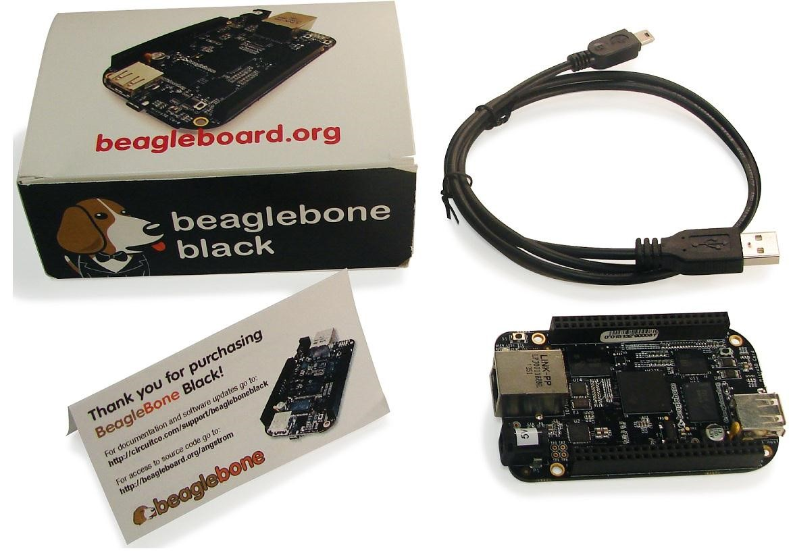
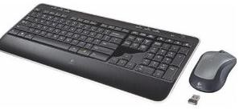
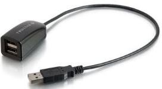
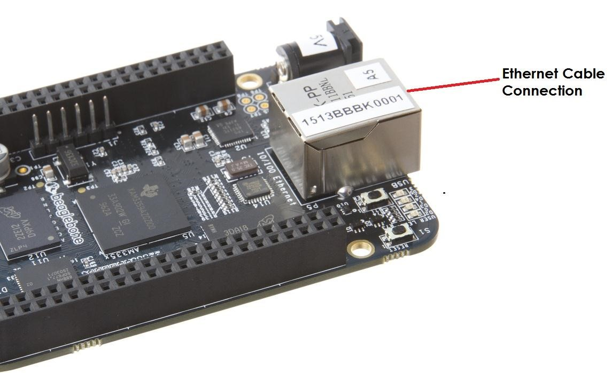

.. _beagleboneblack-connectivity:

Connecting Up Your BeagleBone Black
#######################################

This section provides instructions on how to hook up your board. Two
scenarios will be discussed:

1.  Tethered to a PC and
2.  As a standalone development platform in a desktop PC configuration.

What’s In the Box
---------------------

In the box you will find three main items as shown in <<figure-1>>.

* BeagleBone Black
* miniUSB to USB Type A Cable
* Instruction card with link to the support WIKI address.

This is sufficient for the tethered scenario and creates an out of box
experience where the board can be used immediately with no other
equipment needed.

   In the Box
   
Main Connection Scenarios
-----------------------------

This section will describe how to connect the board for use. This
section is basically a slightly more detailed description of the Quick
Start Guide that came in the box. There is also a Quick Start Guide
document on the board that should also be referred to. The intent here
is that someone looking to purchase the board will be able to read this
section and get a good idea as to what the initial set up will be like.

The board can be configured in several different ways, but we will
discuss the two most common scenarios as described in the Quick Start
Guide card that comes in the box.

* Tethered to a PC via the USB cable

  * Board is accessed as a storage drive 
  * Or a RNDIS Ethernet connection.
  
* Standalone desktop 

  * Display
  * Keyboard and mouse
  * External 5V power supply

Each of these configurations is discussed in general terms in the
following sections.

For an up-to-date list of confirmed working accessories please go to
`BeagleBone_Black_Accessories <http://elinux.org/BeagleBone_Black_Accessories_>`_
 

Tethered To A PC
--------------------

In this configuration, the board is powered by the PC via the provided
USB cable--no other cables are required. The board is accessed either as
a USB storage drive or via the browser on the PC. You need to use either
Firefox or Chrome on the PC, Internet Explorer will not work properly. <<figure-2>>
shows this configuration.

.. figure:: media/image8.jpg
   :width: 632px
   :height: 166px
   :align: center
   :alt: Tethered Configuration

   Tethered Configuration
   

All the power for the board is provided by the PC via the USB cable. In
some instances, the PC may not be able to supply sufficient power for
the board. In that case, an external 5VDC power supply can be used, but
this should rarely be necessary.

Connect the Cable to the Board
************************************

1. Connect the small connector on the USB cable to the board as shown in *figure-3*. The connector is on the bottom side of the board.

.. figure:: media/image9.jpg
   :width: 451px
   :height: 206px
   :align: center
   :alt: USB Connection to the Board

   USB Connection to the Board

2.  Connect the large connector of the USB cable to your PC or laptop USB port.
3.  The board will power on and the power LED will be on as shown in figure below.

.. figure:: media/image10.jpg
   :width: 401px
   :height: 267px
   :align: center
   :alt: Board Power LED

   Board Power LED

4. When the board starts to the booting process started by the process of applying power, the LEDs will come on in sequence as shown in *figure-5* below. It will take a few seconds for the status LEDs to come on, so be patient. The LEDs will be flashing in an erratic manner as it begins to boot the Linux kernel.

.. figure:: media/image11.jpg
   :width: 400px
   :height: 254px
   :align: center
   :alt: Board Boot Status

   Board Boot Status

Accessing the Board as a Storage Drive
********************************************

The board will appear around a USB Storage drive on your PC after the
kernel has booted, which will take around 10 seconds. The kernel on the
board needs to boot before the port gets enumerated. Once the board
appears as a storage drive, do the following:

1.  Open the USB Drive folder.
2.  Click on the file named *start.htm*
3.  The file will be opened by your browser on the PC and you should get a display showing the Quick Start Guide.
4.  Your board is now operational! Follow the instructions on your PC screen.

Standalone w/Display and Keyboard/Mouse
-------------------------------------------

In this configuration, the board works more like a PC, totally free from
any connection to a PC as shown in <<figure-6>>. It allows you to create
your code to make the board do whatever you need it to do. It will
however require certain common PC accessories. These accessories and
instructions are described in the following section.

.. figure:: media/image12.jpg
   :width: 356px
   :height: 409px
   :align: center
   :alt: Desktop Configuration

   Desktop Configuration

Optionally an Ethernet cable can also be used for network access.

Required Accessories
**************************

In order to use the board in this configuration, you will need the
following accessories:

* 1 x 5VDC 1A power supply
* 1 x HDMI monitor or a DVI-D monitor. (*NOTE:* Only HDMI will give you audio capability).
* 1 x Micro HDMI to HDMI cable or a Micro HDMI to DVI-D adapter.
* 1 x USB wireless keyboard and mouse combo.
* 1 x USB HUB (OPTIONAL). The board has only one USB host port, so you may need to use a USB Hub if your keyboard and mouse requires two ports.

For an up-to-date list of confirmed working accessories please go to `BeagleBone_Black_Accessories <http://elinux.org/BeagleBone_Black_Accessories_>`_

Connecting Up the Board
*****************************

1. Connect the big end of the HDMI cable as shown in *figure-7* to your HDMI monitor. Refer to your monitor Owner’s Manual for the location of your HDMI port. If you have a DVI-D Monitor go to *Step 3*, otherwise proceed to *Step 4* .

   Connect microHDMI Cable to the Monitor

2.  If you have a DVI-D monitor you must use a DVI-D to HDMI adapter in addition to your HDMI cable. An example is shown in *figure-8* below from two perspectives. If you use this configuration, you will not have audio support.

.. figure:: media/image14.jpg
   :width: 243px
   :height: 243px
   :align: center
   :alt: DVI-D to HDMI Adapter

   DVI-D to HDMI Adapter

3.  If you have a single wireless keyboard and mouse combination such as seen in *figure-9* below, you need to plug the receiver in the USB host port of the board as shown in *figure-10* .

   Wireless Keyboard and Mouse Combo

   Connect Keyboard and Mouse Receiver to the Board

If you have a wired USB keyboard requiring two USB ports, you will need a HUB similar to the ones shown in figure below . You may want to have more than one port for other devices. Note that the board can only supply up to 500mA, so if you plan to load it down, it will need to be externally powered.

   Keyboard and Mouse Hubs

4. Connect the Ethernet Cable

If you decide you want to connect to your local area network, an Ethernet cable can be used. Connect the Ethernet Cable to the Ethernet port as shown in figure below . Any standard 100M Ethernet cable should work.

   Ethernet Cable Connection

5. The final step is to plug in the DC power supply to the DC power jack as shown in figure below.

.. figure:: media/image25.jpg
   :width: 618px
   :height: 298px
   :align: center
   :alt: External DC Power

   External DC Power

6. The cable needed to connect to your display is a microHDMI to HDMI. Connect the microHDMI connector end to the board at this time. The connector is on the bottom side of the board as shown in *figure-14* below.

.. figure:: media/image26.jpg
   :width: 540px
   :height: 227
   :align: center
   :alt: Connect microHDMI Cable to the Board 

   Connect microHDMI Cable to the Board
   
The connector is fairly robust, but we suggest that you not use the cable as a leash for your Beagle. Take proper care not to put too much stress on the connector or cable.

7. Booting the Board

As soon as the power is applied to the board, it will start the booting up process. When the board starts to boot the LEDs will come on in sequence as shown in *figure-15* below. It will take a few seconds for the status LEDs to come on, so be patient. The LEDs will be flashing in an erratic manner as it boots the Linux kernel.

.. figure:: media/image11.jpg
   :width: 541px
   :height: 254px
   :align: center
   :alt: Board Boot Status

   Board Boot Status

While the four user LEDs can be overwritten and used as desired, they
do have specific meanings in the image that is shipped with the board
once the Linux kernel has booted.

* *USER0* is the heartbeat indicator from the Linux kernel.
* *USER1* turns on when the microSD card is being accessed
* *USER2* is an activity indicator. It turns on when the kernel is not in the idle loop.
* *USER3* turns on when the onboard eMMC is being accessed.
  
8. A Booted System
   
   a. The board will have a mouse pointer appear on the screen as it enters the Linux boot step. You may have to move the physical mouse to get the mouse pointer to appear. 
      The system can come up in the suspend mode with the HDMI port in a sleep mode.
   b. After a minute or two a login screen will appear. You do not have to do anything at this point.
   c. After a minute or two the desktop will appear. It should be similar to the one shown in figure-1. HOWEVER, 
      it will change from one release to the next, so do not expect your system to look exactly like the one in the figure, but it will be very similar.
   d. And at this point you are ready to go! *figure-16* shows the desktop after booting.

   Desktop Screen

9. Powering Down
    
   A. Press the power button momentarily.
   B. The system will power down automatically. 
   C. Remove the power jack.
