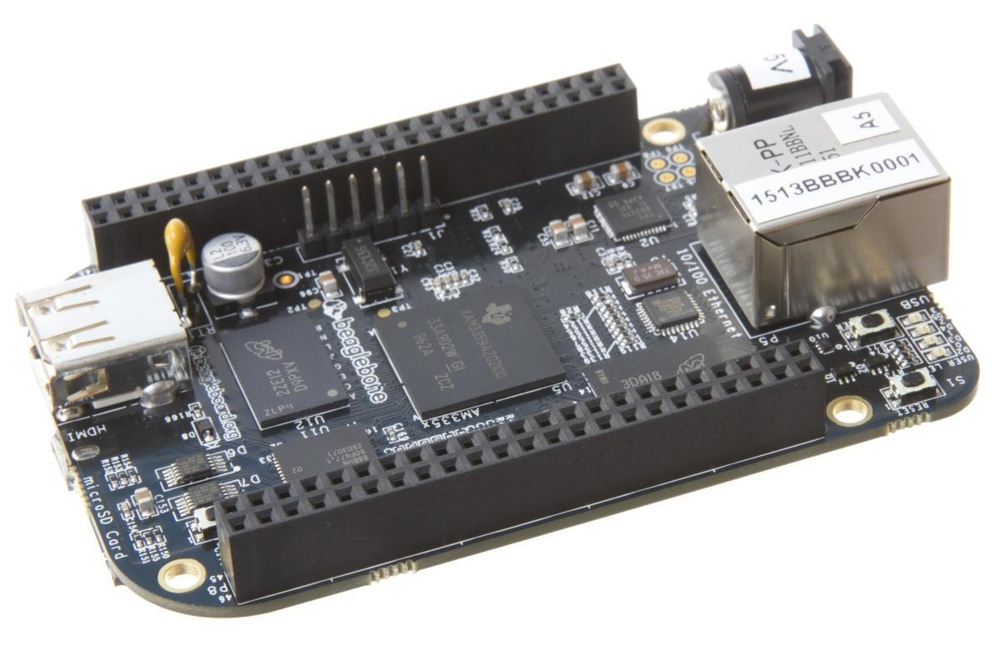
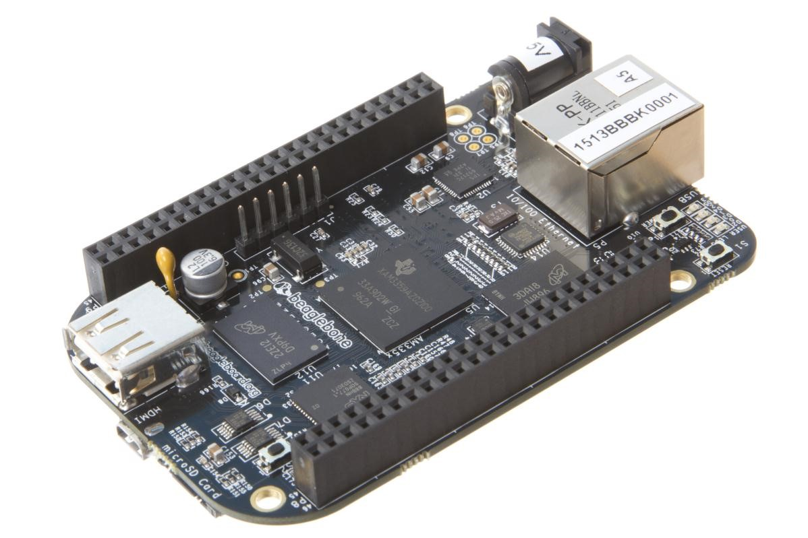
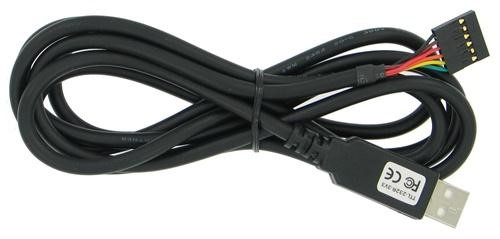
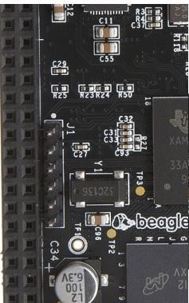
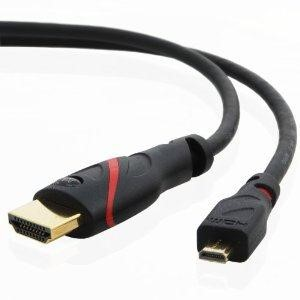

.. _beagleboneblack-connectors:

Connectors
##############

This section describes each of the connectors on the board.

Expansion Connectors
------------------------

The expansion interface on the board is comprised of two 46 pin
connectors. All signals on the expansion headers are _3.3V_ unless
otherwise indicated.

*NOTE: Do not connect 5V logic level signals to these pins or the board
will be damaged.*

*NOTE: DO NOT APPLY VOLTAGE TO ANY I/O PIN WHEN POWER IS NOT SUPPLIED TO
THE BOARD. IT WILL DAMAGE THE PROCESSOR AND VOID THE WARRANTY.*

**NO PINS ARE TO BE DRIVEN UNTIL AFTER THE SYS_RESET LINE GOES HIGH.**

.. figure:: media/image68.jpg
   :width: 400px
   :align: center
   :alt: Expansion Connector Location

   Expansion Connector Location

The location and spacing of the expansion headers are the same as on the
original BeagleBone.

Connector P8
******************

*table-12* shows the pinout of the **P8** expansion header. Other signals
can be connected to this connector based on setting the pin mux on the
processor, but this is the default settings on power up. The SW is
responsible for setting the default function of each pin. There are some
signals that have not been listed here. Refer to the processor
documentation for more information on these pins and detailed
descriptions of all of the pins listed. In some cases there may not be
enough signals to complete a group of signals that may be required to
implement a total interface.

The *PROC* column is the pin number on the processor.

The *PIN* column is the pin number on the expansion header.

The *MODE* columns are the mode setting for each pin. Setting each mode
to align with the mode column will give that function on that pin.

*NOTE: DO NOT APPLY VOLTAGE TO ANY I/O PIN WHEN POWER IS NOT SUPPLIED TO
THE BOARD. IT WILL DAMAGE THE PROCESSOR AND VOID THE WARRANTY.*

*NO PINS ARE TO BE DRIVEN UNTIL AFTER THE SYS_RESET LINE GOES HIGH.*

.. raw:: latex

  \begin{landscape}
  \tiny

.. list-table:: Expansion Header P8 Pinout
   :header-rows: 1

   * - PIN 
     - PROC  
     - NAME 
     - MODE0 
     - MODE1 
     - MODE2 
     - MODE3 
     - MODE4 
     - MODE5 
     - MODE6 
     - MODE7
   * - 1,2 
     -
     - GND 
     -
     -
     - 
     -
     -
     -
     -
     -
   * - 3 
     - R9 
     - GPIO1_6 
     - gpmc_ad6 
     - mmc1_dat6 
     - 
     -
     -
     -
     -
     - gpio1[6]
   * - 4 
     - T9 
     - GPIO1_7
     - gpmc_ad7
     - mmc1_dat7
     - 
     -
     -
     -
     -
     - gpio1[7]
   * - 5 
     - R8 
     - GPIO1_2
     - gpmc_ad2
     - mmc1_dat2
     - 
     -
     -
     -
     -
     - gpio1[2]
   * - 6 
     - T8 
     - GPIO1_3
     - gpmc_ad3
     - mmc1_dat3
     - 
     -
     -
     -
     -
     - gpio1[3]
   * - 7 
     - R7
     - TIMER4
     - gpmc_advn_ale
     - 
     - timer4
     - 
     -
     -
     -
     - gpio2[2]
   * - 8
     - T7 
     - TIMER7
     - gpmc_oen_ren
     - 
     - timer7
     -
     -
     -
     -
     - gpio2[3]
   * - 9 
     - T6 
     - TIMER5
     - gpmc_be0n_cle
     - 
     - timer5
     -
     -
     -
     -
     - gpio2[5]
   * - 10
     - U6 
     - TIMER6
     - gpmc_wen
     - 
     - timer6
     -
     -
     -
     -
     - gpio2[4]
   * - 11
     - R12 
     - GPIO1_13
     - gpmc_ad13
     - lcd_data18
     - mmc1_dat5
     - mmc2_dat1
     - eQEP2B_in
     - 
     - pr1_pru0_pru_r30_15
     - gpio1[13]
   * - 12
     - T12 
     - GPIO1_12
     - gpmc_ad12
     - lcd_data19
     - mmc1_dat4
     - mmc2_dat0
     - eQEP2a_in
     - 
     - pr1_pru0_pru_r30_14
     - gpio1[12]
   * - 13
     - T10 
     - EHRPWM2B
     - gpmc_ad9
     - lcd_data22
     - mmc1_dat1
     - mmc2_dat5
     - ehrpwm2B
     - 
     -
     - gpio0[23]
   * - 14
     - T11 
     - GPIO0_26
     - gpmc_ad10
     - lcd_data21
     - mmc1_dat2
     - mmc2_dat6
     - ehrpwm2_tripzone_in
     - 
     -
     - gpio0[26]
   * - 15
     - U13 
     - GPIO1_15
     - gpmc_ad15
     - lcd_data16
     - mmc1_dat7
     - mmc2_dat3
     - eQEP2_strobe
     - 
     - pr1_pru0_pru_r31_15
     - gpio1[15]
   * - 16
     - V13 
     - GPIO1_14
     - gpmc_ad14
     - lcd_data17
     - mmc1_dat6
     - mmc2_dat2
     - eQEP2_index
     - 
     - pr1_pru0_pru_r31_14
     - gpio1[14]
   * - 17
     - U12 
     - GPIO0_27
     - gpmc_ad11
     - lcd_data20
     - mmc1_dat3
     - mmc2_dat7
     - ehrpwm0_synco
     - 
     -
     - gpio0[27]
   * - 18
     - V12 
     - GPIO2_1
     - gpmc_clk_mux0
     - lcd_memory_clk
     - gpmc_wait1
     - mmc2_clk
     - 
     -
     - mcasp0_fsr
     - gpio2[1]
   * - 19
     - U10 
     - EHRPWM2A
     - gpmc_ad8
     - lcd_data23
     - mmc1_dat0
     - mmc2_dat4
     - ehrpwm2A
     - 
     -
     - gpio0[22]
   * - 20
     - V9 
     - GPIO1_31
     - gpmc_csn2
     - gpmc_be1n
     - mmc1_cmd
     - 
     -
     - pr1_pru1_pru_r30_13
     - pr1_pru1_pru_r31_13
     - gpio1[31]
   * - 21
     - U9 
     - GPIO1_30
     - gpmc_csn1
     - gpmc_clk
     - mmc1_clk
     - 
     - 
     - pr1_pru1_pru_r30_12
     - pr1_pru1_pru_r31_12
     - gpio1[30]
   * - 22
     - V8
     - GPIO1_5
     - gpmc_ad5
     - mmc1_dat5
     - 
     -
     -
     -
     -
     - gpio1[5]
   * - 23
     - U8 
     - GPIO1_4
     - gpmc_ad4
     - mmc1_dat4
     - 
     -
     -
     -
     -
     - gpio1[4]
   * - 24
     - V7 
     - GPIO1_1
     - gpmc_ad1
     - mmc1_dat1
     - 
     -
     -
     -
     -
     - gpio1[1]
   * - 25
     - U7 
     - GPIO1_0
     - gpmc_ad0
     - mmc1_dat0
     - 
     -
     -
     -
     -
     - gpio1[0]
   * - 26
     - V6 
     - GPIO1_29
     - gpmc_csn0
     - 
     -
     -
     -
     -
     -
     - gpio1[29]
   * - 27
     - U5 
     - GPIO2_22
     - lcd_vsync
     - gpmc_a8
     - 
     -
     -
     - pr1_pru1_pru_r30_8
     - pr1_pru1_pru_r31_8
     - gpio2[22]
   * - 28
     - V5 
     - GPIO2_24
     - lcd_pclk
     - gpmc_a10
     - 
     -
     -
     - pr1_pru1_pru_r30_10
     - pr1_pru1_pru_r31_10
     - gpio2[24]
   * - 29
     - R5 
     - GPIO2_23
     - lcd_hsync
     - gpmc_a9
     - 
     -
     -
     - pr1_pru1_pru_r30_9
     - pr1_pru1_pru_r31_9
     - gpio2[23]
   * - 30
     - R6 
     - GPIO2_25
     - lcd_ac_bias_en
     - gpmc_a11
     - 
     -
     -
     -
     -
     - gpio2[25]
   * - 31
     - V4 
     - UART5_CTSN
     - lcd_data14
     - gpmc_a18
     - eQEP1_index
     - mcasp0_axr1
     - uart5_rxd
     - 
     - uart5_ctsn
     - gpio0[10]
   * - 32
     - T5 
     - UART5_RTSN
     - lcd_data15
     - gpmc_a19
     - eQEP1_strobe
     - mcasp0_ahclkx
     - mcasp0_axr3
     - 
     - uart5_rtsn
     - gpio0[11]
   * - 33
     - V3 
     - UART4_RTSN
     - lcd_data13
     - gpmc_a17
     - eQEP1B_in
     - mcasp0_fsr
     - mcasp0_axr3
     - 
     - uart4_rtsn
     - gpio0[9]
   * - 34
     - U4 
     - UART3_RTSN
     - lcd_data11
     - gpmc_a15
     - ehrpwm1B
     - mcasp0_ahclkr
     - mcasp0_axr2
     - 
     - uart3_rtsn
     - gpio2[17]
   * - 35
     - V2 
     - UART4_CTSN
     - lcd_data12
     - gpmc_a16
     - eQEP1A_in
     - mcasp0_aclkr
     - mcasp0_axr2
     - 
     - uart4_ctsn
     - gpio0[8]
   * - 36
     - U3 
     - UART3_CTSN
     - lcd_data10
     - gpmc_a14
     - ehrpwm1A
     - mcasp0_axr0
     - 
     -
     - uart3_ctsn
     - gpio2[16]
   * - 37
     - U1 
     - UART5_TXD
     - lcd_data8
     - gpmc_a12
     - ehrpwm1_tripzone_in
     - mcasp0_aclkx
     - uart5_txd
     - 
     - uart2_ctsn
     - gpio2[14]
   * - 38
     - U2 
     - UART5_RXD
     - lcd_data9
     - gpmc_a13
     - ehrpwm0_synco
     - mcasp0_fsx
     - uart5_rxd
     - 
     - uart2_rtsn
     - gpio2[15]
   * - 39
     - T3 
     - GPIO2_12
     - lcd_data6
     - gpmc_a6
     - 
     - eQEP2_index
     - 
     - pr1_pru1_pru_r30_6
     - pr1_pru1_pru_r31_6
     - gpio2[12]
   * - 40
     - T4 
     - GPIO2_13
     - lcd_data7
     - gpmc_a7
     - 
     - eQEP2_strobe
     - pr1_edio_data_out7
     - pr1_pru1_pru_r30_7
     - pr1_pru1_pru_r31_7
     - gpio2[13]
   * - 41
     - T1 
     - GPIO2_10
     - lcd_data4
     - gpmc_a4
     - 
     - eQEP2A_in
     - 
     - pr1_pru1_pru_r30_4
     - pr1_pru1_pru_r31_4
     - gpio2[10]
   * - 42
     - T2 
     - GPIO2_11
     - lcd_data5
     - gpmc_a5
     - 
     - eQEP2B_in
     - 
     - pr1_pru1_pru_r30_5
     - pr1_pru1_pru_r31_5
     - gpio2[11]
   * - 43
     - R3 
     - GPIO2_8
     - lcd_data2
     - gpmc_a2
     - 
     - ehrpwm2_tripzone_in
     - 
     - pr1_pru1_pru_r30_2
     - pr1_pru1_pru_r31_2
     - gpio2[8]
   * - 44
     - R4 
     - GPIO2_9
     - lcd_data3
     - gpmc_a3
     - 
     - ehrpwm0_synco
     - 
     - pr1_pru1_pru_r30_3
     - pr1_pru1_pru_r31_3
     - gpio2[9]
   * - 45
     - R1 
     - GPIO2_6
     - lcd_data0
     - gpmc_a0
     - 
     - ehrpwm2A
     - 
     - pr1_pru1_pru_r30_0
     - pr1_pru1_pru_r31_0
     - gpio2[6]
   * - 46
     - R2 
     - GPIO2_7
     - lcd_data1
     - gpmc_a1
     - 
     - ehrpwm2B
     - 
     - pr1_pru1_pru_r30_1
     - pr1_pru1_pru_r31_1
     - gpio2[7]

.. raw:: latex

  \end{landscape}

Connector P9
******************

Table-13 lists the signals on connector **P9**. Other signals can be
connected to this connector based on setting the pin mux on the
processor, but this is the default settings on power up.

There are some signals that have not been listed here. Refer to the
processor documentation for more information on these pins and detailed
descriptions of all of the pins listed. In some cases there may not be
enough signals to complete a group of signals that may be required to
implement a total interface.

The *PROC* column is the pin number on the processor.

The *PIN* column is the pin number on the expansion header.

The *MODE* columns are the mode setting for each pin. Setting each mode
to align with the mode column will give that function on that pin.

NOTES:

In the table are the following notations:

*PWR_BUT* is a 5V level as pulled up internally by the TPS65217C. It is
activated by pulling the signal to GND.

*NOTE: DO NOT APPLY VOLTAGE TO ANY I/O PIN WHEN POWER IS NOT SUPPLIED TO
THE BOARD. IT WILL DAMAGE THE PROCESSOR AND VOID THE WARRANTY.*

*NO PINS ARE TO BE DRIVEN UNTIL AFTER THE SYS_RESET LINE GOES HIGH.*

* Both of these signals connect to pin 41 of P11. Resistors are installed that allow for the GPIO3_20 connection to be removed by removing R221. The intent is to allow the SW to use either of these signals, one or the other, on pin 41. SW should set the unused pin in input mode when using the other pin. This allowed us to get an extra signal out to the expansion header.
 
* Both of these signals connect to pin 42 of P11. Resistors are installed that allow for the GPIO3_18 connection to be removed by removing R202. The intent is to allow the SW to use either of these signals, on pin 42. SW should set the unused pin in input mode when using the other pin. This allowed us to get an extra signal out to the expansion header.

.. raw:: latex

  \begin{landscape}
  \tiny

.. list-table:: Expansion Header P9 Pinout
   :header-rows: 1

   * - PIN
     - PROC
     - NAME
     - MODE0
     - MODE1
     - MODE2
     - MODE3
     - MODE4
     - MODE5
     - MODE6
     - MODE7
   * - **1,2**
     - **GND**
     - 
     -
     -
     -
     -
     -
     -
     -
     -
   * - **3,4**
     - **DC_3.3V**
     - 
     -
     -
     -
     -
     -
     -
     -
     -
   * - **5,6**
     - **VDD_5V**
     - 
     -
     -
     -
     -
     -
     -
     -
     -
   * - **7,8**
     - **SYS_5V**
     - 
     -
     -
     -
     -
     -
     -
     -
     -
   * - **9** 
     - **PWR_BUT**
     - 
     -
     -
     -
     -
     -
     -
     -
     -
   * - **10**
     - **A10**
     - **SYS_RESETn**
     -
     -
     -
     -
     -
     -
     -
     -
   * - **11**
     - **T17**
     - **UART4_RXD**
     - gpmc_wait0
     - mii2_crs
     - gpmc_csn4
     - rmii2_crs_dv
     - mmc1_sdcd
     -
     - uart4_rxd_mux2
     - gpio0[30]
   * - **12**
     - **U18**
     - **GPIO1_28**
     - gpmc_be1n
     - mii2_col
     - gpmc_csn6 
     - mmc2_dat3
     - gpmc_dir
     - 
     - mcasp0_aclkr_mux3
     - gpio1[28]
   * - **13**
     - **U17**
     - **UART4_TXD**
     - gpmc_wpn
     - mii_rxerr
     - gpmc_csn5
     - rmii2_rxerr
     - mmc2_sdcd
     - 
     - uart4_txd_mux2
     - gpio0[31]
   * - **14**
     - **U14**
     - **EHRPWM1A**
     - gpmc_a2
     - mii2_txd3
     - rgmii2_td3
     - mmc2_dat1
     - gpmc_a18
     - 
     - ehrpwm1A_mux1
     - gpio1[18]
   * - **15**
     - **R13**
     - **GPIO1_16**
     - gpmc_a0
     - gmii2_txen
     - rmii2_tctl
     - mii2_txen
     - gpmc_a16
     - 
     - ehrpwm1_tripzone_input
     - gpio1[16]
   * - **16**
     - **T14**
     - **EHRPWM1B**
     - gpmc_a3
     - mii2_txd2
     - rgmii2_td2
     - mmc2_dat2
     - gpmc_a19
     - 
     - ehrpwm1B_mux1
     - gpio1[19]
   * - **17**
     - **A16**
     - **I2C1_SCL**
     - spi0_cs0
     - mmc2_sdwp
     - I2C1_SCL
     - ehrpwm0_synci
     - pr1_uart0_txd
     - 
     -
     - gpio0[5]
   * - **18**
     - **B16**
     - **I2C1_SDA**
     - spi0_d1
     - mmc1_sdwp
     - I2C1_SDA
     - ehrpwm0_tripzone
     - pr1_uart0_rxd
     - 
     -   
     - gpio0[4]
   * - **19**
     - **D17**
     - **I2C2_SCL**
     - uart1_rtsn
     - timer5
     - dcan0_rx
     - I2C2_SCL
     - spi1_cs1
     - pr1_uart0_rts_n
     - 
     - gpio0[13]
   * - **20**
     - **D18**
     - **I2C2_SDA**
     - uart1_ctsn
     - timer6
     - dcan0_tx
     - I2C2_SDA
     - spi1_cs0
     - pr1_uart0_cts_n
     - 
     - gpio0[12]
   * - **21**
     - **B17**
     - **UART2_TXD**
     - spi0_d0
     - uart2_txd
     - I2C2_SCL
     - ehrpwm0B
     - pr1_uart0_rts_n
     - 
     - EMU3_mux1
     - gpio0[3]
   * - **22**
     - **A17**
     - **UART2_RXD**
     - spi0_sclk
     - uart2_rxd
     - I2C2_SDA
     - ehrpwm0A
     - pr1_uart0_cts_n
     - 
     - EMU2_mux1
     - gpio0[2]
   * - **23**
     - **V14**
     - **GPIO1_17**
     - gpmc_a1
     - gmii2_rxdv
     - rgmii2_rxdv
     - mmc2_dat0
     - gpmc_a17
     - 
     - ehrpwm0_synco
     - gpio1[17]
   * - **24**
     - **D15**
     - **UART1_TXD**
     - uart1_txd
     - mmc2_sdwp
     - dcan1_rx
     - I2C1_SCL
     - 
     - pr1_uart0_txd
     - pr1_pru0_pru_r31_16
     - gpio0[15]
   * - **25**
     - **A14**
     - **GPIO3_21**
     - mcasp0_ahclkx
     - eQEP0_strobe
     - mcasp0_axr3
     - mcasp1_axr1
     - EMU4_mux2
     - pr1_pru0_pru_r30_7
     - pr1_pru0_pru_r31_7
     - gpio3[21]
   * - **26**
     - **D16**
     - **UART1_RXD**
     - uart1_rxd
     - mmc1_sdwp
     - dcan1_tx
     - I2C1_SDA
     - 
     - pr1_uart0_rxd
     - pr1_pru1_pru_r31_16
     - gpio0[14]
   * - **27**
     - **C13**
     - **GPIO3_19**
     - mcasp0_fsr
     - eQEP0B_in
     - mcasp0_axr3
     - mcasp1_fsx
     - EMU2_mux2
     - pr1_pru0_pru_r30_5
     - pr1_pru0_pru_r31_5
     - gpio3[19]
   * - **28**
     - **C12**
     - **SPI1_CS0**
     - mcasp0_ahclkr
     - ehrpwm0_synci
     - mcasp0_axr2
     - spi1_cs0
     - eCAP2_in_PWM2_out
     - pr1_pru0_pru_r30_3
     - pr1_pru0_pru_r31_3
     - gpio3[17]
   * - **29**
     - **B13**
     - **SPI1_D0**
     - mcasp0_fsx
     - ehrpwm0B
     - 
     - spi1_d0
     - mmc1_sdcd_mux1
     - pr1_pru0_pru_r30_1
     - pr1_pru0_pru_r31_1
     - gpio3[15]
   * - **30**
     - **D12**
     - **SPI1_D1**
     - mcasp0_axr0
     - ehrpwm0_tripzone
     - 
     - spi1_d1
     - mmc2_sdcd_mux1
     - pr1_pru0_pru_r30_2
     - pr1_pru0_pru_r31_2
     - gpio3[16]
   * - **31**
     - **A13**
     - **SPI1_SCLK**
     - mcasp0_aclkx
     - ehrpwm0A
     - 
     - spi1_sclk
     - mmc0_sdcd_mux1
     - pr1_pru0_pru_r30_0
     - pr1_pru0_pru_r31_0
     - gpio3[14]
   * - **32**
     - **VADC**
     -
     -
     -
     -
     -
     -
     - 
     -
     -
   * - **33**
     - **C8**
     - **AIN4**
     -
     -
     -
     -
     -
     -
     - 
     -
   * - **34**
     - **AGND**
     - 
     -
     -
     -
     -
     -
     -
     - 
     -
   * - **35**
     - **A8**
     - **AIN6**
     - 
     -
     -
     -
     -
     -
     -
     - 
   * - **36**
     - **B8**
     - **AIN5**
     - 
     -
     -
     -
     -
     -
     -
     - 
   * - **37**
     - **B7**
     - **AIN2**
     - 
     -
     -
     -
     -
     -
     -
     -
   * - **38**
     - **A7**
     - **AIN3**
     - 
     -
     -
     -
     -
     -
     -
     -   
   * - **39**
     - **B6**
     - **AIN0**
     - 
     -
     -
     -
     -
     -
     -
     -       
   * - **40**
     - **C7**
     - **AIN1**
     - 
     -
     -
     -
     -
     -
     -
     -  
   * - **41**
     - **D14**
     - **CLKOUT2**
     - xdma_event_intr1
     - 
     - tclkin
     - clkout2
     - timer7_mux1
     - pr1_pru0_pru_r31_16
     - EMU3_mux0
     - gpio0[20]
   * - 
     - **D13**
     - **GPIO3_20**
     - mcasp0_axr1
     - eQEP0_index
     - 
     - mcasp1_axr0
     - emu3
     - pr1_pru0_pru_r30_6
     - pr1_pru0_pru_r31_6
     - gpio3[20]
   * - **42**
     - **C18**
     - **GPIO0_7**
     - eCAP0_in_PWM0_out
     - uart3_txd
     - spi1_cs1
     - pr1_ecap0_ecap_capin_apwm_o
     - spi1_sclk
     - mmc0_sdwp
     - xdma_event_intr2
     - gpio0[7]
   * -
     - **B12**
     - **GPIO3_18**
     - mcasp0_aclkr
     - eQEP0A_in
     - mcasp0_axr2
     - mcasp1_aclkx
     - 
     - pr1_pru0_pru_r30_4
     - pr1_pru0_pru_r31_4
     - gpio3[18]
   * - **43-46**
     - **GND**
     - 
     -
     -
     -
     -
     -
     -
     - 
     -

.. raw:: latex

  \end{landscape}

Power Jack
--------------

The DC power jack is located next to the RJ45 Ethernet connector as
shown in <<figure-51>>. This uses the same power connector as is used on
the original BeagleBone. The connector has a 2.1mm diameter center post
(5VDC) and a 5.5mm diameter outer dimension on the barrel (GND).

   5VDC Power Jack

The board requires a regulated 5VDC +/-.25V supply at 1A. A higher
current rating may be needed if capes are plugged into the expansion
headers. Using a higher current power supply will not damage the board.

USB Client
--------------

The USB Client connector is accessible on the bottom side of the board
under the row of four LEDs as shown in <<figure-52>>. It uses a 5 pin
miniUSB cable, the same as is used on the original BeagleBone. The cable
is provided with the board. The cable can also be used to power the
board.

   USB Client

This port is a USB Client only interface and is intended for connection
to a PC.

USB Host
------------

There is a single USB Host connector on the board and is shown in
*Figure 53* below.

   USB Host Connector

The port is USB 2.0 HS compatible and can supply up to 500mA of current. If more current or ports is needed, then a HUB can be used.

Serial Header
-----------------

Each board has a debug serial interface that can be accessed by using a special serial cable that is plugged into the serial header as shown in *Figure 54* below.

   Serial Debug Header

Two signals are provided, TX and RX on this connector. The levels on
these signals are 3.3V. In order to access these signals, a FTDI USB to
Serial cable is recommended as shown in *Figure 55* below.

   PRU-ICSS Block Diagram

The cable can be purchased from several different places and must be the
3.3V version TTL-232R-3V3. Information on the cable itself can be found
direct from FTDI at: `pdf <http://www.ftdichip.com/Support/Documents/DataSheets/Cables/DS_TTL232R_CABLES.pdf>`_

Pin 1 of the cable is the black wire. That must align with the pin 1 on
the board which is designated by the white dot next to the connector on
the board.

Refer to the support WIKI `http://elinux.org/BeagleBoneBlack <http://elinux.org/BeagleBoneBlack>`_ for more sources of this cable and other options that will work.

Table is the pinout of the connector as reflected in the schematic. It is the same as the FTDI cable which can be found at `http://www.ftdichip.com/Support/Documents/DataSheets/Cables/DS_TTL-232R_CABLES.pdf <http://www.ftdichip.com/Support/Documents/DataSheets/Cables/DS_TTL-232R_CABLES.pdf>`_ with the exception that only three pins are used on the board. The pin numbers are defined in *Table 14*. The signals are from the perspective of the board.

.. list-table:: J1 Serial Header Pins
   :header-rows: 1
   :class: longtable
   :align: center
   :widths: auto

   * - PIN NUMBER 
     - SIGNAL
   * - 1 
     - Ground
   * - 4 
     - Receive
   * - 5 
     - Transmit

   Serial Header

HDMI
--------

Access to the HDMI interface is through the HDMI connector that is
located on the bottom side of the board as shown in *Figure 57* below.

   HDMI Connector

The connector is microHDMI connector. This was done due to the space
limitations we had in finding a place to fit the connector. It requires
a microHDMI to HDMI cable as shown in *Figure 58* below. The cable can
be purchased from several different sources.

   HDMI Cable

microSD
-----------

A microSD connector is located on the back or bottom side of the board
as shown in *Figure 59* below. The microSD card is not supplied with the
board.

   microSD Connector

When plugging in the SD card, the writing on the card should be up.
Align the card with the connector and push to insert. Then release.
There should be a click and the card will start to eject slightly, but
it then should latch into the connector. To eject the card, push the SD
card in and then remove your finger. The SD card will be ejected from
the connector.

Do not pull the SD card out or you could damage the connector.

Ethernet
------------

The board comes with a single 10/100 Ethernet interface located next to
the power jack as shown in Figure below.

   Ethernet Connector

The PHY supports AutoMDX which means either a straight or a swap cable
can be used.

JTAG Connector
------------------

A place for an optional 20 pin CTI JTAG header is provided on the board
to facilitate the SW development and debugging of the board by using
various JTAG emulators. This header is not supplied standard on the
board. To use this, a connector will need to be soldered onto the board.

If you need the JTAG connector you can solder it on yourself. No other
components are needed. The connector is made by Samtec and the part
number is FTR-110-03-G-D-06. You can purchase it from
`http://www.digikey.com/ <https://www.digikey.com>`_

