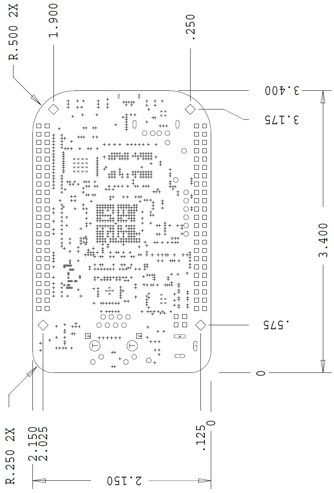
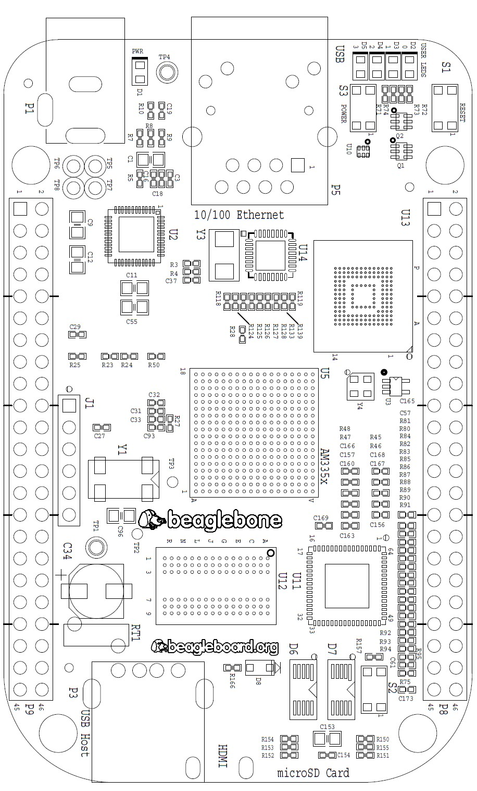
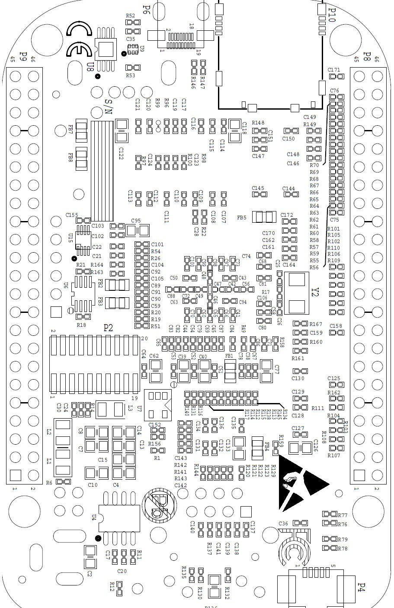

.. _beagleboneblack-mechanical:

BeagleBone Black Mechanical
###############################

Dimensions and Weight
-------------------------

Size: 3.5” x 2.15” (86.36mm x 53.34mm)

Max height: .187” (4.76mm)

PCB Layers: 6

PCB thickness: .062”

RoHS Compliant: Yes

Weight: 1.4 oz

Silkscreen and Component Locations
--------------------------------------

   Board Dimensions

   Component Side Silkscreen

   Circuit Side Silkscreen
   