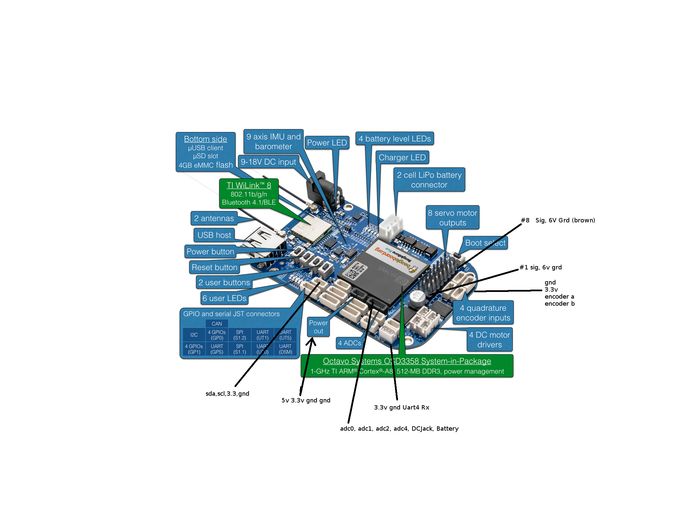
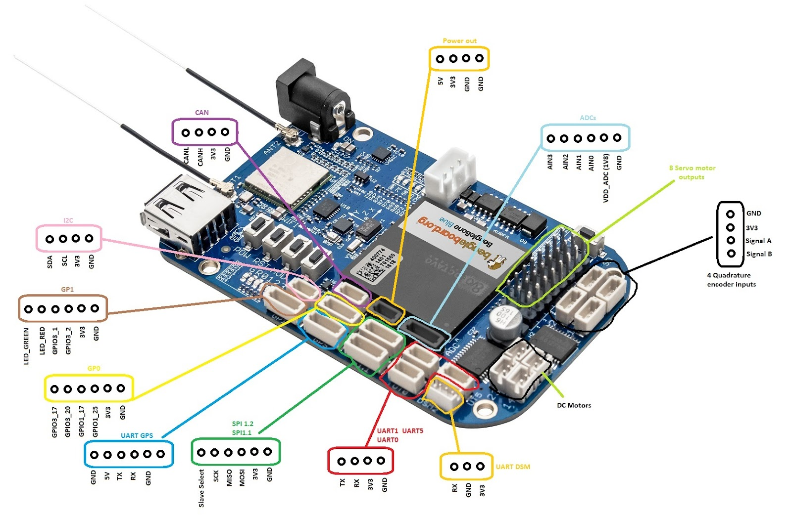

.. _beaglebone-blue-pinouts:

BeagleBone Blue Pinouts 
#########################

-  Connector pinout
   `details <https://github.com/beagleboard/beaglebone-blue/blob/master/BeagleBone_Blue_sch.pdf>`__
   from schematic(s)
-  `Pin
   Table <https://github.com/beagleboard/beaglebone-blue/blob/master/BeagleBone_Blue_Pin_Table.csv>`__
   with some Blue : Black corelation.

UT1
=====

UART (/dev/ttyS1)
--------------------

.. code:: bash

   config-pin P9.24 uart
   config-pin P9.26 uart

GPS
===========

UART (/dev/ttyS2)
--------------------

.. code:: bash

   config-pin P9.21 uart
   config-pin P9.22 uart
