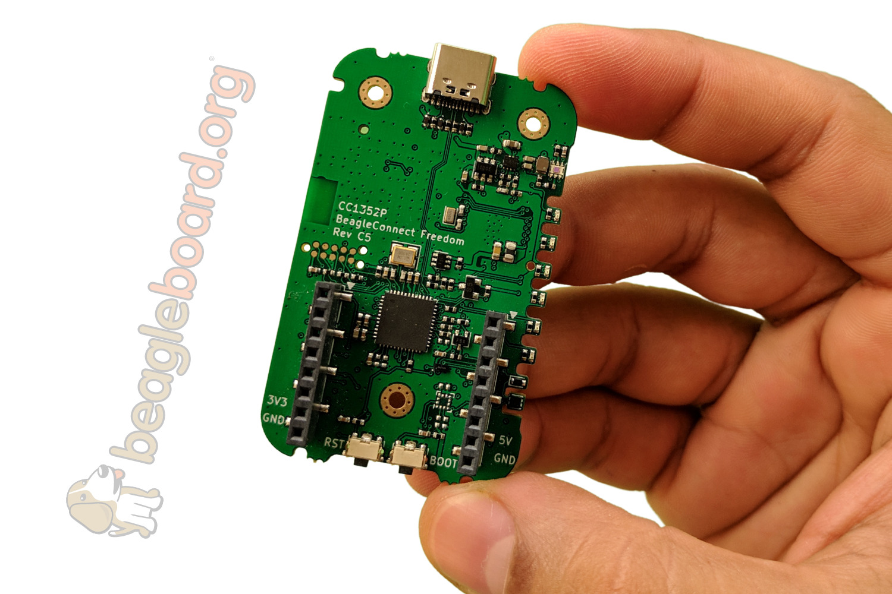

BeagleConnect Freedom
######################

The initial BeagleConnect™ Freedom production release will:

* Support at least 100 mikroBUS-based Click boards from Mikroelectronika
* Work with Bluetooth Low Energy (BLE)-enabled Linux computers at 2.4GHz
* Work with long-range sub-1GHz IEEE 802.15.4 wireless connections at 500 
  meters with data rates of 1kbps, and
* Work with a low-cost BeagleBoard.org Linux single-board computer (SBC) as a 
  BeagleConnect™ gateway device and work with at least 10 other BeagleConnect™ 
  node devices each supporting 2 add-on sensor, actuator or indicator devices.

Future releases will be collaborated with the community, evolve dynamically, 
and contain additional functionality. The goal is to support over 500 add-on 
devices within the first year after the initial release.

.. important::
   BeagleConnect™ Freedom enables wirelessly adding new device nodes 
   and is targeted to cost initially around US$20 with a roadmap to variants as 
   low as US$1. 

BeagleConnect™ Freedom
**********************

BeagleConnect™ Freedom is based on the `TI CC1352 <https://www.ti.com/product/CC1352R>`_ 
and is the first available BeagleConnect™ solution. It implements:

* BeagleConnect™ gateway device function for Sub-GHz 802.15.4 long-range 
  wireless
* BeagleConnect™ node device function for Bluetooth Low-Energe (BLE) and 
  Sub-GHz 802.15.4 long range wireless
* USB-based serial console and firmware updates
* 2x `mikroBUS sockets <https://www.mikroe.com/mikrobus>`_ with BeagleConnect™ 
  protocol support

#TODO: provide image of BeagleConnect™ Freedom in a case with a hand for size perspective

BeagleConnect™ Freedom beta kit
*******************************

A small number of beta kits have been assembled with BeagleConnect™ Freedom 
rev C5 boards, which is the version that should be taken to production.

The kit includes:

* 1x `Seeed BeagleBone® Green Gateway <https://wiki.seeedstudio.com/BeagleBone-Green-Gateway/>`_ (board, USB cable)
* 3x BeagleConnect™ Freedom (board, attenna, USB cable)
* 1x `Mikroelectronika Click ID Board <https://www.mikroe.com/unique-id-click>`_

To get started with this kit, see [demo-1].

What makes BeagleConnect™ new and different?
********************************************

.. important::
  BeagleConnect™ solves IoT in a different and better way than any 
  previous solution.

The device interface software is already done
=============================================

BeagleConnect™ uses the collaboratively developed Linux kernel to contain the 
intelligence required to speak to these devices (sensors, actuators, and 
indicators), rather than relying on writing code on a microcontroller specific 
to these devices. Some existing solutions rely on large libraries of 
microcontroller code, but the integration of communications, maintenance of the
library with a limited set of developer resources and other constraints to be 
explained later make those other solutions less suitable for rapid prototyping 
than BeagleConnect™.

Linux presents these devices abstractly in ways that are self-descriptive. Add 
an accelerometer to the system and you are automatically fed a stream of force 
values in standard units. Add a temperature sensor and you get it back in 
standard units again. Same for sensing magnetism, proximity, color, light, 
frequency, orientation, or multitudes of other inputs. Indicators, such as LEDs
and displays, are similarly abstracted with a few other kernel subsystems and 
more advanced actuators with and without feedback control are in the process of
being developed and standardized. In places where proper Linux kernel drivers 
exist, no new specialized code needs to be created for the devices.

Important: *Bottom line*: For hundreds of devices, users won't have to write a 
single line of code to add them their systems. The automation code they do 
write can be extremely simple, done with graphical tools or in any language 
they want. Maintenance of the code is centralized in a small reusable set of 
microcontroller firmware and the Linux kernel, which is highly peer reviewed 
under a `highly-regarded governance model <https://wiki.p2pfoundation.net/Linux_-_Governance>`_. 

On-going maintenance
====================

Because there isn't code specific to any given network-of-devices configuration
, we can all leverage the same software code base. This means that when someone
fixes an issue in either BeagleConnect™ firmware or the Linux kernel, you 
benefit from the fixes. The source for BeagleConnect™ firmware is also 
submitted to the `Zephyr Project <https://www.zephyrproject.org/>`_ upstream, 
further increasing the user base. Additionally, we will maintain stable 
branches of the software and provide mechanisms for updating firmware on 
BeagleConnect™ hardware. With a single, relatively small firmware load, the 
potential for bugs is kept low. With large user base, the potential for 
discovering and resolving bugs is high.

Rapid prototyping without wiring
================================

BeagleConnect™ utilizes the `mikroBUS standard <https://elinux.org/Mikrobus>`_.
The mikroBUS standard interface is flexible enough for almost any typical 
sensor or indicator with hundreds of devices available.

Note: Currently, we have support in the Linux kernel for a bit over 100 Click 
mikroBUS add-on boards from Mikroelektronika and are working with 
Mikroelektronika on a updated version of the specification for these boards to 
self-identify. Further, eventually the vast majority of over 800 currently 
available Click mikroBUS add-on boards will be supported as well as the 
hundreds of compliant boards developed every year. 

Long-range, low-power wireless
==============================

BeagleConnect™ Freedom wireless hardware is built around a 
`TI CC1352 <http://www.ti.com/product/CC1352R>`_ multiprotocol and multi-band 
Sub-1 GHz and 2.4-GHz wireless microcontroller (MCU). CC1352R includes a 48-MHz
Arm® Cortex®-M4F processor, 352KB Flash, 256KB ROM, 8KB Cache SRAM, 80KB of 
ultra-low leakage SRAM, and `Over-the-Air <https://en.wikipedia.org/wiki/Over-the-air_programming>`_ 
upgrades (OTA).

Full customization possible
===========================

BeagleConnect™ utilizes `open source hardware <https://www.oshwa.org/definition/>`_ 
and `open source software <https://en.wikipedia.org/wiki/Open-source_software>`_, 
making it possible to optimize hardware and software implementations and 
sourcing to meet end-product requirements. BeagleConnect™ is meant to enable 
rapid-prototyping and not to necessarily satisfy any particular end-product’s 
requirements, but with full considerations for go-to-market needs.

Each BeagleBoard.org BeagleConnect™ solution will be:

* Readily available for over 10 years,
* Built with fully open source software with submissions to mainline Linux and 
  Zephyr repositories to aide in support and porting,
* Built with fully open source and non-restrictive hardware design including 
  schematic, bill-of-materials, layout, and manufacturing files (with only the 
  BeagleBoard.org logo removed due to licensing restrictions of our brand),
* Built with parts where at least a compatible part is available from worldwide
  distributors in any quantity,
* Built with design and manufacturing partners able to help scale derivative
  designs,
* Based on a security model using public/private keypairs that can be replaced 
  to secure your own network, and
* Fully FCC/CE certified.

Getting Started
***************

* `Typical usage with a Linux host </boards/beagleconnect/freedom/usage.html>`__
* `Programming with Zephyr </boards/beagleconnect/freedom/zephyr.html>`__

.. toctree::
   :maxdepth: 1
   :hidden:

   usage.rst
   zephyr.rst
