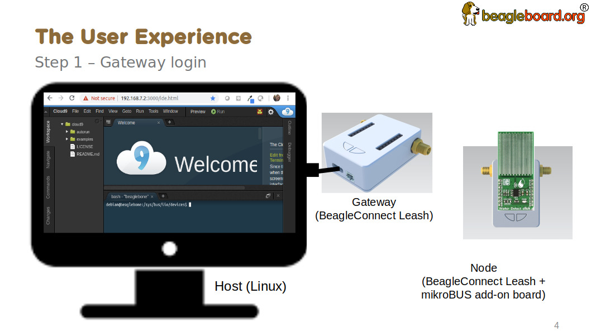
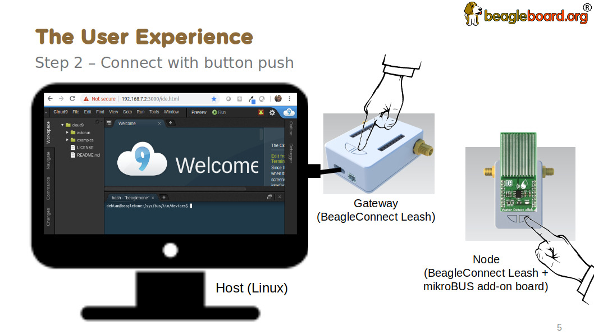
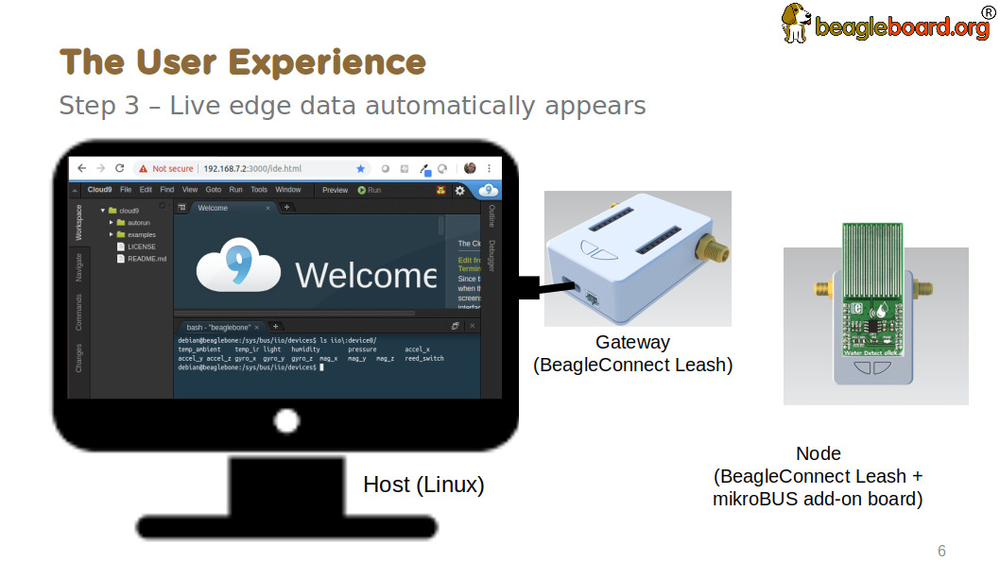

.. _beagleconnect-Usage:

BeagleConnect Freedom Usage
###########################

This section describes the usage model we are developing. To use the current
code in development, please refer to the [development] section.

BeagleConnect wireless user experience
***************************************

Enable a Linux host with BeagleConnect
=======================================

Log into a host system running Linux that is BeagleConnect™ enabled. Enable a
Linux host with BeagleConnect™ by plugging a **BeagleConnect™ gateway device**
into it’s USB port. You’ll also want to have a **BeagleConnect™ node device**
with a sensor, actuator or indicator device connected.

.. note::
  BeagleConnect™ Freedom can act as either a BeagleConnect™ gateway device
  or a BeagleConnect™ node device.

.. important::
  The Linux host will need to run the BeagleConnect™ management
  software, most of which is incorporated into the Linux kernel. Support will be
  provided for BeagleBoard and BeagleBone boards, x86 hosts, and Raspberry Pi.

#TODO#: Clean up images

Connect host and device
=======================

Initiate a connection between the host and devices by pressing the discovery
button(s).

Device data shows up as files
=============================

New streams of self-describing data show up on the host system using native
device drivers.

High-level applications, like Node-RED, can directly read/write these
high-level data streams (including data-type information) to Internet-based
`MQTT <https://mqtt.org/>`_ brokers, live dashboards, or other logical
operations without requiring any sensor-specific coding. Business logic can be
applied using simple if-this-then-that style operations or be made as complex
as desired using virtually any programming language or environment.

Components
**********

BeagleConnect™ enabled host Linux computer, possibly single-board computer
(SBC), with BeagleConnect™ management software and BeagleConnect™ gateway
function. BeagleConnect™ gateway function can be provided by a BeagleConnect™
compatible interface or by connecting a BeagleConnect™ **gateway** device over USB.

.. note::
  If the Linux host has BLE, the BeagleConnect™ **gateway** is optional for short
  distances

BeagleConnect™ Freedom Board, case, and wireless MCU with Zephyr based firmware
for acting as either a BeagleConnect™ gateway device or BeagleConnect™ node
device.

* In BeagleConnect™ **gateway** device mode: Provides long-range, low-power
  wireless communications, Connects with the host via USB and an associated
  Linux kernel driver, and is powered by the USB connector.
* In BeagleConnect™ **node** device mode: Powered by a battery or USB connector
  Provides 2 mikroBUS connectors for connecting any of hundreds of `Click Board <https://bbb.io/click>`_
  mikroBUS add-on devices Provides new Linux host controllers for SPI, I2C,
  UART, PWM, ADC, and GPIO with interrupts via Greybus

BeagleConnect **gateway** device
==================================

Provides a BeagleConnect™ compatible interface to a host. This could be a
built-in interface device or one connected over USB. BeagleConnect™ Freedom can
provide this function.

BeagleConnect **node** device
==============================

Utilizes a BeagleConnect™ compatible interface and TODO

BeagleConnect compatible interface
==================================

Immediate plans are to support Bluetooth Low Energy (BLE), 2.4GHz IEEE 802.15.4
, and Sub-GHz IEEE 802.15.4 wireless interfaces. A built-in BLE interface is
suitable for this at short range, whereas IEEE 802.15.4 is typically
significantly better at long ranges. Other wired interfaces, such as CAN and
RS-485, are being considered for future BeagleConnect™ gateway device and
BeagleConnect™ node device designs.

Greybus
-------

TODO

#TODO: Find a place for the following notes:

* The device interfaces get exposed to the host via Greybus BRIDGED_PHY
  protocol
* The I2C bus is probed for a an identifier EEPROM and appropriate device
  drivers are loaded on the host
* Unsupported Click Boards connected are exposed via userspace drivers on the
  host for development

What’s different?
*****************

So, in summary, what is so different with this approach?

* No microcontroller code development is required by users
* Userspace drivers make rapid prototyping really easy
* Kernel drivers makes the support code collaborative parts of the Linux kernel
  , rather than cut-and-paste

