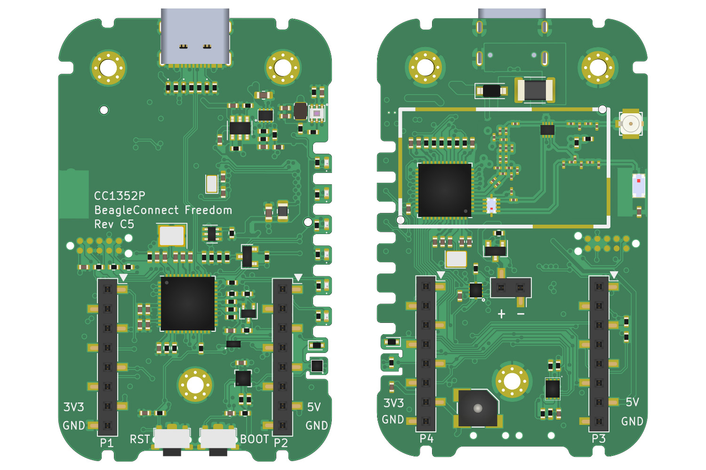
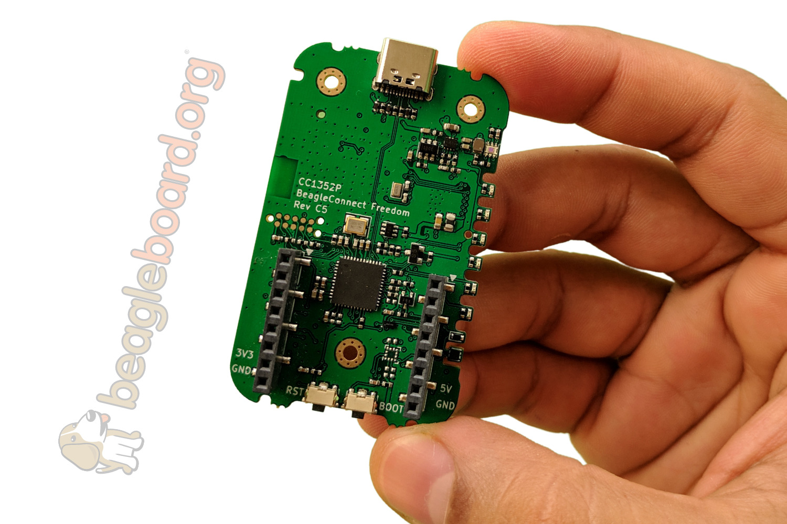

.. _beagleconnect-home:

BeagleConnect
###############

BeagleConnect™ is a revolutionary technology virtually eliminating low-level 
software development for `IoT <https://en.wikipedia.org/wiki/Internet_of_things>`_ 
and `IIoT <https://en.wikipedia.org/wiki/Industrial_internet_of_things>`_ 
applications, such as building automation, factory automation, home automation,
and scientific data acquisition. While numerous IoT and IIoT solutions 
available today provide massive software libraries for microcontrollers 
supporting a limited body of `sensors <https://en.wikipedia.org/wiki/Sensor>`_,
`actuators <https://en.wikipedia.org/wiki/Actuator>`_ and `indicators <https://en.wikipedia.org/wiki/Indicator_(distance_amplifying_instrument)>`_ 
as well as libraries for communicating over various networks, BeagleConnect 
simply eliminates the need for these libraries by shifting the burden into the 
most massive and collaborative software project of all time, the `Linux kernel <https://en.wikipedia.org/wiki/Linux_kernel>`_.

These are the tools used to automate things in 
`scientific data collection <https://en.wikipedia.org/wiki/Data_collection_system>`_, 
`data science <https://en.wikipedia.org/wiki/Data_science>`_, 
`mechatronics <https://en.wikipedia.org/wiki/Mechatronics>`_, 
and `IoT <https://en.wikipedia.org/wiki/Internet_of_things>`_.

BeagleConnect™ technology solves:

* The need to write software to add a large set of diverse devices to your 
  system,
* The need to maintain the software with security updates,
* The need to rapidly prototype using off-the-shelf software and hardware 
  without wiring,
* The need to connect to devices using long-range, low-power wireless, and
* The need to produce high-volume custom hardware cost-optimized for your 
  requirements.

BeagleConnect Experience
*************************

BeagleConnect™ provides a scalable experience for interacting with the physical
world.

Note: The term BeagleConnect™ refers to a technology comprising of a family of 
boards, a collection of Linux kernel drivers, microcontroller firmware, a 
communication protocol, and system-level integration to automation software 
tools. More specific terms will be applied in the architecture details. The 
term is also used here to represent the experience introduced to users through 
the initial BeagleConnect™ Freedom product consisting of a board and case which
ships programmed and ready to be used. 

For scientists, we are integrating `Jupyter Notebook <https://jupyter.org/>`_ 
with the data streams from any of hundreds of sensor options, including 
`vibration <https://www.mikroe.com/click/sensors/force>`_, 
`gas detection <https://www.mikroe.com/click/sensors/gas>`_, 
`biometrics <https://www.mikroe.com/click/sensors/biometrics>`_ and 
`more <https://www.mikroe.com/click/sensors>`_. These data streams can be 
stored in simple `data files <https://en.wikipedia.org/wiki/Comma-separated_values>` 
or processed and visualized.

#TODO: provide images demonstrating Jupyter Notebook visualization

For embedded systems developers, data is easily extracted using the standard IIO
interface provided by the Linux kernel running on the gateway using any of 
hundreds of programming languages and environments, without writing a line of 
microcontroller firmware. The Linux environment provides opportunities for 
high-level remote management using tools like Balena with applications deployed
in Docker containers.

#TODO: provide image illustrating remote management

The hardware and software are fully open source, providing for scalability and 
a lack of vendor lock-in.

For DevOps…

For home automaters, integration into WebThings…

#TODO: think a bit more about this section with some feedback from Cathy.

BeagleConnect Technology
************************

Learn about the technology behind BeagleConnect.

.. toctree::
   :maxdepth: 2

   /boards/beagleconnect/technology/index.rst
   /boards/beagleconnect/technology/story.rst

BeagleConnect Boards
********************

Get started using your BeagleConnect.

.. toctree::
   :maxdepth: 2

   /boards/beagleconnect/freedom/index.rst

