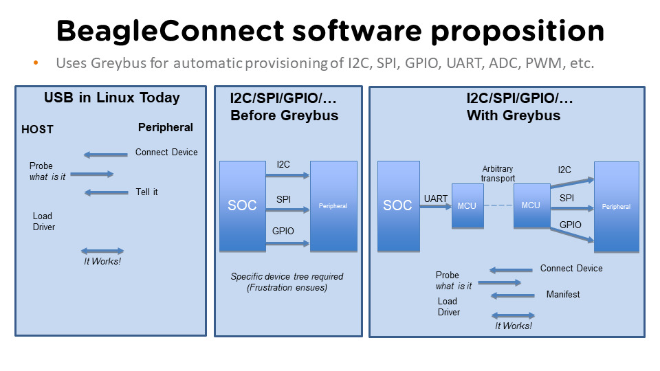
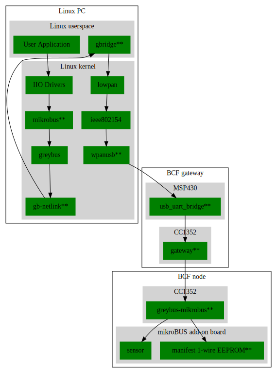

.. _beagleconnect-overview:

BeagleConnect Technology
########################

This is the deep-dive introduction to BeagleConnect™ technology and software
architecture.

.. note:: 
    This documentation and the associated software are each a work-in-progress.

.. image:: ../freedom/media/image1.jpg
   :width: 598
   :align: center
   :height: 400
   :alt: BeagleConnect

BeagleConnect™ Greybus Stack
****************************

Work in progress
================

To understand a bit more about how the BeagleConnect™ Greybus stack is being
built, this section helps describe the development currently in progress and
the principles of operation.

Background
----------

BeagleConnect™ uses Greybus and updated Click Boards with identifiers to 
eliminate the need to add and manually configure devices added onto the Linux 
system.

High-level
----------
* For Linux nerds: Think of BeagleConnect™ as 6LoWPAN over 802.15.4-based 
  Greybus (instead of Unipro as used by Project Ara), where every 
  BeagleConnect™ board shows up as new SPI, I2C, UART, PWM, ADC, and GPIO 
  controllers that can now be probed to load drivers for the sensors or 
  whatever is connected to them. (Proof of concept of Greybus over TCP/IP: 
  https://www.youtube.com/watch?v=7H50pv-4YXw)

* For MCU folks: Think of BeagleConnect™ as a Firmata-style firmware load that 
  exposes the interfaces for remote access over a secured wireless network. 
  However, instead of using host software that knows how to speak the Firmata 
  protocol, the Linux kernel speaks the slightly similar Greybus protocol to 
  the MCU and exposes the device generically to users using a Linux kernel 
  driver. Further, the Greybus protocol is spoken over 6LoWPAN on 802.15.4.

Software architecture
---------------------

TODO items
----------

* Linux kernel driver

* Provisioning

* Firmware for host CC13x

* Firmware for device CC13x

* Click Board drivers and device tree formatted metadata for 100 or so Click 
  Boards

* Click Board plug-ins for node-red for the same 100 or so Click Boards

* BeagleConnect™ Freedom System Reference Manual and FAQs

Associated pre-work
-------------------

* Click Board support for Node-RED can be executed with native connections on 
  PocketBeagle+TechLab and BeagleBone Black with mikroBUS Cape

* Device tree fragments and driver updates can be provided via 
  https://bbb.io/click

* The Kconfig style provisioning can be implemented for those solutions, which 
  will require a reboot. We need to centralize edits to /boot/uEnv.txt to be 
  programmatic. As I think through this, I don't think BeagleConnect is 
  impacted, because the Greybus-style discovery along with Click EEPROMS will 
  eliminate any need to edit /boot/uEnv.txt.

User experience concerns
------------------------

* Make sure no reboots are required

* Plugging BeagleConnect into host should trigger host configuration

* Click EEPROMs should trigger loading whatever drivers are needed and 
  provisioning should load any new drivers

* Userspace (spidev, etc.) drivers should unload cleanly when 2nd phase 
  provisioning is completed

BeagleConnect™ Greybus demo using BeagleConnect™ Freedom
========================================================
BeagleConnect™ Freedom runs a subGHz IEEE 802.15.4 network. This BeagleConnect™
Greybus demo shows how to interact with GPIO, I2C and mikroBUS add-on boards 
remotely connected over a BeagleConnect™ Freedom.

This section starts with the steps required to use 
`Linux <https://en.wikipedia.org/wiki/Linux>`_ embedded computer 
(`BeagleBone Green Gateway <https://wiki.seeedstudio.com/BeagleBone-Green-Gateway/>`_) 
and the `Greybus <https://lwn.net/Articles/715955/>`_ protocol, over an 
IEEE 802.15.4 wireless link, to blink an LED on a 
`Zephyr <https://zephyrproject.org/>`_ device.

Introduction
------------

*Why??*

Good question. Blinking an LED is kind of the 
`Hello, World <https://en.wikipedia.org/wiki/%22Hello,_World!%22_program>`_ of 
the hardware community. In this case, we're less interested in the mechanics 
of switching a GPIO to drive some current through an LED and more interested in
how that happens with the 
`Internet of Things (IoT) <https://en.wikipedia.org/wiki/Internet_of_things>`_.

There are several existing network and application layers that are driven by 
corporate heavyweights and industry consortiums, but relatively few that are 
community driven and, more specifically, even fewer that have the ability to 
integrate so tightly with the Linux kernel.

The goal here is to provide a community-maintained, developer-friendly, and 
open-source protocol for the Internet of Things using the Greybus Protocol, and
blinking an LED using Greybus is the simplest proof-of-concept for that. All 
that is required is a reliable transport.

#. Power a BeagleConnect Freedom that has not yet been programmed via a USB 
   power source, not the BeagleBone Green Gateway. You'll hear a click every 
   1-2 seconds along with seeing 4 of the LEDs turn off and on.

#. In an isolated terminal window, :code:`sudo beagleconnect-start-gateway`

#. :code:`sensortest-rx.py`

Every 1-2 minutes, you should see something like:

.. code-block::

    ('fe80::3111:7a22:4b:1200%lowpan0', 52213, 0, 13)  '2l:7.79;'
    ('fe80::3111:7a22:4b:1200%lowpan0', 52213, 0, 13)  '4h:43.75;4t:23.11;'

The value after "2l:" is the amount of light in lux. The value after "4h:" is 
the relative humidity and after "4t:" is the temperature in Celsius.

Flash BeagleConnect™ Freedom node device with Greybus firmware
--------------------------------------------------------------

#TODO: How can we add a step in here to show the network is connected without needing gbridge to be fully functional?

Do this from the BeagleBone® Green Gateway board that was previously used to 
program the BeagleConnect™ Freedom gateway device:

#. Disconnect the BeagleConnect™ Freedom **gateway** device

#. Connect a new BeagleConnect™ Freedom board via USB

#. :code:`sudo systemctl stop lowpan.service`

#. :code:`cc2538-bsl.py /usr/share/beagleconnect/cc1352/greybus_mikrobus_beagleconnect.bin /dev/ttyACM0`

#. After it finishes programming successfully, disconnect the BeagleConnect Freedom node device

#. Power the newly programmed BeagleConnect Freedom node device from an alternate USB power source

#. Reconnect the BeagleConnect Freedom **gateway** device to the BeagleBone Green Gateway

#. :code:`sudo systemctl start lowpan.service`

#. :code:`sudo beagleconnect-start-gateway`

.. code-block:: bash

    debian@beaglebone:~$ sudo beagleconnect-start-gateway
    [sudo] password for debian:
    setting up wpanusb gateway for IEEE 802154 CHANNEL 1(906 Mhz)
    ping6: Warning: source address might be selected on device other than lowpan0.
    PING 2001:db8::1(2001:db8::1) from ::1 lowpan0: 56 data bytes
    64 bytes from 2001:db8::1: icmp_seq=2 ttl=64 time=185 ms
    64 bytes from 2001:db8::1: icmp_seq=3 ttl=64 time=40.9 ms
    64 bytes from 2001:db8::1: icmp_seq=4 ttl=64 time=40.9 ms
    64 bytes from 2001:db8::1: icmp_seq=5 ttl=64 time=40.6 ms

    --- 2001:db8::1 ping statistics ---
    5 packets transmitted, 4 received, 20% packet loss, time 36ms
    rtt min/avg/max/mdev = 40.593/76.796/184.799/62.356 ms
    debian@beaglebone:~$ iio_info
    Library version: 0.19 (git tag: v0.19)
    Compiled with backends: local xml ip usb serial
    IIO context created with local backend.
    Backend version: 0.19 (git tag: v0.19)
    Backend description string: Linux beaglebone 5.14.18-bone20 #1buster PREEMPT Tue Nov 16 20:47:19 UTC 2021 armv7l
    IIO context has 1 attributes:
        local,kernel: 5.14.18-bone20
    IIO context has 3 devices:
        iio:device0: TI-am335x-adc.0.auto (buffer capable)
            8 channels found:
                voltage0:  (input, index: 0, format: le:u12/16>>0)
                1 channel-specific attributes found:
                    attr  0: raw value: 1412
                voltage1:  (input, index: 1, format: le:u12/16>>0)
                1 channel-specific attributes found:
                    attr  0: raw value: 2318
                voltage2:  (input, index: 2, format: le:u12/16>>0)
                1 channel-specific attributes found:
                    attr  0: raw value: 2631
                voltage3:  (input, index: 3, format: le:u12/16>>0)
                1 channel-specific attributes found:
                    attr  0: raw value: 817
                voltage4:  (input, index: 4, format: le:u12/16>>0)
                1 channel-specific attributes found:
                    attr  0: raw value: 881
                voltage5:  (input, index: 5, format: le:u12/16>>0)
                1 channel-specific attributes found:
                    attr  0: raw value: 0
                voltage6:  (input, index: 6, format: le:u12/16>>0)
                1 channel-specific attributes found:
                    attr  0: raw value: 0
                voltage7:  (input, index: 7, format: le:u12/16>>0)
                1 channel-specific attributes found:
                    attr  0: raw value: 1180
            2 buffer-specific attributes found:
                    attr  0: data_available value: 0
                    attr  1: watermark value: 1
        iio:device1: hdc2010
            3 channels found:
                humidityrelative:  (input)
                3 channel-specific attributes found:
                    attr  0: peak_raw value: 52224
                    attr  1: raw value: 52234
                    attr  2: scale value: 1.525878906
                current:  (output)
                2 channel-specific attributes found:
                    attr  0: heater_raw value: 0
                    attr  1: heater_raw_available value: 0 1
                temp:  (input)
                4 channel-specific attributes found:
                    attr  0: offset value: -15887.515151
                    attr  1: peak_raw value: 25600
                    attr  2: raw value: 25628
                    attr  3: scale value: 2.517700195
        iio:device2: opt3001
            1 channels found:
                illuminance:  (input)
                2 channel-specific attributes found:
                    attr  0: input value: 79.040000
                    attr  1: integration_time value: 0.800000
            2 device-specific attributes found:
                    attr  0: current_timestamp_clock value: realtime

                    attr  1: integration_time_available value: 0.1 0.8
    debian@beaglebone:~$ dmesg | grep -e mikrobus -e greybus
    [  100.491253] greybus 1-2.2: Interface added (greybus)
    [  100.491294] greybus 1-2.2: GMP VID=0x00000126, PID=0x00000126
    [  100.491306] greybus 1-2.2: DDBL1 Manufacturer=0x00000126, Product=0x00000126
    [  100.737637] greybus 1-2.2: excess descriptors in interface manifest
    [  102.475168] mikrobus:mikrobus_port_gb_register: mikrobus gb_probe , num cports= 2, manifest_size 192
    [  102.475206] mikrobus:mikrobus_port_gb_register: protocol added 3
    [  102.475214] mikrobus:mikrobus_port_gb_register: protocol added 2
    [  102.475239] mikrobus:mikrobus_port_register: registering port mikrobus-1
    [  102.475400] mikrobus_manifest:mikrobus_state_get: mikrobus descriptor not found
    [  102.475417] mikrobus_manifest:mikrobus_manifest_attach_device: parsed device 1, driver=opt3001, protocol=3, reg=44
    [  102.494516] mikrobus_manifest:mikrobus_manifest_attach_device: parsed device 2, driver=hdc2010, protocol=3, reg=41
    [  102.494567] mikrobus_manifest:mikrobus_manifest_parse:  (null) manifest parsed with 2 devices
    [  102.494592] mikrobus mikrobus-1: registering device : opt3001
    [  102.495096] mikrobus mikrobus-1: registering device : hdc2010
    debian@beaglebone:~$

#TODO: update the below for the built-in sensors

#TODO: can we also handle the case where these sensors are included and recommend them? Same firmware?

#TODO: the current demo is for the built-in sensors, not the Click boards mentioned below

Currently only a limited number of add-on boards have been tested to work over Greybus, simple add-on boards without interrupt requirement are the ones that work currently. The example is for Air Quality 2 Click and Weather Click attached to the mikroBUS ports on the device side.

/var/log/gbridge will have the gbridge log, and if the mikroBUS port has been instantiated successfully the kernel log will show the devices probe messages:

#TODO: this log needs to be updated

.. code-block::

    greybus 1-2.2: GMP VID=0x00000126, PID=0x00000126
    greybus 1-2.2: DDBL1 Manufacturer=0x00000126, Product=0x00000126
    greybus 1-2.2: excess descriptors in interface manifest
    mikrobus:mikrobus_port_gb_register: mikrobus gb_probe , num cports= 3, manifest_size 252
    mikrobus:mikrobus_port_gb_register: protocol added 11
    mikrobus:mikrobus_port_gb_register: protocol added 3
    mikrobus:mikrobus_port_gb_register: protocol added 2
    mikrobus:mikrobus_port_register: registering port mikrobus-0
    mikrobus_manifest:mikrobus_manifest_attach_device: parsed device 1, driver=bme280, protocol=3, reg=76
    mikrobus_manifest:mikrobus_manifest_attach_device: parsed device 2, driver=ams-iaq-core, protocol=3, reg=5a
    mikrobus_manifest:mikrobus_manifest_parse:  Greybus Service Sample Application manifest parsed with 2 devices
    mikrobus mikrobus-0: registering device : bme280
    mikrobus mikrobus-0: registering device : ams-iaq-core

#TODO: bring in the GPIO toggle and I2C explorations for greater understanding

Flashing via a Linux Host
-------------------------

If flashing the Freedom board via the BeagleBone fails here's a trick you can try to flash from a Linux host.

Use :code:`sshfs` to mount the Bone's files on the Linux host. This assumes the
Bone is plugged in the the USB and appears at :code:`192.168.7.2`:

.. code-block:: bash

    host$ cd
    host$ sshfs 192.168.7.2:/ bone
    host$ cd bone; ls
    bin   dev  home    lib         media  opt   root  sbin  sys  usr
    boot  etc  ID.txt  lost+found  mnt    proc  run   srv   tmp  var
    host$ ls /dev/ttyACM*
    /dev/ttyACM1

The Bone's files now appear as local files. Notice there is already a 
:code:`/dev/ACM*` appearing. Now plug the Connect into the Linux host's USB 
port and run the command again.

.. code-block:: bash

    host$ ls /dev/ttyACM*
    /dev/ttyACM0  /dev/ttyACM1

The :code:`/dev/ttyACM` that just appeared is the one associated with the 
Connect. In my case it's :code:`/dev/ttyACM0`. That's what I'll use in this 
example.

Now change directories to where the binaries are and load:

.. code-block:: bash

    host$ cd ~/bone/usr/share/beagleconnect/cc1352;ls
    greybus_mikrobus_beagleconnect.bin     sensortest_beagleconnect.dts
    greybus_mikrobus_beagleconnect.config  wpanusb_beagleconnect.bin
    greybus_mikrobus_beagleconnect.dts     wpanusb_beagleconnect.config
    sensortest_beagleconnect.bin           wpanusb_beagleconnect.dts
    sensortest_beagleconnect.config

    host$ ~/bone/usr/bin/cc2538-bsl.py sensortest_beagleconnect.bin /dev/ttyACM0
    8-bsl.py sensortest_beagleconnect.bin /dev/ttyACM0
    Opening port /dev/ttyACM0, baud 50000
    Reading data from sensortest_beagleconnect.bin
    Cannot auto-detect firmware filetype: Assuming .bin
    Connecting to target...
    CC1350 PG2.0 (7x7mm): 352KB Flash, 20KB SRAM, CCFG.BL_CONFIG at 0x00057FD8
    Primary IEEE Address: 00:12:4B:00:22:7A:10:46
        Performing mass erase
    Erasing all main bank flash sectors
        Erase done
    Writing 360448 bytes starting at address 0x00000000
    Write 104 bytes at 0x00057F988
        Write done
    Verifying by comparing CRC32 calculations.
        Verified (match: 0x0f6bdf0f)

Now you are ready to continue the instructions above after the cc2528 command.

Trying for different add-on boards
^^^^^^^^^^^^^^^^^^^^^^^^^^^^^^^^^^

See `mikroBUS over Greybus <https://github.com/vaishnav98/greybus-for-zephyr/tree/mikrobus#trying-out-different-add-on-boardsdevices-over-mikrobus>`_ 
for trying out the same example for different mikroBUS add-on boards/ on-board devices.

Observe the node device
-----------------------

Connect BeagleConnect Freedom node device to an Ubuntu laptop to observe the 
Zephyr console.

Console (:code:`tio`)
---------------------
In order to see diagnostic messages or to run certain commands on the Zephyr 
device we will require a terminal open to the device console. In this case, we
use `tio <https://tio.github.io/>`_ due how its usage simplifies the 
instructions.

#. Install :code:`tio`
   :code:`sudo apt install -y tio`

#. Run :code:`tio`
   :code:`tio /dev/ttyACM0`

 To exit :code:`tio` (later), enter :code:`ctrl+t, q`. 

The Zephyr Shell
----------------

After flashing, you should observe the something matching the following output in :code:`tio`.

.. code-block:: bash

    uart:~$ *** Booting Zephyr OS build 9c858c863223  ***
    [00:00:00.009,735] <inf> greybus_transport_tcpip: CPort 0 mapped to TCP/IP port 4242
    [00:00:00.010,131] <inf> greybus_transport_tcpip: CPort 1 mapped to TCP/IP port 4243
    [00:00:00.010,528] <inf> greybus_transport_tcpip: CPort 2 mapped to TCP/IP port 4244
    [00:00:00.010,742] <inf> greybus_transport_tcpip: Greybus TCP/IP Transport initialized
    [00:00:00.010,864] <inf> greybus_manifest: Registering CONTROL greybus driver.
    [00:00:00.011,230] <inf> greybus_manifest: Registering GPIO greybus driver.
    [00:00:00.011,596] <inf> greybus_manifest: Registering I2C greybus driver.
    [00:00:00.011,871] <inf> greybus_service: Greybus is active
    [00:00:00.026,092] <inf> net_config: Initializing network
    [00:00:00.134,063] <inf> net_config: IPv6 address: 2001:db8::1

The line beginning with :code:`***` is the Zephyr boot banner.

Lines beginning with a timestamp of the form :code:`[H:m:s.us]` are Zephyr 
kernel messages.

Lines beginning with :code:`uart:~$` indicates that the Zephyr shell is 
prompting you to enter a command.

From the informational messages shown, we observe the following.

* Zephyr is configured with the following 
  `link-local IPv6 address <https://en.wikipedia.org/wiki/Link-local_address#IPv6>`_ :code:`fe80::3177:a11c:4b:1200`

* It is listening for (both) TCP and UDP traffic on port 4242

However, what the log messages do not show (which will come into play later), 
are 2 critical pieces of information:

#. **The RF Channel**: As you may have guessed, IEEE 802.15.4 devices are only 
   able to communicate with each other if they are using the same frequency to 
   transmit and recieve data. This information is part of the Physical Layer.

#. The `PAN identifier <https://www.silabs.com/community/wireless/proprietary/knowledge-base.entry.html/2019/10/04/connect_tutorial6-ieee802154addressing-rapc>`_: 
   IEEE 802.15.4 devices are only be able to communicate with one another if 
   they use the same PAN ID. This permits multiple networks (PANs) on the same 
   frequency. This information is part of the Data Link Layer.

If we type :code:`help` in the shell and hit Enter, we're prompted with the 
following:

.. code-block::

    Please press the <Tab> button to see all available commands.
    You can also use the <Tab> button to prompt or auto-complete all commands or its subcommands.
    You can try to call commands with <-h> or <--help> parameter for more information.
    Shell supports following meta-keys:

    Ctrl+a, Ctrl+b, Ctrl+c, Ctrl+d, Ctrl+e, Ctrl+f, Ctrl+k, Ctrl+l, Ctrl+n, Ctrl+p, Ctrl+u, Ctrl+w
    Alt+b, Alt+f.
    Please refer to shell documentation for more details.

So after hitting Tab, we see that there are several interesting commands we can
use for additional information.

.. code-block::

    uart:~$
    clear       help        history     ieee802154  log         net
    resize      sample      shell

Zephyr Shell: IEEE 802.15.4 commands
^^^^^^^^^^^^^^^^^^^^^^^^^^^^^^^^^^^^

Entering :code:`ieee802154 help`, we see

.. code-block::

    uart:~$ ieee802154 help
    ieee802154 - IEEE 802.15.4 commands
    Subcommands:
    ack             :<set/1 | unset/0> Set auto-ack flag
    associate       :<pan_id> <PAN coordinator short or long address (EUI-64)>
    disassociate    :Disassociate from network
    get_chan        :Get currently used channel
    get_ext_addr    :Get currently used extended address
    get_pan_id      :Get currently used PAN id
    get_short_addr  :Get currently used short address
    get_tx_power    :Get currently used TX power
    scan            :<passive|active> <channels set n[:m:...]:x|all> <per-channel
                    duration in ms>
    set_chan        :<channel> Set used channel
    set_ext_addr    :<long/extended address (EUI-64)> Set extended address
    set_pan_id      :<pan_id> Set used PAN id
    set_short_addr  :<short address> Set short address
    set_tx_power    :<-18/-7/-4/-2/0/1/2/3/5> Set TX power

We get the missing Channel number (frequency) with the command :code:`ieee802154 get_chan`.

.. code-block::

    uart:~$ ieee802154 get_chan
    Channel 26

We get the missing PAN ID with the command :code:`ieee802154 get_pan_id`.

.. code-block::

    uart:~$ ieee802154 get_pan_id
    PAN ID 43981 (0xabcd)

Zephyr Shell: Network Commands
^^^^^^^^^^^^^^^^^^^^^^^^^^^^^^

Additionally, we may query the IPv6 information of the Zephyr device.

.. code-block::

    uart:~$ net iface

    Interface 0x20002b20 (IEEE 802.15.4) [1]
    ========================================
    Link addr : CD:99:A1:1C:00:4B:12:00
    MTU       : 125
    IPv6 unicast addresses (max 3):
            fe80::cf99:a11c:4b:1200 autoconf preferred infinite
            2001:db8::1 manual preferred infinite
    IPv6 multicast addresses (max 4):
            ff02::1
            ff02::1:ff4b:1200
            ff02::1:ff00:1
    IPv6 prefixes (max 2):
            <none>
    IPv6 hop limit           : 64
    IPv6 base reachable time : 30000
    IPv6 reachable time      : 16929
    IPv6 retransmit timer    : 0

And we see that the static IPv6 address (:code:`2001:db8::1`) from 
:code:`samples/net/sockets/echo_server/prj.conf` is present and configured. 
While the statically configured IPv6 address is useful, it isn't 100% necessary.

Rebuilding from source
----------------------

#TODO: revisit everything below here

Prerequisites
^^^^^^^^^^^^^

* Zephyr environment is set up according to the 
  `Getting Started Guide <https://docs.zephyrproject.org/latest/getting_started/index.html>`_

    * Please use the Zephyr SDK when installing a toolchain above

* `Zephyr SDK <https://docs.zephyrproject.org/latest/getting_started/index.html#install-a-toolchain>`_ 
  is installed at ~/zephyr-sdk-0.11.2 (any later version should be fine as well)

* Zephyr board is connected via USB

Cloning the repository
^^^^^^^^^^^^^^^^^^^^^^

This repository utilizes `git submodules <https://git-scm.com/book/en/v2/Git-Tools-Submodules>`_ 
to keep track of all of the projects required to reproduce the on-going work. 
The instructions here only cover checking out the :code:`demo` branch which 
should stay in a tested state. On-going development will be on the 
:code:`master` branch.

Note: The parent directory :code:`~` is simply used as a placeholder for testing. 
Please use whatever parent directory you see fit. 

Clone specific tag
^^^^^^^^^^^^^^^^^^

.. code-block:: bash

    cd ~
    git clone --recurse-submodules --branch demo https://github.com/jadonk/beagleconnect

Zephyr
------

Add the Fork
^^^^^^^^^^^^

For the time being, Greybus must remain outside of the main Zephyr repository. 
Currently, it is just in a Zephyr fork, but it should be converted to a 
proper `Module (External Project) <https://docs.zephyrproject.org/latest/guides/modules.html>`_. 
This is for a number of reasons, but mainly there must be:

* specifications for authentication and encryption

* specifications for joining and rejoining wireless networks

* specifications for discovery

Therefore, in order to reproduce this example, please run the following.

.. code-block:: bash

    cd ~/beagleconnect/sw/zephyrproject/zephyr
    west update

Build and Flash Zephyr
^^^^^^^^^^^^^^^^^^^^^^

Here, we will build and flash the Zephyr 
`greybus_net sample <https://github.com/cfriedt/zephyr/tree/greybus-sockets/samples/subsys/greybus/net>`_ 
to our device.

#. Edit the file :code:`~/.zephyrrc` and place the following text inside of it

.. code-block:: bash

    export ZEPHYR_TOOLCHAIN_VARIANT=zephyr
    export ZEPHYR_SDK_INSTALL_DIR=~/zephyr-sdk-0.11.2

#. Set up the required Zephyr environment variables via

.. code-block:: bash

    source zephyr-env.sh

#. Build the project

.. code-block:: bash

    BOARD=cc1352r1_launchxl west build samples/subsys/greybus/net --pristine \
    --build-dir build/greybus_launchpad -- -DCONF_FILE="prj.conf overlay-802154.conf"

#. Ensure that the last part of the build process looks somewhat like this:

.. code-block:: bash

    ...
    [221/226] Linking C executable zephyr/zephyr_prebuilt.elf
    Memory region         Used Size  Region Size  %age Used
            FLASH:      155760 B     360360 B     43.22%
        FLASH_CCFG:          88 B         88 B    100.00%
                SRAM:       58496 B        80 KB     71.41%
            IDT_LIST:         184 B         2 KB      8.98%
    [226/226] Linking C executable zephyr/zephyr.elf

#. Flash the firmware to your device using

.. code-block:: bash

    BOARD=cc1352r1_launchxl west flash --build-dir build/greybus_launchpad

Linux
-----

Warning: If you aren't comfortable building and installing a Linux kernel on 
your computer, you should probably just stop here. I'll assume you know the 
basics of building and installing a Linux kernel from here on out. 

Clone, patch, and build the kernel
^^^^^^^^^^^^^^^^^^^^^^^^^^^^^^^^^^

For this demo, I used the 5.8.4 stable kernel. Also, I've applied the 
:code:`mikrobus` kernel driver, though it isn't strictly required for greybus.

Note: The parent directory :code:`~` is simply used as a placeholder for testing. 
Please use whatever parent directory you see fit. 

TODO: The patches for gb-netlink will eventually be applied here until pushed into mainline.

.. code-block:: bash

    cd ~
    git clone --branch v5.8.4 --single-branch git://git.kernel.org/pub/scm/linux/kernel/git/stable/linux.git
    cd linux
    git checkout -b v5.8.4-greybus
    git am ~/beagleconnect/sw/linux/v2-0001-RFC-mikroBUS-driver-for-add-on-boards.patch
    git am ~/beagleconnect/sw/linux/0001-mikroBUS-build-fixes.patch
    cp /boot/config-`uname -r` .config
    yes "" | make oldconfig
    ./scripts/kconfig/merge_config.sh .config ~/beagleconnect/sw/linux/mikrobus.config
    ./scripts/kconfig/merge_config.sh .config ~/beagleconnect/sw/linux/atusb.config
    make -j`nproc --all`
    sudo make modules_install
    sudo make install

Reboot and select your new kernel.

Probe the IEEE 802.15.4 Device Driver
^^^^^^^^^^^^^^^^^^^^^^^^^^^^^^^^^^^^^

On the Linux machine, make sure the :code:`atusb` driver is loaded. This should
happen automatically when the adapter is inserted or when the machine is booted
while the adapter is installed.

.. code-block:: bash

    $ dmesg | grep -i ATUSB
    [    6.512154] usb 1-1: ATUSB: AT86RF231 version 2
    [    6.512492] usb 1-1: Firmware: major: 0, minor: 3, hardware type: ATUSB (2)
    [    6.525357] usbcore: registered new interface driver atusb
    ...

We should now be able to see the IEEE 802.15.4 network device by entering :code:`ip a show wpan0`.

.. code-block:: bash

    $ ip a show wpan0
    36: wpan0: <BROADCAST,NOARP,UP,LOWER_UP> mtu 123 qdisc fq_codel state UNKNOWN group default qlen 300
        link/ieee802.15.4 3e:7d:90:4d:8f:00:76:a2 brd ff:ff:ff:ff:ff:ff:ff:ff

But wait, that is not an IP address! It's the hardware address of the 802.15.4 
device. So, in order to associate it with an IP address, we need to run a 
couple of other commands (thanks to wpan.cakelab.org).

Set the 802.15.4 Physical and Link-Layer Parameters
^^^^^^^^^^^^^^^^^^^^^^^^^^^^^^^^^^^^^^^^^^^^^^^^^^^

#. First, get the phy number for the :code:`wpan0` device

.. code-block:: bash

    $ iwpan list
        wpan_phy phy0
        supported channels:
            page 0: 11,12,13,14,15,16,17,18,19,20,21,22,23,24,25,26
        current_page: 0
        current_channel: 26,  2480 MHz
        cca_mode: (1) Energy above threshold
        cca_ed_level: -77
        tx_power: 3
        capabilities:
            iftypes: node,monitor
            channels:
                page 0:
                    [11]  2405 MHz, [12]  2410 MHz, [13]  2415 MHz,
                    [14]  2420 MHz, [15]  2425 MHz, [16]  2430 MHz,
                    [17]  2435 MHz, [18]  2440 MHz, [19]  2445 MHz,
                    [20]  2450 MHz, [21]  2455 MHz, [22]  2460 MHz,
                    [23]  2465 MHz, [24]  2470 MHz, [25]  2475 MHz,
                    [26]  2480 MHz
            tx_powers:
                    3 dBm, 2.8 dBm, 2.3 dBm, 1.8 dBm, 1.3 dBm, 0.7 dBm,
                    0 dBm, -1 dBm, -2 dBm, -3 dBm, -4 dBm, -5 dBm,
                    -7 dBm, -9 dBm, -12 dBm, -17 dBm,
            cca_ed_levels:
                    -91 dBm, -89 dBm, -87 dBm, -85 dBm, -83 dBm, -81 dBm,
                    -79 dBm, -77 dBm, -75 dBm, -73 dBm, -71 dBm, -69 dBm,
                    -67 dBm, -65 dBm, -63 dBm, -61 dBm,
            cca_modes:
                (1) Energy above threshold
                (2) Carrier sense only
                (3, cca_opt: 0) Carrier sense with energy above threshold (logical operator is 'and')
                (3, cca_opt: 1) Carrier sense with energy above threshold (logical operator is 'or')
            min_be: 0,1,2,3,4,5,6,7,8
            max_be: 3,4,5,6,7,8
            csma_backoffs: 0,1,2,3,4,5
            frame_retries: 3
            lbt: false

#. Next, set the Channel for the 802.15.4 device on the Linux machine

.. code-block:: bash

    sudo iwpan phy phy0 set channel 0 26

#. Then, set the PAN identifier for the 802.15.4 device on the Linux machine :code:`sudo iwpan dev wpan0 set pan_id 0xabcd`

#. Associate the :code:`wpan0` device to a new, 6lowpan network interface

.. code-block:: bash

    sudo ip link add link wpan0 name lowpan0 type lowpan

#. Finally, set the links up for both :code:`wpan0` and :code:`lowpan0`

.. code-block:: bash

    sudo ip link set wpan0 up
    sudo ip link set lowpan0 up

We should observe something like the following when we run :code:`ip a show lowpan0`.

.. code-block:: bash

    ip a show lowpan0
    37: lowpan0@wpan0: <BROADCAST,MULTICAST,UP,LOWER_UP> mtu 1280 qdisc noqueue state UNKNOWN group default qlen 1000
        link/6lowpan 9e:0b:a4:e8:00:d3:45:53 brd ff:ff:ff:ff:ff:ff:ff:ff
        inet6 fe80::9c0b:a4e8:d3:4553/64 scope link
        valid_lft forever preferred_lft forever

Ping Pong
---------

Broadcast Ping
^^^^^^^^^^^^^^

Now, perform a broadcast ping to see what else is listening on :code:`lowpan0`.

.. code-block::

    $ ping6 -I lowpan0 ff02::1
    PING ff02::1(ff02::1) from fe80::9c0b:a4e8:d3:4553%lowpan0 lowpan0: 56 data bytes
    64 bytes from fe80::9c0b:a4e8:d3:4553%lowpan0: icmp_seq=1 ttl=64 time=0.099 ms
    64 bytes from fe80::9c0b:a4e8:d3:4553%lowpan0: icmp_seq=2 ttl=64 time=0.125 ms
    64 bytes from fe80::cf99:a11c:4b:1200%lowpan0: icmp_seq=2 ttl=64 time=17.3 ms (DUP!)
    64 bytes from fe80::9c0b:a4e8:d3:4553%lowpan0: icmp_seq=3 ttl=64 time=0.126 ms
    64 bytes from fe80::cf99:a11c:4b:1200%lowpan0: icmp_seq=3 ttl=64 time=9.60 ms (DUP!)
    64 bytes from fe80::9c0b:a4e8:d3:4553%lowpan0: icmp_seq=4 ttl=64 time=0.131 ms
    64 bytes from fe80::cf99:a11c:4b:1200%lowpan0: icmp_seq=4 ttl=64 time=14.9 ms (DUP!)

Yay! We have pinged (pung?) the Zephyr device over IEEE 802.15.4 using 6LowPAN!

Ping Zephyr
^^^^^^^^^^^

We can ping the Zephyr device directly without a broadcast ping too, of course.

.. code-block::

    $ ping6 -I lowpan0 fe80::cf99:a11c:4b:1200
    PING fe80::cf99:a11c:4b:1200(fe80::cf99:a11c:4b:1200) from fe80::9c0b:a4e8:d3:4553%lowpan0 lowpan0: 56 data bytes
    64 bytes from fe80::cf99:a11c:4b:1200%lowpan0: icmp_seq=1 ttl=64 time=16.0 ms
    64 bytes from fe80::cf99:a11c:4b:1200%lowpan0: icmp_seq=2 ttl=64 time=13.8 ms
    64 bytes from fe80::cf99:a11c:4b:1200%lowpan0: icmp_seq=3 ttl=64 time=9.77 ms
    64 bytes from fe80::cf99:a11c:4b:1200%lowpan0: icmp_seq=5 ttl=64 time=11.5 ms

Ping Linux
^^^^^^^^^^

Similarly, we can ping the Linux host from the Zephyr shell.

.. code-block::

    uart:~$ net ping --help
    ping - Ping a network host.
    Subcommands:
    --help  :'net ping [-c count] [-i interval ms] <host>' Send ICMPv4 or ICMPv6
            Echo-Request to a network host.
    $ net ping -c 5 fe80::9c0b:a4e8:d3:4553
    PING fe80::9c0b:a4e8:d3:4553
    8 bytes from fe80::9c0b:a4e8:d3:4553 to fe80::cf99:a11c:4b:1200: icmp_seq=0 ttl=64 rssi=110 time=11 ms
    8 bytes from fe80::9c0b:a4e8:d3:4553 to fe80::cf99:a11c:4b:1200: icmp_seq=1 ttl=64 rssi=126 time=9 ms
    8 bytes from fe80::9c0b:a4e8:d3:4553 to fe80::cf99:a11c:4b:1200: icmp_seq=2 ttl=64 rssi=128 time=13 ms
    8 bytes from fe80::9c0b:a4e8:d3:4553 to fe80::cf99:a11c:4b:1200: icmp_seq=3 ttl=64 rssi=126 time=10 ms
    8 bytes from fe80::9c0b:a4e8:d3:4553 to fe80::cf99:a11c:4b:1200: icmp_seq=4 ttl=64 rssi=126 time=7 ms

Assign a Static Address
^^^^^^^^^^^^^^^^^^^^^^^

So far, we have been using IPv6 Link-Local addressing. However, the Zephyr 
application is configured to use a statically configured IPv6 address as well 
which is, namely :code:`2001:db8::1`.

If we add a similar static IPv6 address to our Linux IEEE 802.15.4 network 
interface, :code:`lowpan0`, then we should expect to be able to reach that as 
well.

In Linux, run the following

.. code-block:: bash

    sudo ip -6 addr add 2001:db8::2/64 dev lowpan0

We can verify that the address has been set by examining the :code:`lowpan0` 
network interface again.

.. code-block:: bash

    $ ip a show lowpan0
    37: lowpan0@wpan0: <BROADCAST,MULTICAST,UP,LOWER_UP> mtu 1280 qdisc noqueue state UNKNOWN group default qlen 1000
        link/6lowpan 9e:0b:a4:e8:00:d3:45:53 brd ff:ff:ff:ff:ff:ff:ff:ff
        inet6 2001:db8::2/64 scope global
        valid_lft forever preferred_lft forever
        inet6 fe80::9c0b:a4e8:d3:4553/64 scope link
        valid_lft forever preferred_lft forever

Lastly, ping the statically configured IPv6 address of the Zephyr device.

.. code-block::

    $ ping6 2001:db8::1
    PING 2001:db8::1(2001:db8::1) 56 data bytes
    64 bytes from 2001:db8::1: icmp_seq=2 ttl=64 time=53.7 ms
    64 bytes from 2001:db8::1: icmp_seq=3 ttl=64 time=13.1 ms
    64 bytes from 2001:db8::1: icmp_seq=4 ttl=64 time=22.0 ms
    64 bytes from 2001:db8::1: icmp_seq=5 ttl=64 time=22.7 ms
    64 bytes from 2001:db8::1: icmp_seq=6 ttl=64 time=18.4 ms

Now that we have set up a reliable transport, let's move on to the application 
layer.

Greybus
-------

Hopefully the videos listed earlier provide a sufficient foundation to 
understand what will happen shortly. However, there is still a bit more 
preparation required.

Build and probe Greybus Kernel Modules
^^^^^^^^^^^^^^^^^^^^^^^^^^^^^^^^^^^^^^

Greybus was originally intended to work exclusively on the UniPro physical 
layer. However, we're using RF as our physical layer and TCP/IP as our 
transport. As such, there was need to be able to communicate with the Linux 
Greybus facilities through userspace, and out of that need arose gb-netlink. 
The Netlink Greybus module actually does not care about the physical layer, but
is happy to usher Greybus messages back and forth between the kernel and 
userspace.

Build and probe the gb-netlink modules (as well as the other Greybus modules) 
with the following:

.. code-block:: bash

    cd ${WORKSPACE}/sw/greybus
    make -j`nproc --all`
    sudo make install
    ../load_gb_modules.sh

Build and Run Gbridge
^^^^^^^^^^^^^^^^^^^^^

The gbridge utility was created as a proof of concept to abstract the Greybus 
Netlink datapath among several reliable transports. For the purposes of this 
tutorial, we'll be using it as a TCP/IP bridge.

To run :code:`gbridge`, perform the following:

.. code-block:: bash

    sudo apt install -y libnl-3-dev libnl-genl-3-dev libbluetooth-dev libavahi-client-dev
    cd gbridge
    autoreconf -vfi
    GBNETLINKDIR=${PWD}/../greybus \
    ./configure --enable-uart --enable-tcpip --disable-gbsim --enable-netlink --disable-bluetooth
    make -j`nproc --all`
    sudo make install
    gbridge

Blinky!
-------

Now that we have set up a reliable TCP transport, and set up the Greybus 
modules in the Linux kernel, and used Gbridge to connect a Greybus node to the 
Linux kernel via TCP/IP, we can now get to the heart of the demonstration!

First, save the following script as :code:`blinky.sh`.

.. code-block:: bash

    #!/bin/bash
    
    # Blinky Demo for CC1352R SensorTag
    
    # /dev/gpiochipN that Greybus created
    CHIP="$(gpiodetect | grep greybus_gpio | head -n 1 | awk '{print $1}')"
    
    # red, green, blue LED pins
    RED=6
    GREEN=7
    BLUE=21
    
    # Bash array for pins and values
    PINS=($RED $GREEN $BLUE)
    NPINS=${#PINS[@]}
    
    for ((;;)); do
        for i in ${!PINS[@]}; do
            # turn off previous pin
            if [ $i -eq 0 ]; then
                PREV=2
            else
                PREV=$((i-1))
            fi
            gpioset $CHIP ${PINS[$PREV]}=0
    
            # turn on current pin
            gpioset $CHIP ${PINS[$i]}=1
    
            # wait a sec
            sleep 1
        done
    done

Second, run the script with root privileges: :code:`sudo bash blinky.sh`

The output of your minicom session should resemble the following.

.. code-block::

    $ *** Booting Zephyr OS build zephyr-v2.3.0-1435-g40c0ed940d71  ***
    [00:00:00.011,932] <inf> net_config: Initializing network
    [00:00:00.111,938] <inf> net_config: IPv6 address: fe80::6c42:bc1c:4b:1200
    [00:00:00.112,121] <dbg> greybus_service.greybus_service_init: Greybus initializing..
    [00:00:00.112,426] <dbg> greybus_transport_tcpip.gb_transport_backend_init: Greybus TCP/IP Transport initializing..
    [00:00:00.112,579] <dbg> greybus_transport_tcpip.netsetup: created server socket 0 for cport 0
    [00:00:00.112,579] <dbg> greybus_transport_tcpip.netsetup: setting socket options for socket 0
    [00:00:00.112,609] <dbg> greybus_transport_tcpip.netsetup: binding socket 0 (cport 0) to port 4242
    [00:00:00.112,640] <dbg> greybus_transport_tcpip.netsetup: listening on socket 0 (cport 0)
    [00:00:00.112,823] <dbg> greybus_transport_tcpip.netsetup: created server socket 1 for cport 1
    [00:00:00.112,823] <dbg> greybus_transport_tcpip.netsetup: setting socket options for socket 1
    [00:00:00.112,854] <dbg> greybus_transport_tcpip.netsetup: binding socket 1 (cport 1) to port 4243
    [00:00:00.112,854] <dbg> greybus_transport_tcpip.netsetup: listening on socket 1 (cport 1)
    [00:00:00.113,037] <inf> net_config: IPv6 address: fe80::6c42:bc1c:4b:1200
    [00:00:00.113,250] <dbg> greybus_transport_tcpip.netsetup: created server socket 2 for cport 2
    [00:00:00.113,250] <dbg> greybus_transport_tcpip.netsetup: setting socket options for socket 2
    [00:00:00.113,281] <dbg> greybus_transport_tcpip.netsetup: binding socket 2 (cport 2) to port 4244
    [00:00:00.113,311] <dbg> greybus_transport_tcpip.netsetup: listening on socket 2 (cport 2)
    [00:00:00.113,494] <dbg> greybus_transport_tcpip.netsetup: created server socket 3 for cport 3
    [00:00:00.113,494] <dbg> greybus_transport_tcpip.netsetup: setting socket options for socket 3
    [00:00:00.113,525] <dbg> greybus_transport_tcpip.netsetup: binding socket 3 (cport 3) to port 4245
    [00:00:00.113,555] <dbg> greybus_transport_tcpip.netsetup: listening on socket 3 (cport 3)
    [00:00:00.113,861] <inf> greybus_transport_tcpip: Greybus TCP/IP Transport initialized
    [00:00:00.116,149] <inf> greybus_service: Greybus is active
    [00:00:00.116,546] <dbg> greybus_transport_tcpip.accept_loop: calling poll
    [00:45:08.397,399] <dbg> greybus_transport_tcpip.accept_loop: poll returned 1
    [00:45:08.397,399] <dbg> greybus_transport_tcpip.accept_loop: socket 0 (cport 0) has traffic
    [00:45:08.397,491] <dbg> greybus_transport_tcpip.accept_loop: accepted connection from [2001:db8::2]:39638 as fd 4
    [00:45:08.397,491] <dbg> greybus_transport_tcpip.accept_loop: spawning client thread..
    [00:45:08.397,735] <dbg> greybus_transport_tcpip.accept_loop: calling poll
    [00:45:08.491,363] <dbg> greybus_transport_tcpip.accept_loop: poll returned 1
    [00:45:08.491,363] <dbg> greybus_transport_tcpip.accept_loop: socket 3 (cport 3) has traffic
    [00:45:08.491,455] <dbg> greybus_transport_tcpip.accept_loop: accepted connection from [2001:db8::2]:39890 as fd 5
    [00:45:08.491,455] <dbg> greybus_transport_tcpip.accept_loop: spawning client thread..
    [00:45:08.491,699] <dbg> greybus_transport_tcpip.accept_loop: calling poll
    [00:45:08.620,056] <dbg> greybus_transport_tcpip.accept_loop: poll returned 1
    [00:45:08.620,086] <dbg> greybus_transport_tcpip.accept_loop: socket 2 (cport 2) has traffic
    [00:45:08.620,147] <dbg> greybus_transport_tcpip.accept_loop: accepted connection from [2001:db8::2]:42422 as fd 6
    [00:45:08.620,147] <dbg> greybus_transport_tcpip.accept_loop: spawning client thread..
    [00:45:08.620,422] <dbg> greybus_transport_tcpip.accept_loop: calling poll
    [00:45:08.679,504] <dbg> greybus_transport_tcpip.accept_loop: poll returned 1
    [00:45:08.679,534] <dbg> greybus_transport_tcpip.accept_loop: socket 1 (cport 1) has traffic
    [00:45:08.679,595] <dbg> greybus_transport_tcpip.accept_loop: accepted connection from [2001:db8::2]:48286 as fd 7
    [00:45:08.679,595] <dbg> greybus_transport_tcpip.accept_loop: spawning client thread..
    [00:45:08.679,870] <dbg> greybus_transport_tcpip.accept_loop: calling poll
    ...

Read I2C Registers
^^^^^^^^^^^^^^^^^^

The SensorTag comes with an opt3001 ambient light sensor as well as an hdc2080 
temperature & humidity sensor.

First, find which i2c device corresponds to the SensorTag:

.. code-block:: bash

    ls -la /sys/bus/i2c/devices/* | grep "greybus"
    lrwxrwxrwx 1 root root 0 Aug 15 11:24 /sys/bus/i2c/devices/i2c-8 -> ../../../devices/virtual/gb_nl/gn_nl/greybus1/1-2/1-2.2/1-2.2.2/gbphy2/i2c-8

On my machine, the i2c device node that Greybus creates is :code:`/dev/i2c-8`.

Read the ID registers (at the i2c register address 0x7e) of the opt3001 sensor 
(at i2c bus address 0x44) as shown below:

.. code-block:: bash

    i2cget -y 8 0x44 0x7e w
    0x4954

Read the ID registers (at the i2c register address 0xfc) of the hdc2080 sensor 
(at i2c bus address 0x41) as shown below:

.. code-block:: bash

    i2cget -y 8 0x41 0xfc w
    0x5449

Conclusion
----------

The blinking LED can and poking i2c registers can be a somewhat anticlimactic, 
but hopefully it illustrates the potential for Greybus as an IoT application layer 
protocol.

What is nice about this demo, is that we're using Device Tree to describe our 
Greybus Peripheral declaratively, they Greybus Manifest is automatically 
generated, and the Greybus Service is automatically started in Zephyr.

In other words, all that is required to replicate this for other IoT devices is
simply an appropriate Device Tree overlay file.

The proof-of-concept involving Linux, Zephyr, and IEEE 802.15.4 was actually 
fairly straight forward and was accomplished with mostly already-upstream 
source.

For Greybus in Zephyr, there is still a considerable amount of integration work
to be done, including * converting the fork to a proper Zephyr module * adding 
security and authentication * automatic detection, joining, and rejoining of 
devices.

Thanks for reading, and we hope you've enjoyed this tutorial.
