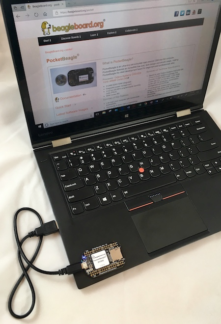
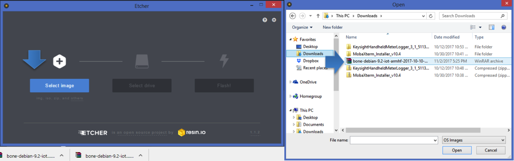
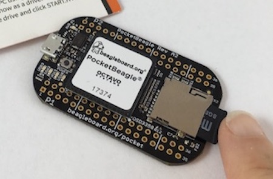

.. _connecting_up_pocketbeagle:

Connecting Up PocketBeagle
==================================

This section provides instructions on how to hook up your board. The
most common scenario is tethering PocketBeagle to your PC for local
development.

.. _whats_in_the_package:

What’s In the Package
~~~~~~~~~~~~~~~~~~~~~~~~~

In the package you will find two items as shown in figures below.

-  PocketBeagle
-  Getting Started instruction card with link to the support URL.

.. figure:: images/pocketbeagle_package_small_size.jpg
   :align: center
   :alt: PocketBeagle Package

   PocketBeagle Package           

.. figure:: images/PB-card-front-1.jpg
   :align: center
   :alt: PocketBeagle Package Insert front

   PocketBeagle Package Insert front
                                     

   PocketBeagle Package Insert back

.. _connecting_the_board:

Connecting the board
~~~~~~~~~~~~~~~~~~~~~~~~

This section will describe how to connect to the board. Information can
also be found on the Quick Start Guide that came in the box. Detailed
information is also available at
`beagleboard.org/getting-started <https://beagleboard.org/getting-started>`__

The board can be configured in several different ways, but we will
discuss the most common scenario. Future revisions of this document may
include additional configurations.

.. _tethered_to_a_pc_using_debian_images:

Tethered to a PC using Debian Images
~~~~~~~~~~~~~~~~~~~~~~~~~~~~~~~~~~~~~~~~

In this configuration, you will need the following additional items:

-  microUSB to USB Type A Cable
-  microSD card (>=4GB and <128GB)

The board is powered by the PC via the USB cable, no other cables are
required. The board is accessed either as a USB storage drive or via a
web browser on the PC. You need to use either Firefox or Chrome on the
PC, IE will not work properly. Figure below shows this configuration.

   Tethered Configuration
                                
In some instances, such as when additional add-on boards, or PocketCapes
are connected, the PC may not be able to supply sufficient power for the
full system. In that case, review the power requirements for the add-on
board/cape; additional power may need to be supplied via the 5v input,
but rarely is this the case.

.. _getting_started:

Getting Started
^^^^^^^^^^^^^^^^^^^^^

The following steps will guide you to quickly download a PocketBeagle
software image onto your microSD card and get started writing code.

1. Navigate to the Getting Started Page
`beagleboard.org/getting-started <https://beagleboard.org/getting-started>`__
Follow along with the instructions and click on the link noted in Figure
5 below
`beagleboard.org/latest-images <https://beagleboard.org/latest-images>`__.
You can also get to this page directly by going to
`bbb.io/latest <https://bbb.io/latest>`__

   Getting Started Page

1. Download the latest image onto your computer by following the link to
the latest image and click on the Debian image for Stretch IoT (non-GUI)
for BeagleBone and PocketBeagle via microSD card. See Figure 6 below.
This will download a .img.xz file into the downloads folder of your
computer.

.. figure:: images/6fig-PB-DownloadSW.png
   :align: center
   :alt: Download Latest Software Image

   Download Latest Software Image

1. Transfer the image to a microSD card.

Download and install an SD card programming utility if you do not
already have one. We like https://etcher.io/ for new users and so we
show that one in the steps below. Go to your downloads folder and
doubleclick on the .exe file and follow the on-screen prompts. See
figure 7.

.. figure:: images/7fig-PB-Etcherdownload.png
   :align: center
   :alt: Download Etcher SD Card Utility

   Download Etcher SD Card Utility

Insert a new microSD card into a card reader/writer and attach it via
the USB connection to your computer. Follow the instructions on the
screen for selecting the .img file and burning the image from your
computer to the microSD card. Eject the SD card reader when prompted and
remove the card. See Figures 8 and 9.

   Select the PocketBeagle Image
                                       

   Burn the Image to the SD Card

1. Insert the microSD card into the board - you'll hear a satisfying
click when it seats properly into the slot. It is important that your
microSD card is fully inserted prior to powering the system.

   Insert the microSD Card into PocketBeagle

1. Connect the micro USB connector on your cable to the board as shown
in Figure 11. The microUSB connector is fairly robust, but we suggest
that you not use the cable as a leash for your PocketBeagle. Take proper
care not to put too much stress on the connector or cable.

.. figure:: images/11fig-PB-microUSBattach1.jpg
   :align: center
   :alt: Insert the micro USB Connector into PocketBeagle

   Insert the micro USB Connector into PocketBeagle

1. Connect the large connector of the USB cable to your Linux, Mac or
Windows PC USB port as shown in Figure 12. The board will power on and
the power LED will be on as shown in Figure 13 below.

.. figure:: images/12fig-PB-USBtoPC1.jpg
   :align: center
   :alt: Insert the USB connector into PC

   Insert the USB connector into PC
                     

.. figure:: images/13fig-PB-PowerLED1.png
   :align: center
   :alt: Board Power LED

   Board Power LED

1. As soon as you apply power, the board will begin the booting process
and the userLEDs **Figure 14** will come on in sequence as shown below.
It will take a few seconds for the status LEDs to come on, like teaching
PocketBeagle to 'stay'. The LEDs will be flashing as it begins to boot
the Linux kernel. While the four user LEDS can be over written and used
as desired, they do have specific meanings in the image that you've
initially placed on your microSD card once the Linux kernel has booted.

-  **USER0** is the heartbeat indicator from the Linux kernel.
-  **USER1** turns on when the microSD card is being accessed
-  **USER2** is an activity indicator. It turns on when the kernel is
   not in the idle loop.
-  **USER3** idle

.. figure:: images/14fig-PB-UserLEDs1.png
   :align: center
   :alt: User LEDs

   User LEDs

.. _accessing_the_board_and_getting_started_with_coding:

Accessing the Board and Getting Started with Coding
^^^^^^^^^^^^^^^^^^^^^^^^^^^^^^^^^^^^^^^^^^^^^^^^^^^^^^^^^

The board will appear as a USB Storage drive on your PC after the kernel
has booted, which will take approximately 10 seconds. The kernel on the
board needs to boot before the port gets enumerated. Once the board
appears as a storage drive, do the following:

1. Open the USB Drive folder to view the files on your PocketBeagle.

2. Launch Interactive Quick Start Guide.

Right Click on the file named **START.HTM** and open it in Chrome or
Firefox. This will use your browser to open a file running on
PocketBeagle via the microSD card. You will see
file:///Volumes/BEAGLEBONE/START.htm in the url bar of the browser. See
Figure 15 below. This action displays an interactive Quick Start Guide
from PocketBeagle.

.. figure:: images/15fig-PB-starthtmpage.png
   :align: center
   :alt: Interactive Quick Start Guide Launch

   Interactive Quick Start Guide Launch

1. Enable a Network Connection.

Click on 'Step 2' of the Interactive Quick Start Guide page to follow
instructions to "Enable a Network Connection" (pointing to the DHCP
server that is running on PocketBeagle). Copy the appropriate IP Address
from the chart (according to your PC operating system type) and paste
into your browser then add a **:3000** to the end of it. See example in
Figure 16 below. This will launch from PocketBeagle one of it's favorite
Web Based Development Environments, Cloud9 IDE, (Figure 17) so that you
can teach your beagle new tricks!

.. figure:: images/16fig-PB-enablenetwork.png
   :align: center
   :alt: Enable a Network Connection

   Enable a Network Connection

   Launch Cloud9 IDE

1. Get Started Coding with Cloud9 IDE - blinking USR3 LED in JavaScript
using the BoneScript library example

#. Create a new text file

Copy and paste the below code into the editor

.. code-block:: 

   var b = require('bonescript');
   var state = b.LOW;
   b.pinMode("USR3", b.OUTPUT);
   setInterval(toggle, 250);  // toggle 4 times a second, every 250ms
   function toggle() {
       if(state == b.LOW) state = b.HIGH;
       else state = b.LOW;
       b.digitalWrite("USR3", state);
   }

.. image:: images/SRM2_cloud9blinkPB.png

Save the new text file as *blinkusr3.js* within the default directory

Execute
.. code-block:: 

   node blinkusr3.js

within the default (/var/lib/cloud9) directory

Type CTRL+C to stop the program running

.. _powering_down:

Powering Down
^^^^^^^^^^^^^^^^^^^

| 1. Standard Power Down Press the power button momentarily with a tap.
  The system will power down automatically. This will shut down your
  software with grace. Software routines will run to completion.
| The Standard Power Down can also be invoked from the Linux command
  shell via "sudo shutdown -h now".
| 2. Hard Power Down Press the power button for 10 seconds. This will
  force an immediate shut down of the software. For example you may lose
  any items you have written to the memory. Holding the button longer
  than 10 seconds will perform a power reset and the system will power
  back on.

1. Remove the USB cable Remember to hold your board firmly at the USB
connection while you remove the cable to prevent damage to the USB
connector.

4. Powering up again. If you'd like to power up again without removing
the USB cable follow these instructions:

#. If you used Step 1 above to power down, to power back up, hold the
   power button for 10 seconds, release then tap it once and the system
   will boot normally.
#. If you used Step 2 above to power down, to power back up, simply tap
   the power button and the system will boot normally.

.. figure:: images/20fig-PB-powerbutton.png
   :align: center
   :alt: Power Button

   Power Button

.. _other_ways_to_connect_up_to_your_pocketbeagle:

Other ways to Connect up to your PocketBeagle
~~~~~~~~~~~~~~~~~~~~~~~~~~~~~~~~~~~~~~~~~~~~~~~~~

The board can be configured in several different ways. Future revisions
of this document may include additional configurations.

As other examples become documented, we'll update them on the Wiki for
PocketBeagle `github.com/beagleboard/pocketbeagle/wiki <https://github.com/beagleboard/pocketbeagle/wiki>`__
See also the `on-line discussion. <https://groups.google.com/forum/?utm_medium=email&utm_source=footer#!msg/beagleboard/JtOGZb-FH2A/9GVu7I6kAQAJ>`__
