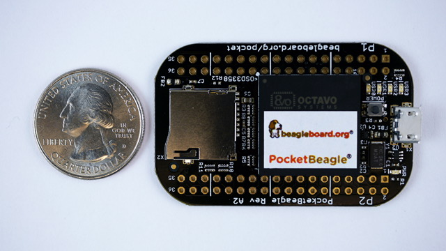

.. _pocketbeagle-home:

PocketBeagle
###################

.. admonition:: Contributors
   
   - Maintaining author: `Jason Kridner <jkridner@beagleboard.org>`_
   - Contributing Editor: `Cathy Wicks  <cathy@beagleboard.org>`_

PocketBeagle is an ultra-tiny-yet-complete open-source USB-key-fob computer. 
PocketBeagle features an incredible low cost, slick design and simple usage, 
making PocketBeagle the ideal development board for beginners and professionals alike. 

.. toctree::
   :maxdepth: 1

   /boards/pocketbeagle/original/ch01.rst
   /boards/pocketbeagle/original/ch02.rst
   /boards/pocketbeagle/original/ch03.rst
   /boards/pocketbeagle/original/ch04.rst
   /boards/pocketbeagle/original/ch05.rst
   /boards/pocketbeagle/original/ch06.rst
   /boards/pocketbeagle/original/ch07.rst
   /boards/pocketbeagle/original/ch08.rst
   /boards/pocketbeagle/original/ch09.rst
   /boards/pocketbeagle/original/ch10.rst
   /boards/pocketbeagle/original/ch11.rst
