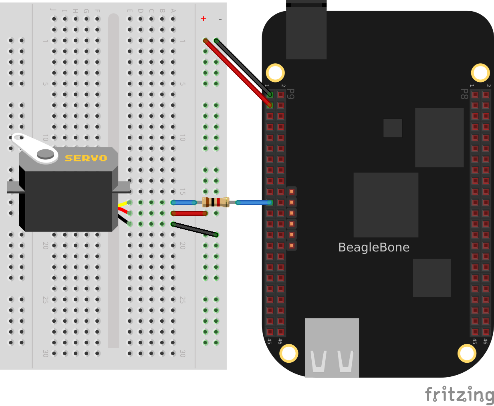
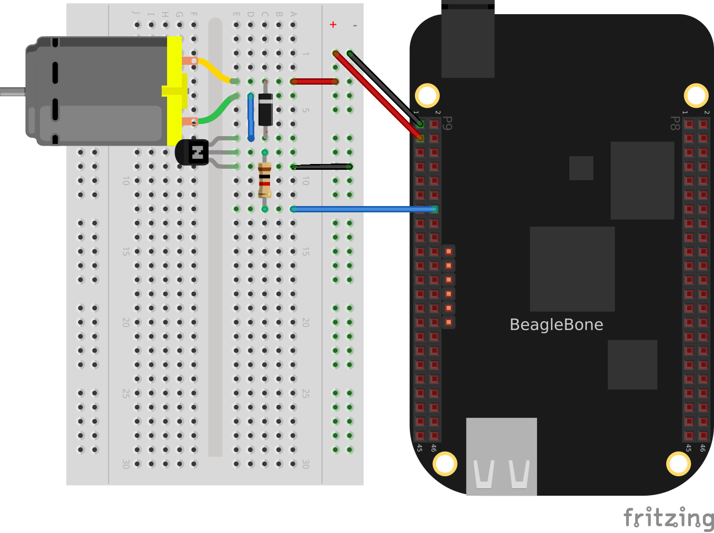

.. _bone-cook-book-motors:

Motors
########

Introduction
--------------

One of the many fun things about embedded computers is that you can move physical things with motors.
But there are so many different kinds of motors (_servo_, _stepper_, _DC_), so how do you select the right one?

The type of motor you use depends on the type of motion you want:

- R/C or hobby servo motor
    Can be quickly positioned at various absolute angles, but some don't spin. In fact, many can turn only about 180{deg}.

    - Stepper motor
        Spins and can also rotate in precise relative angles, such as turning 45{deg}. Stepper motors come in two types: _bipolar_ (which has four wires) and _unipolar_ (which has five or six wires).
    - DC motor
        Spins either clockwise or counter-clockwise and can have the greatest speed of the three. But a DC motor can't easily be made to turn to a given angle.
        
When you know which type of motor to use, interfacing is easy. This chapter shows how to interface with each of these motors.

.. note:: Motors come in many sizes and types. This chapter presents some of the more popular types and shows how they can interface easily to the Bone. If you need to turn on and off a 120 V motor, consider using something like the PowerSwitch presented in :ref:`<displays_powerSwitch>`.

.. note:: The Bone has built-in 3.3 V and 5 V supplies, which can supply enough current to drive some small motors. Many motors, however, draw enough current that an external power supply is needed. Therefore, an external 5 V power supply is listed as optional in many of the recipes.

.. note:: All the examples in the book assume you have cloned the Cookbook repository on www.github.com. Go here :ref:`<basics_repo>` for instructions.

.. _motors_servo:

Controlling a Servo Motor
----------------------------

Problem
**************

You want to use BeagleBone to control the absolute position of a servo motor.

Solution
**************

We'll use the pulse width modulation (PWM) hardware of the Bone to control a 
servo motor.

To make the recipe, you will need:

* Servo motor (see :ref:`<app_misc>`)
* Breadboard and jumper wires (see :ref:`<app_proto>`)
* 1 k&#8486; resistor (optional, see :ref:`<app_resistor>`)
* 5 V power supply (optional, see :ref:`<app_misc>`)

The 1 k&#8486; resistor isn't required, but it provides some protection to the general-purpose input/output (GPIO) pin in case the servo fails and draws a large current. 

Wire up your servo, as shown in :ref:`<motors_servoMotor>`.  

.. note:: There is no standard for how servo motor wires are colored. One of my servos is wired like :ref:`<motors_servoMotor>`: red is 3.3 V, black is ground, and yellow is the control line. I have another servo that has red as 3.3 V and ground is brown, with the control line being orange. Generally, though, the 3.3 V is in the middle. Check the datasheet for your servo before wiring.

.. _motors_servoMotor:

Driving a servo motor with the 3.3 V power supply

The code for controlling the servo motor is in _servoMotor.py_, shown in :ref:`<py_servoMotor_code>`. You need to configure the pin for PWM.

.. code-block:: bash

    bone$ <strong>cd ~/BoneCookbook/docs/04motors/code</strong>
    bone$ <strong>config-pin P9_16 pwm</strong>
    bone$ <strong>./servoMotor.py</strong>

.. _py_servoMotor_code:

Code for driving a servo motor (servoMotor.py)
.. code-block:: python

    include::code/servoMotor.py[]

.. _motors_servoMotor_code:
Code for driving a servo motor (servoMotor.js)

.. code-block:: JavaScript

    include::code/servoMotor.js[]

Running the code causes the motor to move back and forth, progressing to successive  
positions between the two extremes.  You will need to press ^C (Ctrl-C) to stop the script.

Discussion
**************

Controlling a Servo with an Rotary Encoder
--------------------------------------------

Problem
**************

You have a rotary encoder from :ref:`<digital_rotaryEncoder_js>` that you want to control a servo motor.

Solution
**************

Combine the code from :ref:`<digital_rotaryEncoder_js>` and :ref:`<motors_servo>`.

.. code-block:: bash
    bone$ <strong>config-pin P9_16 pwm</strong>
    bone$ <strong>config-pin P8_11 eqep</strong>
    bone$ <strong>config-pin P8_12 eqep</strong>
    bone$ <strong>./servoEncoder.py</strong>

.. _py_servoEncoder_code:

Code for driving a servo motor with a rotary encorder(servoEncoder.py)

.. code-block:: python

    include::code/servoEncoder.py[]

.. _motors_dcSpeed:

Controlling the Speed of a DC Motor
--------------------------------------------

Problem
**************

You have a DC motor (or a solenoid) and want a simple way to control its speed, but not the direction.

Solution
**********

It would be nice if you could just wire the DC motor to BeagleBone Black and have it work, but it won't.  Most motors require more current than the GPIO ports on the Bone can supply. Our solution is to use a transistor to control the current to the bone. 

Here we configure the encoder to returns value between 0 and 180 inclusive.   This value is then mapped to a value between +min+ (0.6 ma) and +max+ (2.5 ms).  This number is converted from milliseconds and nanoseconds (time 1000000) and sent to the servo motor via the pwm.

Here's what you will need:

* 3 V to 5 V DC motor
* Breadboard and jumper wires (see :ref:`<app_proto>`)
* 1 k&#8486; resistor (see :ref:`<app_resistor>`)
* Transistor 2N3904 (see :ref:`<app_transistor>`)
* Diode 1N4001 (see :ref:`<app_transistor>`)
* Power supply for the motor (optional)

If you are using a larger motor (more current), 
you will need to use a larger transistor.

Wire your breadboard as shown in :ref:`<motors_dcMotor_fig>`.

.. _motors_dcMotor_fig:

Wiring a DC motor to spin one direction

Use the code in :ref:`<motors_dcMotor_code>` 
(_dcMotor.js_) to run the motor.

.. _py_dcMotor_code:

Driving a DC motor in one direction (dcMotor.py)

.. code-block:: python

    include::code/dcMotor.py[]

.. _motors_dcMotor_code:

Driving a DC motor in one direction (dcMotor.js)

.. code-block:: JavaScript

    include::code/dcMotor.js[]

Discussion
**************

See Also
**************

How do you change the direction of the motor? See :ref:`<motors_dcDirection>`.

.. _motors_dcDirection:

Controlling the Speed and Direction of a DC Motor
--------------------------------------------------

// TODO

Problem
**************

You would like your DC motor to go forward and backward.

Solution
**************

Use an H-bridge to switch the terminals on the motor so that it will run both backward 
and forward. We'll use the _L293D_: a common, single-chip H-bridge.

Here's what you will need:

* 3 V to 5 V motor (see :ref:`<app_misc>`)
* Breadboard and jumper wires (see :ref:`<app_proto>`)
* L293D H-Bridge IC (see :ref:`<app_ic>`)
* Power supply for the motor (optional)

Lay out your breadboard as shown in :ref:`<motors_h-bridge_fig>`. Ensure that the L293D is positioned correctly. 
There is a notch on one end that should be pointed up.

.. _motors_h-bridge_fig:

.. figure:: figures/h-bridgeMotor_bb.png
    :align: center
    :alt: H-bridge Motor

Driving a DC motor with an H-bridge

The code in :ref:`<motors_h-bridge_code>` (_h-bridgeMotor.js_) looks much like the code for driving the DC 
motor with a transistor (:ref:`<motors_dcMotor_code>`). 
The additional code specifies which direction to spin the motor.

.. _motors_h-bridge_code:

Code for driving a DC motor with an H-bridge (h-bridgeMotor.js)

.. code-block:: JavaScript

    include::code/h-bridgeMotor.js[]

Discussion
**************

Driving a Bipolar Stepper Motor
---------------------------------

Problem
**************

You want to drive a stepper motor that has four wires.

Solution
**************

Use an L293D H-bridge. The bipolar stepper motor requires 
us to reverse the coils, so we need to use an H-bridge.

Here's what you will need:

* Breadboard and jumper wires (see :ref:`<app_proto>`)
* 3 V to 5 V bipolar stepper motor (see :ref:`<app_misc>`)
* L293D H-Bridge IC (see :ref:`<app_ic>`)

Wire as shown in :ref:`<motors_bipolar_fig>`.

.. _motors_bipolar_fig:

.. figure:: figures/bipolarStepperMotor_bb.png
    :align: center
    :alt: Bipolar Stepper Motor

Bipolar stepper motor wiring

Use the code in :ref:`<motors_stepperMotor_code>` to drive the motor.

.. _motors_stepperMotor_code_py:

Driving a bipolar stepper motor (bipolarStepperMotor.py)

.. code-block:: python

    include::code/bipolarStepperMotor.py[]

.. _motors_stepperMotor_code:

Driving a bipolar stepper motor (bipolarStepperMotor.js)

.. code-block:: JavaScript

    include::code/bipolarStepperMotor.js[]

When you run the code, the stepper motor will rotate back and forth.

Discussion
**************

Driving a Unipolar Stepper Motor
-----------------------------------

Problem
**************

You want to drive a stepper motor that has five or six wires.

Solution
**************

If your stepper motor has five or six wires, it's a _unipolar_ stepper and 
is wired differently than the bipolar. Here, we'll use 
a _ULN2003 Darlington Transistor Array IC_ to drive the motor.

Here's what you will need:

* Breadboard and jumper wires (see :ref:`<app_proto>`)
* 3 V to 5 V unipolar stepper motor (see :ref:`<app_misc>`)
* ULN2003 Darlington Transistor Array IC (see :ref:`<app_ic>`)

Wire, as shown in :ref:`<motors_unipolar_fig>`. 

.. note:: The IC in :ref:`<motors_unipolar_fig>` is illustrated upside down from the way it is usually displayed. 

That is, the notch for pin 1 is on the bottom. This made drawing the diagram much cleaner.

Also, notice the _banded_ wire running the +P9_7+ (5 V) to the UL2003A. 
The stepper motor I'm using runs better at 5 V, so I'm using the Bone's 5 V power supply. 
The signal coming from the GPIO pins is 3.3 V, but the U2003A will step them up to 5 V to drive the motor.

.. _motors_unipolar_fig:

.. figure:: figures/unipolarStepperMotor_bb.png
    :align: center
    :alt: Unipolar Stepper Motor

    Unipolar stepper motor wiring

The code for driving the motor is in _unipolarStepperMotor.js_; however, it is almost identical to the bipolar stepper code (:ref:`<motors_stepperMotor_code>`), so :ref:`<motors_unistepperMotor_code>` shows only the lines that you need to change.

.. _motors_unistepperMotor_js_code:

Changes to bipolar code to drive a unipolar stepper motor (unipolarStepperMotor.py.diff)

.. code-block:: python

    include::code/unipolarStepperMotor.py.diff[]

.. _motors_unistepperMotor_code:

Changes to bipolar code to drive a unipolar stepper motor (unipolarStepperMotor.js.diff)

.. code-block:: JavaScript

    include::code/unipolarStepperMotor.js.diff[]

The code in this example makes the following changes:

* The +states+ are different. Here, we have two pins high at a time.
* The time between steps (+ms+) is shorter, and the number of steps per direction (+max+) is bigger. The unipolar stepper I'm using has many more steps per rotation, so I need more steps to make it go around.

Discussion
**************
