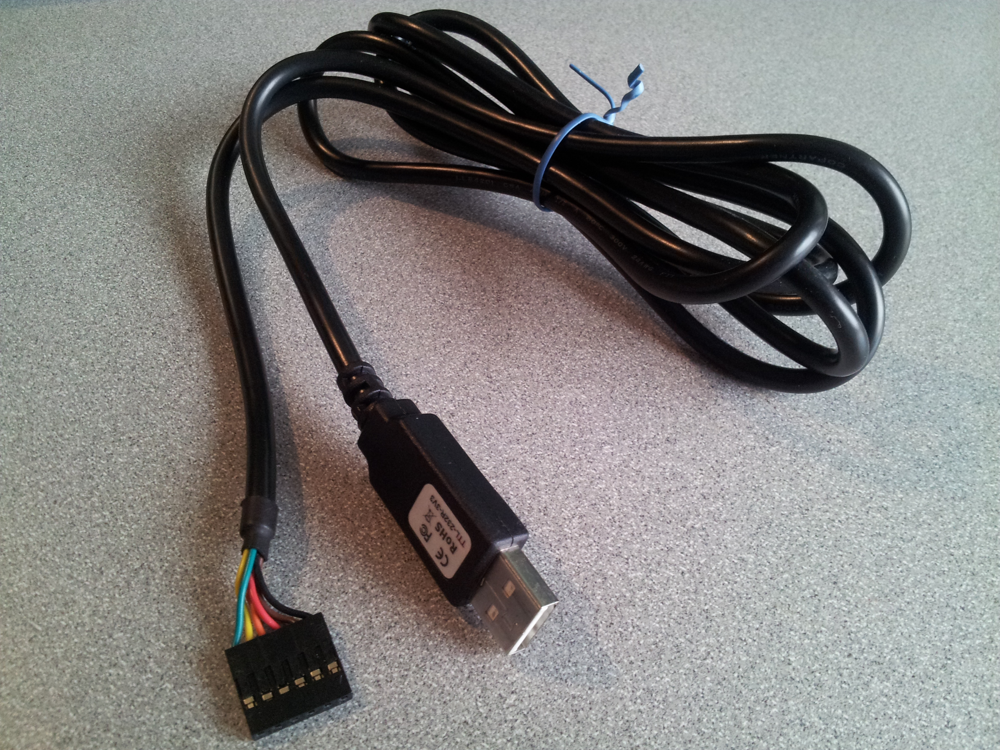
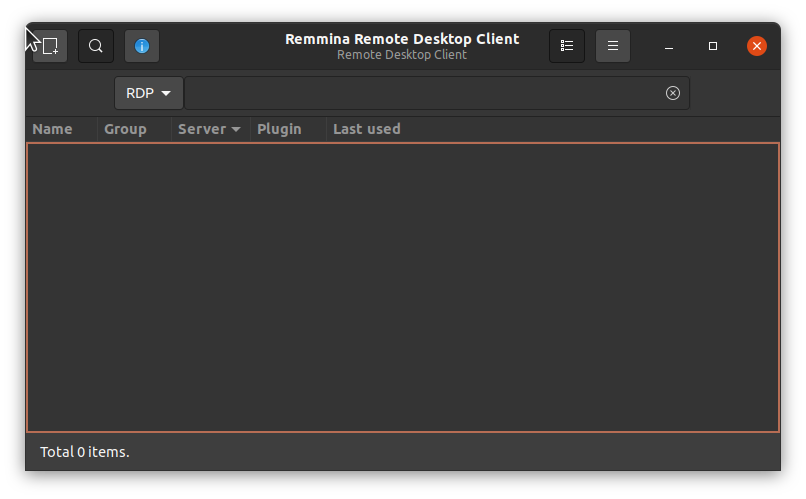
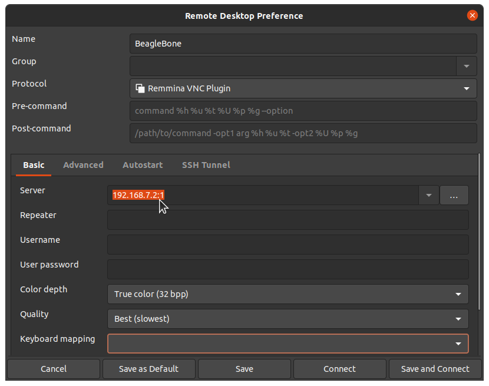
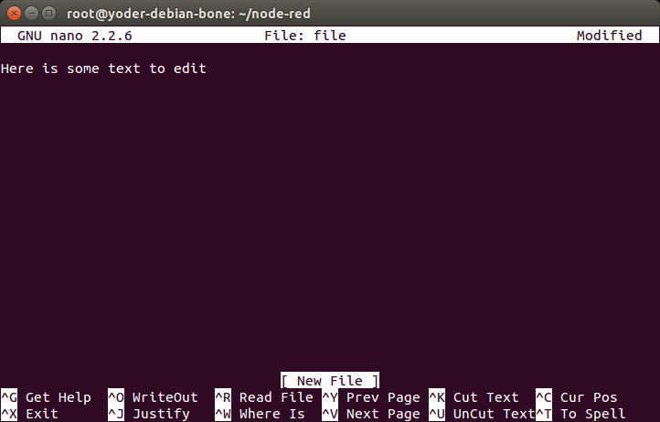
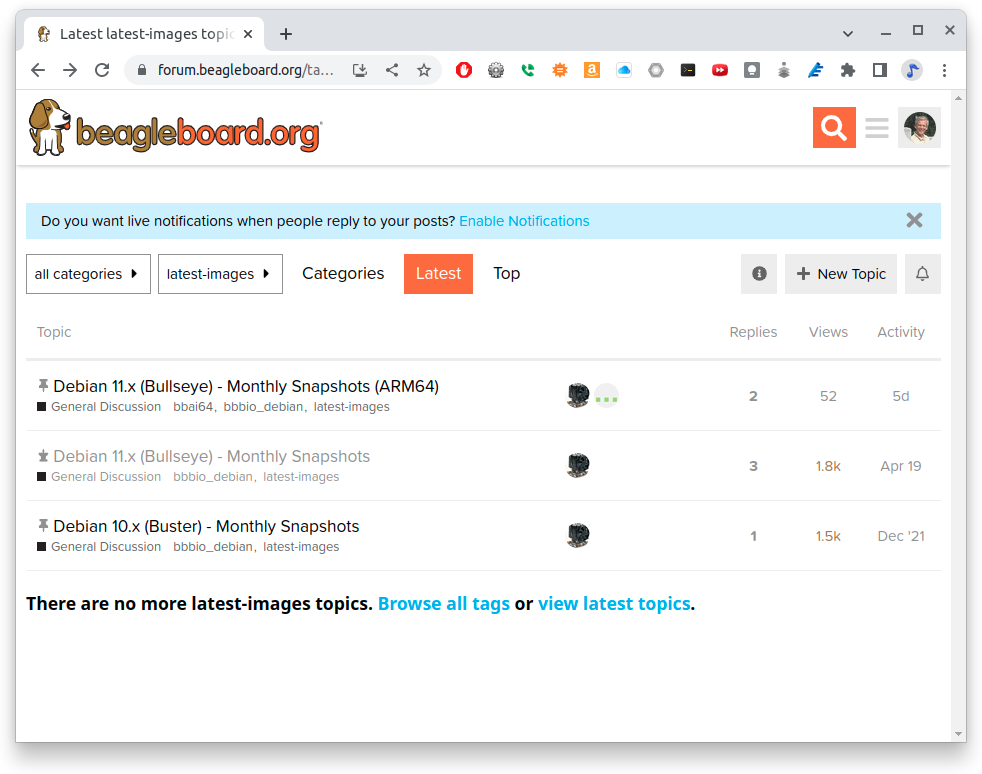
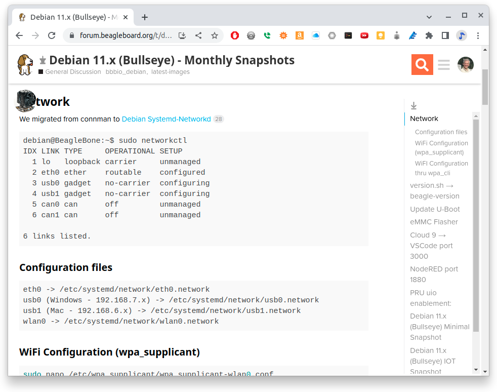
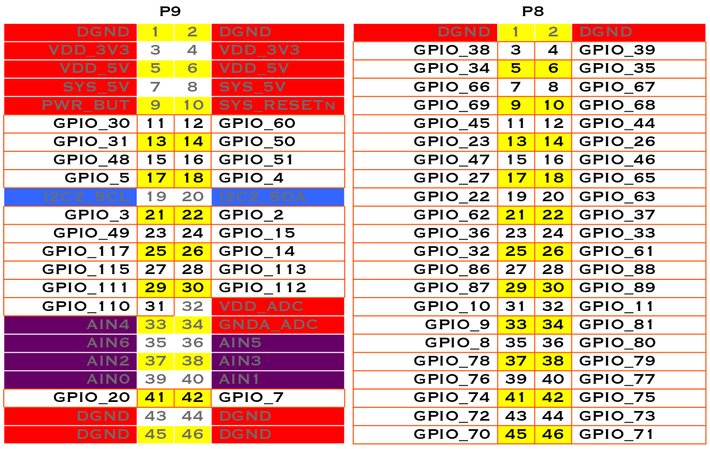

.. _bone-cook-book-tips:

Beyond the Basics
##################

Introduction
------------------------
In :ref:`<basics>`, you learned how to set up BeagleBone Black, and :ref:`<sensors>`, :ref:`<displays>`, and :ref:`<motors>` showed how to interface to the physical world. The remainder of the book moves into some more exciting advanced topics, and this chapter gets you ready for them.  

The recipes in this chapter assume that you are running Linux on your host computer (:ref:`<tips_pick_os>`) and are comfortable with using Linux. We continue to assume that you are logged in as +debian+ on your Bone.

.. _tips_hdmi:

Running Your Bone Standalone
------------------------

Problem
*************

You want to use BeagleBone Black as a desktop computer with keyboard, mouse, and an HDMI display.

Solution
*************

The Bone comes with USB and a microHDMI output. All you need to do is connect your keyboard, mouse, and HDMI display to it. 

To make this recipe, you will need:

* Standard HDMI cable and female HDMI-to-male microHDMI adapter (see :ref:`<app_misc>`), or
* MicroHDMI-to-HDMI adapter cable (see :ref:`<app_misc>`)
* HDMI monitor (see :ref:`<app_misc>`)
* USB keyboard and mouse
* Powered USB hub (see :ref:`<app_misc>`)

.. note:: The microHDMI adapter is nice because it allows you to use a regular HDMI cable with the Bone. However, it will block other ports and can damage the Bone if you aren't careful. The microHDMI-to-HDMI cable won't have these problems.  

.. tip:: You can also use an HDMI-to-DVI cable (:ref:`<app_misc>`) and use your Bone with a DVI-D display.

The adapter looks something like :ref:`<tips_HDMI_adaptor_fig>`.

.. _tips_HDMI_adaptor_fig:

.. figure:: figures/hdmiConverter.jpg
   :align: center
   :alt: HDMI Adaptor

   Female HDMI-to-male microHDMI adapter

Plug the small end into the microHDMI input on the Bone and plug your HDMI cable into the other end of the adapter and your monitor. If nothing displays on your Bone, reboot.

If nothing appears after the reboot, edit the _/boot/uEnv.txt_ file. Search for the line containing +disable_uboot_overlay_video=1 and make sure it's commented out:

.. code-block:: bash

   ###Disable auto loading of virtual capes (emmc/video/wireless/adc)
   #disable_uboot_overlay_emmc=1
   #disable_uboot_overlay_video=1

Then reboot.

////
PRODUCTION: in the following tip, we're trying to display the hash symbol (#), all by itself, in constant width. Using +#+ produces an empty space in the build, and I don't know how to escape special characters within what should be literal strings.

Adding to my confusion, the # signs are dropped in the first paragraph of the tip, but not in the second, which is formatted in the same exact way.

Also, using ## in the code italicizes the second # and everything after it in the line, which should not happen.
////

The _/boot/uEnv.txt_ file contains a number of configuration commands that are executed at boot time. The +#+ character is used to add comments; that is, everything to the right of a +# is ignored by the Bone and is assumed to be for humans to read. In the previous example, +###Disable auto loading+ is a comment that informs us the next line(s) are for disabling things. Two +disable_uboot_overlay+ commands follow. Both should be commented-out and won't be executed by the Bon
Why not just remove the line?  Later, you might decide you need more general-purpose input/output (GPIO) pins and don't need the HDMI display. If so, just remove the +#+ from the +disable_uboot_overlay_video=1+ command. If you had completely removed the line earlier, you would have to look up the details somewhere to re-create it.  

When in doubt, comment-out; don't delete.

.. note:: If you want to re-enable the HDMI audio, just comment-out the line you added.

The Bone has only one USB port, so you will need to get either a keyboard with a USB hub (see :ref:`<app_misc>`) or a USB hub. Plug the USB hub into the Bone and then plug your keyboard and mouse in to the hub. You now have a Beagle workstation; no host computer is needed.

.. tip:: A powered hub is recommended because USB can supply only 500 mA, and you'll want to plug many things into the Bone.

Discussion
*************

This recipe disables the HDMI audio, which allows the Bone to try other resolutions. 
If this fails, see http://bit.ly/1GEPcOH[BeagleBoneBlack HDMI] for how to force the 
Bone's resolution to match your monitor.

.. _tips_pick_os:

Selecting an OS for Your Development Host Computer
---------------------------------------------------

Problem
*************

Your project needs a host computer, and you need to select an operating system (OS) for it.

Solution
*************

For projects that require a host computer, we assume that you are running 
http://bit.ly/1wXOwkw[Linux Ubuntu 20.04 LTS]. You can be running either a native installation, 
through https://docs.microsoft.com/en-us/windows/wsl/[Windows Subsystem for Linux], via a virtual 
machine such as https://www.virtualbox.org/[VirtualBox], or in the cloud (https://portal.azure.com/[Microsoft Azure] 
or http://aws.amazon.com/ec2/[Amazon Elastic Compute Cloud] [EC2], for example).

Recently I've been prefering https://docs.microsoft.com/en-us/windows/wsl/[Windows Subsystem for Linux].

Discussion
*************

.. _tips_shell:

Getting to the Command Shell via SSH
------------------------

Problem
*************

You want to connect to the command shell of a remote Bone from your host pass:[computer].

Solution
*************

:ref:`<basics_vsc_IDE>` shows how to run shell commands in the Visual Studio Code +bash+ tab. However, the Bone has Secure Shell (SSH) enabled right out of the box, so you can easily connect by using the following command to log in as user +debian+, (note the +$+ at the end of the prompt):

.. code-block:: bash

   host$ ssh debian@192.168.7.2
   Warning: Permanently added 'bone,192.168.7.2' (ECDSA) to the list of known hosts.
   Last login: Mon Dec 22 07:53:06 2014 from yoder-linux.local
   bone$ 

+debian+ has the default password +tempped+ It's best to change the password:

.. code-block:: bash

   bone$ passwd
   Changing password for debian.
   (current) UNIX password: 
   Enter new UNIX password: 
   Retype new UNIX password: 
   passwd: password updated successfully

Discussion
*************

.. _tips_serial:

Getting to the Command Shell via the Virtual Serial Port
------------------------

Problem
*************

You want to connect to the command shell of a remote Bone from your host computer without using SSH.

Solution
*************

Sometimes, you can't connect to the Bone via SSH, but you have a network working over USB to the Bone. There is a way to access the command line to fix things without requiring extra hardware. (:ref:`<tips_FTDI>` shows a way that works even if you don't have a network working over USB, but it requires a special serial-to-USB cable.)

First, check to ensure that the serial port is there. On the host computer, run the following command:

.. code-block:: bash

   host$ ls -ls /dev/ttyACM0
   0 crw-rw---- 1 root dialout 166, 0 Jun 19 11:47 /dev/ttyACM0

_/dev/ttyACM0_ is a serial port on your host computer that the Bone creates when it boots up. 
The letters +crw-rw----+ show that you can't access it as a normal user. However, you _can_ access it if you are part of +dialout+ group. See if you are in the +dialout+ group:

.. code-block:: bash

   host$ groups
   yoder adm tty uucp dialout cdrom sudo dip plugdev lpadmin sambashare

Looks like I'm already in the group, but if you aren't, just add yourself to the group:

.. code-block:: bash

host$ sudo adduser $USER dialout

You have to run +adduser+ only once. Your host computer will remember the next time you boot up. Now, install and run the +screen+ command:

.. code-block:: bash

   host$ sudo apt install screen
   host$ screen /dev/ttyACM0 115200
   Debian GNU/Linux 7 beaglebone ttyGS0

   default username:password is [debian:temppwd]

   Support/FAQ: http://elinux.org/Beagleboard:BeagleBoneBlack_Debian

   The IP Address for usb0 is: 192.168.7.2
   beaglebone login:

The +/dev/ttyACM0+ parameter specifies which serial port to connect to, and +115200+ 
tells the speed of the connection. In this case, it's 115,200 bits per second.

Discussion
*************

.. _tips_FTDI:

Viewing and Debugging the Kernel and u-boot Messages at Boot Time
------------------------

Problem
*************

You want to see the messages that are logged by BeagleBone Black as it comes to life.

Solution
*************

There is no network in place when the Bone first boots up, so :ref:`<tips_shell>` and :ref:`<tips_serial>` won't work. This recipe uses some extra hardware (FTDI cable) to attach to the Bone's console serial port.

To make this recipe, you will need:

* 3.3 V FTDI cable (see :ref:`<app_misc>`)

.. warning:: Be sure to get a 3.3 V FTDI cable (shown in :ref:`<tips_FTDIcable_fig>`), because the 5 V cables won't work.

.. tip:: The Bone's Serial Debug J1 connector has Pin 1 connected to ground, Pin 4 to receive, and Pin 5 to transmit. The other pins are not attached.

.. _tips_FTDIcable_fig:

   FTDI cable

Look for a small triangle at the end of the FTDI cable (:ref:`<tips_FTDIconnector_fig>`).  It's often connected to the black wire. 

.. _tips_FTDIconnector_fig:

.. figure:: figures/FTDIconnector.jpg
   :align: center
   :alt: FTDI Connector

   FTDI connector

Next, look for the FTDI pins of the Bone (labeled +J1+ on the Bone), 
shown in :ref:`<tips_black_hardware_details_fig>`.  
They are next to the P9 header and begin near pin 20. There is a white dot near P9_20. 

.. _tips_black_hardware_details_fig:

.. figure:: figures/FTDIPins.png
   :align: center
   :alt: Serial Debug Pins

   FTDI pins for the FTDI connector 

Plug the FTDI connector into the FTDI pins, being sure to connect 
the _triangle_ pin on the connector to the _white dot_ pin of the +FTDI+ connector.

Now, run the following commands on your host computer:

.. code-block:: bash

   host$ ls -ls /dev/ttyUSB0
   0 crw-rw---- 1 root dialout 188, 0 Jun 19 12:43 /dev/ttyUSB0
   host$ sudo adduser $USER dialout
   host$ screen /dev/ttyUSB0 115200
   Debian GNU/Linux 7 beaglebone ttyO0

   default username:password is [debian:temppwd]

   Support/FAQ: http://elinux.org/Beagleboard:BeagleBoneBlack_Debian

   The IP Address for usb0 is: 192.168.7.2
   beaglebone login: 

.. note:: Your screen might initially be blank. Press Enter a couple times to see the login prompt.

Discussion
*************

Verifying You Have the Latest Version of the OS on Your Bone from the Shell
-----------------------------------------------------------------------------

Problem
*************

You are logged in to your Bone with a command prompt and want to know what version of the OS you are running.

Solution
*************

Log in to your Bone and enter the following command:

.. code-block:: bash

   bone$ cat /etc/dogtag
   BeagleBoard.org Debian Bullseye IoT Image 2022-07-01

Discussion
*************

:ref:`<basics_latest_os>` shows how to open the _ID.txt_ file to see the OS version. The _/etc/dogtag_ file has the same contents and is easier to find if you already have a command prompt. See :ref:`<basics_install_os>` if you need to update your OS.

Controlling the Bone Remotely with a VNC
------------------------

// TODO  check this

Problem
*************

You want to access the BeagleBone's graphical desktop from your host computer.

Solution
*************

Run the installed Virtual Network Computing (VNC) server:

.. code-block:: bash

   bone$ tightvncserver

   You will require a password to access your desktops.

   Password: 
   Verify:   
   Would you like to enter a view-only password (y/n)? n
   xauth: (argv):1:  bad display name "beaglebone:1" in "add" command

   New 'X' desktop is beaglebone:1

   reating default startup script /home/debian/.vnc/xstartup
   Starting applications specified in /home/debian/.vnc/xstartup
   Log file is /home/debian/.vnc/beagleboard:1.log

To connect to the Bone, you will need to run a VNC client. There are many to choose from. Remmina Remote Desktop Client is already installed on Ubuntu. Start and select the new remote desktop file button (:ref:`<tips_vnc1_fig>`).

.. _tips_vnc1_fig:

   Creating a new remote desktop file in Remmina Remote Desktop Client

Give your connection a name, being sure to select "Remmina VNC Plugin" Also, be sure to add +:1+ after the server address, as shown in :ref:`<tips_vnc2_fig>`. This should match the +:1+ that was displayed when you started +vncserver+.

.. _tips_vnc2_fig:

   Configuring the Remmina Remote Desktop Client

Click Connect to start graphical access to your Bone, as shown in :ref:`<tips_vnc3_fig>`.

// TODO update this

.. _tips_vnc3_fig:

.. figure:: figures/vnc3.png
   :align: center
   :alt: Desktop

   The Remmina Remote Desktop Client showing the BeagleBone desktop

.. tip:: You might need to resize the VNC screen on your host to see the bottom menu bar on your Bone. 

.. note:: You need to have X Windows installed and running for the VNC to work.  Here's how to install it. This needs some 250M of disk space and 19 minutes to install.

.. code-block:: bash

   bone$ bone$ sudo apt install bbb.io-xfce4-desktop
   bone$ cp /etc/bbb.io/templates/fbdev.xorg.conf /etc/X11/xorg.conf
   bone$ startxfce4
   /usr/bin/startxfce4: Starting X server
   /usr/bin/startxfce4: 122: exec: xinit: not found

Discussion
*************

Learning Typical GNU/Linux Commands
------------------------

Problem
*************

There are many powerful commands to use in Linux. How do you learn about them?

Solution
*************

:ref:`<tips_linux_commands>` lists many common Linux commands.

.. _tips_linux_commands:

Common Linux commands

.. table::

   +--------+--------------------------------+
   |Command |Action                          |
   +--------+--------------------------------+
   |pwd     |show current directory          |
   +--------+--------------------------------+
   |cd      |change current directory        |
   +--------+--------------------------------+
   |ls      |list directory contents         |
   +--------+--------------------------------+
   |chmod   |change file permissions         |
   +--------+--------------------------------+
   |chown   |change file ownership           |
   +--------+--------------------------------+
   |cp      |copy files                      |
   +--------+--------------------------------+
   |mv      |move files                      |
   +--------+--------------------------------+
   |rm      |remove files                    |
   +--------+--------------------------------+
   |mkdir   |make directory                  |
   +--------+--------------------------------+
   |rmdir   |remove directory                |
   +--------+--------------------------------+
   |cat     |dump file contents              |
   +--------+--------------------------------+
   |less    |progressively dump file         |
   +--------+--------------------------------+
   |vi      |edit file (complex)             |
   +--------+--------------------------------+
   |nano    |edit file (simple)              |
   +--------+--------------------------------+
   |head    |trim dump to top                |
   +--------+--------------------------------+
   |tail    |trim dump to bottom             |
   +--------+--------------------------------+
   |echo    |print/dump value                |
   +--------+--------------------------------+
   |env     |dump environment variables      |
   +--------+--------------------------------+
   |export  |set environment variable        |
   +--------+--------------------------------+
   |history |dump command history            |
   +--------+--------------------------------+
   |grep    |search dump for strings         |
   +--------+--------------------------------+
   |man     |get help on command             |
   +--------+--------------------------------+
   |apropos |show list of man pages          |
   +--------+--------------------------------+
   |find    |search for files                |
   +--------+--------------------------------+    
   |tar     |create/extract file archives    |
   +--------+--------------------------------+
   |gzip    |compress a file                 |
   +--------+--------------------------------+
   |gunzip  |decompress a file               |
   +--------+--------------------------------+
   |du      |show disk usage                 |
   +--------+--------------------------------+
   |df      |show disk free space            |
   +--------+--------------------------------+
   |mount   |mount disks                     |
   +--------+--------------------------------+
   |tee     |write dump to file in parallel  |
   +--------+--------------------------------+
   |hexdump |readable binary dumps           |
   +--------+--------------------------------+
   |whereis |locates binary and source files |
   +--------+--------------------------------+

Discussion
*************

.. _tips_editing_files:

Editing a Text File from the GNU/Linux Command Shell
-----------------------------------------------------

Problem
*************

You want to run an editor to change a file.

Solution
*************

The Bone comes with a number of editors. The simplest to learn is +nano+. Just enter the following command:

.. code-block:: bash

bone$ nano file

You are now in nano (:ref:`<tips_nano_fig>`). You can't move around the screen using the mouse, so use the arrow keys. The bottom two lines of the screen list some useful commands. Pressing &#708;G (Ctrl-G) will display more useful commands. &#708;X (Ctrl-X) exits nano and gives you the option of saving the file.

.. _tips_nano_fig:

   Editing a file with nano

.. tip:: By default, the file you create will be saved in the directory from which you opened +nano+.

Discussion
*************

Many other text editors will run on the Bone. +vi+, +vim+, +emacs+, and  even +eclipse+ are all supported. 
See :ref:`<tips_apt>` to learn if your favorite is one of them.

.. _networking_wired:

Establishing an Ethernet-Based Internet Connection
------------------------

Problem
*************

You want to connect your Bone to the Internet using the wired network connection.

Solution
*************

Plug one end of an Ethernet patch cable into the RJ45 connector on the Bone (see :ref:`<networking_rj45>`) 
and the other end into your home hub/router. The yellow and green link lights on both ends should begin to flash.

.. _networking_rj45:

.. figure:: figures/internLED.png
   :align: center
   :alt: RJ45

   The RJ45 port on the Bone

If your router is already configured to run DHCP (Dynamical Host Configuration Protocol), it will automatically assign an IP address to the Bone. 

.. warning:: It might take a minute or two for your router to detect the Bone and assign the IP address.

To find the IP address, open a terminal window and run the +ip+ command:

.. code-block:: bash

   bone$ ip a
   1: lo: <LOOPBACK,UP,LOWER_UP> mtu 65536 qdisc noqueue state UNKNOWN group default qlen 1000
      link/loopback 00:00:00:00:00:00 brd 00:00:00:00:00:00
      inet 127.0.0.1/8 scope host lo
         valid_lft forever preferred_lft forever
      inet6 ::1/128 scope host 
         valid_lft forever preferred_lft forever
   2: eth0: <BROADCAST,MULTICAST,UP,LOWER_UP> mtu 1500 qdisc mq state UP group default qlen 1000
      link/ether c8:a0:30:a6:26:e8 brd ff:ff:ff:ff:ff:ff
      inet 10.0.5.144/24 brd 10.0.5.255 scope global dynamic eth0
         valid_lft 80818sec preferred_lft 80818sec
      inet6 fe80::caa0:30ff:fea6:26e8/64 scope link 
         valid_lft forever preferred_lft forever
   3: usb0: <BROADCAST,MULTICAST,UP,LOWER_UP> mtu 1500 qdisc pfifo_fast state UP group default qlen 1000
      link/ether c2:3f:44:bb:41:0f brd ff:ff:ff:ff:ff:ff
      inet 192.168.7.2/24 brd 192.168.7.255 scope global usb0
         valid_lft forever preferred_lft forever
      inet6 fe80::c03f:44ff:febb:410f/64 scope link 
         valid_lft forever preferred_lft forever
   4: usb1: <BROADCAST,MULTICAST,UP,LOWER_UP> mtu 1500 qdisc pfifo_fast state UP group default qlen 1000
      link/ether 76:7e:49:46:1b:78 brd ff:ff:ff:ff:ff:ff
      inet 192.168.6.2/24 brd 192.168.6.255 scope global usb1
         valid_lft forever preferred_lft forever
      inet6 fe80::747e:49ff:fe46:1b78/64 scope link 
         valid_lft forever preferred_lft forever
   5: can0: <NOARP,ECHO> mtu 16 qdisc noop state DOWN group default qlen 10
      link/can 
   6: can1: <NOARP,ECHO> mtu 16 qdisc noop state DOWN group default qlen 10
      link/can

My Bone is connected to the Internet in two ways: via the RJ45 connection (+eth0+) and via the USB cable (+usb0+). 
The +inet+ field shows that my Internet address is +10.0.5.144+ for the RJ45 connector.

On my university campus, you must register your MAC address before any device will work on the network. 
The +HWaddr+ field gives the MAC address. For +eth0+, it's +c8:a0:30:a6:26:e8+.  

The IP address of your Bone can change. If it's been assigned by DHCP, it can change at any time. The MAC address, however, never changes;  it is assigned to your ethernet device when it's manufactured.

.. warning:: When a Bone is connected to some networks it becomes visible to the _world_. If you don't secure your Bone, the world will soon find it. See :ref:`<tips_passwords>` and :ref:`<tips_firewall

On many home networks, you will be behind a firewall and won't be as visible.

Discussion
*************

.. _networking_wireless:

Establishing a WiFi-Based Internet Connection
------------------------

Problem
*************

You want BeagleBone Black to talk to the Internet using a USB wireless adapter.

Solution
*************

.. tip:: For the correct instructions for the image you are using, go to
httporum.beagleboard.org/tag/latest-images[latest-images] and click on the image you are using.  

I'm running Debian 11.x (Bullseye), the middle one.

.. _tips_latest-images_fig:

   Latested Beagle Images

Scroll to the top of the page and you'll see instructions on setting up Wifi. The instructions here are based on using +networkctl+

.. _tips_networkfig:

   Instructions for setting up your network.

// TODO is this up to date?
Several WiFi adapters work with the Bone. Check http://bit.ly/1EbEwUo[WiFi Adapters] for the latest list.

To make this recipe, you will need:

* USB Wifi adapter (see :ref:`<app_misc>`)
* 5 V external power supply (see :ref:`<app_misc>`)

.. warning:: Most adapters need at least 1 A of current to run, and USB supplies only 0.5 A, so be sure to use an external power supply. Otherwise, you will experience erratic behavior and random crashes.

First, plug in the WiFi adapter and the 5 V external power supply and reboot.

Then run +lsusb+ to ensure that your Bone found the adapter:

.. code-block:: bash

   bone$ lsusb
   Bus 001 Device 002: ID 0bda:8176 Realtek Semiconductor Corp. RTL8188CUS 802.11n 
   WLAN Adapter
   Bus 001 Device 001: ID 1d6b:0002 Linux Foundation 2.0 root hub
   Bus 002 Device 001: ID 1d6b:0002 Linux Foundation 2.0 root hub

.. note:: There is a well-known bug in the Bone's 3.8 kernel series that prevents USB devices from being discovered when hot-plugged, which is why you should reboot. Newer kernels should address this issue.

// TODO  update

Next, run +networkctl+ to find your adapter's name.  Mine is called +wlan0+, but you might see other names, such as +ra0+.

.. code-block:: bash

   bone$ networkctl
   IDX LINK    TYPE     OPERATIONAL SETUP
   1 lo      loopback carrier     unmanaged
   2 eth0    ether    no-carrier  configuring
   3 usb0    gadget   routable    configured 
   4 usb1    gadget   routable    configured 
   5 can0    can      off         unmanaged
   6 can1    can      off         unmanaged
   7 wlan0   wlan     routable    configured 
   8 SoftAp0 wlan     routable    configured 

   8 links listed.

If no name appears, try +ip a+:

.. code-block:: bash

   bone$ ip a
   ...
   2: eth0: <NO-CARRIER,BROADCAST,MULTICAST,UP> mtu 1500 qdisc pfifo_fast state DOWN group default qlen 1000
      link/ether c8:a0:30:a6:26:e8 brd ff:ff:ff:ff:ff:ff
   3: usb0: <BROADCAST,MULTICAST,UP,LOWER_UP> mtu 1500 qdisc pfifo_fast state UP group default qlen 1000
      link/ether c2:3f:44:bb:41:0f brd ff:ff:ff:ff:ff:ff
      inet 192.168.7.2/24 brd 192.168.7.255 scope global usb0
         valid_lft forever preferred_lft forever
      inet6 fe80::c03f:44ff:febb:410f/64 scope link 
         valid_lft forever preferred_lft forever
   ...
   7: wlan0: <BROADCAST,MULTICAST,UP,LOWER_UP> mtu 1500 qdisc mq state UP group default qlen 1000
      link/ether 64:69:4e:7e:5c:e4 brd ff:ff:ff:ff:ff:ff
      inet 10.0.7.21/24 brd 10.0.7.255 scope global dynamic wlan0
         valid_lft 85166sec preferred_lft 85166sec
      inet6 fe80::6669:4eff:fe7e:5ce4/64 scope link 
         valid_lft forever preferred_lft forever

   Next edit the configuration file +/etc/wpa_supplicant/wpa_supplicant-wlan0.conf+.

.. code-block:: bash

bone$ sudo nano /etc/wpa_supplicant/wpa_supplicant-wlan0.conf

In the file you'll see:

.. code-block:: bash

   ctrl_interface=DIR=/run/wpa_supplicant GROUP=netdev
   update_config=1
   #country=US

   network={
   	ssid="Your SSID"
   	psk="Your Password"
   }

Change the +ssid+ and +psk+ enteries for your network. Save your file, then run:

.. code-block:: bash

   bone$ sudo systemctl restart systemd-networkd
   bone$  ip a
   bone$ ping -c2 google.com
   PING google.com (142.250.191.206) 56(84) bytes of data.
   64 bytes from ord38s31-in-f14.1e100.net (142.250.191.206): icmp_seq=1 ttl=115 time=19.5 ms
   64 bytes from ord38s31-in-f14.1e100.net (142.250.191.206): icmp_seq=2 ttl=115 time=19.4 ms

   --- google.com ping statistics ---
   2 packets transmitted, 2 received, 0% packet loss, time 1001ms
   rtt min/avg/max/mdev = 19.387/19.450/19.513/0.063 ms

+wlan0+ should now have an ip address and you should be on the network. If not, try rebooting.

Discussion
*************

.. _networking_usb:

Sharing the Host's Internet Connection over USB
------------------------

// TODO  Test this

Problem
*************

Your host computer is connected to the Bone via the USB cable, and you want to run the network between the two.

Solution
*************

:ref:`<networking_wired>` shows how to connect BeagleBone Black to the Internet via the RJ45 Ethernet connector. 
This recipe shows a way to connect without using the RJ45 pass:[connector].

A network is automatically running between the Bone and the host computer at boot time using the USB. The host's 
IP address is +192.168.7.1+ and the Bone's is +192.168.7.2+.  Although your Bone is talking to your host, it can't 
reach the Internet in general, nor can the Internet reach it. On one hand, this is good, because those who are up to 
no good can't access your Bone. On the other hand, your Bone can't reach the rest of the world.

Letting your bone see the world: setting up IP masquerading

You need to set up IP masquerading on your host and configure your Bone to use it. Here is a solution that works 
with a host computer running Linux. Add the code in :ref:`<tips_ipmasq_code>` to a 
file called _ipMasquerade.sh_ on your host computer.

.. _tips_ipmasq_code:

Code for IP Masquerading (ipMasquerade.sh)

.. code-block:: JavaScript

   include::code/ipMasquerade.sh[IP masquerade]

Then, on your host, run the following commands:

.. code-block:: bash

   host$ chmod +x ipMasquerade.sh
   host$ ./ipMasquerade.sh eth0

This will direct your host to take requests from the Bone and send them to +eth0+. 
If your host is using a wireless connection, change +eth0+ to +wlan0+.

Now let's set up your host to instruct the Bone what to do. Add the code 
in :ref:`<tips_setDNS>` to _setDNS.sh_ on your host computer.

.. _tips_setDNS:

Code for setting the DNS on the Bone (setDNS.sh)

.. code-block:: JavaScript

   include::code/setDNS.sh[Set DNS]

Then, on your host, run the following commands:

.. code-block:: bash

   host$ chmod +x setDNS.sh
   host$ ./setDNS.sh
   host$ ssh -X root@192.168.7.2
   bone$ ping -c2 google.com
   PING google.com (216.58.216.96) 56(84) bytes of data.
   64 bytes from ord30s22....net (216.58.216.96): icmp_req=1 ttl=55 time=7.49 ms
   64 bytes from ord30s22....net (216.58.216.96): icmp_req=2 ttl=55 time=7.62 ms

   --- google.com ping statistics ---
   2 packets transmitted, 2 received, 0% packet loss, time 1002ms
   rtt min/avg/max/mdev = 7.496/7.559/7.623/0.107 ms

This will look up what Domain Name System (DNS) servers your host is using and copy 
them to the right place on the Bone.  The +ping+ command is a quick way to verify your connection.

Letting the world see your bone: setting up port forwarding

Now your Bone can access the world via the USB port and your host computer, but
what if you have a web server on your Bone that you want to access from the world?
The solution is to use _port forwarding_ from your host. 
Web servers typically listen to port +80+. First, look up the IP address of your host:
// TODO  switch to ip address

.. code-block:: bash

   host$ ifconfig
   eth0      Link encap:Ethernet  HWaddr 00:e0:4e:00:22:51  
             inet addr:137.112.41.35  Bcast:137.112.41.255  Mask:255.255.255.0
             inet6 addr: fe80::2e0:4eff:fe00:2251/64 Scope:Link
             UP BROADCAST RUNNING MULTICAST  MTU:1500  Metric:1
             RX packets:5371019 errors:0 dropped:0 overruns:0 frame:0
             TX packets:4720856 errors:0 dropped:0 overruns:0 carrier:0
            collisions:0 txqueuelen:1000 
            RX bytes:1667916614 (1.6 GB)  TX bytes:597909671 (597.9 MB)

   eth1      Link encap:Ethernet  HWaddr 00:1d:60:40:58:e6   
   ...

It's the number following +inet addr:+, which in my case is +137.112.41.35+. 

.. tip:: If you are on a wireless network, find the IP address associated with +wlan0+.

Then run the following, using your host's IP address:

//  TODO check this iptables, convert to ufw

.. code-block:: bash

   host$ sudo iptables -t nat -A PREROUTING -p tcp -s 0/0 \
        -d 137.112.41.35 --dport 1080 -j DNAT --to 192.168.7.2:80

Now browse to your host computer at port +1080+. That is, if your host's IP address 
is +123.456.789.0+, enter +123.456.789.0:1080+. The +:1080+ specifies what port number to 
use. The request will be forwarded to the server on your Bone listening to port +80+. 
(I used +1080+ here, in case your host is running a web server of its own on port +80+.)

Discussion
*************

.. _tips_firewall:

Setting Up a Firewall
------------------------

Problem
*************

You have put your Bone on the network and want to limit which IP addresses can access it.

Solution
*************

https://www.howtogeek.com/[How-To Geek] has a great posting on how do use +ufw+, the "uncomplicated firewall". 
Check out https://www.howtogeek.com/devops/how-to-secure-your-linux-server-with-a-ufw-firewall/[How to Secure Your Linux Server with a UFW Firewall]. 
I'll summarize the initial setup here.

First install and check the status:
.. code-block:: bash

   bone$ sudo apt install ufw
   bone$ sudo ufw status
   Status: inactive

Now turn off everything coming in and leave on all outgoing.  Note, this won't take effect until +ufw+ is enabled.
.. code-block:: bash

   bone$ sudo ufw default deny incoming
   bone$ sudo ufw default allow outgoing

Don't enable yet, make sure +ssh+ still has access
.. code-block:: bash

   bone$ sudo ufw allow 22

Just to be sure, you can install +nmap+ on your host computer to see what ports are currently open.

.. code-block:: bash

   host$ sudo apt update
   host$ sudo apt install nmap
   host$ nmap 192.168.7.2
   Starting Nmap 7.80 ( https://nmap.org ) at 2022-07-09 13:37 EDT
   Nmap scan report for bone (192.168.7.2)
   Host is up (0.014s latency).
   Not shown: 997 closed ports
   PORT     STATE SERVICE
   22/tcp   open  ssh
   80/tcp   open  http
   3000/tcp open  ppp

Nmap done: 1 IP address (1 host up) scanned in 0.19 seconds

Currently there are three ports visible:  22, 80 and 3000(visual studio code) Now turn on the firewal and see what happends.

.. code-block:: bash

   bone$ sudo ufw enable
   Command may disrupt existing ssh connections. Proceed with operation (y|n)? y
   Firewall is active and enabled on system startup

   host$ nmap 192.168.7.2
   Starting Nmap 7.80 ( https://nmap.org ) at 2022-07-09 13:37 EDT
   Nmap scan report for bone (192.168.7.2)
   Host is up (0.014s latency).
   Not shown: 999 closed ports
   PORT     STATE SERVICE
   22/tcp   open  ssh

Nmap done: 1 IP address (1 host up) scanned in 0.19 seconds

Only port 22 (ssh) is accessable now.  

The firewall will remain on, even after a reboot. Disable it now if you don't want it on.

.. code-block:: bash

bone$ sudo ufw disable
Firewall stopped and disabled on system startup

See the How-To Geek article for more examples.

Discussion
*************

.. _tips_apt:

Installing Additional Packages from the Debian Package Feed
-------------------------------------------------------------

Problem
*************

You want to do more cool things with your BeagleBone by installing more programs.

Solution
*************

.. warning:: Your Bone needs to be on the network for this to work. See :ref:`<networking_wired>`, :ref:`<networking_wireless>`, or :ref:`<networking_usb>`.

The easiest way to install more software is to use +apt+:

.. code-block:: bash

   bone$ sudo apt update
   bone$ sudo apt install "name of software"

A +sudo+ is necessary since you aren't running as +root+. The first command downloads package lists from various repositories and updates them to get information on the newest versions of packages and their dependencies. (You need to run it only once a week or so.) The second command fetches the software and installs it and all packages it depends on. 

How do you find out what software you can install?  Try running this:

.. code-block:: bash

   bone$ apt-cache pkgnames | sort > /tmp/list
   bone$ wc /tmp/list
      67303   67303 1348342 /tmp/list
   bone$ less /tmp/list

The first command lists all the packages that +apt+ knows about and sorts them and stores 
them in _/tmp/list_. The second command shows why you want to put the list in a file. 
The +wc+ command counts the number of lines, words, and characters in a file. In our case, 
there are over 67,000 packages from which we can choose! The +less+ command displays the sorted 
list, one page at a time. Press the space bar to go to the next page. Press Q to quit.  

Suppose that you would like to install an online dictionary (+dict+). Just run the following command:

.. code-block:: bash

bone$ sudo apt install dict

Now you can run +dict+. 

Discussion
*************

.. _tips_apt_remove:

Removing Packages Installed with apt
------------------------

Problem
*************

You've been playing around and installing all sorts of things with +apt+ and now you want to clean things up a bit.

Solution
*************

+apt+ has a +remove+ option, so you can run the following command:

.. code-block:: bash

bone$ sudo apt remove dict
Reading package lists... Done
Building dependency tree       
Reading state information... Done
The following packages were automatically installed and are no longer required:
  libmaa3 librecode0 recode
Use 'apt autoremove' to remove them.
The following packages will be REMOVED:
  dict
0 upgraded, 0 newly installed, 1 to remove and 27 not upgraded.
After this operation, 164 kB disk space will be freed.
Do you want to continue [Y/n]? y

Discussion
*************

Copying Files Between the Onboard Flash and the MicroSD Card
---------------------------------------------------------------

Problem
*************

You want to move files between the onboard flash and the microSD card.

Solution
*************

If you booted from the microSD card, run the following command:

.. code-block:: bash

   bone$ df -h
   Filesystem      Size  Used Avail Use% Mounted on
   rootfs          7.2G  2.0G  4.9G  29% /
   udev             10M     0   10M   0% /dev
   tmpfs           100M  1.9M   98M   2% /run
   /dev/mmcblk0p2  7.2G  2.0G  4.9G  29% /
   tmpfs           249M     0  249M   0% /dev/shm
   tmpfs           249M     0  249M   0% /sys/fs/cgroup
   tmpfs           5.0M     0  5.0M   0% /run/lock
   tmpfs           100M     0  100M   0% /run/user
   bone$ ls /dev/mmcblk*
   /dev/mmcblk0    /dev/mmcblk0p2  /dev/mmcblk1boot0  /dev/mmcblk1p1
   /dev/mmcblk0p1  /dev/mmcblk1    /dev/mmcblk1boot1

The +df+ command shows what partitions are already mounted. 
The line +/dev/mmcblk0p2  7.2G  2.0G  4.9G  29% /+ shows that +mmcblk0+ partition +p2+ 
is mounted as +/+, the root file system. The general rule is that the media you're booted from 
(either the onboard flash or the microSD card) will appear as +mmcblk0+. 
The second partition (+p2+) is the root of the file system. 

The +ls+ command shows what devices are available to mount. Because +mmcblk0+ is already mounted, 
+/dev/mmcblk1p1+ must be the other media that we need to mount. Run the following commands to mount it:

// TODO update

.. code-block:: bash

   bone$ cd /mnt
   bone$ sudo mkdir onboard
   bone$ ls onboard
   bone$ sudo mount /dev/mmcblk1p1 onboard/
   bone$ ls onboard
   bin   etc     lib         mnt           proc  sbin     sys  var
   boot  home    lost+found  nfs-uEnv.txt  root  selinux  tmp
   dev   ID.txt  media       opt           run   srv      usr

The +cd+ command takes us to a place in the file system where files are commonly mounted. 
The +mkdir+ command creates a new directory (_onboard_) to be a mount point. The +ls+ 
command shows there is nothing in _onboard_. The +mount+ command makes the contents of 
the onboard flash accessible. The next +ls+ shows there now are files in _onboard_. 
These are the contents of the onboard flash, which can be copied to and from like any other file.

Discussion
*************

This same process should also work if you have booted from the onboard flash. When you are done with the onboard flash, you can unmount it by using this command:

.. code-block:: bash

   bone$ sudo umount /mnt/onboard

Freeing Space on the Onboard Flash or MicroSD Card
----------------------------------------------------

Problem
*************

You are starting to run out of room on your microSD card (or onboard flash) and 
have removed several packages you had previously installed (:ref:`<tips_apt_remove>`), 
ut you still need to free up more space.

Solution 
*************

To free up space, you can remove preinstalled packages or discover big files to remove.

Removing preinstalled packages

You might not need a few things that come preinstalled in the Debian image, including such things as OpenCV, the Chromium web browser, and some documentation. 

.. note:: The Chromium web browser is the open source version of Google's Chrome web browser. Unless you are using the Bone as a desktop computer, you can probably remove it.

Here's how you can remove these:

.. code-block:: bash

   bone$ sudo apt remove bb-node-red-installer (171M)
   bone$ sudo apt autoremove
   bone$ sudo -rf /usr/share/doc               (116M)
   bone$ sudo -rf /usr/share/man               (19M)

Discovering big files

The +du+ (disk usage) command offers a quick way to discover big files:

.. code-block:: bash

   bone$ sudo du -shx /*
   12M	/bin
   160M	/boot
   0	/dev
   23M	/etc
   835M	/home
   4.0K	/ID.txt
   591M	/lib
   16K	/lost+found
   4.0K	/media
   8.0K	/mnt
   664M	/opt
   du: cannot access '/proc/1454/task/1454/fd/4': No such file or directory
   du: cannot access '/proc/1454/task/1454/fdinfo/4': No such file or directory
   du: cannot access '/proc/1454/fd/3': No such file or directory
   du: cannot access '/proc/1454/fdinfo/3': No such file or directory
   0	/proc
   1.4M	/root
   1.4M	/run
   13M	/sbin
   4.0K	/srv
   0	/sys
   48K	/tmp
   1.6G	/usr
   1.9G	/var

If you booted from the microSD card, +du+ lists the usage of the microSD. 
If you booted from the onboard flash, it lists the onboard flash usage.

The +-s+ option summarizes the results rather than displaying every file. +-h+ prints 
it in _human_ form--that is, using +M+ and +K+ postfixes rather than showing lots of digits. 
The +/*+ specifies to run it on everything in the top-level directory. It looks like a couple 
of things disappeared while the command was running and thus produced some error messages.

.. tip:: For more help, try +du --help+.

The _/var_ directory appears to be the biggest user of space at 1.9 GB. You can then run the 
following command to see what's taking up the space in _/var_:

.. code-block:: bash

   bone$ sudo du -sh /usr/*
   4.0K	/var/backups
   76M	/var/cache
   93M	/var/lib
   4.0K	/var/local
   0	/var/lock
   751M	/var/log
   4.0K	/var/mail
   4.0K	/var/opt
   0	/var/run
   16K	/var/spool
   987M	/var/swap
   28K	/var/tmp
   16K	/var/www

A more interactive way to explore your disk usage is by installing +ncdu+ (ncurses disk usage):

.. code-block:: bash

   bone$ sudo apt install ncdu
   bone$ ncdu /

After a moment, you'll see the following:

.. code-block:: bash

   ncdu 1.15.1 ~ Use the arrow keys to navigate, press ? for help          
   --- / ------------------------------------------------------------------
   .   1.9 GiB [##########] /var                                           
       1.5 GiB [########  ] /usr
     835.0 MiB [####      ] /home
     663.5 MiB [###       ] /opt
     590.9 MiB [###       ] /lib
     159.0 MiB [          ] /boot
   .  22.8 MiB [          ] /etc
      12.5 MiB [          ] /sbin
      11.1 MiB [          ] /bin
   .   1.4 MiB [          ] /run
   .  40.0 KiB [          ] /tmp
   !  16.0 KiB [          ] /lost+found
       8.0 KiB [          ] /mnt
   e   4.0 KiB [          ] /srv
   !   4.0 KiB [          ] /root
   e   4.0 KiB [          ] /media
       4.0 KiB [          ]  ID.txt
   .   0.0   B [          ] /sys
   .   0.0   B [          ] /proc
       0.0   B [          ] /dev

   Total disk usage:   5.6 GiB  Apparent size:   5.5 GiB  Items: 206148

+ncdu+ is a character-based graphics interface to +du+.  You can now use your arrow 
keys to navigate the file structure to discover where the big unused files are. Press ? for help.

.. warning:: Be careful not to press the D key, because it's used to delete a file or directory.

Discussion
*************

.. _misc_libsoc:

Using C to Interact with the Physical World
------------------------

Problem
*************

You want to use C on the Bone to talk to the world.

Solution
*************

The C solution isn't as simple as the JavaScript or Python solution, but it does work 
and is much faster.  The approach is the same, write to the +/sys/class/gpio+ files.

.. _misc_c_blink:

Use C to blink an LED (blinkLED.c)

.. code-block:: bash

   include::code/blinkLED.c[]

Here, as with JavaScript and Python, the gpio pins are refered to by the Linux gpio number. 
:ref:`<tips_cape_headers_digital>` shows how the P8 and P9 Headers numbers map to the gpio number. 
For this example P9_14 is used, which the table shows in gpio 50.

.. _tips_cape_headers_digital:

   Mapping from header pin to internal GPIO number

Compile and run the code:

.. code-block:: bash

   bone$ gcc -o blinkLED blinkLED.c 
   bone$ ./blinkLED
   ^C

Hit ^C to stop the blinking.

Discussion
*************

