.. _beaglebone-cookbook-iot:

Internet of Things
####################

Introduction
-------------

You can easily connect BeagleBone Black to the Internet via a wire (:ref:`<networking_wired>`), 
wirelessly (:ref:`<networking_wireless>`), or through the USB to a host and then to the Internet 
(:ref:`<networking_usb>`). Either way, it opens up a world of possibilities for the "Internet of Things" (IoT). 

Now that you're online, this chapter offers various things to do with your connection.

Accessing Your Host Computer's Files on the Bone
-------------------------------------------------

Problem
*********

You want to access a file on a Linux host computer that's attached to the Bone.

Solution
*********

If you are running Linux on a host computer attached to BeagleBone Black, 
it's not hard to mount the Bone's files on the host or the host's files on the 
Bone by using +sshfs+. Suppose that you want to access files on the host from 
the Bone. First, install +sshfs+:

.. code-block:: bash

  bone$ sudo apt install sshfs

Now, mount the files to an empty directory (substitute your username on the host computer for +username+ and the IP address of the host for +192.168.7.1+):

.. code-block:: bash

  bone$ mkdir host
  bone$ sshfs username@$192.168.7.1:. host
  bone$ cd host
  bone$ ls

The +ls+ command will now list the files in your home directory on your host computer.  You can edit them as if they were local to the Bone.  You can access all the files by substituting +:/+ for the +:.+ following the IP address.

You can go the other way, too. Suppose that you are on your Linux host computer and want to access files on your Bone. Install +sshfs+:

.. code-block:: bash

  host$ sudo apt install sshfs

and then access:

.. code-block:: bash

  host$ mkdir /mnt/bone
  host$ sshfs debian@$192.168.7.2:/ /mnt/bone
  host$ cd /mnt/bone
  host$ ls

Here, we are accessing the files on the Bone as +debian+. We’ve mounted the entire file system, starting with +/+, so you can access any file. Of course, with great power comes great responsibility, so be careful.

Discussion
************

The +sshfs+ command gives you easy access from one computer to another. When you are done, you can unmount the files by using the following commands:

.. code-block:: bash

  host$ umount /mnt/bone
  bone$ umount home

.. _networking_builtin_server:

Serving Web Pages from the Bone
----------------------------------

Problem
*********

You want to use BeagleBone Black as a web server.

Solution
*********

BeagleBone Black already has the +nginx+ web server running.

When you point your browser to _192.168.7.2_, you are using the +nginx+ web server. 
The web pages are served from _/var/www/html/. Add the HTML in :ref:`<networking_index_html>` 
to a file called _/var/www/html/test.html_, and then point your browser to _192.168.7.2://test.html_. 

.. _networking_index_html:

A sample web page (test.html)

.. code-block:: html

  include::code/test.html[Sample html]

You will see the web page shown in :ref:`<networking_node_page>`.

.. _networking_node_page:

test.html as served by nginx

.. figure:: figures/nginxTest.png
  :align: center
  :alt: test.html served by nginx

Discussion
*********

.. _networking_nodejs:

Interacting with the Bone via a Web Browser
---------------------------------------------

Problem
*********

BeagleBone Black is interacting with the physical world nicely and you want to display that information on a web browser.

Solution
*********

https://www.fullstackpython.com/flask.html[Flask] is a Python web framework built 
with a small core and easy-to-extend philosophy. :ref:`<networking_builtin_server>` 
shows how to use nginx, the web server that's already running. This recipe shows how 
easy it is to build your own server. This is an adaptation of 
`Python WebServer With Flask and Raspberry Pi <https://towardsdatascience.com/python-webserver-with-flask-and-raspberry-pi-398423cc6f5d>`_.

First, install flask:

.. code-block:: bash

  bone$ sudo apt update
  bone$ sudo apt install python3-flask

All the code in is the Cookbook repo:

.. code-block:: bash

  bone$ git clone https://github.com/MarkAYoder/BoneCookbook
  bone$ cd BoneCookbook/doc/06iod/code/flash

First Flask - hello, world
****************************

Our first example is *helloWorld.py*

.. _flask_hello_world:

Python code for flask hello world (helloWorld.py)

.. code-block:: python

  include::code/flask/helloWorld.py[simple flask-based web server]

<1> The first line loads the Flask module into your Python script. 

<2> The second line creates a Flask object called _app_. 

<3> The third line is where the action is, it says to run the index() function when someone accesses the root URL (‘/’) of the server. In this case, send the text “hello, world” to the client’s web browser via return.

<4> The last line says to “listen” on port 8080, reporting any errors.

Now on your host computer, browse to 192.168.7.2:8080flask an you should see.

.. _flask_flaskServer:

Test page served by our custom flask server

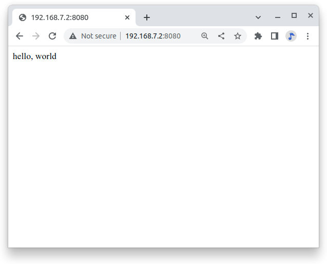

Adding a template
*******************

Let’s improve our “hello, world” application, by using an HTML template and a 
CSS file for styling our page.  Note: these have been created for you in the 
“templates” sub-folder. So, we will create a file named *index1.html*, 
that has been saved in */templates*.

Here's what's in *templates/index1.html*:

.. _flask_index1:

Python code for flask hello world (helloWorld.py)

.. code-block:: html

  include::code/flask/templates/index1.html

Note: a style sheet (style.css) is also included. This will be populated later.

Observe that anything in double curly braces within the HTML template is interpreted 
as a variable that would be passed to it from the Python script via the render_template 
function. Now, let’s create a new Python script. We will name it app1.py:

.. _flask_app1:

Python code for flask index1.html (app1.py)

.. code-block:: html

  include::code/flask/app1.py[app1]

Note that we create a formatted string("timeString") using the date and time from the "now" object, that has the current time stored on it.

Next important thing on the above code, is that we created a dictionary of variables (a set of keys, such as the title that is associated with values, such as HELLO!) to pass into the template. On “return”, we will return the index.html template to the web browser using the variables in the templateData dictionary.

Execute the Python script:

.. code-block:: bash

  bone$ .\app.py

Open any web browser and browse to 192.168.7.2:8080. You should see:

.. _flask_app1_fig:

Test page served by app1.py

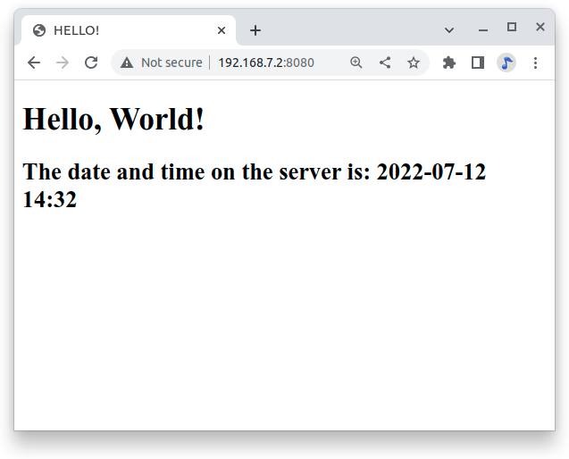

Note that the page’s content changes dynamically any time that you refresh 
it with the actual variable data passed by Python script. In our case, 
“title” is a fixed value, but “time” change it every second.

Displaying GPIO Status in a Web Browser - reading a button
-----------------------------------------------------------

Problem
*********

You want a web page to display the status of a GPIO pin.

Solution
*********

This solution builds on the Flask-based web server solution in :ref:`<networking_nodejs>`.  

To make this recipe, you will need:

* Breadboard and jumper wires (see :ref:`<app_proto>`)
* Pushbutton switch (see :ref:`<app_misc>`)

Wire your pushbutton as shown in :ref:`<js_pushbutton_fig>`. 

Wire a button to *P9_11* and have the web page display the value of the button.

Let’s use a new Python script named *app2.py*.

.. _flask_app2:

A simple Flask-based web server to read a GPIO (app2.py)

.. code-block:: python

  include::code/flask/app2.py

Look that what we are doing is defining the button on *P9_11* as input, reading its value and 
storing it in *buttonSts*. Inside the function *index()*, we will pass that value to our web 
page through “button” that is part of our variable dictionary: *templateData*.

Let’s also see the new *index2.html* to show the GPIO status:

.. _flask_index2:

A simple Flask-based web server to read a GPIO (index2.html)

.. code-block:: html

  include::code/flask/templates/index2.html[]

Now, run the following command:

.. code-block:: bash

  bone$ ./app2.py

Point your browser to _http://192.168.7.2:8080_, and the 
page will look like :ref:`<networking_GPIOserver_fig>`.

.. _flask_app2_fig:

Status of a GPIO pin on a web page

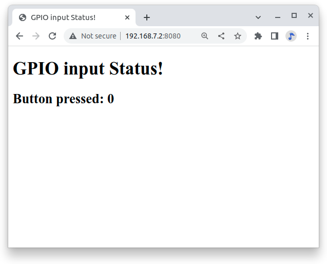

Currently, the +0+ shows that the button isn't pressed. 
Try refreshing the page while pushing the button, and you will see +1+ displayed.

Discussion
***********

It's not hard to assemble your own HTML with the GPIO data. It's an easy extension to write a program to display the status of all the GPIO pins.

Controlling GPIOs
------------------

Problem
*********

You want to control an LED attached to a GPIO pin.

Solution
*********

Now that we know how to “read” GPIO Status, let’s change them. What we will do will control the LED via 
the web page. We have an LED connected to *P9_14*. Controlling remotely we will change 
its status from LOW to HIGH and vice-versa.

The python script Let’s create a new Python script and named it *app3.py*.

.. _flask_app3:

A simple Flask-based web server to read a GPIO (app3.py)

.. code-block:: python

  include::code/flask/app3.py

What we have new on above code is the new “route”:

@app.route("/<deviceName>/<action>")

From the webpage, calls will be generated with the format:

http://192.168.7.2:8081/ledRed/on

or

http://192.168.7.2:8081/ledRed/off

For the above example, *ledRed* is the “deviceName” and *on* or *off* are examples of 
possible “action”. Those routes will be identified and properly “worked”. The main steps are:

* Convert the string “ledRED”, for example, on its equivalent GPIO pin.

The integer variable ledRed is equivalent to P9_14. We store this value on variable “actuator”

* For each actuator, we will analyze the “action”, or “command” and act properly.
If “action = on” for example, we must use the command: GPIO.output(actuator, GPIO.HIGH)

* Update the status of each actuator
* Update the variable library
* Return the data to index.html

Let’s now create an index.html to show the GPIO status of each actuator and more important, create “buttons” to send the commands:

.. _flask_index3:

A simple Flask-based web server to write a GPIO (index3.html)

.. code-block:: html

  include::code/flask/templates/index3.html

.. code-block:: bash

  bone$ ./app3.py

Point your browser as before and you will see:

.. _flask_app3_fig:

Status of a GPIO pin on a web page

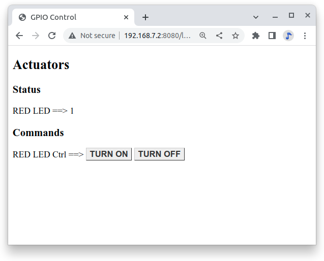

Try clicking the "TURN ON" and "TURN OFF" buttons and your LED will respond.

*app4.py* and *app5.py* combine the previous apps.  Try them out.

Plotting Data
---------------

Problem
*********

You have live, continuous,  data coming into your Bone via one of the Analog Ins, and you want to plot it.

Solution
*********

Analog in - Continuous
(This is based on information at: http://software-dl.ti.com/processor-sdk-linux/esd/docs/latest/linux/Foundational_Components/Kernel/Kernel_Drivers/ADC.html#Continuous%20Mode)

Reading a continuous analog signal requires some set up. First go to the iio devices directory.

.. code-block:: bash

  bone$ cd /sys/bus/iio/devices/iio:device0
  bone$ ls -F
  buffer/  in_voltage0_raw  in_voltage2_raw  in_voltage4_raw  in_voltage6_raw  name      power/          subsystem@
  dev      in_voltage1_raw  in_voltage3_raw  in_voltage5_raw  in_voltage7_raw  of_node@  scan_elements/  uevent

Here you see the files used to read the one shot values. Look in +scan_elements+ to see how to enable continuous input.

.. code-block:: bash

  bone$ ls scan_elements
  in_voltage0_en     in_voltage1_index  in_voltage2_type   in_voltage4_en     in_voltage5_index  in_voltage6_type
  in_voltage0_index  in_voltage1_type   in_voltage3_en     in_voltage4_index  in_voltage5_type   in_voltage7_en
  in_voltage0_type   in_voltage2_en     in_voltage3_index  in_voltage4_type   in_voltage6_en     in_voltage7_index
  in_voltage1_en     in_voltage2_index  in_voltage3_type   in_voltage5_en     in_voltage6_index  in_voltage7_type

Here you see three values for each analog input, _en (enable), _index (index of this channel in the buffer’s chunks) and _type (How the ADC stores its data). (See the link above for details.) Let's use the input at *P9.40* which is *AIN1*. To enable this input:

.. code-block:: bash

  bone$ echo 1 > scan_elements/in_voltage1_en

Next set the buffer size.

.. code-block:: bash

  bone$ ls buffer
  data_available  enable  length  watermark

Let's use a 512 sample buffer. You might need to experiment with this.

.. code-block:: bash

  bone$ echo 512 > buffer/length

  Then start it running.

.. code-block:: bash

  bone$ echo 1 > buffer/enable

  Now, just read from +/dev/iio:device0+.

.. _analog_sine_fig:

1KHz sine wave sampled at 8KHz

.. figure:: figures/Sine1k.png
  :align: center
  :alt: 1KHz sine wave sampled at 8KHz

An example Python program that does the above and the reads and 
plot the buffer is here: analogInContinuous.py 

.. _analog_code:

Code to read and plot a continuous analog input(analogInContinuous.py)

.. code-block:: python

  include::code/analogInContinuous.py[]

Be sure to read the instillation instructions in the comments. Also note this uses X 
windows and you need to +ssh -X 192.168.7.2+ for X to know where the display is.

Run it:

.. code-block:: bash

  host$ ssh -X bone

  bone$ cd <Cookbook repo>/doc/06iot/code>/strong>
  bone$ ./analogInContinuous.py
  Hit ^C to stop

// TODO verify this works. fonts are taking too long to load

:ref:`<analog_sine_fig>` is the output of a 1KHz sine wave.

It's a good idea to disable the buffer when done.

.. code-block:: bash

  bone$ echo 0 > /sys/bus/iio/devices/iio:device0/buffer/enable

Analog in - Continuous, Change the sample rate
***********************************************

The built in ADCs sample at 8k samples/second by default. 
They can run as fast as 200k samples/second by editing a device tree.

.. code-block:: bash

  bone$ cd /opt/source/bb.org-overlays
  bone$ make

This will take a while the first time as it compiles all the device trees.

.. code-block:: bash

  bone$ vi src/arm/src/arm/BB-ADC-00A0.dts

Around line 57 you'll see

.. code-block:: bash

  Line    Code
  57     // For each step, number of adc clock cycles to wait between setting up muxes and sampling.
  58     //  range: 0 .. 262143
  59     //  optional, default is 152 (XXX but why?!)
  60     ti,chan-step-opendelay = <152 152 152 152 152 152 152 152>;
  61     //`
  62     // XXX is there any purpose to set this nonzero other than to fine-tune the sample rate?
  63 
  64 
  65     // For each step, how many times it should sample to average.
  66     //  range: 1 .. 16, must be power of two (i.e. 1, 2, 4, 8, or 16)
  67     //  optional, default is 16
  68     ti,chan-step-avg = <16 16 16 16 16 16 16 16>;

The comments give lots of details on how to adjust the device tree  to change the sample rate.
Line 68 says for every sample returned, average 16 values. This will give you a cleaner signal, but if you want to go fast, change the 16's to 1's. Line 60 says to delay 152 cycles between each sample. Set this to 0 to got as fast a possible.

.. code-block:: bash

  ti,chan-step-avg = <1 1 1 1 1 1 1 1>;
  ti,chan-step-opendelay = <0x00 0x00 0x00 0x00 0x00 0x00 0x00 0x00>;

Now compile it.

.. code-block:: bash

  bone$ make
    DTC     src/arm/BB-ADC-00A0.dtbo
  gcc -o config-pin ./tools/pmunts_muntsos/config-pin.c

It knows to only recompile the file you just edited. Now install and reboot.

.. code-block:: bash

  bone$ sudo make install
  ...
  'src/arm/AM335X-PRU-UIO-00A0.dtbo' -> '/lib/firmware/AM335X-PRU-UIO-00A0.dtbo'
  'src/arm/BB-ADC-00A0.dtbo' -> '/lib/firmware/BB-ADC-00A0.dtbo'
  'src/arm/BB-BBBMINI-00A0.dtbo' -> '/lib/firmware/BB-BBBMINI-00A0.dtbo'
  ...
  bone$ reboot

A number of files get installed, including the ADC file. Now try rerunning.

.. code-block:: bash

  bone$ cd <Cookbook repo>/docs/06iot/code>
  bone$ ./analogInContinuous.py
  Hit ^C to stop

Here's the output of a 10KHz sine wave. 

// TODO  Is this trun: (The plot is wrong, but eLinux won't let me fix it.)

.. _analog_tri_fig:

10KHz triangle wave sampled at 200KHz

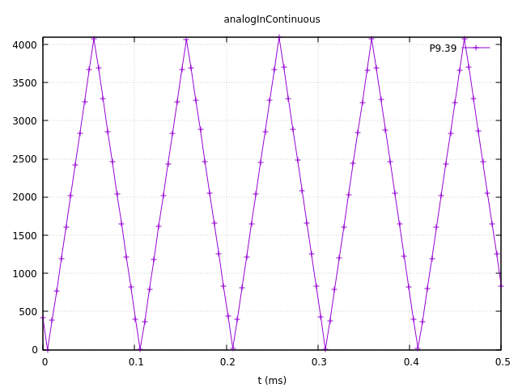

It's still a good idea to disable the buffer when done.

.. code-block:: bash

  bone$ echo 0 > /sys/bus/iio/devices/iio:device0/buffer/enable

Sending an Email
---------------------

Problem
*********

You want to send an email via Gmail from the Bone.

Solution
*********

This example came from https://realpython.com/python-send-email/.
First, you need to `set up a Gmail account <https://mail.google.com>`_, if you don't already have one. 
Then add the code in :ref:`<networking_nodemailer_code>` to a file named _emailTest.py_. Substitute your own Gmail username.  For the password:

* Go to: https://myaccount.google.com/security
* Select App password.
* Generate your own 16 char password and copy it into _emailTest.py_.
* Be sure to delete password when done https://myaccount.google.com/apppasswords .

.. _networking_nodemailer_code:

Sending email using nodemailer (emailtTest.py)

.. code-block:: python

  include::code/emailTest.py

Then run the script to send the email:

.. code-block:: bash

  bone$ chmod +x emailTest.py
  bone$ .\emailTest.py

.. warning:: This solution requires your Gmail password to be in plain text in a file, which is a security problem. Make sure you know who has access to your Bone. Also, if you remove the microSD card, make sure you know who has access to it. Anyone with your microSD card can read your Gmail password.

Discussion
*********

Be careful about putting this into a loop.  Gmail presently limits you to 
`500 emails per day and 10 MB per message <http://group-mail.com/email-marketing/how-to-send-bulk-emails-using-gmail/>`_.

See https://realpython.com/python-send-email/ for an example that sends an attached file.

Sending an SMS Message
-------------------------

// TODO  My twilio account is suspended.

Problem
*********

You want to send a text message from BeagleBone Black.

Solution
*********

There are a number of SMS services out there. This recipe uses Twilio because you can use it for free, but you will need to http://bit.ly/1MrHBBF[verify the number] to which you are texting. First, go to https://www.twilio.com/[Twilio's home page] and set up an account. Note your account SID and authorization token. If you are using the free version, be sure to http://bit.ly/19c7GZ7[verify your numbers].

Next, install Trilio by using the following command:

.. code-block:: bash

  bone$ npm install -g twilio

Finally, add the code in :ref:`<networking_twilio_code>` to a file named _twilio-test.js_ and run it. Your text will be sent.

.. _networking_twilio_code:

Sending SMS messages using Twilio (_twilio-test.js_)

.. code-block:: JavaScript

  include::code/twilio-test.js[nodemailer-test.js]

Discussion
*********

Twilio allows a small number of free text messages, enough to test your code and to play around some.

Displaying the Current Weather Conditions
-------------------------------------------

Problem
*********

You want to display the current weather conditions.

Solution
*********

Because your Bone is on the network, it's not hard to access the current weather conditions from a weather API. 

* Go to https://openweathermap.org/ and create an account.
* Go to https://home.openweathermap.org/api_keys and get your API key.
* Store your key in the +bash+ variable +APPID+.

.. code-block:: bash

  bash$ export APPID="Your key"

* Then add the code in :ref:`<networking_weather_code>` to a file named _weather.js_.
* Run the pyhon script.

.. _networking_weather_code:

Code for getting current weather conditions (_weather.py_)

.. code-block:: python

  include::code/weather.py

<1> Prints current conditions.
<2> Prints the forecast for the next day.
<3> Prints everything returned by the weather site.

Run this by using the following commands:

.. code-block:: bash

  bone$ chmod +x weather.py
  bone$ ./weather.js
  Getting weather
  Temp:  85.1
  Humid: 50
  Low:   62.02
  High:  85.1
  sunrise: 2022-07-14 14:32:46

Discussion
*********

The weather API returns lots of information. Use Python to extract the information you want.

Sending and Receiving Tweets
-------------------------------

Problem
*********

You want to send and receive tweets (Twitter posts) with your Bone.

Solution
*********

`Twitter <https://twitter.com/>`_ has a whole `git repo <https://github.com/twitterdev/Twitter-API-v2-sample-code>`_ 
of sample code for interacting with Twitter.  Here I'll show how to create a tweet and then how to delete it.

Creating a Project and App
****************************

* Follow the https://developer.twitter.com/en/docs/apps/overview[directions here] to create a project and and app. 
* Be sure to giv eyour app Read and Write permission.
* Then go to the https://developer.twitter.com/en/portal/projects-and-apps[developer portal] and select you app by clicking on the gear icon to the right of the app name.  
* Click on the *Keys and tokens* tab. Here you can get to all your keys and tokens.  

.. tip:: Be sure to record them, you can't get them later.

* Open the file +twitterKeys.sh+ and record your keys in it.

.. code-block:: bash

  export API_KEY='XXX'
  export API_SECRET_KEY='XXX'
  export BEARER_TOKEN='XXX'
  export TOKEN='4XXX'
  export TOKEN_SECRET='XXX'

* Next, source the file so the values will appear in your bash session.

.. code-block:: bash

  bash$ source twitterKeys.sh

You'll need to do this every time you open a new +bash+ window.

Creating a tweet
****************************
Add the code in :ref:`<twitter_create_code>` to a file called _twitter_create_tweet_.py_ and run it to see your timeline.

.. _twitter_create_code:

Create a Tweet (_twitter_create_tweet.py_)

.. code-block:: python

  include::code/twitter_create_tweet.py[]

Run the code and you'll have to authorize.

.. code-block:: bash

  bash$ ./twitter_create_tweet.py
  Got OAuth token: tWBldQAAAAAAWBJgAAABggJt7qg
  Please go here and authorize: https://api.twitter.com/oauth/authorize?oauth_token=tWBldQAAAAAAWBJgAAABggJt7qg
  Paste the PIN here: 4859044
  Response code: 201
  {
      "data": {
          "id": "1547963178700533760",
          "text": "Hello world!"
      }
  }

Check your twitter account and you'll see the new tweet.
Record the *id* number and we'll use it next to delete the tweet.

Deleting a tweet
****************************

Use the code in :ref:`<twitter_delete_code>` to delete a tweet.  Around line 15 is the *id* number.  Paste in the value returned above.

.. _twitter_delete_code:

.Code to delete a tweet  (twitter_delete_tweet.py_)

.. code-block:: python

  include::code/twitter_delete_tweet.py

// TODO  Start Here
The code in :ref:`<networking_pushbutton_code>` sends a tweet whenever a button is pushed.

.. _networking_pushbutton_code:
.Tweet when a button is pushed (twitterPushbutton.js)

.. code-block:: JavaScript

  include::code/twitterPushbutton.js

To see many other examples, go to `iStrategyLabs' node-twitter GitHub page <http://bit.ly/18AvSTW>`_.

Discussion
*********

This opens up many new possibilities. You can read a temperature sensor and tweet its 
value whenever it changes, or you can turn on an LED whenever a certain hashtag 
is used. What are you going to tweet?

.. _networking_node_red:

Wiring the IoT with Node-RED
-----------------------------

Problem
*********

You want BeagleBone to interact with the Internet, 
but you want to program it graphically.

Solution
*********

http://nodered.org/[Node-RED] is a visual tool for wiring the IoT. 
It makes it easy to turn on a light when a certain hashtag is tweeted, 
or spin a motor if the forecast is for hot weather.

Installing Node-RED
*********************

To install Node-RED, run the following commands:

.. code-block:: bash

  bone$ cd          # Change to home directory
  bone$ git clone https://github.com/node-red/node-red.git
  bone$ cd node-red/
  bone$ npm install --production    # almost 6 minutes
  bone$ cd nodes
  bone$ git clone https://github.com/node-red/node-red-nodes.git # 2 seconds
  bone$ cd ~/node-red

To run Node-RED, use the following commands:

.. code-block:: bash

  bone$ cd ~/node-red
  bone$ node red.js
  Welcome to Node-RED

- 18 Aug 16:31:43 - [red] Version: 0.8.1.git
- 18 Aug 16:31:43 - [red] Loading palette nodes
- 18 Aug 16:31:49 - [26-rawserial.js] Info : only really needed for 
  Windows boxes without serialport npm module installed.
- 18 Aug 16:31:56 - ------------------------------------------
- 18 Aug 16:31:56 - [red] Failed to register 44 node types
- 18 Aug 16:31:56 - [red] Run with -v for details
- 18 Aug 16:31:56 - ------------------------------------------
- 18 Aug 16:31:56 - [red] Server now running at http://127.0.0.1:1880/
- 18 Aug 16:31:56 - [red] Loading flows : flows_yoder-debian-bone.json

The second-to-last line informs you that Node-RED is listening on part +1880+. Point your browser to http://192.168.7.2:1880, and you will see the screen shown in :ref:`<networking_node_red_fig>`.

.. _networking_node_red_fig:

The Node-RED web page

.. figure:: figures/node-red.png
  :align: center
  :alt: node-red

Building a Node-RED Flow
****************************
The example in this recipe builds a Node-RED flow that will toggle an LED whenever a certain hashtag is tweeted. But first, you need to set up the Node-RED flow with the +twitter+ node:

- On the Node-RED web page, scroll down until you see the +social+ nodes on the left side of the page.
- Drag the +twitter+ node to the canvas, as shown in :ref:`<networking_node_twitter_fig>`.

.. _networking_node_twitter_fig:

Node-RED twitter node

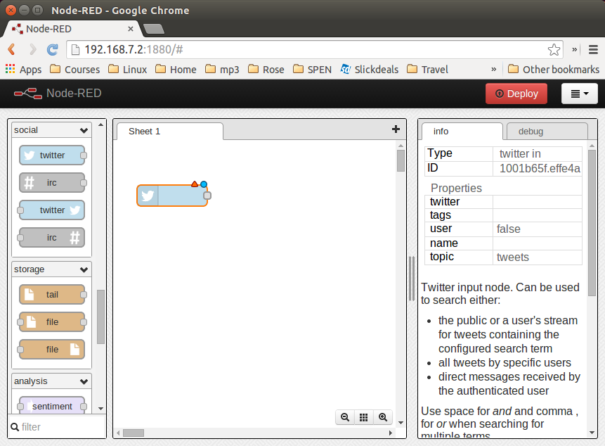

.. [start=3]
. Authorize Twitter by double-clicking the +twitter+ node. You'll see the screen shown in :ref:`<networking_node_twitter_auth_fig>`.

.. _networking_node_twitter_auth_fig:

Node-RED Twitter authorization, step 1

.. figure:: figures/node-twitter-auth.png
  :align: center
  :alt: node-red authentication

.. [start=4]
. Click the pencil button to bring up the dialog box shown in :ref:`<networking_node_twitter_auth2_fig>`.

.. _networking_node_twitter_auth2_fig:

Node-RED twitter authorization, step 2

.. figure:: figures/node-twitter-auth2.png
  :align: center
  :alt: node-red authentication2

.. [start=5]

- Click the "here" link, as shown in :ref:`<networking_node_twitter_auth2_fig>`, and you'll 
be taken to Twitter to authorize Node-RED.

- Log in to Twitter and click the "Authorize app" button (:ref:`<networking_node_twitter_auth3_fig>`).

.. _networking_node_twitter_auth3_fig:

Node-RED Twitter site authorization

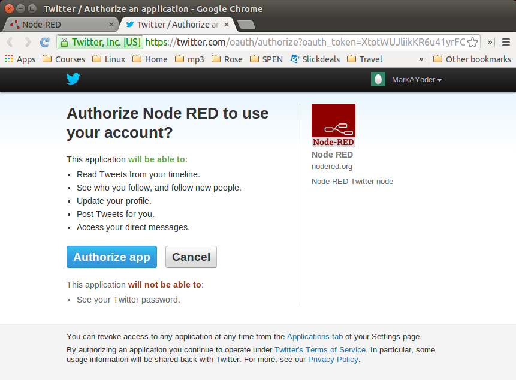

.. [start=7]

- When you're back to Node-RED, click the Add button, add your Twitter credentials, 
enter the hashtags to respond to (:ref:`<networking_node_twitter_beagle_fig>`), and then 
click the Ok pass:[button].

.. _networking_node_twitter_beagle_fig:

Node-RED adding the #BeagleBone hashtag

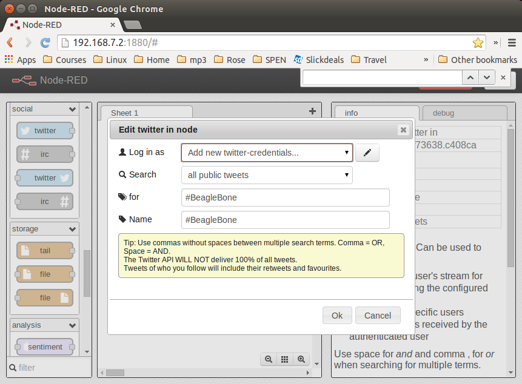

.. [start=8]
- Go back to the left panel, scroll up to the top, and then drag the +debug+ node to the canva- (+debug+ is in the +output+ section.)
- Connect the two nodes by clicking and dragging (:ref:`<networking_node_twitter_debug_fig>`).

.. _networking_node_twitter_debug_fig:

Node-RED Twitter adding +debug+ node and connecting

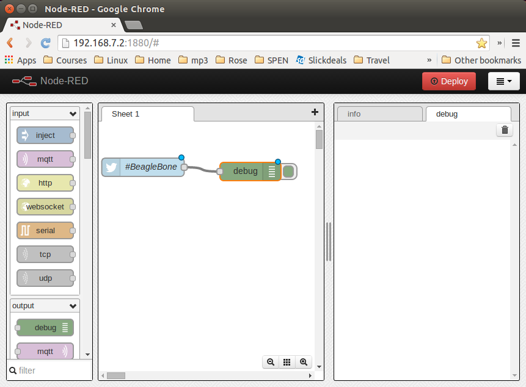

.. [start=10]

- In the right panel, in the upper-right corner, click the "debug" tab.
- Finally, click the Deploy button above the "debug" tab.

Your Node-RED flow is now running on the Bone. Test it by going to Twitter and tweeting something with the hashtag +#BeagleBone+. Your Bone is now responding to events happening out in the world.

Adding an LED Toggle
***********************

Now, we're ready to add the LED toggle:

- Wire up an LED as shown in :ref:`<displays_externalLED>`. Mine is wired to +P9_14+.  
- Scroll to the bottom of the left panel and drag the +bbb-discrete-out+ node (second from the bottom of the +bbb+ nodes) to the canvas and wire it (:ref:`<networking_node_bbb_out_fig>`).

.. _networking_node_bbb_out_fig:

Node-RED adding bbb-discrete-out node

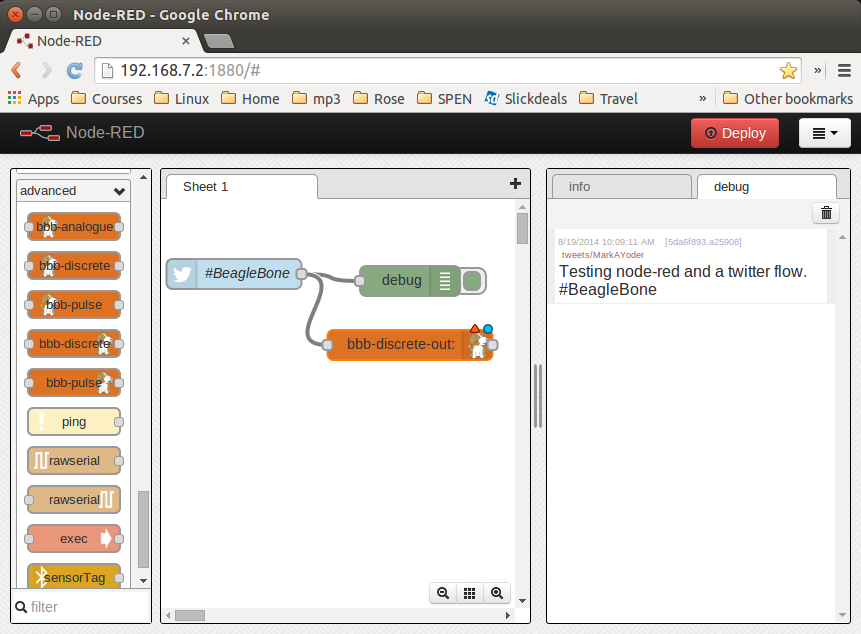

.. [start=3]

Double-click the node, select your GPIO pin and "Toggle state," 
and then set "Startup as" to +1+ (:ref:`<networking_node_bbb_out_setup_fig>`).

.. _networking_node_bbb_out_setup_fig:

Node-RED adding bbb-discrete-out configuration

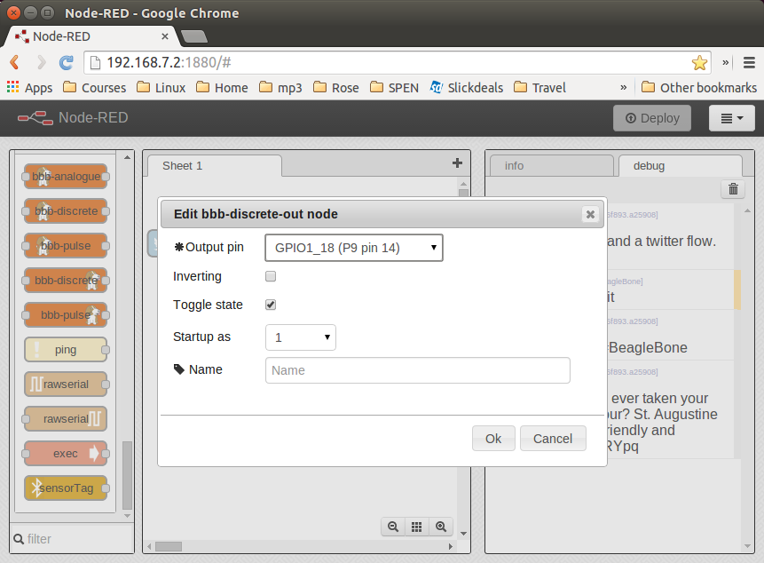

.. [start=4]

Click Ok and then Deploy.

Test again. The LED will toggle every time the hashtag +#BeagleBone+ is tweeted. With a little more exploring, you should be able to have your Bone ringing a bell or spinning a motor in response to tweets.

Discussion
***********

Communicating over a Serial Connection to an Arduino or LaunchPad
-------------------------------------------------------------------

Problem
*********

You would like your Bone to talk to an Arduino or LaunchPad.

Solution
*********

The common serial port (also know as a UART) is the simplest way to 
talk between the two.  Wire it up as shown in :ref:`<networking_launchPad_fig>`.

.. warning:: 
  BeagleBone Black runs at 3.3 V. When wiring other devices to it, 
  ensure that they are also 3.3 V. The LaunchPad I'm using is 3.3 V, 
  but many Arduinos are 5.0 V and thus won't work. Or worse, 
  they might damage your Bone.

.. _networking_launchPad_fig:

Wiring a LaunchPad to a Bone via the common serial port

.. figure:: figures/launchPad_bb.png
  :align: center
  :alt: MSP430 LaunchPad

Add the code (or _sketch_, as it's called in Arduino-speak) in :ref:`<js_launchPad_code>` 
to a file called _launchPad.ino_ and run it on your LaunchPad.

.. _js_launchPad_code:

LaunchPad code for communicating via the UART (launchPad.ino)

.. code-block:: C

  include::code/launchPad/launchPad.ino

1. Set the mode for the built-in red and green LEDs.

2. Start the serial port at 9600 baud.

3. Prompt the user, which in this case is the Bone.

4. Set the LEDs to the current values of the +red+ and +green+ variables.

5. Wait for characters to arrive on the serial port.

6. After the characters are received, read it and respond to it.

On the Bone, add the script in :ref:`<js_launchPadBeagle_code>` to a file called _launchPad.js_ and run it.

.. _js_launchPadBeagle_code:

Code for communicating via the UART (launchPad.js)

.. code-block:: C

  include::code/launchPad.js

1. Select which serial port to use. :ref:`<networking_cape-headers-serial_fig>` shows what's available. We've wired +P9_24+ and +P9_26+, so we are using serial port +/dev/ttyO1+. (Note that's the letter _O_ and not the number _zero_.)

2. Set the baudrate to 9600, which matches the setting on the LaunchPad.

3. Read one line at a time up to the newline character (+\n+).

4. Open the serial port and call +onSerial()+ whenever there is data available.

5. Determine what event has happened on the serial port and respond to it.

6. If the serial port has been ++open++ed, start calling +sendCommand()+ every 1000 ms.

7. These are the two commands to send.

8. Write the character out to the serial port and to the LaunchPad.

9. Move to the next command.

.. _networking_cape-headers-serial_fig:

.. figure:: figures/cape-headers-serial.png
  :align: center
  :alt: UART outputs

  Table of UART outputs

Discussion
************

When you run the script in :ref:`<js_launchPadBeagle_code>`, the Bone opens up the 
serial port and every second sends a new command, either +r+ or +g+. 
The LaunchPad waits for the command and, when it arrives, responds by toggling the corresponding LED.
