.. _pru-cookbook-case:

Case Studies - Introduction
#############################

It's an exciting time to be making projects that use embedded processors.  
Make:'s `Makers' Guide to Boards <https://makezine.com/comparison/boards/>`_ shows
many of the options that are available and groups them into different types.  
*Single board computers* (SBCs) generally run Linux on some sort of `ARM <https://www.arm.com/>`_
processor.  Examples are the BeagleBoard and the Raspberry Pi.  Another type
is the *microcontroller*, of which the `Arduino <https://www.arduino.cc/>`_ is 
popular.  

The SBCs are used because they have an operating system to manage files, I/O, 
and schedule when things are run, all while possibly talking to the Internet.  
Microcontrollers shine when things 
being interfaced require careful timing and can't afford to have an OS preempt an 
operation.

But what if you have a project that needs the flexibility of an OS and the timing 
of a microcontroller?  This is where the BeagleBoard excels since it has both 
an ARM procssor running Linux and two footnote:[Four if you are on the BeagleBone AI];
**P**rogrammable **R**eal-Time **U**nits (PRUs).
The PRUs have 32-bit cores which run
independently of the ARM processor, therefore they can
be programmed to respond quickly to inputs and produce very precisely timed 
outputs. 

There are many :ref:`Projects <pru-cookbook-projects>` that use the PRU.
They are able to do things that can't be done with just a SBC or just a microcontroller. 
Here we present some case studies that give a high-level view of using the PRUs. In later
chapters you will see the details of how they work.

Here we present:

.. TODO Switch from LEDscape to FPP

* `Robotics Control Library <http://strawsondesign.com/docs/roboticscape/>`_
* `BeagleLogic <https://github.com/abhishek-kakkar/BeagleLogic/wiki>`_
* `NeoPixels -- 5050 RGB LEDs with Integrated Drivers (Falcon Christmas) <http://falconchristmas.com>`_
* `RGB LED Matrix (Falcon Christmas) <http://falconchristmas.com>`_
* `simpPRU -- A python-like language for programming the PRUs`_ <https://github.com/VedantParanjape/simpPRU>
.. * `MachineKit <http://www.machinekit.io/>`_
.. * `ArduPilot <http://ardupilot.org/>, <http://ardupilot.org/dev/docs/beaglepilot.html>`_
.. * `BeagleScope <https://github.com/ZeekHuge/BeagleScope>`_

The following are resources used in this chapter.

.. admonition:: Resources

   * `Pocket Beagle System Reference Manual https://github.com/beagleboard/pocketbeagle/wiki/System-Reference-Manual#673_PRUICSS_Pin_Access`_
   * `BeagleBone Black P8 Header Table https://github.com/derekmolloy/exploringBB/blob/master/chp06/docs/BeagleboneBlackP8HeaderTable.pdf`_
   * `BeagleBone Black P9 Header Table https://github.com/derekmolloy/exploringBB/blob/master/chp06/docs/BeagleboneBlackP9HeaderTable.pdf`_
   * `BeagleBone AI System Reference Manual https://github.com/beagleboard/beaglebone-ai/wiki/System-Reference-Manual`_

Robotics Control Library
-------------------------

Robotics is an embedded application that often requires both an SBC to control the 
high-level tasks (such as path planning, line following, communicating with the user)
*and* a microcontroller to handle the low-level tasks (such as telling motors how fast
to turn, or how to balance in response to an IMU input).  The 
`EduMIP <https://www.ucsdrobotics.org/edumip>`_ balancing 
`robot <https://www.hackster.io/edumip/edumip-13a29c>`_ 
demonstrates that by using the PRU, the Blue can handle both the high 
and low -level tasks without an additional microcontroller. The EduMIP is shown 
in :ref:`<case_blue>`.

.. _case_blue:

Blue balancing
~~~~~~~~~~~~~~~

.. figure:: figures/blue.png
   :align: center
   :alt: Blue balancing

The `Robotics Control Library <http://strawsondesign.com/docs/roboticscape/>`_ is a 
package that is already installed on the Beagle 
that contains a C library and example/testing programs. It uses the PRU to extend the 
real-time hardware of the Bone by adding eight addional servo channels and one 
addition real-time encoder input.

The following examples show how easy it is to use the PRU for robotics.

Controlling Eight Servos
*************************

Problem
~~~~~~~~

You need to control eight servos, but the Bone doesn't have enough pulse width 
modulation (PWM) channels
and you don't want to add hardware.  

Solution
~~~~~~~~~

The Robotics Control Library provides eight additional PWM channels 
via the PRU that can be used out of the box. 

.. note::
   The I/O pins on the Beagles have a mutliplexer that lets you select what I/O 
   appears on a given pin.  The Blue has the mux already configured to to run these
   examples.  Follow the instructions in 
   :ref:`../03details/details.html#details_configure_servos, Configuring Pins for Controlling Servos` 
   to configure the pins for the Black and the Pocket.

.. * TODO - verify these commands

Just run:

.. code-block:: bash

   bone$ sudo rc_test_servos -f 10 -p 1.5

The ``-f 10`` says to use a frequency of 10 Hz and the ``-p 1.5`` says to set the position to ``1.5``.  The range of positions is
``-1.5`` to ``1.5``.   Run ``rc_test_servos -h`` to see all the options.

.. code-block:: bash

   bone$ rc_test_servos -h

   Options
   -c {channel}   Specify one channel from 1-8.
                  Otherwise all channels will be driven equally
   -f {hz}        Specify pulse frequency, otherwise 50hz is used
   -p {position}  Drive servo to a position between -1.5 & 1.5
   -w {width_us}  Send pulse width in microseconds (us)
   -s {limit}     Sweep servo back/forth between +- limit
                  Limit can be between 0 & 1.5
   -r {ch}        Use DSM radio channel {ch} to control servo
   -h             Print this help messege 

   sample use to center servo channel 1:
      rc_test_servo -c 1 -p 0.0

Discussion
~~~~~~~~~~~

The BeagleBone Blue sends these eight outputs to it's servo channels.  The others use the pins shown in the 
:ref:`case__register_to_pin_table`.

.. _case__register_to_pin_table:

PRU register to pin table
~~~~~~~~~~~~~~~~~~~~~~~~~~

.. table::

   +-----------+--------+---------+----------+-------+
   |PRU pin    |Blue pin|Black pin|Pocket pin|AI pin |
   +===========+========+=========+==========+=======+
   |pru1_r30_8 |1       |P8_27    |P2.35     |       |
   +-----------+--------+---------+----------+-------+
   |pru1_r30_10|2       |P8_28    |P1.35     |P9_42  |
   +-----------+--------+---------+----------+-------+
   |pru1_r30_9 |3       |P8_29    |P1.02     |P8_14  |
   +-----------+--------+---------+----------+-------+
   |pru1_r30_11|4       |P8_30    |P1.04     |P9_27  |
   +-----------+--------+---------+----------+-------+
   |pru1_r30_6 |5       |P8_39    |          |P8_19  |
   +-----------+--------+---------+----------+-------+
   |pru1_r30_7 |6       |P8_40    |          |P8_13  |
   +-----------+--------+---------+----------+-------+
   |pru1_r30_4 |7       |P8_41    |          |       |
   +-----------+--------+---------+----------+-------+
   |pru1_r30_5 |8       |P8_42    |          |P8_18  |
   +-----------+--------+---------+----------+-------+

You can find these details in the 
`P8 Header Table <https://github.com/derekmolloy/exploringBB/blob/master/chp06/docs/BeagleboneBlackP8HeaderTable.pdf>`_, 
`P9 Header Table <https://github.com/derekmolloy/exploringBB/blob/master/chp06/docs/BeagleboneBlackP9HeaderTable.pdf>`_, 
`Pocket Beagle System Reference Manual <https://github.com/beagleboard/pocketbeagle/wiki/System-Reference-Manual#673_PRUICSS_Pin_Access>`_ 
(Here is a more usable version of the `table <https://docs.google.com/spreadsheets/d/1FRGvYOyW1RiNSEVprvstfJAVeapnASgDXHtxeDOjgqw/edit?usp=sharing>`_.)
and
`BeagleBone AI System Reference Manual <https://github.com/beagleboard/beaglebone-ai/wiki/System-Reference-Manual>`_.
(Here is a more usable version of the `table <https://docs.google.com/spreadsheets/d/1dFSBVem86vAUD7MLXvqdS-N0Efi8_g_O1iTqzql8DAo/edit#gid=0>`_.)

Be default the PRUs are already loaded with the code needed to run the
servos.  All you have to do is run the command.

.. [/opt/source/Robotics_Cape_Installer/pru_firmware/src/pru1-servo.asm]

Controlling Individual Servos
******************************

Problem
~~~~~~~~~

``rc_test_servos`` is nice, but I need to control the servos individually.

Solution
~~~~~~~~~

You can modify ``rc_test_servos.c``.  You'll find it on the bone online at
https://github.com/beagleboard/librobotcontrol/blob/master/examples/src/rc_test_servos.c.

Just past line 250 you'll find a ``while`` loop that has calls to ``rc_servo_send_pulse_normalized(ch,servo_pos)`` and
``rc_servo_send_pulse_us(ch, width_us)``.  The first call sets the pulse width relative to the pulse period; the other
sets the width to an absolute time.  Use whichever works for you.

Controlling More Than Eight Channels
*************************************

Problem
~~~~~~~~~~

I need more than eight PWM channels, or I need less jitter on the off time.

Solution
~~~~~~~~~~

This is a more advanced problem and required reprograming the PRUs.  See 
:ref:`../05blocks/blocks.html#blocks_pwm, PWM Generator` for an example.

Reading Hardware Encoders
**************************

Problem
~~~~~~~~~~

I want to use four encoders to measure four motors, but I only see hardware for three.

Solution
~~~~~~~~~~

The forth encoder can be implemented on the PRU. If you run ``rc_test_encoders_eqep`` on the Blue, you will see the output of 
encoders E1-E3 which are connected to the eEQP hardware.

.. code-block:: bash

   bone$ *rc_test_encoders_eqep* 

   Raw encoder positions
         E1   |      E2   |      E3   | 
            0 |         0 |         0 |^C

You can also access these hardware encoders on the Black and Pocket using the 
pins shown in :ref:`case_pin_mapping`.

.. _case_pin_mapping:

eQEP to pin mapping
~~~~~~~~~~~~~~~~~~~~
.. table::

   +----+--------+-----------+-----------+--------+--------+------------+-------------+
   |eQEP|Blue pin|Black pin A|Black pin B|AI pin A|AI pin B|Pocket pin A|Pocket pin B |
   +====+========+===========+===========+========+========+============+=============+
   |0   |E1      |P9_42B     |P9_27      |        |        |P1.31       |P2.24        |
   +----+--------+-----------+-----------+--------+--------+------------+-------------+
   |1   |E2      |P8_35      |P8_33      |P8_35   |P8_33   |P2.10       |             |
   +----+--------+-----------+-----------+--------+--------+------------+-------------+
   |2   |E3      |P8_12      |P8_11      |P8_12   |P8_11   |P2.24       |P2.33        |
   +----+--------+-----------+-----------+--------+--------+------------+-------------+
   |2   |        |P8_41      |P8_42      |P9_19   |P9_41   |            |             |
   +----+--------+-----------+-----------+--------+--------+------------+-------------+
   |    |E4      |P8_16      |P8_15      |        |        |P2.09       |P2.18        |
   +----+--------+-----------+-----------+--------+--------+------------+-------------+
   |3   |        |           |           |P8_25   |P8_24   |            |             |
   +----+--------+-----------+-----------+--------+--------+------------+-------------+
   |3   |        |           |           |P9_42   |P9_27   |            |             |
   +----+--------+-----------+-----------+--------+--------+------------+-------------+

.. note::

   The I/O pins on the Beagles have a mutliplexer that lets you select what I/O 
   appears on a given pin.  The Blue has the mux already configured to to run these
   examples.  Follow the instructions in 
   :ref:`../03details/details.html#details_configure_encoders, Configuring Pins for Controlling Encoders` 
   to configure the pins for the Black and the Pocket.

Reading PRU Encoder
*********************

Problem
~~~~~~~~

I want to access the PRU encoder.

Solution
~~~~~~~~~

The forth encoder is implemented on the PRU and accessed with `sudo rc_test_encoders_pru`  
.. note::
   This command needs root permission, so the `sudo` is needed.  

Here's what you will see

.. code-block:: bash

   bone$ *sudo rc_test_encoders_pru*
   [sudo] password for debian: 

   Raw encoder position
         E4   | 
            0 |^C

.. note::

   If you aren't running the Blue you will have to configure the pins as shown 
   in the note above.  

BeagleLogic -- a 14-channel Logic Analyzer
-------------------------------------------

Problem
********

I need a 100Msps, 14-channel logic analyzer

Solution
*********

`BeagleLogic <https://beaglelogic.readthedocs.io/en/latest/>`_ is a 100Msps, 
14-channel logic analyzer that runs on the Beagle. 

.. admonition:: information
   
   BeagleLogic turns your BeagleBone [Black] into a 14-channel, 100Msps Logic 
   Analyzer. Once loaded, it presents itself as a character device node */dev/beaglelogic*.
   The core of the logic analyzer is the 'beaglelogic' kernel module that 
   reserves memory for and drives the two Programmable Real-Time Units 
   (PRU) via the remoteproc interface wherein the PRU directly writes logic 
   samples to the System Memory (DDR RAM) at the configured sample rate 
   one-shot or continuously without intervention from the ARM core.

   https://github.com/abhishek-kakkar/BeagleLogic/wiki

The quickest solution is to get the `no-setup-required image <https://github.com/abhishek-kakkar/BeagleLogic/wiki/BeagleLogic-%22no-setup-required%22-setup:-Introducing-System-Image!>`_.  It points to an older image
(beaglelogic-stretch-2017-07-13-4gb.img.xz) but should still work.

If you want to be running a newer image, there are instructions on the site for `installing BeagleLogic <https://beaglelogic.readthedocs.io/en/latest/install.html>`_, but I had to do the additional steps in :ref:`case_installing_beaglelogic`.

.. TODO - Recheck

.. _case_installing_beaglelogic:

Installing BeagleLogic
~~~~~~~~~~~~~~~~~~~~~~~

.. code-block:: bash
      
   bone$ *git clone https://github.com/abhishek-kakkar/BeagleLogic*
   bone$ *cd BeagleLogic/kernel*
   bone$ *mv beaglelogic-00A0.dts beaglelogic-00A0.dts.orig*
   bone$ *wget https://gist.githubusercontent.com/abhishek-kakkar/0761ef7b10822cff4b3efd194837f49c/raw/eb2cf6cfb59ff5ccb1710dcd7d4a40cc01cfc050/beaglelogic-00A0.dts*
   bone$ *make overlay*
   bone$ *sudo cp beaglelogic-00A0.dtbo /lib/firmware/*
   bone$ *sudo update-initramfs -u -k \`uname -r`*
   bone$ *sudo reboot*

Once the Bone has rebooted, browse to 192.168.7.2:4000 where you'll see
:ref:`case_beaglelogic_capture`.  Here you can easily select the sample
rate, number of samples, and which pins to sample. 
Then click *Begin Capture* to capture your data, at up to 100 MHz!

.. _case_beaglelogic_capture:

BeagleLogic Data Capture
~~~~~~~~~~~~~~~~~~~~~~~~~

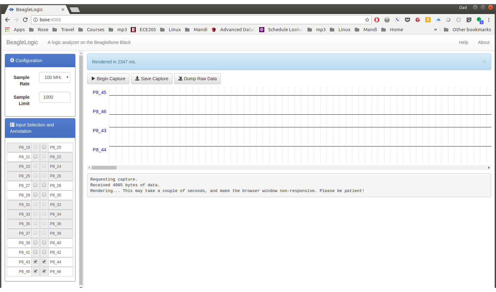

Discussion
************

BeagleLogic is a complete system that includes firmware for the PRUs, 
a kernel module and a web interface that create a powerful 100 MHz 
logic analyzer on the Bone with no additional hardware needed.

.. tip::

   If you need buffered inputs, consider
   http://standalone.beaglelogic.net/en/latest/[BeagleLogic Standalone],
   a turnkey Logic Analyzer built on top of BeagleLogic.

The kernel interface makes it easy to control the PRUs through the
command line.  For example

.. code-block:: bash
      
   bone$ *dd if=/dev/beaglelogic of=mydump bs=1M count=1*

will capture a binary dump from the PRUs. The sample rate and number of 
bits per sample can be controlled through ``/sys/``.

.. code-block:: bash

   bone$ *cd /sys/devices/virtual/misc/beaglelogic*
   bone$ *ls*
   buffers      filltestpattern  power       state         uevent
   bufunitsize  lasterror        samplerate  subsystem
   dev          memalloc         sampleunit  triggerflags
   bone$ *cat samplerate*
   1000
   bone$ *cat sampleunit*
   8bit

You can set the sample rate by simply writing to ``samplerate``.

.. code-block:: bash

   bone$ *echo 100000000 > samplerate*

`sysfs attributes Reference <https://beaglelogic.readthedocs.io/en/latest/sysfs_attributes.html>`_
has more details on configuring via sysfs.

If you run ``dmesg -Hw`` in another window you can see when a capture 
is started and stopped.

.. code-block:: bash

   bone$ *dmesg -Hw*
   [Jul25 08:46] misc beaglelogic: capture started with sample rate=100000000 Hz, sampleunit=1, triggerflags=0
   [  +0.086261] misc beaglelogic: capture session ended

BeagleLogic uses the two PRUs to sample at 100Msps.  Getting a PRU running at 200Hz to sample at 100Msps is a slick trick.
`The Embedded Kitchen <http://theembeddedkitchen.net/beaglelogic-building-a-logic-analyzer-with-the-prus-part-1/449>`_ has a nice article 
explaining how the PRUs get this type of performance.   

NeoPixels -- 5050 RGB LEDs with Integrated Drivers (Falcon Christmas)
----------------------------------------------------------------------

Problem
*********

You have an `Adafruit NeoPixel LED string <http://www.adafruit.com/products/1138>`_,
`Adafruit NeoPixel LED matrix <http://www.adafruit.com/products/1487>`_ or
any other type of 
`WS2812 LED <https://cdn-shop.adafruit.com/datasheets/WS2812.pdf>`_
and want to light it up.

.. TODO Show how to drive ws2812's with FPP.

Solution
*********

If you are driving just one string you can write your own code 
(See :ref:`../05blocks/blocks.adoc#blocks_ws2812, WS2812 Driver`)
If you plan to drive multiple strings, then consider
Falcon Christmas (`FPP <https://falconchristmas.com/>`_). 
FPP can be used to drive both LEDs with an integrated
driver (neopixels) or without an integrated driver.  Here we'll show you how to
set up for the integrated drive and in the next section the no driver LEDs will be 
show.

Hardware
*********

For this setup we'll wire a single string of NeoPixels to the Beagle.  
I've attached the black wire on the string to ground on the Beagle 
and the red wire to a 3.3V pin on the Beagle.
The yellow data in line is attached to P1.31 (I'm using a PocketBeagle.).

How did I know to attach to P1.31?  The FalconChristmas git repo
(https://github.com/FalconChristmas/fpp) has files that tell which pins
attach to which port.  https://github.com/FalconChristmas/fpp/blob/master/capes/pb/strings/F8-B-20.json
has a list of 20 ports and where they are connected.  Pin P1.31 appears on
line 27.  It's the 20th entry in the list.  You could pick any of the others
if you'd rather.

Software Setup
***************

Assuming the PocketBeagle is attached via the USB cable, 
on your host computer browse to <http://192.168.7.2/> and you will see 
:ref:`case_fpp_program_control2`.

.. _case_fpp_program_control2:

Falcon Play Program Control
~~~~~~~~~~~~~~~~~~~~~~~~~~~~

.. figure:: figures/fpp_program_control.png
   :align: center
   :alt: Falcon Play Program Control

You can test the display by first setting up the Channel Outputs and then 
going to *Display Testing*.  :ref:`case_channel_outputs_menu2` shows where to 
select Channel Outputs and :ref:`case_channel_outputs2` shows which settings to use.

.. _case_channel_outputs_menu2:

Selecting Channel Outputs
~~~~~~~~~~~~~~~~~~~~~~~~~~

.. figure:: figures/fpp_channel_outputs_menu.png
   :align: center
   :alt: Selecting Channel Outputs

.. _case_channel_outputs2:

Channel Outputs Settings
~~~~~~~~~~~~~~~~~~~~~~~~~

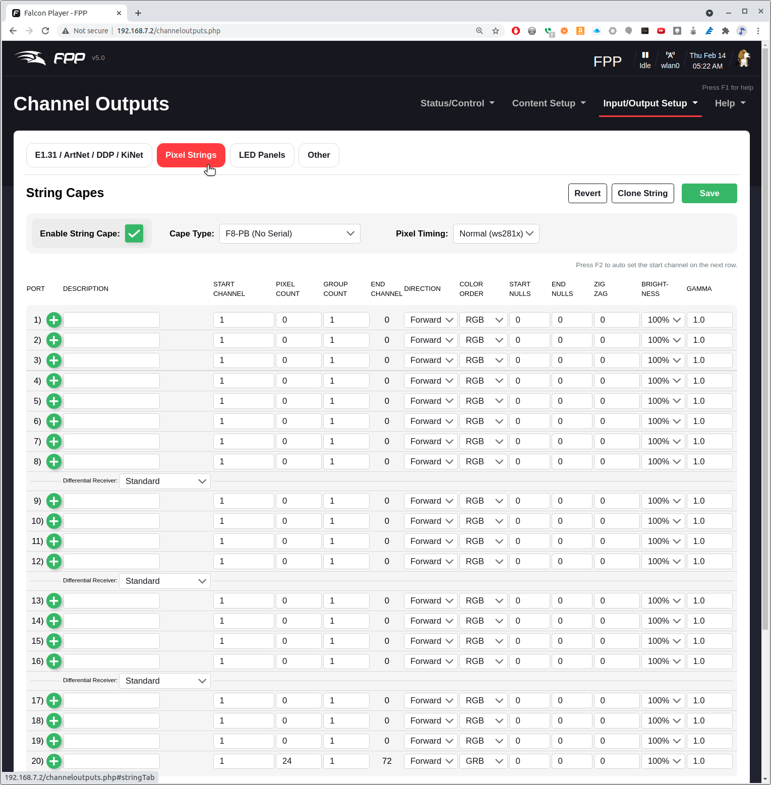

Click on the *Pixel Strings* tab.  Earlier we noted that *P1.31* is attached
to port 20.  Note that at the bottom of the screen, port 20 has a PIXEL COUNT
of 24.  We're telling FPP our string has 24 NeoPixels and they are attached
to port 2 which in *P1.31*.  

Be sure to check the *Enable String Cape*.

Next we need to test the display.  Select **Display Testing** shown in
:ref:`case_display_testing_menu2`.

.. _case_display_testing_menu2:

Selecting Display Testing
~~~~~~~~~~~~~~~~~~~~~~~~~~~

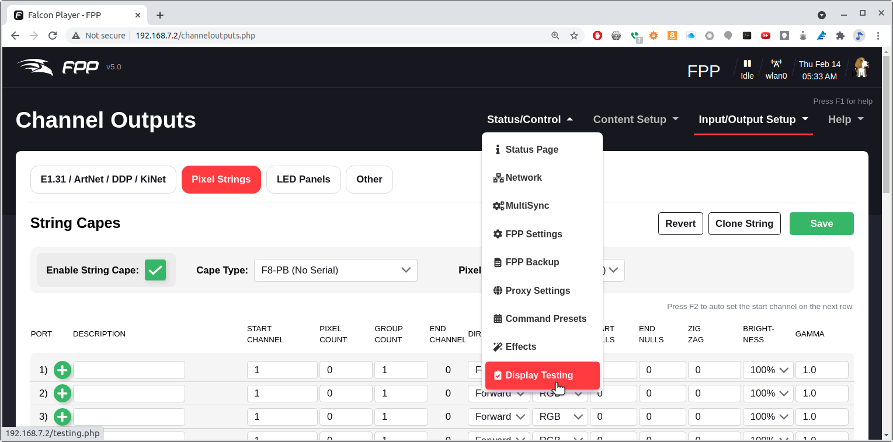

Set the *End Channel* to *72*. (72 is 3*24)  
Click *Enable Test Mode* and your matrix should light up.  Try the different 
testing patterns shown in :ref:`case_display_testing2`.

.. note::

   Clicking on the *-3* will subtract three from the End Channel, which should
   then display three fewer LEDs which is one NeoPixel.  The last of your NeoPixels
   should go black.  This is an easy way to make sure you have the correct pixel
   count.

.. _case_display_testing2:

Display Testing Options
~~~~~~~~~~~~~~~~~~~~~~~~

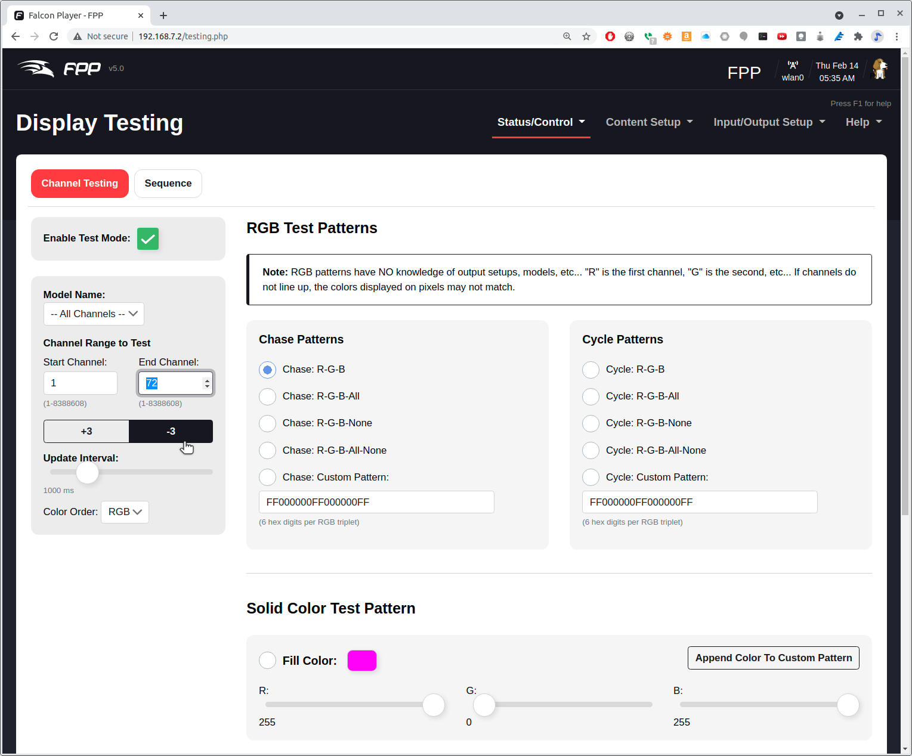

You can control the LED string using the E1.31 protocol. 
(https://www.doityourselfchristmas.com/wiki/index.php?title=E1.31_(Streaming-ACN)_Protocol)
First configure the input channels by going to Channel Inputs as shown in
:ref:`case_channel_inputs`.

.. _case_channel_inputs:

Going to Channel Inputs
~~~~~~~~~~~~~~~~~~~~~~~~

.. figure:: figures/fpp_channel_inputs.png
   :align: center
   :alt: Going to Channel Inputs

Tell it you have 72 LEDs and enable the input as shown in :ref:`case_set_inputs`.

.. _case_set_inputs:

Setting Channel Inputs
~~~~~~~~~~~~~~~~~~~~~~~~~

.. figure:: figures/fpp_inputs_setup2.png
   :align: center
   :alt: Setting Channel Inputs

Finally go to the Status Page as shown in :ref:`case_status`.

.. _case_status:

Watching the status
~~~~~~~~~~~~~~~~~~~~

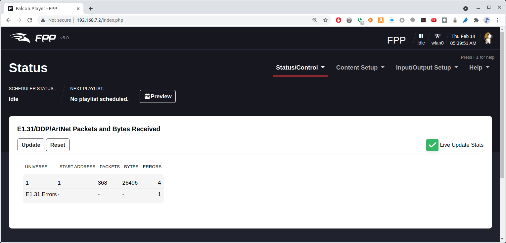

Now run a program on another computer that generated E1.31 packets.
:ref:`case_1.31_example` is an example python program.

.. _cse_e1.31_example:

.e1.31-test.py 
~~~~~~~~~~~~~~

:downlod:`e1.31-test.py <code/e1.31-test.py>`- Example of generating packets to control the NeoPixels 

.. TODO document the code

.. _case_rgb_matrix:

RGB LED Matrix -- No Integrated Drivers (Falcon Christmas)
-----------------------------------------------------------

Problem
*************************

You want to use a RGB LED Matrix display that doesn't have integrated
drivers such as the 
`64x32 RGB LED Matrix <https://www.adafruit.com/product/2277>`_ by Adafuit
shown in :ref:`case_adfruit_matrix`.

.. _case_adfruit_matrix:

Adafruit LED Matrix
~~~~~~~~~~~~~~~~~~~~~

.. figure:: figures/ledmatrix.jpg
   :align: center
   :alt: Adafruit LED Matrix

Solution
*************************

`Falcon Christmas <http://falconchristmas.com>`_ makes a software package
called 
`Falcon Player <http://falconchristmas.com/forum/index.php/board,8.0.html>`_ (FPP) which can drive 
such displays.

.. admonition:: information:

   The Falcon Player (FPP) is a lightweight, optimized, feature-rich sequence player 
   designed to run on low-cost SBC's (Single Board Computers).
   FPP is a software solution that you download and install on hardware which can be 
   purchased from numerous sources around the internet. 
   FPP aims to be controller agnostic, it can talk E1.31, DMX, Pixelnet, and 
   Renard to hardware from multiple hardware vendors, including controller 
   hardware from Falcon Christmas available via COOPs or in the store on FalconChristmas.com.

   http://www.falconchristmas.com/wiki/FPP:FAQ#What_is_FPP.3F

Hardware
~~~~~~~~~

The Beagle hardware can be either a BeagleBone Black with the 
`Octoscroller Cape <https://oshpark.com/shared_projects/7mSHNZcD>`_, or a 
PocketBeagle with the 
`PocketScroller LED Panel Cape <https://www.hackster.io/daniel-kulp/pocketscroller-led-panel-cape-for-pocketbeagle-fe12a6>`_. 
(See `to purchase <https://kulplights.com/product/pocketscroller/>`_.)
`Building and Octoscroller Matrix Display <https://www.diychristmas.org/wiki/index.php?title=Building_an_Octoscroller_Matrix_Display>`_ 
gives details for using the BeagleBone Black. 

:ref:`case_pocket` shows how to attach the PocketBeagle to the P5 LED matrix 
and where to attach the 5V power.  If you are going to turn on all the LEDs 
to full white at the same time you will need at least a 4A supply.

.. _case_pocket:

Pocket Beagle Driving a P5 RGB LED Matrix via the PocketScroller Cape
~~~~~~~~~~~~~~~~~~~~~~~~~~~~~~~~~~~~~~~~~~~~~~~~~~~~~~~~~~~~~~~~~~~~~~

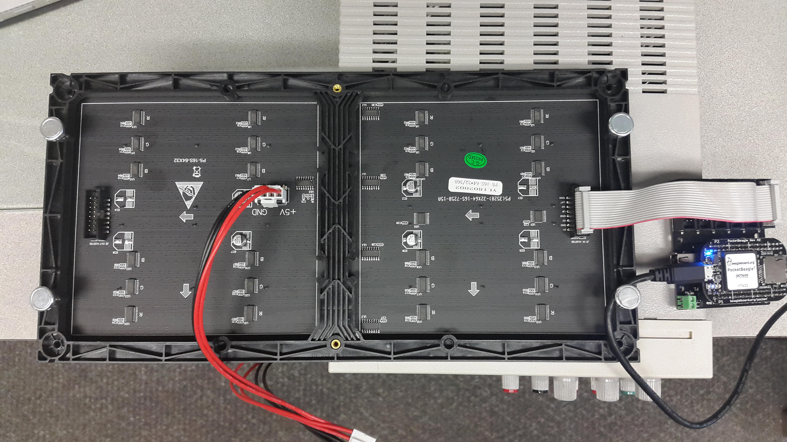

Software
~~~~~~~~~~

The FPP software is most easily installed by downloading the 
`current FPP release <https://github.com/FalconChristmas/fpp/releases/>`_, flashing an SD card and 
booting from it. 

.. tip::

   The really brave can install it on a already running image.  See details at
   https://github.com/FalconChristmas/fpp/blob/master/SD/FPP_Install.sh

Assuming the PocketBeagle is attached via the USB cable, 
on your host computer browse to http://192.168.7.2/ and you will see 
:ref:`case_fpp_program_control`.

.. _case_fpp_program_control:

Falcon Play Program Control
~~~~~~~~~~~~~~~~~~~~~~~~~~~~

.. figure:: figures/fpp_program_control.png
   :align: center
   :alt: Falcon Play Program Control

You can test the display by first setting up the Channel Outputs and then 
going to *Display Testing*.  :ref:`case_channel_outputs_menu` shows where to 
select Channel Outputs and :ref:`case_channel_outputs` shows which settings to use.

.. _case_channel_outputs_menu:

Selecting Channel Outputs
~~~~~~~~~~~~~~~~~~~~~~~~~~

.. figure:: figures/fpp_channel_outputs_menu.png
   :align: center
   :alt: Selecting Channel Outputs

.. _case_channel_outputs:

Channel Outputs Settings
~~~~~~~~~~~~~~~~~~~~~~~~~

.. figure:: figures/fpp_channel_outputs.png
   :align: center
   :alt: Channel Outputs Settings

Click on the **LED Panels** tab and then the only changes I made was 
to select the **Single Panel Size** to be
*64x32* and to check the **Enable LED Panel Output**.

Next we need to test the display.  Select *Display Testing* shown in
:ref:`case_display_testing_menu`.

.. _case_display_testing_menu:

Selecting Display Testing
~~~~~~~~~~~~~~~~~~~~~~~~~~

.. figure:: figures/fpp_display_testing_menu.png
   :align: center
   :alt: Selecting Display Testing

Set the **End Channel** to **6144**. (6144 is 3*64*32)  
Click **Enable Test Mode** and your matrix should light up.  Try the different 
testing patterns shown in :ref:`case_display_testing`.

.. _case_display_testing:

Display Testing Options
~~~~~~~~~~~~~~~~~~~~~~~~~

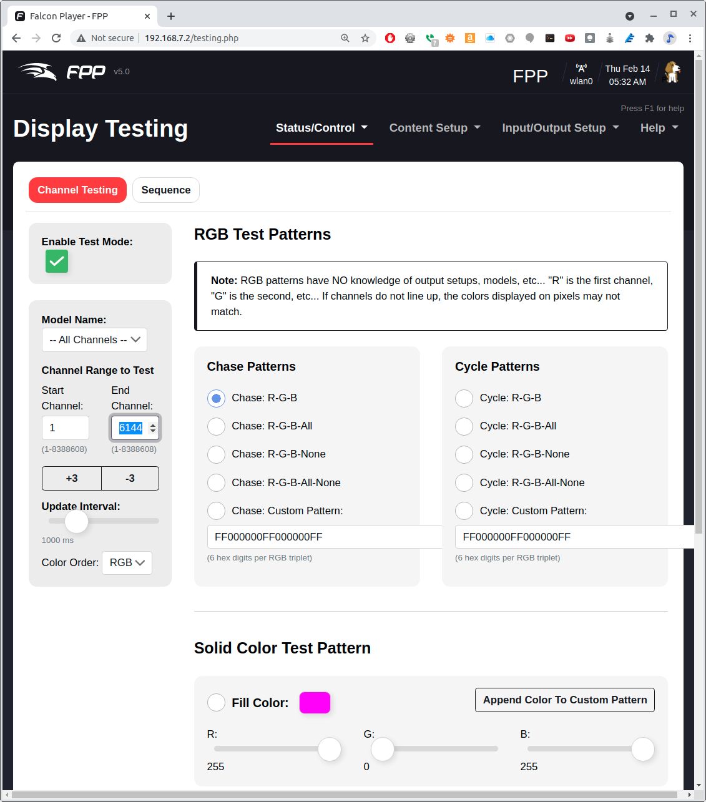

xLights - Creating Content for the Display
~~~~~~~~~~~~~~~~~~~~~~~~~~~~~~~~~~~~~~~~~~~

Once you are sure your LED Matrix is working correctly you can program it 
with a sequence.  

.. admonition:: information:

   xLights is a free and open source program that enables you to design, create and play 
   amazing lighting displays through the use of DMX controllers, E1.31 Ethernet controllers and more.

   With it you can layout your display visually then assign effects to the various items 
   throughout your sequence. This can be in time to music (with beat-tracking built into xLights) 
   or just however you like. xLights runs on Windows, OSX and Linux

   https://xlights.org/

xLights can be installed on your host computer (not the Beagle) by
following instructions at https://xlights.org/releases/.

Run xLights and you'll see :ref:`case_xlights_setup`.

.. code-block:: bash

   host$ *chmod +x xLights-2021.18-x86_64.AppImage*
   host$ *./xLights-2021.18-x86_64.AppImage*

.. TODO update the figures.

.. _case_xlights_setup:

xLights Setup
~~~~~~~~~~~~~~

.. figure:: figures/xlights_setup.png
   :align: center
   :alt: xLights Setup

We'll walk you through a simple setup to get an animation to display on the 
RGB Matrix.  xLights can use a protocol called E1.31 to send information to 
the display.  Setup xLights by clicking on *Add Ethernet* and entering the values 
shown in :ref:`case_xlights_setup_e1_31`.

.. _case_xlights_setup_e1_31:

Setting Up E1.31
~~~~~~~~~~~~~~~~~

.. figure:: figures/xlights_setup_e1_31.png
   :align: center
   :alt: Setting Up E1.31

The **IP Address** is the Bone's address as seen from the host computer. 
Each LED is one channel, so one RGB LED is three channels.  The P5 board 
has 3*64*32 or 6144 channels.  These are grouped into universes of 512 
channels each.  This gives 6144/512 = 12 universes. See the 
`E.13 documentation <https://www.doityourselfchristmas.com/wiki/index.php?title=E1.31_(Streaming-ACN)_Protocol#Configuring_Sequencing_Software_to_use_E1.31_Output>`_ 
for more details.

Your setup should look like :ref:`case_xlights_setup_done`.  Click the
*Save Setup* button to save.

.. _case_xlights_setup_done:

xLights setup for P5 display
~~~~~~~~~~~~~~~~~~~~~~~~~~~~~~

.. figure:: figures/xlights_setup_done.png
   :align: center
   :alt: xLights setup for P5 display

Next click on the **Layout** tab.  Click on the *Matrix* button as shown in 
:ref:`case_xlights_matrix`, then click on the black area where you want your 
matrix to appear.

.. _case_xlights_matrix:

Setting up the Matrix Layout
~~~~~~~~~~~~~~~~~~~~~~~~~~~~~~

.. figure:: figures/xlights_layout.png
   :align: center
   :alt: Setting up the Matrix Layout

:ref:`case_xlights_layout_details` shows the setting to use for the P5 matrix. 

.. _case_xlights_layout_details:

Layout details for P5 matrix
~~~~~~~~~~~~~~~~~~~~~~~~~~~~~

.. figure:: figures/xlights_layout_details.png
   :align: center
   :alt: Layout details for P5 matrix

All I changed was **# Strings**, **Nodes/String**, **Starting Location** and most 
importantly, expand **String Properties** and select at **String Type** of 
**RGB Nodes**.  Above the setting you should see that **Start Chan** is 1 and 
the **End Chan** is 6144, which is the total number of individual LEDs (3*63*32). 
xLights now knows we are working with a P5 matrix, now on to the sequencer. 

Now click on the *Sequencer* tab and then click on the **New Sequence** button
(:ref:`case_seq_new`).

.. _case_seq_new:

Starting a new sequence
~~~~~~~~~~~~~~~~~~~~~~~~~

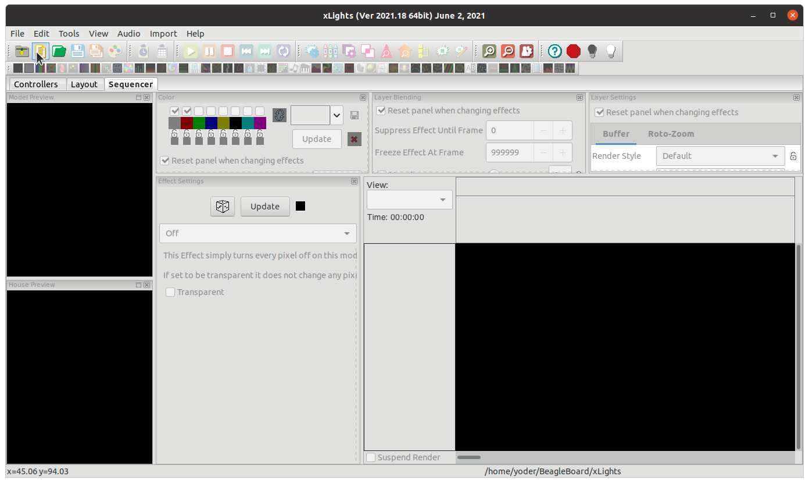

Then click on **Animation**, **20fps (50ms)**, and **Quick Start**. Learning how to 
do sequences is beyond the scope of this cookbook, however I'll shown you how
do simple sequence just to be sure xLights is talking to the Bone.

Setting Up E1.31 on the Bone
~~~~~~~~~~~~~~~~~~~~~~~~~~~~~

First we need to setup FPP to take input from xLights.  Do this by going to 
the *Input/Output Setup* menu and selecting *Channel Inputs*.  Then 
enter *12* for *Universe Count* and click *set* and you will see 
:ref:`case_inputs_setup`.

.. _case_inputs_setup:

E1.31 Inputs
~~~~~~~~~~~~~

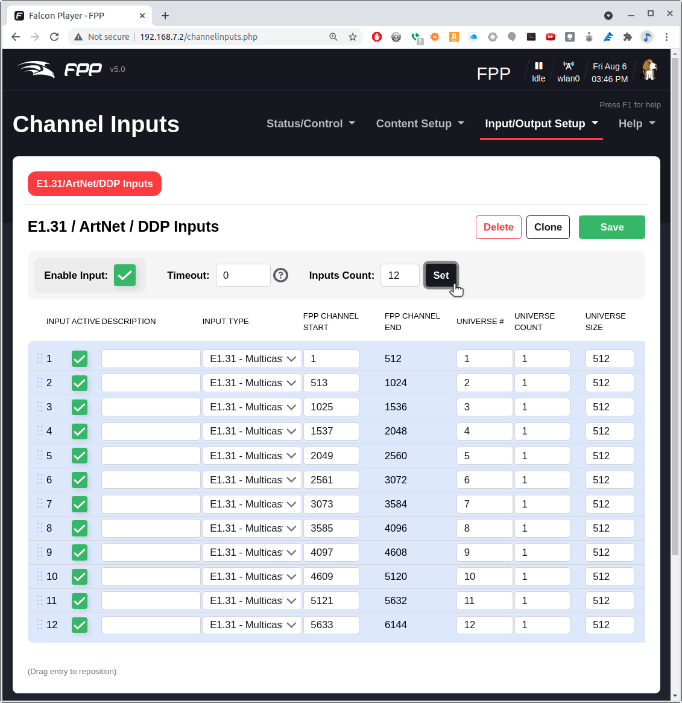

Click on the **Save** button above the table.  

Then go to the **Status/Control** menu and select **Status Page**.  

.. TODO  update this

.. _case_mode_bridge:

Bridge Mode
~~~~~~~~~~~~~

.. figure:: figures/fpp_mode_bridge.png
   :align: center
   :alt: Bridge Mode

Testing the xLights Connection
~~~~~~~~~~~~~~~~~~~~~~~~~~~~~~~

The Bone is now listening for commands from xLights via the E1.31 protocol.
A quick way to verify everything is t o return to xLights and go to the 
*Tools* menu and select **Test** (:ref:`case_xlights_test`).  

.. _case_xlights_test:

xLights test page
~~~~~~~~~~~~~~~~~~

.. figure:: figures/xlights_test.png
   :align: center
   :alt: xLights test page

Click the box under **Select channels...**, click **Output to lights** and 
select **Twinkle 50%**.  You matrix should have a colorful twinkle pattern
(:ref:`case_xlights_twinkle`).

.. _case_xlights_twinkle:

xLights Twinkle test pattern
~~~~~~~~~~~~~~~~~~~~~~~~~~~~~~

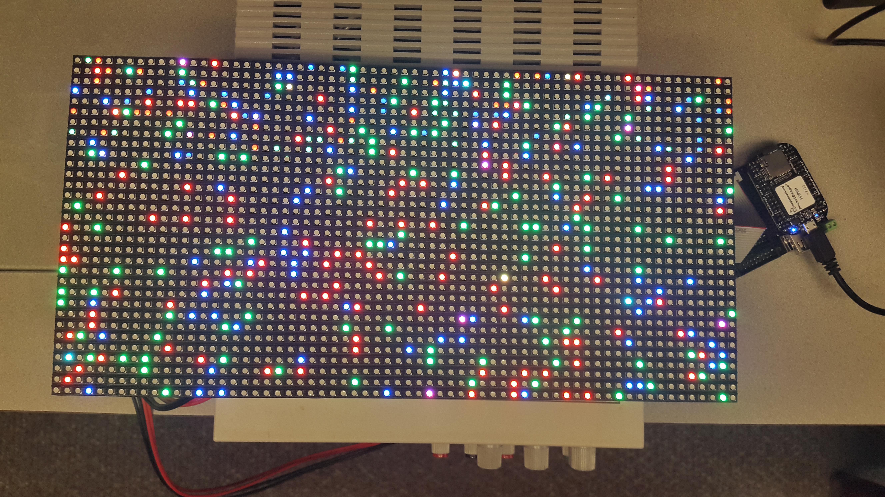

A Simple xLights Sequence
~~~~~~~~~~~~~~~~~~~~~~~~~~

Now that the xLights to FPP link is tested you can generate a sequence to 
play.  Close the Test window and click on the **Sequencer** tab.  Then drag 
an effect from the **Effects** box to the timeline that below it.  Drop it to 
the right of the **Matrix** label (:ref:`case_seq_drag`).  The click 
*Output To Lights* which is the yellow lightbulb to the right on the top 
toolbar.  Your matrix should now be displaying your effect.

.. _case_seq_drag:

Drag an effect to the timeline
~~~~~~~~~~~~~~~~~~~~~~~~~~~~~~~~

.. figure:: figures/xlights_seq_drag.png
   :align: center
   :alt: Drag an effect to the timeline

The setup requires the host computer to send the animation data to the Bone. 
The next section shows how to save the sequence and play it on the Bone 
standalone.

Saving a Sequence and Playing it Standalone
~~~~~~~~~~~~~~~~~~~~~~~~~~~~~~~~~~~~~~~~~~~~

In xLights save your sequence by hitting Ctrl-S and giving it a name.  I called 
mine *fire* since I used a fire effect.  Now, switch back to FPP and select 
the *Content Setup* menu and select *File Manager*.  Click the black
*Select Files* button and select your sequence file that ends in *.fseq*
(:ref:`case_file_manager`).

.. _case_file_manager:

FPP file manager
~~~~~~~~~~~~~~~~

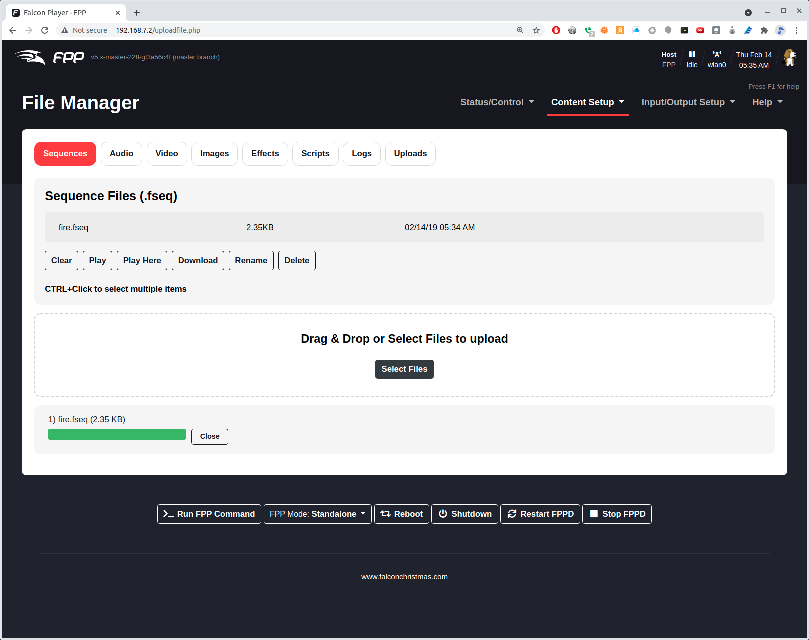

Once your sequence is uploaded, got to **Content Steup** and select **Playlists**. 
Enter you playlist name (I used **fire**) and click **Add**.  Then click
**Add a Sequence/Entry** and select **Sequence Only** 
(:ref:`case_playlist`), then click **Add**. 

.. _case_playlist:

Adding a new playlist to FPP
~~~~~~~~~~~~~~~~~~~~~~~~~~~~~~

.. figure:: figures/fpp_playlist.png
   :align: center
   :alt: Adding a new playlist to FPP

Be sure to click **Save Playlist** on the right. Now return to 
**Status/Control** and **Status Page** and make sure **FPPD Mode:** is set 
to **Standalone**.  You should see your playlist.  Click the **Play** 
button and your sequence will play.

.. _case_playlist_status:

Adding a new playlist to FPP
~~~~~~~~~~~~~~~~~~~~~~~~~~~~~~~

.. figure:: figures/fpp_playlist_status.png
   :align: center
   :alt: Playing a playlist

The beauty of the PRU is that the Beagle can play a detailed sequence at 
20 frames per second and the ARM procossor is only 15% used.  The PRUs 
are doing all the work.

simpPRU -- A python-like language for programming the PRUs 
-----------------------------------------------------------

`simpPRU <https://github.com/VedantParanjape/simpPRU>`_ is a simple, python-like 
programming languge designed to make programming the PRUs easy. 
It has detailed `documentation <https://simppru.readthedocs.io/en/latest/>`_ and
many `examples <https://simppru.readthedocs.io/en/latest/examples/digital_read/>`_.

.. admonition:: information

   simpPRU is a procedural programming language that is statically typed. 
   Variables and functions must be assigned data types during compilation.
   It is typesafe, and data types of variables are decided during compilation.
   simPRU codes have a +.sim+ extension.
   simpPRU provides a console app to use Remoteproc functionality.

   https://simppru.readthedocs.io/en/latest/

You can `build simpPRU <https://simppru.readthedocs.io/en/latest/install/build/>`_ from
source, more easily just `install it <https://simppru.readthedocs.io/en/latest/install/install/>`_. 
On the Beagle run:

.. code-block:: bash

   bone$ wget https://github.com/VedantParanjape/simpPRU/releases/download/1.4/simppru-1.4-armhf.deb
   bone$ sudo dpkg -i simppru-1.4-armhf.deb
   bone$ sudo apt update
   bone$ sudo apt install gcc-pru

Now, suppose you wanted to run the 
`LED blink <https://simppru.readthedocs.io/en/latest/examples/led_blink/>`_
example which is reproduced here.

LED Blink (blink.sim)
~~~~~~~~~~~~~~~~~~~~~

:download:`blink.sim <code/blink.sim>`

Just run simppru

.. code-block:: bash

   bone$ simppru blink.sim --load 
   Detected TI AM335x PocketBeagle
   inside while
   [4] : setting P1_31 as output

   Current mode for P1_31 is:     pruout

Detected TI AM335x PocketBeagle
--------------------------------

The +--load+ flag caused the compiled code to be copied to +/lib/firmware+.
To start just do:

.. code-block:: bash

   bone$ cd /dev/remoteproc/pruss-core0/
   bone$ ls
   device  firmware  name  power  state  subsystem  uevent
   bone$ echo start > state
   bone$ cat state
   running

Your LED should now be blinking.

Check out the many examples (https://simppru.readthedocs.io/en/latest/examples/led_blink/).

simpPRU Examples
~~~~~~~~~~~~~~~~

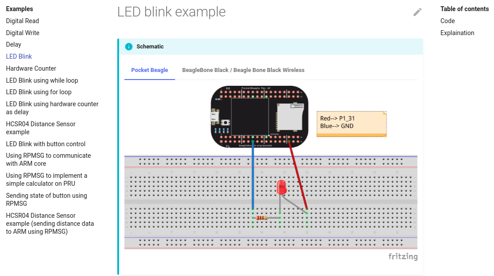

MachineKit
-----------

`MachineKit <http://www.machinekit.io/>`_ is a platform for machine control 
applications.  It can control machine tools, robots, or other automated devices. It can control servo 
motors, stepper motors, relays, and other devices related to machine tools.

.. admonition:: information

   Machinekit is portable across a wide range of hardware platforms and real-time environments, 
   and delivers excellent performance at low cost. It is based on the HAL component architecture, 
   an intuitive and easy to use circuit model that includes over 150 building blocks for digital logic, 
   motion, control loops, signal processing, and hardware drivers. Machinekit supports local and 
   networked UI options, including ubiquitous platforms like phones or tablets.

   http://www.machinekit.io/about/

ArduPilot
----------
`ArduPilot <http://ardupilot.org/>`_ is a open source autopilot system supporting 
multi-copters, traditional helicopters, fixed wing aircraft and rovers. ArduPilot runs on a many 
`hardware platforms <http://ardupilot.org/copter/docs/common-autopilots.html>`_ including the
`BeagleBone Black <http://ardupilot.org/dev/docs/building-for-beaglebone-black-on-linux.html#building-for-beaglebone-black-on-linux>`_ and the 
`BeagleBone Blue <http://ardupilot.org/copter/docs/common-beagle-bone-blue.html>`_.

.. admonition:: information

   Ardupilot is the most advanced, full-featured and reliable open source autopilot software available. 
   It has been developed over 5+ years by a team of diverse professional engineers and computer scientists. 
   It is the only autopilot software capable of controlling any vehicle system imaginable, from conventional 
   airplanes, multirotors, and helicopters, to boats and even submarines. And now being expanded to feature 
   support for new emerging vehicle types such as quad-planes and compound helicopters.

   Installed in over 1,000,000 vehicles world-wide, and with its advanced data-logging, analysis 
   and simulation tools, Ardupilot is the most tested and proven autopilot software. The open-source 
   code base means that it is rapidly evolving, always at the cutting edge of technology development. 
   With many peripheral suppliers creating interfaces, users benefit from a broad ecosystem of sensors, 
   companion computers and communication systems. Finally, since the source code is open, it can be 
   audited to ensure compliance with security and secrecy requirements.

   The software suite is installed in aircraft from many OEM UAV companies, such as 3DR, jDrones, 
   PrecisionHawk, AgEagle and Kespry. It is also used for testing and development by several large 
   institutions and corporations such as NASA, Intel and Insitu/Boeing, as well as countless 
   colleges and universities around the world.

   http://www.machinekit.io/about/
