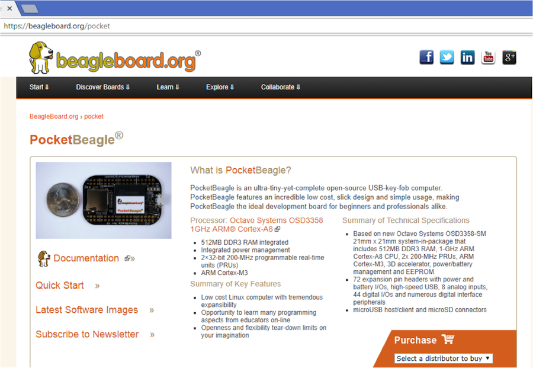

.. _pocketbeagle_introduction:

Introduction
===============

This document is the **System Reference Manual** for PocketBeagle and
covers its use and design. PocketBeagle is an ultra-tiny-yet-complete
Linux-enabled, community-supported, open-source USB-key-fob-computer.
PocketBeagle features an incredible low cost, slick design and simple
usage, making it the ideal development board for beginners and
professionals alike. Simply develop directly in a web browser providing
you with a playground for programming and electronics. Exploring is made
easy with several available libraries and tutorials with many more
coming.

PocketBeagle will boot directly from a microSD card. Load a Linux
distribution onto your card, plug your board into your computer and get
started. PocketBeagle runs GNU.Linux, so you can leverage many different
high-level programming languages and a large body of drivers that
prevent you from needing to write a lot of your own software.

This design will keep improving as the product matures based on feedback
and experience. Software updates will be frequent and will be
independent of the hardware revisions and as such not result in a change
in the revision number of the board. A great place to find out the
latest news and projects for PocketBeagle is on the home page
`beagleboard.org/pocket <https://beagleboard.org/pocket>`__

.. important:: Make sure you check the `BeagleBoard.org docs <https://git.beagleboard.org/docs/docs.beagleboard.io>`_  repository for the most up to date information.

.. _pocketbeagle_home_page_figure:

   PocketBeagle Home Page