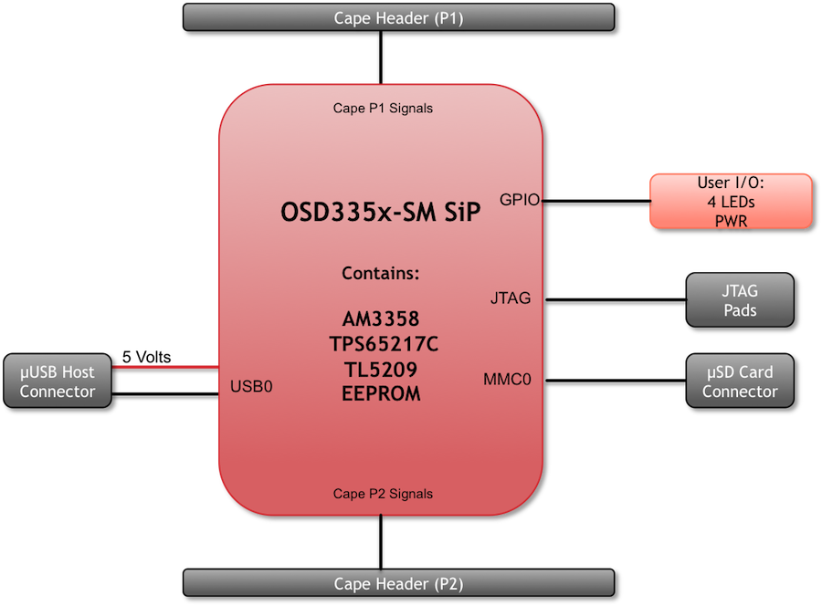
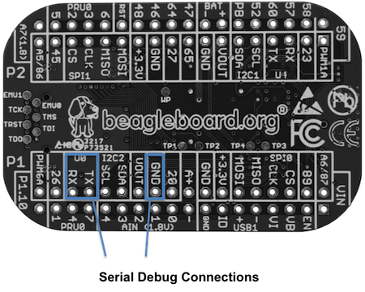

.. _pocketbeagle_high_level_specification:

PocketBeagle High Level Specification
=============================================

This section provides the high level specification of PocketBeagle.

.. _block_diagram:

Block Diagram
~~~~~~~~~~~~~~~~~

Figure 22 below is the high level block diagram of PocketBeagle.

   PocketBeagle Key Components

.. _system_in_package_sip:

System in Package (SiP)
~~~~~~~~~~~~~~~~~~~~~~~~~~~

The OSD335x-SM Block Diagram is detailed in Figure 23 below. More
information, including design resources are available on the 
`'Octavo Systems Website' <https://octavosystems.com/octavo_products/osd335x-sm>`__

   OSD335x SIP Block Diagram

Note: PocketBeagle utilizes the 512MB DDR3 memory size version of the
OSD335x-SM A few of the features of the OSD335x-SM SiP may not be
available on PocketBeagle headers. Please check Section 7 for the P1 and
P2 header pin tables.

Connectivity
~~~~~~~~~~~~~~~~

.. _expansion_headers:

Expansion Headers
^^^^^^^^^^^^^^^^^^^^^^^

PocketBeagle gives access to a large number of peripheral functions and
GPIO via 2 dual rail expansion headers. With 36 pins each, the headers
have been left unpopulated to enable users to choose the header
connector orientation or add-on board / cape connector style. Pins are
clearly marked on the bottom of the board with additional pin
configurations available through software settings. Detailed information
is available in Section 7.

   PocketBeagle Expansion Headers

.. _microsd_connector:

microSD Connector
^^^^^^^^^^^^^^^^^^^^^^^

The board is equipped with a single microSD connector to act as the
primary boot source for the board. Just about any microSD card you have
will work, we commonly find 4G to be suitable.

When plugging in the SD card, the writing on the card should be up.
Align the card with the connector and push to insert. Then release.
There should be a click and the card will start to eject slightly, but
it then should latch into the connector. To eject the card, push the SD
card in and then remove your finger. The SD card will be ejected from
the connector. Do not pull the SD card out or you could damage the
connector.

   microSD Connector
                            
.. _usb_2.0_connector:

USB 2.0 Connector
^^^^^^^^^^^^^^^^^^^^^^^

The board has a microUSB connector that is USB 2.0 HS compatible that
connects the USB0 port to the SiP. Generally this port is used as a
client USB port connected to a power source, such as your PC, to power
the board. If you would like to use this port in host mode you will need
to supply power for peripherals via Header P1 pin 7 (USB1.VIN) or
through a powered USB Hub. Additionally, in the USB host configuration,
you will need to power the board through Header P1 pin 1 (VIN) or Header
P1 pin 7 (USB1.VIN) or Header P2 pin 14 (BAT.VIN)

   USB 2.0 Connector

.. _boot_modes:

Boot Modes
^^^^^^^^^^^^^^^^

There are three boot modes:

-  **SD Boot**: MicroSD connector acts as the primary boot source for
   the board. This is described in Section 3.

-  **USB Boot**: This mode supports booting over the USB port. More
   information can be found in the project called "BeagleBoot" This
   project ported the BeagleBone bootloader server BBBlfs(currently
   written in c) to JavaScript(node.js) and make a cross platform GUI
   (using electron framework) flashing tool utilizing the etcher.io
   project. This will allow a single code base for a cross platform
   tool. For more information on BeagleBoot, see the `BeagleBoot Project
   Page <https://medium.com/@ravikp7/gsoc-2017-final-report-beagleboot-a20d28c8d632>`__.

-  **Serial Boot**: This mode will use the serial port to allow
   downloading of the software. A separate USB to TTL level `serial UART
   converter
   cable <http://www.ftdichip.com/Support/Documents/DataSheets/Cables/DS_TTL-232R_RPi.pdf>`__
   is required or you can connect one of the Mikroelektronika `FTDI
   Click Boards <https://shop.mikroe.com/ftdi-click>`__ to use this
   method. The UART pins on PocketBeagle's expansion headers support the
   interface. For more information regarding the pins on the expansion
   headers and various modes, see Section 7.

.. table:: UART Pins on Expansion Headers for Serial Boot
                                                       

    +-------------+-------------+-------------+-------------+-------------+
    | **H         | **S         | **Proc      | **SiP       | **Pin Name  |
    | eader.Pin** | ilkscreen** | Ball**      | Ball**      | (Mode 0)**  |
    +-------------+-------------+-------------+-------------+-------------+
    | P1.22       | GND         |             |             | GND         |
    +-------------+-------------+-------------+-------------+-------------+
    | P1.30       | U0_TX       | E16         | B12         | uart0_txd   |
    +-------------+-------------+-------------+-------------+-------------+
    | P1.32       | U0_RX       | E15         | A12         | uart0_rxd   |
    +-------------+-------------+-------------+-------------+-------------+
    |             |             |             |             |             |
    +-------------+-------------+-------------+-------------+-------------+

If the Serial Boot is not in use, the UART0 pins can be used for Serial
Debug. See Section 5.6 for more information.

*Software to support USB and serial boot modes is not provided by beagleboard.org.*
*Please contact TI for support of this feature.*

Power
~~~~~~~~~

The board can be powered from three different sources:

-  A USB port on a PC.
-  A power supply with a USB connector.
-  Expansion Header pins.

.. Note:: VIN-USB is directly shorted between the USB connector on PocketBeagle and USB1_VI on the expansion headers. You should only source power to the board over one of these and may optionally use the other as a power sink.

The tables below show the power related pins available on PocketBeagle's
Expansion Headers.

.. table:: Power Inputs Available on Expansion Headers
                                                    

    +-------------+-------------+-------------+-------------+-------------+
    | **H         | **S         | **Proc      | **SiP       | **Pin Name  |
    | eader.Pin** | ilkscreen** | Ball**      | Ball**      | (Mode 0)**  |
    +-------------+-------------+-------------+-------------+-------------+
    | P1.01       | VIN         |             | P10, R10,   | VIN         |
    |             |             |             | T10         |             |
    +-------------+-------------+-------------+-------------+-------------+
    | P1.07       | USB1_VI     |             | P9, R9, T9  | VIN-USB     |
    +-------------+-------------+-------------+-------------+-------------+
    | P2.14       | BAT_+       |             | P8, R8, T8  | VIN-BAT     |
    +-------------+-------------+-------------+-------------+-------------+

.. table:: Power Outputs Available on Expansion Headers
                                                     

    +-------------+-------------+-------------+-------------+-------------+
    | **H         | **S         | **Proc      | **SiP       | **Pin Name  |
    | eader.Pin** | ilkscreen** | Ball**      | Ball**      | (Mode 0)**  |
    +-------------+-------------+-------------+-------------+-------------+
    | P1.14       | +3.3V       |             | F6, F7, G6, | VOUT-3.3V   |
    |             |             |             | G7          |             |
    +-------------+-------------+-------------+-------------+-------------+
    | P1.24       | VOUT        |             | K6, K7, L6, | VOUT-5V     |
    |             |             |             | L7          |             |
    +-------------+-------------+-------------+-------------+-------------+
    | P2.13       | VOUT        |             | K6, K7, L6, | VOUT-5V     |
    |             |             |             | L7          |             |
    +-------------+-------------+-------------+-------------+-------------+
    | P2.23       | +3.3V       |             | F6, F7, G6, | VOUT-3.3V   |
    |             |             |             | G7          |             |
    +-------------+-------------+-------------+-------------+-------------+

.. table::  Ground Pins Available on Expansion Headers
                                                   

    +-------------+-------------+-------------+-------------+-------------+
    | **H         | **S         | **Proc      | **SiP       | **Pin Name  |
    | eader.Pin** | ilkscreen** | Ball**      | Ball**      | (Mode 0)**  |
    +-------------+-------------+-------------+-------------+-------------+
    | P1.15       | USB1_GND    |             |             | GND         |
    +-------------+-------------+-------------+-------------+-------------+
    | P1.16       | GND         |             |             | GND         |
    +-------------+-------------+-------------+-------------+-------------+
    | P1.22       | GND         |             |             | GND         |
    +-------------+-------------+-------------+-------------+-------------+
    | P2.15       | GND         |             |             | GND         |
    +-------------+-------------+-------------+-------------+-------------+
    | P2.21       | GND         |             |             | GND         |
    +-------------+-------------+-------------+-------------+-------------+

.. Note:: A comprehensive tutorial for Power Inputs and Outputs for the OSD335x System in Package is available in the `'Tutorial Series' <https://octavosystems.com/app_notes/osd335x-design-tutorial/bare-minimum-boot/power-input-ouput/>`__ on the Octavo Systems website.

.. _jtag_pads:

JTAG Pads
~~~~~~~~~~~~~

Pads for an optional connection to a JTAG emulator has been provided on
the back of PocketBeagle. More information about JTAG emulation can be
found on the TI website - `'Entry-level debug through full-capability
development' <https://www.ti.com/tools-software/debug.html>`__

   JTAG Pad Connections

.. _serial_debug_port:

Serial Debug Port
~~~~~~~~~~~~~~~~~~~~~

Serial debug is provided via UART0 on the processor. See Section 5.3.4
for the Header Pin table. Signals supported are TX and RX. None of the
handshake signals (CTS/RTS) are supported. A separate USB to TTL level
`serial UART converter cable <http://www.ftdichip.com/Support/Documents/DataSheets/Cables/DS_TTL-232R_RPi.pdf>`__
is required or you can connect one of the Mikroelektronika `FTDI Click
Boards <https://shop.mikroe.com/ftdi-click>`__ to use this method.

If serial boot is not used, the UART0 can be used to view boot messages
during startup and can provide access to a console using a terminal
access program like `Putty <http://www.putty.org/>`__. To view the boot
messages or use the console the UART should be set to a baud rate of
115200 and use 8 bits for data, no parity bit and 1 stop bit (8N1).