.. _pocketbeagle_detailed_hardware_design:

Detailed Hardware Design
================================

The following sections contain schematic references for PocketBeagle.
Full schematics in both PDF and Eagle are available on the
`'PocketBeagle Wiki' <https://github.com/beagleboard/pocketbeagle>`__

.. _osd3358_sm_sip_design:

OSD3358-SM SiP Design
~~~~~~~~~~~~~~~~~~~~~~~~~

Schematics for the OSD3358-SM SiP are divided into several diagrams.

.. _sip_a_osd3358_sip_system_and_power_signals:

SiP A OSD3358 SiP System and Power Signals
^^^^^^^^^^^^^^^^^^^^^^^^^^^^^^^^^^^^^^^^^^^^^^^^

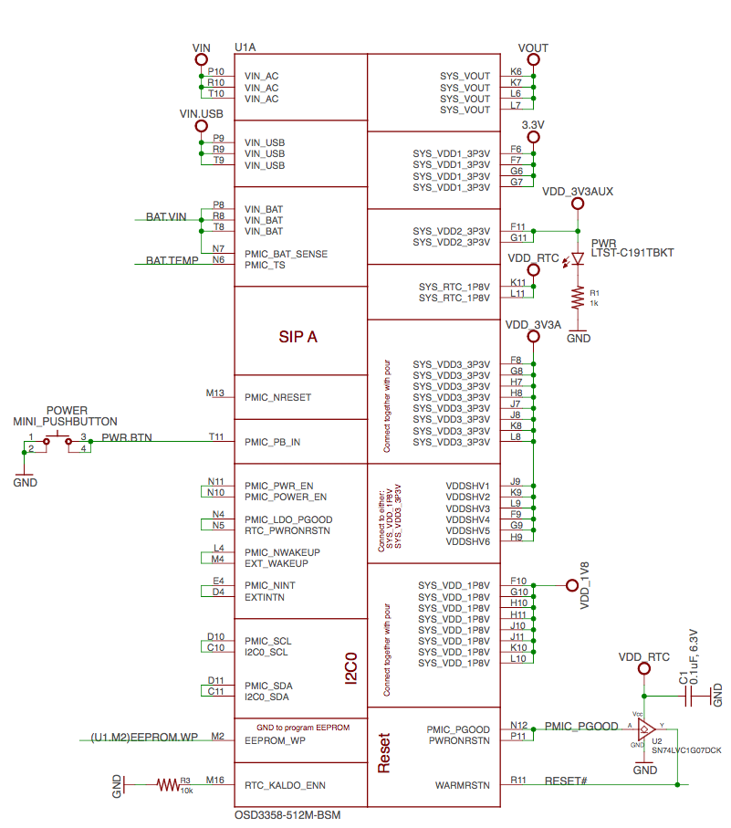

   SiP A OSD3358 SiP System and Power Signals

.. _sip_b_osd3358_sip_jtag_usb_analog_signals:

SiP B OSD3358 SiP JTAG, USB & Analog Signals
^^^^^^^^^^^^^^^^^^^^^^^^^^^^^^^^^^^^^^^^^^^^^^^^^^

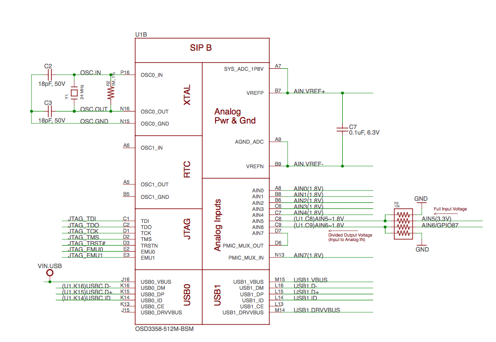

   SiP B OSD3358 SiP JTAG, USB & Analog Signals

.. _sip_c_osd3358_sip_peripheral_signals:

SiP C OSD3358 SiP Peripheral Signals
^^^^^^^^^^^^^^^^^^^^^^^^^^^^^^^^^^^^^^^^^^

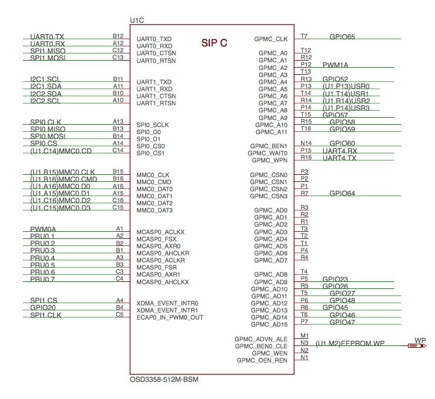

   SiP C OSD3358 SiP Peripheral Signals

.. _sip_d_osd3358_sip_system_boot_configuration:

SiP D OSD3358 SiP System Boot Configuration
^^^^^^^^^^^^^^^^^^^^^^^^^^^^^^^^^^^^^^^^^^^^^^^^^

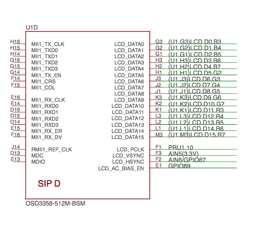

   SiP D OSD3358 SiP System Boot Configuration

.. _sip_e_osd3358_sip_power_signals:

SiP E OSD3358 SiP Power Signals
^^^^^^^^^^^^^^^^^^^^^^^^^^^^^^^^^^^^^

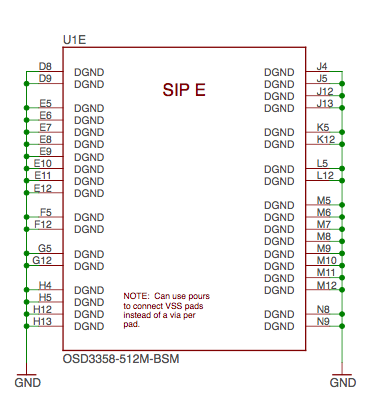

   SiP E OSD3358 SiP Power Signals

.. _sip_f_osd3358_sip_power_signals:

SiP F OSD3358 SiP Power Signals
^^^^^^^^^^^^^^^^^^^^^^^^^^^^^^^^^^^^^

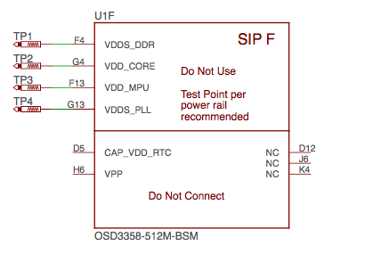

.. _microsd_connection:

MicroSD Connection
~~~~~~~~~~~~~~~~~~~~~~

The Micro Secure Digital (microSD) connector design is highlighted in
Figure 35.

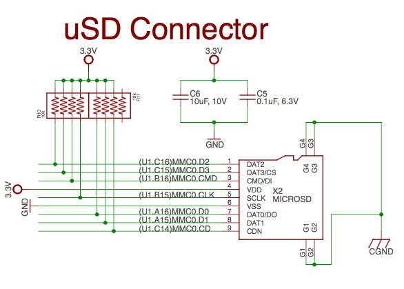

   microSD Connections

.. _usb_connector:

USB Connector
~~~~~~~~~~~~~~~~~

The USB connector design is highlighted in Figure 36.

Note that there is an ID pin for dual-role (host/client) functionality.
The hardware fully supports it, but care should be taken to ensure the
kernel in use is either statically or dynamically configured to
recognize and utilize the proper mode.

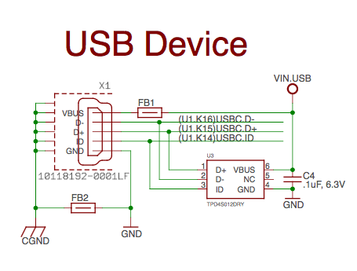

   USB Connection

.. _power_button_design:

Power Button Design
~~~~~~~~~~~~~~~~~~~~~~~

The power button design is highlighted in Figure 37.

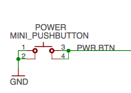

   Power Button

.. _user_leds:

User LEDs
~~~~~~~~~~~~~

There are four user programmable LEDs on PocketBeagle. The design is
highlighted in Figure 38. Table 6 Provides the LED control signals and
pins. A logic level of "1" will cause the LEDs to turn on.

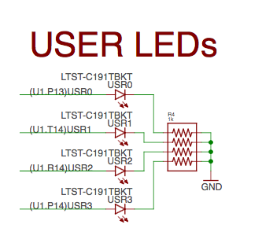

   User LEDs

.. table:: User LED Control Signals/Pins
                                      

    ======= =============== ============= ============
    **LED** **Signal Name** **Proc Ball** **SiP Ball**
    USR0    GPIO1_21        V15           P13
    USR1    GPIO1_22        U15           T14
    USR2    GPIO1_23        T15           R14
    USR3    GPIO1_24        V16           P14
    ======= =============== ============= ============

.. _jtag_pads_1:

JTAG Pads
~~~~~~~~~~~~~

There are 7 pads on the bottom of PocketBeagle to connect JTAG for
debugging. The design is highlighted in Figure 39. More information
regarding JTAG debugging can be found at
`'www.ti.com/jtag' <https://www.ti.com/jtag>`__

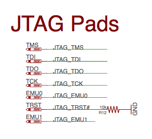

   JTAG Pads Design

.. _pru_icss:

PRU-ICSS
~~~~~~~~~~~~

The Programmable Real-Time Unit Subsystem and Industrial Communication
SubSystem (PRU-ICSS) module is located inside the AM3358 processor,
which is inside the Octavo Systems SiP. Commonly referred to as just the
"PRU", this little subsystem will unleash a lot of performance for you
to use in your application. Consisting of dual 32-bit RISC cores
(Programmable Real-Time Units, or PRUs), data and instruction memories,
internal peripheral modules, and an interrupt controller (INTC). The
programmable nature of the PRU-ICSS, along with their access to pins,
events and all SoC resources, provides flexibility in implementing fast
real-time responses, specialized data handling operations, custom
peripheral interfaces, and in offloading tasks from the other processor
cores of the system-on-chip (SoC). Access to these pins is provided by
PocketBeagle's expansion headers and is multiplexed with other functions
on the board. Access is not provided to all of the available pins.

Some getting started information can be found on
https://beagleboard.org/pru.

Additional documentation is located on the Texas Instruments website at
`processors.wiki.ti.com/index.php/PRU-ICSS <http://processors.wiki.ti.com/index.php/PRU-ICSS>`__
and also located at
`http://github.com/beagleboard/am335x_pru_package. <http://github.com/beagleboard/am335x_pru_package>`__

Example projects using the PRU-ICSS can be found at
`processors.wiki.ti.com/index.php/PRU_Projects <http://processors.wiki.ti.com/index.php/PRU_Projects>`__.

.. _pru_icss_features:

PRU-ICSS Features
^^^^^^^^^^^^^^^^^^^^^^^

The features of the PRU-ICSS include:

Two independent programmable real-time (PRU) cores:

-  32-Bit Load/Store RISC architecture
-  8K Byte instruction RAM (2K instructions) per core
-  8K Bytes data RAM per core
-  12K Bytes shared RAM
-  Operating frequency of 200 MHz
-  PRU operation is little endian similar to ARM processor
-  All memories within PRU-ICSS support parity
-  Includes Interrupt Controller for system event handling
-  Fast I/O interface

– 16 input pins and 16 output pins per PRU core. (Not all of these are
accessible on the PocketBeagle. Please check the Pin Table below for
PRU-ICSS features available through the P1 and P2 headers.)

.. _pru_icss_block_diagram:

PRU-ICSS Block Diagram
^^^^^^^^^^^^^^^^^^^^^^^^^^^^

Figure below is a high level block diagram of the PRU-ICSS.

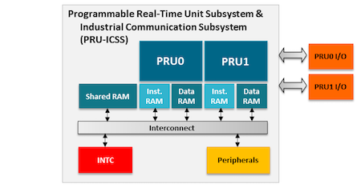

.. _pru_icss_pin_access:

PRU-ICSS Pin Access
^^^^^^^^^^^^^^^^^^^^^^^^^

Both PRU 0 and PRU1 are accessible from the expansion headers. Listed
below are the ports that can be accessed on each PRU.

Table 6. below shows which PRU-ICSS signals can be accessed on
PocketBeagle and on which connector and pins on which they are
accessible. Some signals are accessible on the same pins.

Use scroll bar at bottom of chart to see additional features in columns
to the right. When printing this document, you will need to print this
chart separately.

.. table:: PRU0 and PRU1 Access

    +-------------+-------------+-----------------+-----------+------------------------------+---------------------------+------------------------------+-------------------------------+----------------------------------------------+
    | Header.Pin  | Silkscreen  | Processor Ball  | SiP Ball  | Mode3                        | Mode4                     | Mode5                        | Mode6                         | Note                                         |
    +=============+=============+=================+===========+==============================+===========================+==============================+===============================+==============================================+
    | P1.02       | A6/87       | R5              | F2        |                              |                           | pr1_pru1_pru_r30_9 (Output)  | pr1_pru1_pru_r31_9 (Input)    |                                              |
    +-------------+-------------+-----------------+-----------+------------------------------+---------------------------+------------------------------+-------------------------------+----------------------------------------------+
    | P1.04       | 89          | R6              | E1        |                              |                           | pr1_pru1_pru_r30_11 (Output) | pr1_pru1_pru_r31_11 (Input)   |                                              |
    +-------------+-------------+-----------------+-----------+------------------------------+---------------------------+------------------------------+-------------------------------+----------------------------------------------+
    | P1.06       | SPI0_CS     | A16             | A14       |                              | pr1_uart0_txd (Output)    |                              |                               | UART Transmit Data                           |
    +-------------+-------------+-----------------+-----------+------------------------------+---------------------------+------------------------------+-------------------------------+----------------------------------------------+
    | P1.08       | SPI0_CLK    | A17             | A13       |                              | pr1_uart0_cts_n (Input)   |                              |                               | UART Clear to Send                           |
    +-------------+-------------+-----------------+-----------+------------------------------+---------------------------+------------------------------+-------------------------------+----------------------------------------------+
    | P1.10       | SPI0_MISO   | B17             | B13       |                              | pr1_uart0_rts_n (Output)  |                              |                               | UART Request to Send                         |
    +-------------+-------------+-----------------+-----------+------------------------------+---------------------------+------------------------------+-------------------------------+----------------------------------------------+
    | P1.12       | SPI0_MOSI   | B16             | B14       |                              | pr1_uart0_rxd (Input)     |                              |                               | UART Receive Data                            |
    +-------------+-------------+-----------------+-----------+------------------------------+---------------------------+------------------------------+-------------------------------+----------------------------------------------+
    | P1.20       | 20          | D14             | B4        |                              |                           | pr1_pru0_pru_r31_16 (Input)  |                               |                                              |
    +-------------+-------------+-----------------+-----------+------------------------------+---------------------------+------------------------------+-------------------------------+----------------------------------------------+
    | P1.26       | I2C2_SDA    | D18             | B10       |                              |                           | pr1_uart0_cts_n (Input)      |                               | UART Clear to Send                           |
    +-------------+-------------+-----------------+-----------+------------------------------+---------------------------+------------------------------+-------------------------------+----------------------------------------------+
    | P1.28       | I2C2_SCL    | D17             | A10       |                              |                           | pr1_uart0_rts_n (Output)     |                               | UART Request to Send                         |
    +-------------+-------------+-----------------+-----------+------------------------------+---------------------------+------------------------------+-------------------------------+----------------------------------------------+
    | P1.29       | PRU0_7      | A14             | C4        |                              |                           | pr1_pru0_pru_r30_7 (Output)  | pr1_pru0_pru_r31_7 (Input)    |                                              |
    +-------------+-------------+-----------------+-----------+------------------------------+---------------------------+------------------------------+-------------------------------+----------------------------------------------+
    | P1.30       | U0_TX       | E16             | B12       |                              |                           | pr1_pru1_pru_r30_15 (Output) | pr1_pru1_pru_r31_15 (Input)   |                                              |
    +-------------+-------------+-----------------+-----------+------------------------------+---------------------------+------------------------------+-------------------------------+----------------------------------------------+
    | P1.31       | PRU0_4      | B12             | A3        |                              |                           | pr1_pru0_pru_r30_4 (Output)  | pr1_pru0_pru_r31_4 (Input)    |                                              |
    +-------------+-------------+-----------------+-----------+------------------------------+---------------------------+------------------------------+-------------------------------+----------------------------------------------+
    | P1.32       | U0_RX       | E15             | A12       |                              |                           | pr1_pru1_pru_r30_14 (Output) | pr1_pru1_pru_r31_14 (Input)   |                                              |
    +-------------+-------------+-----------------+-----------+------------------------------+---------------------------+------------------------------+-------------------------------+----------------------------------------------+
    | P1.33       | PRU0_1      | B13             | A2        |                              |                           | pr1_pru0_pru_r30_1 (Output)  | pr1_pru0_pru_r31_1 (Input)    |                                              |
    +-------------+-------------+-----------------+-----------+------------------------------+---------------------------+------------------------------+-------------------------------+----------------------------------------------+
    | P1.35       | P1.10       | V5              | F1        |                              |                           | pr1_pru1_pru_r30_10 (Output) | pr1_pru1_pru_r31_10 (Input)   |                                              |
    +-------------+-------------+-----------------+-----------+------------------------------+---------------------------+------------------------------+-------------------------------+----------------------------------------------+
    | P1.36       | PWM0A       | A13             | A1        |                              |                           | pr1_pru0_pru_r30_0 (Output)  | pr1_pru0_pru_r31_0 (Input)    |                                              |
    +-------------+-------------+-----------------+-----------+------------------------------+---------------------------+------------------------------+-------------------------------+----------------------------------------------+
    | P2.09       | I2C1_SCL    | D15             | B11       |                              |                           | pr1_uart0_txd (Output)       | pr1_pru0_pru_r31_16 (Input)   | UART Transmit Data                           |
    +-------------+-------------+-----------------+-----------+------------------------------+---------------------------+------------------------------+-------------------------------+----------------------------------------------+
    | P2.11       | I2C1_SDA    | D16             | A11       |                              |                           | pr1_uart0_rxd (Input)        | pr1_pru1_pru_r31_16 (Input)   | UART Receive Data                            |
    +-------------+-------------+-----------------+-----------+------------------------------+---------------------------+------------------------------+-------------------------------+----------------------------------------------+
    | P2.17       | 65          | V12             | T7        |                              |                           | pr1_mdio_mdclk               |                               | MDIO Clk                                     |
    +-------------+-------------+-----------------+-----------+------------------------------+---------------------------+------------------------------+-------------------------------+----------------------------------------------+
    | P2.18       | 47          | U13             | P7        |                              |                           | pr1_ecap0_ecap_capin_apwm_o  | pr1_pru0_pru_r31_15 (Input)   | Enhanced capture input or Auxiliary PWM out  |
    +-------------+-------------+-----------------+-----------+------------------------------+---------------------------+------------------------------+-------------------------------+----------------------------------------------+
    | P2.20       | 64          | T13             | R7        |                              |                           | pr1_mdio_data                |                               | MDIO Data                                    |
    +-------------+-------------+-----------------+-----------+------------------------------+---------------------------+------------------------------+-------------------------------+----------------------------------------------+
    | P2.22       | 46          | V13             | T6        |                              |                           |                              | pr1_pru0_pru_r31_14 (Input)   |                                              |
    +-------------+-------------+-----------------+-----------+------------------------------+---------------------------+------------------------------+-------------------------------+----------------------------------------------+
    | P2.24       | 48          | T12             | P6        |                              |                           |                              | pr1_pru0_pru_r30_14 (Output)  |                                              |
    +-------------+-------------+-----------------+-----------+------------------------------+---------------------------+------------------------------+-------------------------------+----------------------------------------------+
    | P2.28       | PRU0_6      | D13             | C3        |                              |                           | pr1_pru0_pru_r30_6 Output)   | pr1_pru0_pru_r31_6 (Input)    |                                              |
    +-------------+-------------+-----------------+-----------+------------------------------+---------------------------+------------------------------+-------------------------------+----------------------------------------------+
    | P2.29       | SPI1_CLK    | C18             | C5        | pr1_ecap0_ecap_capin_apwm_o  |                           |                              |                               | Enhanced capture input or Auxiliary PWM out  |
    +-------------+-------------+-----------------+-----------+------------------------------+---------------------------+------------------------------+-------------------------------+----------------------------------------------+
    | P2.30       | PRU0_3      | C12             | B1        |                              |                           | pr1_pru0_pru_r30_3 (Output)  | pr1_pru0_pru_r31_3 (Input)    |                                              |
    +-------------+-------------+-----------------+-----------+------------------------------+---------------------------+------------------------------+-------------------------------+----------------------------------------------+
    | P2.31       | SPI1_CS     | A15             | A4        |                              |                           | pr1_pru1_pru_r31_16 (Input)  |                               |                                              |
    +-------------+-------------+-----------------+-----------+------------------------------+---------------------------+------------------------------+-------------------------------+----------------------------------------------+
    | P2.32       | PRU0_2      | D12             | B2        |                              |                           | pr1_pru0_pru_r30_2 (Output)  | pr1_pru0_pru_r31_2 (Input)    |                                              |
    +-------------+-------------+-----------------+-----------+------------------------------+---------------------------+------------------------------+-------------------------------+----------------------------------------------+
    | P2.33       | 45          | R12             | R6        |                              |                           |                              | pr1_pru0_pru_r30_15 (Output)  |                                              |
    +-------------+-------------+-----------------+-----------+------------------------------+---------------------------+------------------------------+-------------------------------+----------------------------------------------+
    | P2.34       | PRU0_5      | C13             | B3        |                              |                           | pr1_pru0_pru_r30_5 (Output)  | pr1_pru0_pru_r31_5 (Input)    |                                              |
    +-------------+-------------+-----------------+-----------+------------------------------+---------------------------+------------------------------+-------------------------------+----------------------------------------------+
    | P2.35       | A5/86       | U5              | F3        |                              |                           | pr1_pru1_pru_r30_8 (Output)  | pr1_pru1_pru_r31_8 (Input)    |                                              |
    +-------------+-------------+-----------------+-----------+------------------------------+---------------------------+------------------------------+-------------------------------+----------------------------------------------+