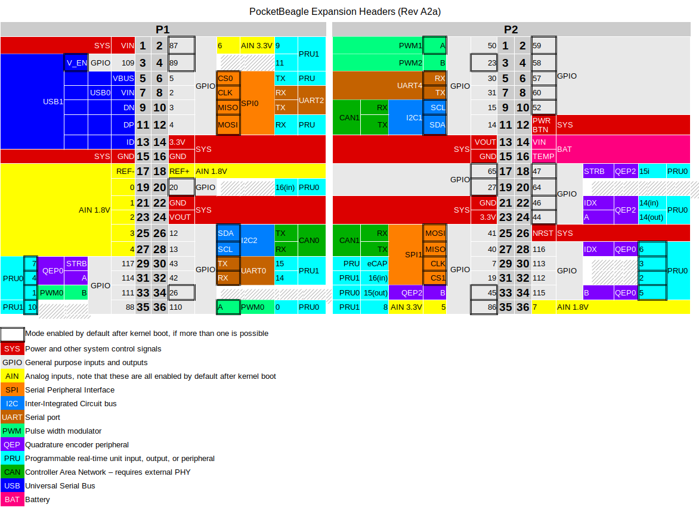

.. _pocketbeagle_connectors:

Connectors
==================

This section describes each of the connectors on the board.

.. _expansion_header_connectors:

Expansion Header Connectors
~~~~~~~~~~~~~~~~~~~~~~~~~~~~~~~

The expansion interface on the board is comprised of two 36 pin
connectors. The two Expansion Header Connectors on PocketBeagle are
labeled P1 and P2. The connections are a standard 100 mil distance so
that they can be compatible with many standard expansion items. The
silkscreen for the headers on the bottom of the board provides the
easiest way to identify them. See Figure 41.

.. figure:: images/41fig-PB-Headerback.png
   :align: center
   :alt: Expansion Headers for PocketBeagle

   Expansion Headers for PocketBeagle

All signals on the expansion headers are **3.3V** unless otherwise
indicated.

.. Note::

    - Do not connect 5V logic level signals to these pins or the board will be damaged.
    - DO NOT APPLY VOLTAGE TO ANY I/O PIN WHEN POWER IS NOT SUPPLIED TO THE BOARD. IT WILL DAMAGE THE PROCESSOR AND VOID THE WARRANTY.
    - NO PINS ARE TO BE DRIVEN UNTIL AFTER THE NRESET LINE GOES HIGH.

Figure 42 shows a color coded chart with an overview of the most popular
functions of PocketBeagle's Expansion Header pins. The Header Pin tables
in Sections 7.1.1 and 7.1.2 show the full pin assignments for each
header.

   Expansion Header Popular Functions - Color Coded
                                                           
.. _p1_header:

P1 Header
~~~~~~~~~~~~~~~

Figure 43 shows the schematic diagram for the P1 Header.

.. figure:: images/Header-P1-sch.png
   :align: center
   :alt: P1 Header
                   
Use scroll bar at bottom of chart to see additional features in columns
to the right. When printing this document you will need to print this
chart separately.

.. table:: P1 Header Pinout
                         
    +-------------+-------------+----------------------+------------+--------------------+-------------------+---------------+---------------+-------------------------+-------------------------+---------------------+---------------------+-----------+
    | Header.Pin  | Silkscreen  | PocketBeagle wiring  | Proc Ball  | SiP Ball           | Mode0 (Name)      | Mode1         | Mode2         | Mode3                   | Mode4                   | Mode5               | Mode6               | Mode7     |
    +=============+=============+======================+============+====================+===================+===============+===============+=========================+=========================+=====================+=====================+===========+
    | P1.01       | VIN         | P1.01 (VIN)          |            | P10 & R10 & T10    | VIN               |               |               |                         |                         |                     |                     |           |
    +-------------+-------------+----------------------+------------+--------------------+-------------------+---------------+---------------+-------------------------+-------------------------+---------------------+---------------------+-----------+
    | P1.02       | A6/87       | P1.02 (AIN6/GPIO87)  | A8         | C9                 | ain6              |               |               |                         |                         |                     |                     |           |
    +-------------+-------------+----------------------+------------+--------------------+-------------------+---------------+---------------+-------------------------+-------------------------+---------------------+---------------------+-----------+
    | P1.02       | A6/87       | P1.02 (AIN6/GPIO87)  | R5         | F2                 | lcd_hsync         | gpmc_a9       | gpmc_a2       | pr1_edio_data_in3       | pr1_edio_data_out3      | pr1_pru1_pru_r30_9  | pr1_pru1_pru_r31_9  | gpio2_23  |
    +-------------+-------------+----------------------+------------+--------------------+-------------------+---------------+---------------+-------------------------+-------------------------+---------------------+---------------------+-----------+
    | P1.03       | USB1_EN     | P1.03 (USB1-DRVVBUS) | F15        | M14                | USB1_DRVVBUS      | -             | -             | -                       | -                       | -                   | -                   | gpio3_13  |
    +-------------+-------------+----------------------+------------+--------------------+-------------------+---------------+---------------+-------------------------+-------------------------+---------------------+---------------------+-----------+
    | P1.04       | 89          | P1.04 (PRU1.11)      | R6         | E1                 | lcd_ac_bias_en    | gpmc_a11      | pr1_mii1_crs  | pr1_edio_data_in5       | pr1_edio_data_out5      | pr1_pru1_pru_r30_11 | pr1_pru1_pru_r31_11 | gpio2_25  |
    +-------------+-------------+----------------------+------------+--------------------+-------------------+---------------+---------------+-------------------------+-------------------------+---------------------+---------------------+-----------+
    | P1.05       | USB1_VB     | P1.05 (USB1-VBUS)    | T18        | M15                | USB1_VBUS         | -             | -             | -                       | -                       | -                   | -                   | -         |
    +-------------+-------------+----------------------+------------+--------------------+-------------------+---------------+---------------+-------------------------+-------------------------+---------------------+---------------------+-----------+
    | P1.06       | SPI0_CS     | P1.06 (SPI0-CS)      | A16        | A14                | spi0_cs0          | mmc2_sdwp     | I2C1_SCL      | ehrpwm0_synci           | pr1_uart0_txd           | pr1_edio_data_in1   | pr1_edio_data_out1  | gpio0_5   |
    +-------------+-------------+----------------------+------------+--------------------+-------------------+---------------+---------------+-------------------------+-------------------------+---------------------+---------------------+-----------+
    | P1.07       | USB1_VI     | P1.07 (VIN-USB)      |            | P9 &R9 &T9         | VIN-USB           |               |               |                         |                         |                     |                     |           |
    +-------------+-------------+----------------------+------------+--------------------+-------------------+---------------+---------------+-------------------------+-------------------------+---------------------+---------------------+-----------+
    | P1.08       | SPI0_CLK    | P1.08 (SPI0-CLK)     | A17        | A13                | spi0_sclk         | uart2_rxd     | I2C2_SDA      | ehrpwm0A                | pr1_uart0_cts_n         | pr1_edio_sof        | EMU2                | gpio0_02  |
    +-------------+-------------+----------------------+------------+--------------------+-------------------+---------------+---------------+-------------------------+-------------------------+---------------------+---------------------+-----------+
    | P1.09       | USB1 -      | P1.09 (USB1-DN)      | R18        | L16                | USB1_DM           | -             | -             | -                       | -                       | -                   | -                   | -         |
    +-------------+-------------+----------------------+------------+--------------------+-------------------+---------------+---------------+-------------------------+-------------------------+---------------------+---------------------+-----------+
    | P1.10       | SPI0_MISO   | P1.10 (SPI0-MISO)    | B17        | B13                | spi0_d0           | uart2_txd     | I2C2_SCL      | ehrpwm0B                | pr1_uart0_rts_n         | pr1_edio_latch_in   | EMU3                | gpio0_3   |
    +-------------+-------------+----------------------+------------+--------------------+-------------------+---------------+---------------+-------------------------+-------------------------+---------------------+---------------------+-----------+
    | P1.11       | USB1 +      | P1.11 (USB1-DP)      | R17        | L15                | USB1_DP           | -             | -             | -                       | -                       | -                   | -                   | -         |
    +-------------+-------------+----------------------+------------+--------------------+-------------------+---------------+---------------+-------------------------+-------------------------+---------------------+---------------------+-----------+
    | P1.12       | SPI0_MOSI   | P1.12 (SPI0-MOSI)    | B16        | B14                | spi0_d1           | mmc1_sdwp     | I2C1_SDA      | ehrpwm0_tripzone_input  | pr1_uart0_rxd           | pr1_edio_data_in0   | pr1_edio_data_out0  | gpio0_04  |
    +-------------+-------------+----------------------+------------+--------------------+-------------------+---------------+---------------+-------------------------+-------------------------+---------------------+---------------------+-----------+
    | P1.13       | USB1_ID     | P1.13 (USB1-ID)      | P17        | L14                | USB1_ID           | -             | -             | -                       | -                       | -                   | -                   | -         |
    +-------------+-------------+----------------------+------------+--------------------+-------------------+---------------+---------------+-------------------------+-------------------------+---------------------+---------------------+-----------+
    | P1.14       | +3.3V       | P1.14 (VOUT-3.3V)    |            | F6 & F7 & G6 & G7  | VOUT-3.3V         |               |               |                         |                         |                     |                     |           |
    +-------------+-------------+----------------------+------------+--------------------+-------------------+---------------+---------------+-------------------------+-------------------------+---------------------+---------------------+-----------+
    | P1.15       | USB1_GND    | P1.15 (GND)          |            |                    | GND               |               |               |                         |                         |                     |                     |           |
    +-------------+-------------+----------------------+------------+--------------------+-------------------+---------------+---------------+-------------------------+-------------------------+---------------------+---------------------+-----------+
    | P1.16       | GND         | P1.16 (GND)          |            |                    | GND               |               |               |                         |                         |                     |                     |           |
    +-------------+-------------+----------------------+------------+--------------------+-------------------+---------------+---------------+-------------------------+-------------------------+---------------------+---------------------+-----------+
    | P1.17       | AIN(1.8V)-  | P1.17 (VREFN)        | A9         | B9                 | VREFN             |               |               |                         |                         |                     |                     |           |
    +-------------+-------------+----------------------+------------+--------------------+-------------------+---------------+---------------+-------------------------+-------------------------+---------------------+---------------------+-----------+
    | P1.18       | AIN(1.8V)A+ | P1.18 (VREFP)        | B9         | B7                 | VREFP             |               |               |                         |                         |                     |                     |           |
    +-------------+-------------+----------------------+------------+--------------------+-------------------+---------------+---------------+-------------------------+-------------------------+---------------------+---------------------+-----------+
    | P1.19       | AIN(1.8V)0  | P1.19 (AIN0-1.8V)    | B6         | A8                 | ain0              |               |               |                         |                         |                     |                     |           |
    +-------------+-------------+----------------------+------------+--------------------+-------------------+---------------+---------------+-------------------------+-------------------------+---------------------+---------------------+-----------+
    | P1.20       | 20          | P1.20 (PRU0.16)      | D14        | B4                 | xdma_event_intr1  | -             | tclkin        | clkout2                 | timer7                  | pr1_pru0_pru_r31_16 | EMU3                | gpio0_20  |
    +-------------+-------------+----------------------+------------+--------------------+-------------------+---------------+---------------+-------------------------+-------------------------+---------------------+---------------------+-----------+
    | P1.21       | AIN(1.8V)1  | P1.21 (AIN1-1.8V)    | C7         | B8                 | ain1              |               |               |                         |                         |                     |                     |           |
    +-------------+-------------+----------------------+------------+--------------------+-------------------+---------------+---------------+-------------------------+-------------------------+---------------------+---------------------+-----------+
    | P1.22       | GND         | P1.22 (GND)          |            |                    | GND               |               |               |                         |                         |                     |                     |           |
    +-------------+-------------+----------------------+------------+--------------------+-------------------+---------------+---------------+-------------------------+-------------------------+---------------------+---------------------+-----------+
    | P1.23       | AIN(1.8V)2  | P1.23 (AIN2-1.8V)    | B7         | B6                 | ain2              |               |               |                         |                         |                     |                     |           |
    +-------------+-------------+----------------------+------------+--------------------+-------------------+---------------+---------------+-------------------------+-------------------------+---------------------+---------------------+-----------+
    | P1.24       | VOUT        | P1.24 (VOUT-5V)      |            | K6 & K7 & L6 & L7  | VOUT-5V           |               |               |                         |                         |                     |                     |           |
    +-------------+-------------+----------------------+------------+--------------------+-------------------+---------------+---------------+-------------------------+-------------------------+---------------------+---------------------+-----------+
    | P1.25       | AIN(1.8V)3  | P1.25 (AIN3-1.8V)    | A7         | C6                 | ain3              |               |               |                         |                         |                     |                     |           |
    +-------------+-------------+----------------------+------------+--------------------+-------------------+---------------+---------------+-------------------------+-------------------------+---------------------+---------------------+-----------+
    | P1.26       | I2C2_SDA    | P1.26 (I2C2-SDA)     | D18        | B10                | uart1_ctsn        | timer6        | dcan0_tx      | I2C2_SDA                | spi1_cs0                | pr1_uart0_cts_n     | pr1_edc_latch0_in   | gpio0_12  |
    +-------------+-------------+----------------------+------------+--------------------+-------------------+---------------+---------------+-------------------------+-------------------------+---------------------+---------------------+-----------+
    | P1.27       | AIN(1.8V)4  | P1.27 (AIN4-1.8V)    | C8         | C7                 | ain4              |               |               |                         |                         |                     |                     |           |
    +-------------+-------------+----------------------+------------+--------------------+-------------------+---------------+---------------+-------------------------+-------------------------+---------------------+---------------------+-----------+
    | P1.28       | I2C2_SCL    | P1.28 (I2C2-SCL)     | D17        | A10                | uart1_rtsn        | timer5        | dcan0_rx      | I2C2_SCL                | spi1_cs1                | pr1_uart0_rts_n     | pr1_edc_latch1_in   | gpio0_13  |
    +-------------+-------------+----------------------+------------+--------------------+-------------------+---------------+---------------+-------------------------+-------------------------+---------------------+---------------------+-----------+
    | P1.29       | PRU0_7      | P1.29 (PRU0.7)       | A14        | C4                 | mcasp0_ahclkx     | eQEP0_strobe  | mcasp0_axr3   | mcasp1_axr1             | EMU4                    | pr1_pru0_pru_r30_7  | pr1_pru0_pru_r31_7  | gpio3_21  |
    +-------------+-------------+----------------------+------------+--------------------+-------------------+---------------+---------------+-------------------------+-------------------------+---------------------+---------------------+-----------+
    | P1.30       | U0_TX       | P1.30 (UART0-TX)     | E16        | B12                | uart0_txd         | spi1_cs1      | dcan0_rx      | I2C2_SCL                | eCAP1_in_PWM1_out       | pr1_pru1_pru_r30_15 | pr1_pru1_pru_r31_15 | gpio1_11  |
    +-------------+-------------+----------------------+------------+--------------------+-------------------+---------------+---------------+-------------------------+-------------------------+---------------------+---------------------+-----------+
    | P1.31       | PRU0_4      | P1.31 (PRU0.4)       | B12        | A3                 | mcasp0_aclkr      | eQEP0A_in     | mcasp0_axr2   | mcasp1_aclkx            | mmc0_sdwp               | pr1_pru0_pru_r30_4  | pr1_pru0_pru_r31_4  | gpio3_18  |
    +-------------+-------------+----------------------+------------+--------------------+-------------------+---------------+---------------+-------------------------+-------------------------+---------------------+---------------------+-----------+
    | P1.32       | U0_RX       | P1.32 (UART0-RX)     | E15        | A12                | uart0_rxd         | spi1_cs0      | dcan0_tx      | I2C2_SDA                | eCAP2_in_PWM2_out       | pr1_pru1_pru_r30_14 | pr1_pru1_pru_r31_14 | gpio1_10  |
    +-------------+-------------+----------------------+------------+--------------------+-------------------+---------------+---------------+-------------------------+-------------------------+---------------------+---------------------+-----------+
    | P1.33       | PRU0_1      | P1.33 (PRU0.1)       | B13        | A2                 | mcasp0_fsx        | ehrpwm0B      | -             | spi1_d0                 | mmc1_sdcd               | pr1_pru0_pru_r30_1  | pr1_pru0_pru_r31_1  | gpio3_15  |
    +-------------+-------------+----------------------+------------+--------------------+-------------------+---------------+---------------+-------------------------+-------------------------+---------------------+---------------------+-----------+
    | P1.34       | 26          | P1.34 (GPIO0.26)     | T11        | R5                 | gpmc_ad10         | lcd_data21    | mmc1_dat2     | mmc2_dat6               | ehrpwm2_tripzone_input  | pr1_mii0_txen       | -                   | gpio0_26  |
    +-------------+-------------+----------------------+------------+--------------------+-------------------+---------------+---------------+-------------------------+-------------------------+---------------------+---------------------+-----------+
    | P1.35       | P1.10       | P1.35 (PRU1.10)      | V5         | F1                 | lcd_pclk          | gpmc_a10      | pru_mii0_crs  | pr1_edio_data_in4       | pr1_edio_data_out4      | pr1_pru1_pru_r30_10 | pr1_pru1_pru_r31_10 | gpio2_24  |
    +-------------+-------------+----------------------+------------+--------------------+-------------------+---------------+---------------+-------------------------+-------------------------+---------------------+---------------------+-----------+
    | P1.36       | PWM0A       | P1.36 (PWM0A)        | A13        | A1                 | mcasp0_aclkx      | ehrpwm0A      | -             | spi1_sclk               | mmc0_sdcd               | pr1_pru0_pru_r30_0  | pr1_pru0_pru_r31_0  | gpio3_14  |
    +-------------+-------------+----------------------+------------+--------------------+-------------------+---------------+---------------+-------------------------+-------------------------+---------------------+---------------------+-----------+

.. _p2_header:

P2 Header
~~~~~~~~~~~~~~~

Figure 44 shows the schematic diagram for the P2 Header.

.. figure:: images/Header-P2-sch.png
   :align: center
   :alt: P2 Header

   P2 Header

Use scroll bar at bottom of chart to see additional features in columns
to the right. When printing this document you will need to print this
chart separately.

.. table:: P2 Header Pinout

    +-------------+-------------+----------------------+------------+--------------------+--------------------+-------------------------+---------------+------------------------------+--------------------+------------------------------+----------------------+-----------+
    | Header.Pin  | Silkscreen  | PocketBeagle wiring  | Proc Ball  | SiP Ball           | Mode0 (Name)       | Mode1                   | Mode2         | Mode3                        | Mode4              | Mode5                        | Mode6                | Mode7     |
    +=============+=============+======================+============+====================+====================+=========================+===============+==============================+====================+==============================+======================+===========+
    | P2.01       | PWM1A       | P2.01 (PWM1A)        | U14        | P12                | gpmc_a2            | gmii2_txd3              | rgmii2_td3    | mmc2_dat1                    | gpmc_a18           | pr1_mii1_txd2                | ehrpwm1A             | gpio1_18  |
    +-------------+-------------+----------------------+------------+--------------------+--------------------+-------------------------+---------------+------------------------------+--------------------+------------------------------+----------------------+-----------+
    | P2.02       | 59          | P2.02 (GPIO1.27)     | V17        | T16                | gpmc_a11           | gmii2_rxd0              | rgmii2_rd0    | rmii2_rxd0                   | gpmc_a27           | pr1_mii1_rxer                | mcasp0_axr1          | gpio1_27  |
    +-------------+-------------+----------------------+------------+--------------------+--------------------+-------------------------+---------------+------------------------------+--------------------+------------------------------+----------------------+-----------+
    | P2.03       | 23          | P2.03 (GPIO0.23)     | T10        | P5                 | gpmc_d9            | lcd_data22              | mmc1_dat1     | mmc2_dat5                    | ehrpwm2B           | pr1_mii0_col                 | -                    | gpio0_23  |
    +-------------+-------------+----------------------+------------+--------------------+--------------------+-------------------------+---------------+------------------------------+--------------------+------------------------------+----------------------+-----------+
    | P2.04       | 58          | P2.04 (GPIO1.26)     | T16        | R15                | gpmc_a10           | gmii2_rxd1              | rgmii2_rd1    | rmii2_rxd1                   | gpmc_a26           | pr1_mii1_rxdv                | mcasp0_axr0          | gpio1_26  |
    +-------------+-------------+----------------------+------------+--------------------+--------------------+-------------------------+---------------+------------------------------+--------------------+------------------------------+----------------------+-----------+
    | P2.05       | U1_RX       | P2.05 (UART4-RX)     | T17        | P15                | gpmc_wait0         | gmii2_crs               | gpmc_csn4     | rmii2_crs_dv                 | mmc1_sdcd          | pr1_mii1_col                 | uart4_rxd            | gpio0_30  |
    +-------------+-------------+----------------------+------------+--------------------+--------------------+-------------------------+---------------+------------------------------+--------------------+------------------------------+----------------------+-----------+
    | P2.06       | 57          | P2.06 (GPIO1.25)     | U16        | T15                | gpmc_a9            | gmii2_rxd2              | rgmii2_rd2    | mmc2_dat7 / rmii2_crs_dv     | gpmc_a25           | pr1_mii_mr1_clk              | mcasp0_fsx           | gpio1_25  |
    +-------------+-------------+----------------------+------------+--------------------+--------------------+-------------------------+---------------+------------------------------+--------------------+------------------------------+----------------------+-----------+
    | P2.07       | U1_TX       | P2.07 (UART4-TX)     | U17        | R16                | gpmc_wp            | gmii2_rxerr             | gpmc_csn5     | rmii2_rxerr                  | mmc2_sdcd          | pr1_mii1_txen                | uart4_txd            | gpio0_31  |
    +-------------+-------------+----------------------+------------+--------------------+--------------------+-------------------------+---------------+------------------------------+--------------------+------------------------------+----------------------+-----------+
    | P2.08       | 60          | P2.08 (GPIO1.28)     | U18        | N14                | gpmc_be1n          | gmii2_col               | gpmc_csn6     | mmc2_dat3                    | gpmc_dir           | pr1_mii1_rxlink              | mcasp0_aclkr         | gpio1_28  |
    +-------------+-------------+----------------------+------------+--------------------+--------------------+-------------------------+---------------+------------------------------+--------------------+------------------------------+----------------------+-----------+
    | P2.09       | I2C1_SCL    | P2.09 (I2C1-SCL)     | D15        | B11                | uart1_txd          | mmc2_sdwp               | dcan1_rx      | I2C1_SCL                     | -                  | pr1_uart0_txd                | pr1_pru0_pru_r31_16  | gpio0_15  |
    +-------------+-------------+----------------------+------------+--------------------+--------------------+-------------------------+---------------+------------------------------+--------------------+------------------------------+----------------------+-----------+
    | P2.10       | 52          | P2.10 (GPIO1.20)     | R14        | R13                | gpmc_a4            | gmii2_txd1              | rgmii2_td1    | rmii2_txd1                   | gpmc_a20           | pr1_mii1_txd0                | eQEP1A_in            | gpio1_20  |
    +-------------+-------------+----------------------+------------+--------------------+--------------------+-------------------------+---------------+------------------------------+--------------------+------------------------------+----------------------+-----------+
    | P2.11       | I2C1_SDA    | P2.11 (I2C1-SDA)     | D16        | A11                | uart1_rxd          | mmc1_sdwp               | dcan1_tx      | I2C1_SDA                     | -                  | pr1_uart0_rxd                | pr1_pru1_pru_r31_16  | gpio0_14  |
    +-------------+-------------+----------------------+------------+--------------------+--------------------+-------------------------+---------------+------------------------------+--------------------+------------------------------+----------------------+-----------+
    | P2.12       | PB          | P2.12 (POWER_BTN)    |            | T11                | POWER              |                         |               |                              |                    |                              |                      |           |
    +-------------+-------------+----------------------+------------+--------------------+--------------------+-------------------------+---------------+------------------------------+--------------------+------------------------------+----------------------+-----------+
    | P2.13       | VOUT        | P2.13 (VOUT-5V)      |            | K6, K7, L6, L7     | VOUT-5V            |                         |               |                              |                    |                              |                      |           |
    +-------------+-------------+----------------------+------------+--------------------+--------------------+-------------------------+---------------+------------------------------+--------------------+------------------------------+----------------------+-----------+
    | P2.14       | BAT +       | P2.14 (VIN-BAT)      |            | P8, R8, T8         | VIN-BAT            |                         |               |                              |                    |                              |                      |           |
    +-------------+-------------+----------------------+------------+--------------------+--------------------+-------------------------+---------------+------------------------------+--------------------+------------------------------+----------------------+-----------+
    | P2.15       | GND         | P2.15 (GND)          |            |                    | GND                |                         |               |                              |                    |                              |                      |           |
    +-------------+-------------+----------------------+------------+--------------------+--------------------+-------------------------+---------------+------------------------------+--------------------+------------------------------+----------------------+-----------+
    | P2.16       | BAT -       | P2.16 (BAT-TEMP)     |            | N6                 | BAT-TEMP           |                         |               |                              |                    |                              |                      |           |
    +-------------+-------------+----------------------+------------+--------------------+--------------------+-------------------------+---------------+------------------------------+--------------------+------------------------------+----------------------+-----------+
    | P2.17       | 65          | P2.17 (GPIO2.1)      | V12        | T7                 | gpmc_clk           | lcd_memory_clk          | gpmc_wait1    | mmc2_clk                     | pr1_mii1_crs       | pr1_mdio_mdclk               | mcasp0_fsr           | gpio2_01  |
    +-------------+-------------+----------------------+------------+--------------------+--------------------+-------------------------+---------------+------------------------------+--------------------+------------------------------+----------------------+-----------+
    | P2.18       | 47          | P2.18 (PRU0.15i)     | U13        | P7                 | gpmc_ad15          | lcd_data16              | mmc1_dat7     | mmc2_dat3                    | eQEP2_strobe       | pr1_ecap0_ecap_capin_apwm_o  | pr1_pru0_pru_r31_15  | gpio1_15P |
    +-------------+-------------+----------------------+------------+--------------------+--------------------+-------------------------+---------------+------------------------------+--------------------+------------------------------+----------------------+-----------+
    | P2.19       | 27          | P2.19 (GPIO0.27)     | U12        | T5                 | gpmc_ad11          | lcd_data20              | mmc1_dat3     | mmc2_dat7                    | ehrpwm0_synco      | pr1_mii0_txd3                | -                    | gpio0_27  |
    +-------------+-------------+----------------------+------------+--------------------+--------------------+-------------------------+---------------+------------------------------+--------------------+------------------------------+----------------------+-----------+
    | P2.20       | 64          | P2.20 (GPIO2.0)      | T13        | R7                 | gpmc_csn3          | gpmc_a3                 | rmii2_crs_dv  | mmc2_cmd                     | pr1_mii0_crs       | pr1_mdio_data                | EMU4                 | gpio2_00  |
    +-------------+-------------+----------------------+------------+--------------------+--------------------+-------------------------+---------------+------------------------------+--------------------+------------------------------+----------------------+-----------+
    | P2.21       | GND         | P2.21 (GND)          |            |                    | GND                |                         |               |                              |                    |                              |                      |           |
    +-------------+-------------+----------------------+------------+--------------------+--------------------+-------------------------+---------------+------------------------------+--------------------+------------------------------+----------------------+-----------+
    | P2.22       | 46          | P2.22 (GPIO1.14)     | V13        | T6                 | gpmc_ad14          | lcd_data17              | mmc1_dat6     | mmc2_dat2                    | eQEP2_index        | pr1_mii0_txd0                | pr1_pru0_pru_r31_14  | gpio1_14  |
    +-------------+-------------+----------------------+------------+--------------------+--------------------+-------------------------+---------------+------------------------------+--------------------+------------------------------+----------------------+-----------+
    | P2.23       | +3.3V       | P2.23 (VOUT-3.3V)    |            | F6 & F7 & G6 & G7  | VOUT-3.3V          |                         |               |                              |                    |                              |                      |           |
    +-------------+-------------+----------------------+------------+--------------------+--------------------+-------------------------+---------------+------------------------------+--------------------+------------------------------+----------------------+-----------+
    | P2.24       | 48          | P2.24 (GPIO1.12)     | T12        | P6                 | gpmc_ad12          | lcd_data19              | mmc1_dat4     | mmc2_dat0                    | eQEP2A_in          | pr1_mii0_txd2                | pr1_pru0_pru_r30_14  | gpio1_12  |
    +-------------+-------------+----------------------+------------+--------------------+--------------------+-------------------------+---------------+------------------------------+--------------------+------------------------------+----------------------+-----------+
    | P2.25       | SPI1_MOSI   | P2.25 (SPI1-MOSI)    | E17        | C13                | uart0_rtsn         | uart4_txd               | dcan1_rx      | I2C1_SCL                     | spi1_d1            | spi1_cs0                     | pr1_edc_sync1_out    | gpio1_09  |
    +-------------+-------------+----------------------+------------+--------------------+--------------------+-------------------------+---------------+------------------------------+--------------------+------------------------------+----------------------+-----------+
    | P2.26       | RST         | P2.26 (NRESET)       | A10        | R11                | nRESETIN_OUT       | -                       | -             | -                            | -                  | -                            | -                    | -         |
    +-------------+-------------+----------------------+------------+--------------------+--------------------+-------------------------+---------------+------------------------------+--------------------+------------------------------+----------------------+-----------+
    | P2.27       | SPI1_MISO   | P2.27 (SPI1-MISO)    | E18        | C12                | uart0_ctsn         | uart4_rxd               | dcan1_tx      | I2C1_SDA                     | spi1_d0            | timer7                       | pr1_edc_sync0_out    | gpio1_08  |
    +-------------+-------------+----------------------+------------+--------------------+--------------------+-------------------------+---------------+------------------------------+--------------------+------------------------------+----------------------+-----------+
    | P2.28       | PRU0_6      | P2.28 (PRU0.6)       | D13        | C3                 | mcasp0_axr1        | eQEP0_index             | -             | mcasp1_axr0                  | EMU3               | pr1_pru0_pru_r30_6           | pr1_pru0_pru_r31_6   | gpio3_20  |
    +-------------+-------------+----------------------+------------+--------------------+--------------------+-------------------------+---------------+------------------------------+--------------------+------------------------------+----------------------+-----------+
    | P2.29       | SPI1_CLK    | P2.29 (SPI1-CLK)     | C18        | C5                 | eCAP0_in_PWM0_out  | uart3_txd               | spi1_cs1      | pr1_ecap0_ecap_capin_apwm_o  | spi1_sclk          | mmc0_sdwp                    | xdma_event_intr2     | gpio0_7   |
    +-------------+-------------+----------------------+------------+--------------------+--------------------+-------------------------+---------------+------------------------------+--------------------+------------------------------+----------------------+-----------+
    | P2.30       | PRU0_3      | P2.30 (PRU0.3)       | C12        | B1                 | mcasp0_ahclkr      | ehrpwm0_synci           | mcasp0_axr2   | spi1_cs0                     | eCAP2_in_PWM2_out  | pr1_pru0_pru_r30_3           | pr1_pru0_pru_r31_3   | gpio3_17  |
    +-------------+-------------+----------------------+------------+--------------------+--------------------+-------------------------+---------------+------------------------------+--------------------+------------------------------+----------------------+-----------+
    | P2.31       | SPI1_CS     | P2.31 (SPI1-CS1)     | A15        | A4                 | xdma_event_intr0   | -                       | timer4        | clkout1                      | spi1_cs1           | pr1_pru1_pru_r31_16          | EMU2                 | gpio0_19  |
    +-------------+-------------+----------------------+------------+--------------------+--------------------+-------------------------+---------------+------------------------------+--------------------+------------------------------+----------------------+-----------+
    | P2.32       | PRU0_2      | P2.32 (PRU0.2)       | D12        | B2                 | mcasp0_axr0        | ehrpwm0_tripzone_input  | -             | spi1_d1                      | mmc2_sdcd          | pr1_pru0_pru_r30_2           | pr1_pru0_pru_r31_2   | gpio3_16  |
    +-------------+-------------+----------------------+------------+--------------------+--------------------+-------------------------+---------------+------------------------------+--------------------+------------------------------+----------------------+-----------+
    | P2.33       | 45          | P2.33 (GPIO1.13)     | R12        | R6                 | gpmc_ad13          | lcd_data18              | mmc1_dat5     | mmc2_dat1                    | eQEP2B_in          | pr1_mii0_txd1                | pr1_pru0_pru_r30_15  | gpio1_13  |
    +-------------+-------------+----------------------+------------+--------------------+--------------------+-------------------------+---------------+------------------------------+--------------------+------------------------------+----------------------+-----------+
    | P2.34       | PRU0_5      | P2.34 (PRU0.5)       | C13        | B3                 | mcasp0_fsr         | eQEP0B_in               | mcasp0_axr3   | mcasp1_fsx                   | EMU2               | pr1_pru0_pru_r30_5           | pr1_pru0_pru_r31_5   | gpio3_19  |
    +-------------+-------------+----------------------+------------+--------------------+--------------------+-------------------------+---------------+------------------------------+--------------------+------------------------------+----------------------+-----------+
    | P2.35       | A5/86       | P2.35 (AIN5/GPIO86)  | B8         | C8                 | ain5               |                         |               |                              |                    |                              |                      |           |
    +-------------+-------------+----------------------+------------+--------------------+--------------------+-------------------------+---------------+------------------------------+--------------------+------------------------------+----------------------+-----------+
    | P2.35       | A5/86       | P2.35 (AIN5/GPIO86)  | U5         | F3                 | lcd_vsync          | gpmc_a8                 | gpmc_a1       | pr1_edio_data_in2            | pr1_edio_data_out2 | pr1_pru1_pru_r30_8           | pr1_pru1_pru_r31_8   | gpio2_22  |
    +-------------+-------------+----------------------+------------+--------------------+--------------------+-------------------------+---------------+------------------------------+--------------------+------------------------------+----------------------+-----------+
    | P2.36       | A7(1.8)     | P2.36 (AIN7)         |            | N13                | ain7               |                         |               |                              |                    |                              |                      |           |
    +-------------+-------------+----------------------+------------+--------------------+--------------------+-------------------------+---------------+------------------------------+--------------------+------------------------------+----------------------+-----------+

.. _mikrobus_socket_connections:

mikroBUS socket connections
~~~~~~~~~~~~~~~~~~~~~~~~~~~~~~~

mikroBUS and, by extension "mikroBUS Click boards", are trademarks of
MikroElektronika. We do not make any claims of compatibility nor
adherence to their specification. We've just seen that many of the Click
boards "just work".

The Expansion Headers on PocketBeagle have been designed to accept up to
two Click Boards added to the header pins at the same time. This
provides an exciting opportunity to add functionality easily to
PocketBeagle from `'hundreds of existing add-on Click
Boards' <https://shop.mikroe.com/click>`__.

The mikroBUS standard comprises a pair of 1×8 female headers with a
standardized pin configuration. The pinout (always laid out in the same
order) consists of three groups of communications pins (SPI, UART and
I2C), six additional pins (PWM, Interrupt, Analog input, Reset and Chip
select), and two power groups (+3.3V and 5V).

   mikroBUS

The Expansion Header pin alignment enables 2 Click Boards on the top
side of PocketBeagle using the inside rails of the headers. This leaves
the outside rails open to be accessed from either the top or the bottom
of PocketBeagle. Place each Click Board into the position shown in
Figure 46, with one Click Board facing each direction. When choosing
Click boards, make sure you are checking that they meet the 3.3V
requirements for PocketBeagle. A growing number of community members are
trying out various Click Boards and posting results on the
`'PocketBeagle Wiki mikroBus Click Boards page' <https://github.com/beagleboard/pocketbeagle/wiki/mikroBus%E2%84%A2-Click-Boards>`__.

.. figure:: images/46fig-PB-Mikro.png 
   :align: center
   :alt: PocketBeagle Both Headers

   PocketBeagle Both Headers
                                    
.. _setting_up_an_additional_usb_connection:

Setting up an additional USB Connection
~~~~~~~~~~~~~~~~~~~~~~~~~~~~~~~~~~~~~~~~~~~

You can add an additional USB connection to PocketBeagle easily by
connecting a microUSB breakout. By default in the current software, the
system should be configured to use this port as a host. Keep up to date
on this project on the `'PocketBeagle Wiki FAQ' <https://github.com/beagleboard/pocketbeagle/wiki/FAQ>`__.

