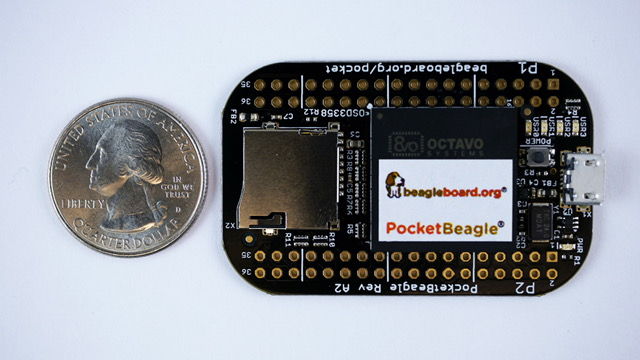

.. _pocketbeagle-home:

PocketBeagle
###################

.. admonition:: Contributors
   
   - Maintaining author: `Jason Kridner <jkridner@beagleboard.org>`_
   - Contributing Editor: `Cathy Wicks  <cathy@beagleboard.org>`_

PocketBeagle is an ultra-tiny-yet-complete open-source USB-key-fob computer. 
PocketBeagle features an incredible low cost, slick design and simple usage, 
making PocketBeagle the ideal development board for beginners and professionals alike. 

.. toctree::
   :maxdepth: 1

   ch01.rst
   ch02.rst
   ch03.rst
   ch04.rst
   ch05.rst
   ch06.rst
   ch07.rst
   ch08.rst
   ch09.rst
   ch10.rst
   ch11.rst