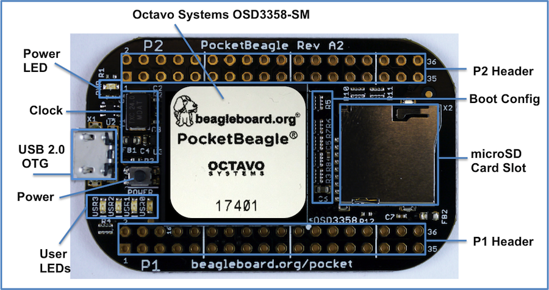

.. _pocketbeagle_overview:

PocketBeagle Overview
=============================

PocketBeagle is built around Octavo Systems' OSD335x-SM
System-In-Package that integrates a high-performance Texas Instruments
AM3358 processor, 512MB of DDR3, power management, nonvolatile serial
memory and over 100 passive components into a single package. This
integration saves board space by eliminating several packages that would
otherwise need to be placed on the board, but more notably simplifies
our board design so we can focus on the user experience.

The compact PocketBeagle design also offers access through the expansion
headers to many of the interfaces and allows for the use of add-on
boards called PocketCapes and Click Boards from MikroElektronika, to add
many different combinations of features. A user may also develop their
own board or add their own circuitry.

.. _pocketbeagle_features_and_specification:

PocketBeagle Features and Specification
~~~~~~~~~~~~~~~~~~~~~~~~~~~~~~~~~~~~~~~~~~~

This section covers the specifications and features of the board in a
chart and provides a high level description of the major components and
interfaces that make up the board.

.. table:: PocketBeagle Features
                              

    +-----------------------+---------------------------------------------+
    | **Feature**           | ''''''                                      |
    +=======================+=============================================+
    | System-In-Package     | Octavo Systems OSD335x-SM in 256 Ball BGA   |
    |                       | (21mm x 21mm)                               |
    +-----------------------+---------------------------------------------+
    | SiP Incorporates      |                                             |
    +-----------------------+---------------------------------------------+
    | Processor             | Texas Instruments 1GHz Sitara™ AM3358 ARM®  |
    |                       | Cortex®-A8 with NEON floating-point         |
    |                       | accelerator                                 |
    +-----------------------+---------------------------------------------+
    | Graphics Engine       | Imagination Technologies PowerVR SGX530     |
    |                       | Graphics Accelerator                        |
    +-----------------------+---------------------------------------------+
    | Real-Time Units       | 2x programmable real-time unit (PRU) 32-bit |
    |                       | 200MHz microcontrollers with single-cycle   |
    |                       | I/O latency                                 |
    +-----------------------+---------------------------------------------+
    | Coprocessor           | ARM® Cortex®-M3 for power management        |
    |                       | functions                                   |
    +-----------------------+---------------------------------------------+
    | SDRAM Memory          | 512MB DDR3 800MHz RAM                       |
    +-----------------------+---------------------------------------------+
    | Non-Volatile Memory   | 4KB I2C EEPROM for board configuration      |
    |                       | information                                 |
    +-----------------------+---------------------------------------------+
    | Power Management      | TPS65217C PMIC along with TL5209 LDO to     |
    |                       | provide power to the system with integrated |
    |                       | 1-cell LiPo battery support                 |
    +-----------------------+---------------------------------------------+
    | Connectivity          |                                             |
    +-----------------------+---------------------------------------------+
    | SD/MMC                | Bootable microSD card slot                  |
    +-----------------------+---------------------------------------------+
    | USB                   | High speed USB 2.0 OTG (host/client)        |
    |                       | micro-B connector                           |
    +-----------------------+---------------------------------------------+
    | Debug Support         | JTAG test points and gdb/other monitor-mode |
    |                       | debug possible                              |
    +-----------------------+---------------------------------------------+
    | Power Source          | microUSB connector, also expansion header   |
    |                       | options (battery, VIN or USB-VIN)           |
    +-----------------------+---------------------------------------------+
    | User I/O              | Power Button with press detection interrupt |
    |                       | via TPS65217C PMIC                          |
    +-----------------------+---------------------------------------------+
    | Expansion Header      |                                             |
    +-----------------------+---------------------------------------------+
    | USB                   | High speed USB 2.0 OTG (host/client)        |
    |                       | control signals                             |
    +-----------------------+---------------------------------------------+
    | Analog Inputs         | 8 analog inputs with 6 @ 1.8V and 2 @ 3.3V  |
    |                       | along with 1.8V references                  |
    +-----------------------+---------------------------------------------+
    | Digital I/O           | 44 digital GPIOs accessible with 18 enabled |
    |                       | by default including 2 shared with the 3.3V |
    |                       | analog input pins                           |
    +-----------------------+---------------------------------------------+
    | UART                  | 3 UARTs accessible with 2 enabled by        |
    |                       | default                                     |
    +-----------------------+---------------------------------------------+
    | I2C                   | 2 I2C busses enabled by default             |
    +-----------------------+---------------------------------------------+
    | SPI                   | 2 SPI busses with single chip selects       |
    |                       | enabled by default                          |
    +-----------------------+---------------------------------------------+
    | PWM                   | 4 Pulse Width Modulation outputs accessible |
    |                       | with 2 enabled by default                   |
    +-----------------------+---------------------------------------------+
    | QEP                   | 2 Quadrature encoder inputs accessible      |
    +-----------------------+---------------------------------------------+
    | CAN                   | 2 CAN bus controllers accessible            |
    +-----------------------+---------------------------------------------+

.. _osd3358_512m_bsm_system_in_package:

OSD3358-512M-BSM System in Package
^^^^^^^^^^^^^^^^^^^^^^^^^^^^^^^^^^^^^^^^

The Octavo Systems OSD3358-512M-BSM System-In-Package (SiP) is part of a
family of products that are building blocks designed to allow easy and
cost-effective implementation of systems based in Texas Instruments
powerful Sitara AM335x line of processors. The OSD335x-SM integrates the
AM335x along with the TI TPS65217C PMIC, the TI TL5209 LDO, up to 1 GB
of DDR3 Memory, a 4 KB EEPROM for non-volatile configuration storage and
resistors, capacitors and inductors into a single 21mm x 21mm
design-in-ready package.

With this level of integration, the OSD335x-SM family of SiPs allows
designers to focus on the key aspects of their system without spending
time on the complicated high-speed design of the processor/DDR3
interface or the PMIC power distribution. It reduces size and complexity
of design.

Full Datasheet and more information is available at
`octavosystems.com/octavo_products/osd335x-sm/ <https://octavosystems.com/octavo_products/osd335x-sm/>`__

.. _board_component_locations:

Board Component Locations
~~~~~~~~~~~~~~~~~~~~~~~~~~~~~

This section describes the key components on the board, their location
and function.

Figure below shows the locations of the devices, connectors, LEDs,
and switches on the PCB layout of the board.

   Key Board Component Locations

**Key Components**

-  **The Octavo Systems OSD3358-512M-BSM System-In-Package** is the
   processor system for the board
-  **P1 and P2 Headers** come unpopulated so a user may choose their
   orientation
-  **User LEDs** provides 4 programmable blue LEDs
-  **Power BUTTON** can be used to power up or power down the board (see
   section 3.3.3 for details)
-  **USB 2.0 OTG** is a microUSB connection to a PC that can also power
   the board
-  **Power LED** provides communication regarding the power to the board
-  **microSD** slot is where a microSD card can be installed.