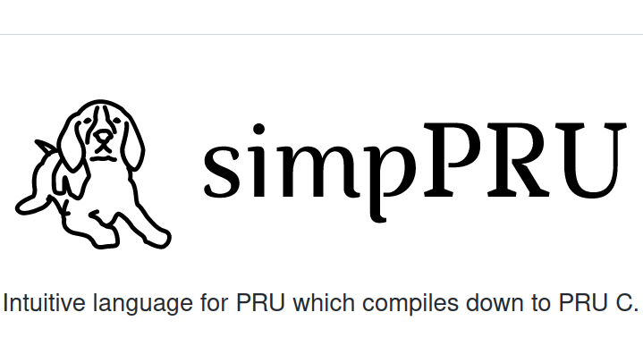

.. _sippru_examples:

simpPRU Examples
##################

These are the examples which have been tested on simpPRU.These examples will serve as a guide for the users to implement.
 

.. toctree::
   :maxdepth: 1

   delay.rst
   digital_read.rst
   digital_write.rst
   hcsr04_example_rpmsg.rst
   hcsr04_sensor.rst
   button_click_rpmsg.rst
   led_blink_button.rst
   led_blink_for.rst
   led_blink_while.rst
   led_blink.rst
   led_blink_counter.rst
   read_counter.rst
   rpmsg_example.rst
   rpmsg_pru_calculator.rst

   

