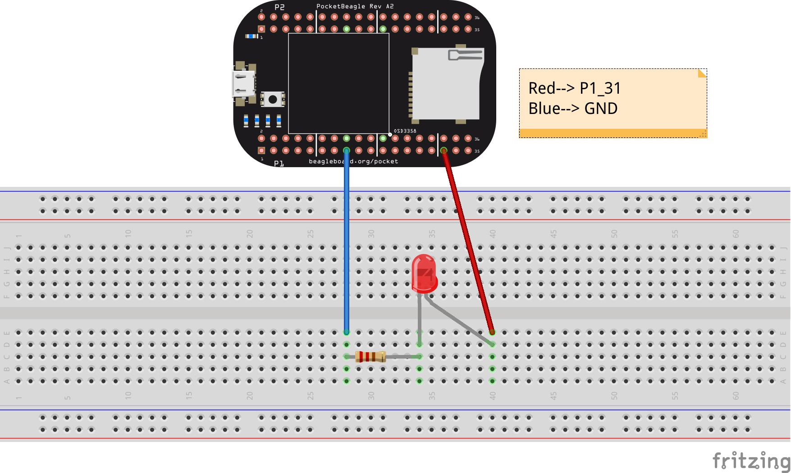

Digital write example
=====================

!!! info “Schematic” === “Pocket Beagle” |image0|

::

   === "BeagleBone Black / Beagle Bone Black Wireless"
      

Code
----

.. code:: python

   while : true {
       digital_write(P1_31, true);
   }

-  Following code works on PocketBeagle, to use on other boards, please
   change the pins accordingly.

Explaination
------------

This code runs a never ending loop, since it is ``while : true``. Inside
``while`` it sets header pin P1_31 to HIGH.

