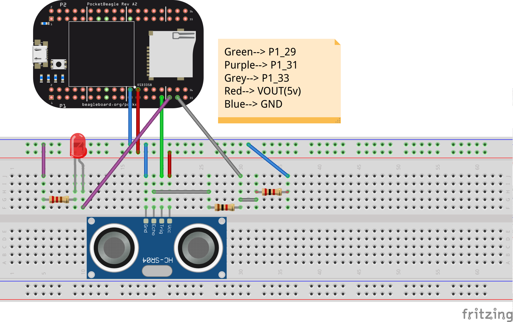

Ultrasonic range sensor example
===============================

Code
----

.. code:: python

   def measure : int : {
       bool timeout := false;
       int echo := 0;

       start_counter();
       
       while : read_counter() <= 2000 {
           digital_write(7, true);
       }
       digital_write(7, false);
       stop_counter();

       start_counter();
       while : not (digital_read(1)) and true {
           if : read_counter() > 200000000 {
               timeout := true;
               break;
           }
       }   
       stop_counter();
       
       if : not(timeout) and true {
           start_counter();
           while : digital_read(1) and true {
               if : read_counter() > 200000000 {
                   timeout := true;
                   break;
               }
               echo := read_counter();
           }
           stop_counter();
       }
       
       if : timeout and true {
           echo := 0;
       } 

       return echo;
   }

   while : true {
       int ping:= measure()*1000;

       if : ping > 292200 {
           digital_write(4, false);
       }
       else
       {
           digital_write(4, true);
       }
       delay(1000);
   }

-  Following code works on PocketBeagle, to use on other boards, please
   change the pins accordingly.

Explaination
------------

