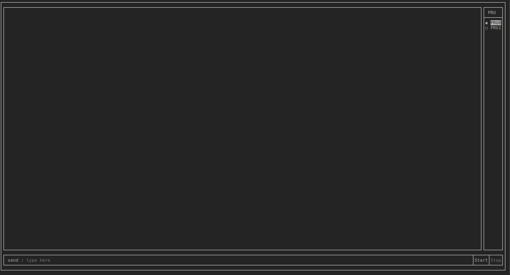
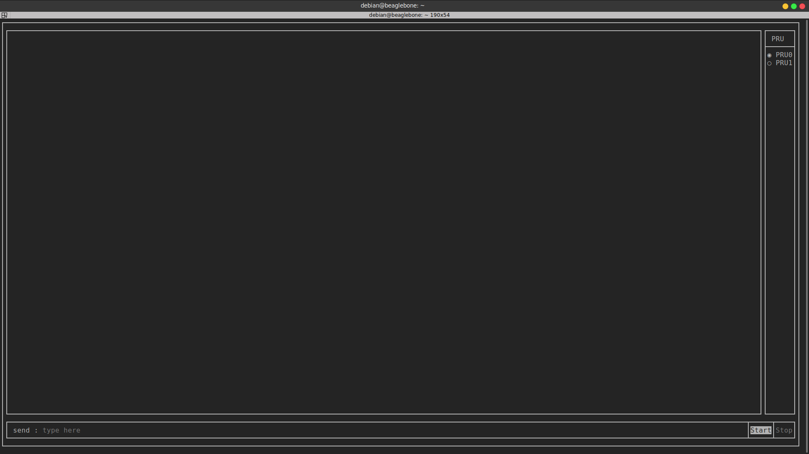
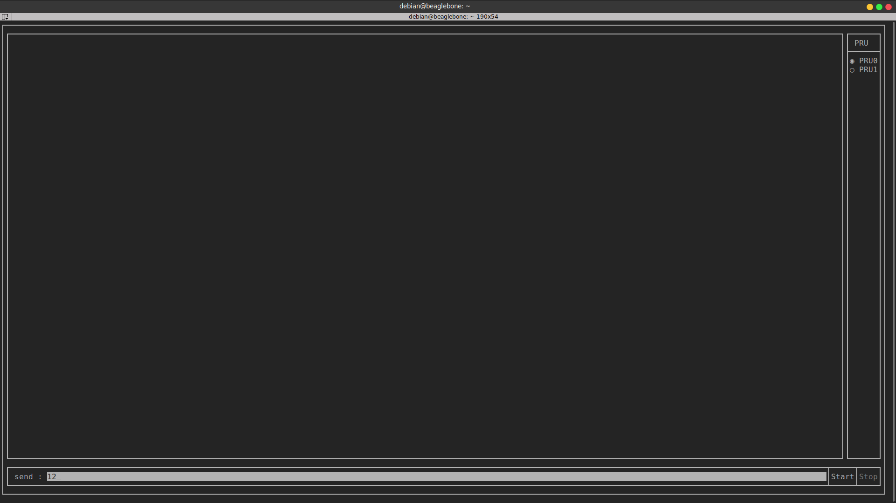
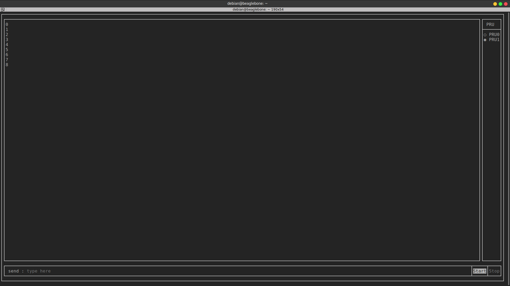
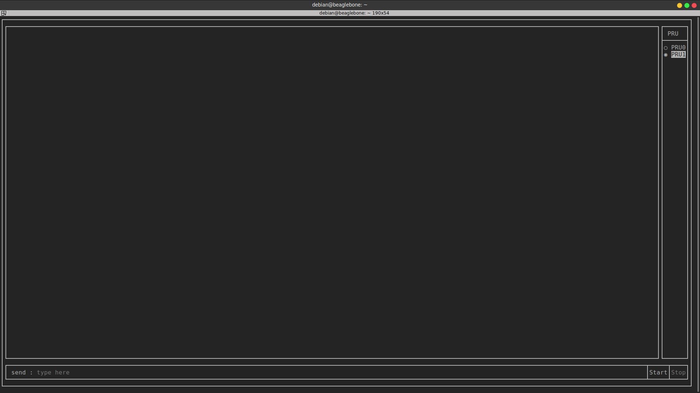

Usage(simppru-console)
=====

simppru-console is a console app, it can be used to send/receive message
to the PRU using RPMSG, and also start/stop the PRU. It is built to
facilitate easier way to use rpmsg and remoteproc API's to control and
communicate with the PRU

- **Warning** : Make sure to stop PRU before exiting. Press ``ctrl+c`` to exit

Features
--------

Use arrow keys to navigate around the textbox and buttons.

Start/stop buttons
~~~~~~~~~~~~~~~~~~

Use these button to start/stop the selected PRU. If PRU is already
running, on starting simppru-console, it is automatically stopped.

Send message to PRU
~~~~~~~~~~~~~~~~~~~

Use this text box to send data to the PRU, only *Integers* are
supported. On pressing enter, the typed message is sent.

PRU0 is running echo program, whatever is sent is echoed back.

Receive message from PRU
~~~~~~~~~~~~~~~~~~~~~~~~

The large box in the screen shows data received from the PRU, It runs
using a for loop, which checks if new message is arrived every 10 ms.

-  PRU is running echo program, whatever is sent is echoed back.

.. image:: images/receive_screen_2.png
   :width: 598
   :align: center
   :height: 400
   :alt: Echoing program

-  PRU is running countup program, it sends a increasing count every 1
   second, which starts from 0

Change PRU ID
~~~~~~~~~~~~~

Using the radio box in the upper right corner, one can change the PRU
id, i.e. if one wants to use the features for PRU0 or PRU1

