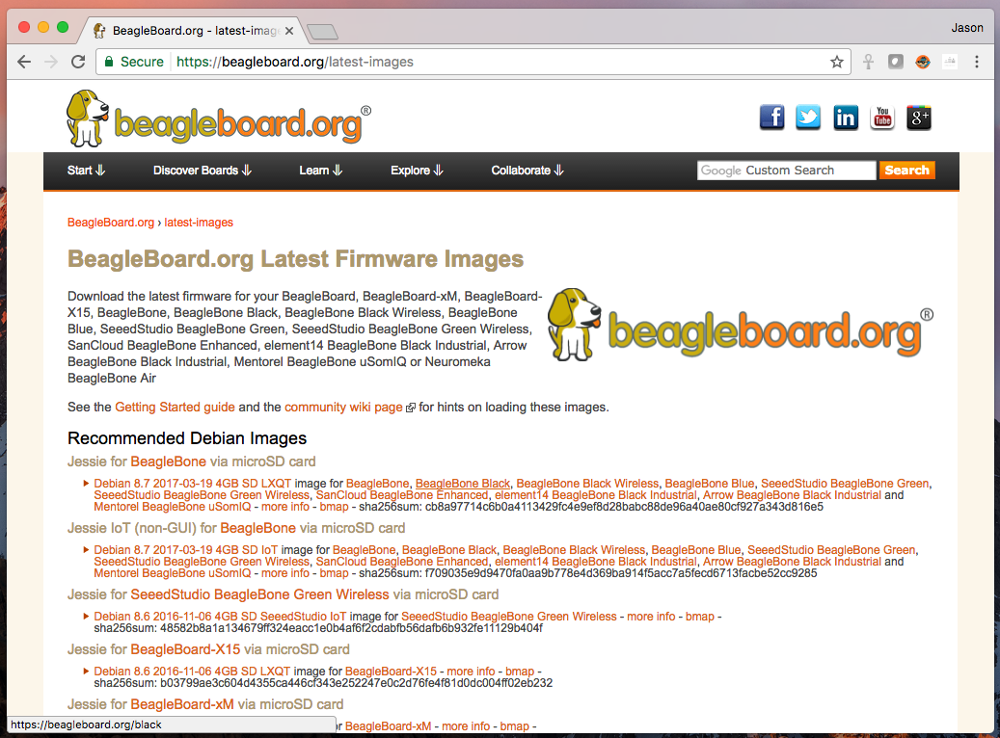
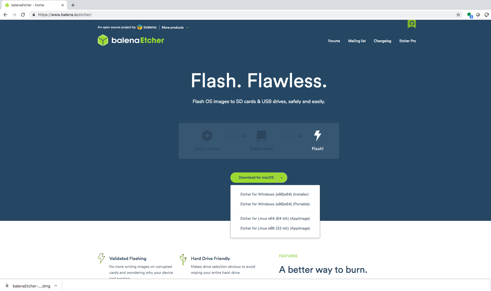
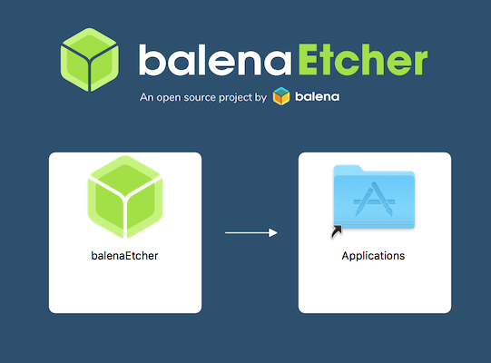
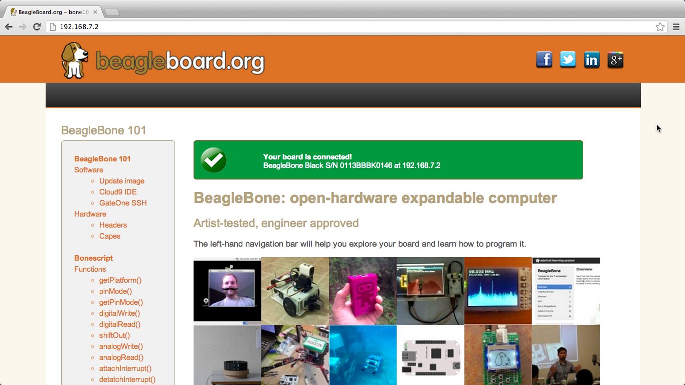

Getting Started
===============

Beagles are tiny computers ideal for learning and prototyping with
electronics. Read the step-by-step getting started tutorial below to
begin developing with your Beagle in minutes.

.. _update:

Update board with latest software
=================================

This step may or may not be necessary, depending on how old a software
image you already have, but executing this, the longest, step will
ensure the rest will go as smooth as possible.

Step #0.A: Download the latest software image
~~~~~~~~~~~~~~~~~~~~~~~~~~~~~~~~~~~~~~~~~~~~~

Download the lastest Debian image from
`beagleboard.org/latest-images <https://beagleboard.org/latest-images>`__.
The "IoT" images provide more free disk space if you don't need to use a
graphical user interface (GUI).

Note: Due to sizing necessities, this download may take 30 minutes or
more.

The Debian distribution is provied for the boards. The file you download
will have an .img.xz extension. This is a compressed sector-by-sector
image of the SD card.

|image0|

Step #0.B: Install SD card programming utility
~~~~~~~~~~~~~~~~~~~~~~~~~~~~~~~~~~~~~~~~~~~~~~

Download and install `balenaEtcher <https://www.balena.io/etcher/>`__.

| |image1|
| |image2|

Step #0.C: Connect SD card to your computer
~~~~~~~~~~~~~~~~~~~~~~~~~~~~~~~~~~~~~~~~~~~

Use your computer's SD slot or a USB adapter to connect the SD card to
your computer.

Step #0.D: Write the image to your SD card
~~~~~~~~~~~~~~~~~~~~~~~~~~~~~~~~~~~~~~~~~~

Use Etcher to write the image to your SD card. Etcher will transparently
decompress the image on-the-fly before writing it to the SD card.

|image3|

Step #0.E: Eject the SD card
~~~~~~~~~~~~~~~~~~~~~~~~~~~~

Eject the newly programmed SD card.

Step #0.F: Boot your board off of the SD card
~~~~~~~~~~~~~~~~~~~~~~~~~~~~~~~~~~~~~~~~~~~~~

Insert SD card into your (powered-down) board, hold down the USER/BOOT
button (if using Black) and apply power, either by the USB cable or 5V
adapter.

If using an original BeagleBone or PocketBeagle, you are done.

If using BeagleBone Black, BeagleBone Blue, BeagleBone AI or other board
with on-board eMMC flash and you desire to write the image to your
on-board eMMC, you'll need to follow the instructions at
http://elinux.org/Beagleboard:BeagleBoneBlack_Debian#Flashing_eMMC. When
the flashing is complete, all 4 USRx LEDs will be steady on or off. The
latest Debian flasher images automatically power down the board upon
completion. *This can take up to 45 minutes.* Power-down your board,
*remove the SD card* and apply power again to finish.

Start your Beagle
=================

*If any step fails, it is recommended to update to the*\ `latest software image <#update>`__\ *using the instructions above.*
~~~~~~~~~~~~~~~~~~~~~~~~~~~~~~~~~~~~~~~~~~~~~~~~~~~~~~~~~~~~~~~~~~~~~~~~~~~~~~~~~~~~~~~~~~~~~~~~~~~~~~~~~~~~~~~~~~~~~~~~~~~~~

|image4| **Power and boot**
~~~~~~~~~~~~~~~~~~~~~~~~~~~

.. container::

   Most Beagles include a USB cable, providing a convenient way to
   provide both power to your Beagle and connectivity to your computer.
   If you provide your own, ensure it is of good quality.

   Alternatively, your Beagle may have a barrel jack. The voltage should
   be 5V except for BeagleBoard-X15 and BeagleBone Blue which use 12V.

   *Note that BeagleBoard-X15 must always be powered by a 12V adapter
   with a barrel jack.*
   If you are using your Beagle with an `SD (microSD)
   card <https://en.wikipedia.org/wiki/Secure_Digital>`__, make sure it
   is inserted ahead of providing power. Most Beagles include programmed
   on-board flash and therefore do not require an SD card to be
   inserted.

   You'll see the power (PWR or ON) LED lit steadily. Within a minute or
   so, you should see the other LEDs blinking in their default
   configurations. Consult the Quick Start Guide (QSG) or System
   Reference Manual (SRM) for your board to locate these LEDs.

   -  USR0 is typically configured at boot to blink in a heartbeat
      pattern
   -  USR1 is typically configured at boot to light during SD (microSD)
      card accesses
   -  USR2 is typically configured at boot to light during CPU activity
   -  USR3 is typically configured at boot to light during eMMC accesses
   -  USR4/WIFI is typically configured at boot to light with WiFi
      (client) network association (*BeagleBone Blue and BeagleBone AI
      only*)

|image5|\ **Enable a network connection**
~~~~~~~~~~~~~~~~~~~~~~~~~~~~~~~~~~~~~~~~~

If connected via USB, a network adapter should show up on your computer.
Your Beagle should be running a DHCP server that will provide your
computer with an IP address of either 192.168.7.1 or 192.168.6.1,
depending on the type of USB network adapter supported by your
computer's operating system. Your Beagle will reserve 192.168.7.2 or
192.168.6.2 for itself.

If your Beagle includes WiFi, an access point called "BeagleBone-XXXX"
where "XXXX" varies between boards. The access point password defaults
to "BeagleBone". Your Beagle should be running a DHCP server that will
provide your computer with an IP address in the 192.168.8.x range and
reserve 192.168.8.1 for itself.

If your Beagle is connected to your local area network (LAN) via either
Ethernet or WiFi, it will utilize
`mDNS <https://en.wikipedia.org/wiki/Multicast_DNS>`__ to broadcast
itself to your computer. If your computer supports mDNS, you should see
your Beagle as beaglebone.local. *Non-BeagleBone boards will utilize
alternate names. Multiple BeagleBone boards on the same network will add
a suffix such as beaglebone-2.local.*

The below table summarizes the typical addresses and should dynamically
update to indicate an active connection.</>

Note: You must "load unsafe scripts" or load\ `this
page <http://beagleboard.org/getting-started>`__\ without HTTPS security
for the automatic detection to work.

================== =============== =================== ========
IP Address         Connection Type Operating System(s) Status
================== =============== =================== ========
192.168.7.2        USB             Windows             Inactive
192.168.6.2        USB             Mac OS X, Linux     Inactive
192.168.8.1        WiFi            all                 Inactive
beaglebone.local   all             mDNS enabled        Inactive
beaglebone-2.local all             mDNS enabled        Inactive
================== =============== =================== ========

|image6|\ **Browse to your Beagle**
~~~~~~~~~~~~~~~~~~~~~~~~~~~~~~~~~~~

Using either `Chrome <https://www.google.com/chrome>`__ or
`Firefox <http://www.mozilla.org/firefox>`__ (Internet Explorer will
**NOT** work), browse to the web server running on your board. It will
load a presentation showing you the capabilities of the board. Use the
arrow keys on your keyboard to navigate the presentation.

-  Click here to launch: http://192.168.7.2
   Older software images require you to EJECT the BEAGLE_BONE drive to
   start the network. With the latest software image, that step is no
   longer required.

|image7|

Troubleshooting
---------------

*Do not use Internet Explorer.*

Virtual machines are not recommended when using the direct USB
connection. It is recommended you use only network connections to your
board if you are using a virtual machine.

When using 'ssh' with the provided image, the username is 'debian' and
the password is 'temppwd'.

With the latest images, *it should no longer be necessary to install
drivers* for your operating system to give you network-over-USB access
to your Beagle. In case you are running an older image, an older
operating system or need additional drivers for serial access to older
boards, links to the old drivers are below.

Operating System

USB Drivers

Comments

Windows (64-bit)

`64-bit
installer <https://beagleboard.org/static/Drivers/Windows/BONE_D64.exe>`__

If in doubt, try the 64-bit installer first.

-  **Note #1:** Windows Driver Certification warning may pop up two or
   three times. Click "Ignore", "Install" or "Run"
-  **Note #2:** To check if you're running 32 or 64-bit Windows see
   this:
   `support.microsoft.com/kb/827218 <https://support.microsoft.com/kb/827218>`__.
-  **Note #3:** On systems without the latest service release, you may
   get an error (0xc000007b). In that case, please install the following
   and retry:
   `www.microsoft.com/en-us/download/confirmation.aspx?id=13523 <https://www.microsoft.com/en-us/download/confirmation.aspx?id=13523>`__.
-  **Note #4:** You may need to reboot Windows.
-  **Note #5:** These drivers have been tested to work up to Windows 10

Windows (32-bit)

`32-bit
installer <https://beagleboard.org/static/Drivers/Windows/BONE_DRV.exe>`__

Mac OS X

| `Network <https://beagleboard.org/static/Drivers/MacOSX/RNDIS/HoRNDIS.pkg>`__
| `Serial <https://beagleboard.org/static/Drivers/MacOSX/FTDI/EnergiaFTDIDrivers2.2.18.pkg>`__

Install both sets of drivers.

Linux

`mkudevrule.sh <https://beagleboard.org/static/Drivers/Linux/FTDI/mkudevrule.sh>`__

Driver installation isn't required, but you might find a few udev rules
helpful.

**Note:** Additional FTDI USB to serial/JTAG information and drivers are
available from
`www.ftdichip.com/Drivers/VCP.htm <https://www.ftdichip.com/Drivers/VCP.htm>`__.

**Note:** Additional USB to virtual Ethernet information and drivers are
available from
`www.linux-usb.org/gadget/ <https://www.linux-usb.org/gadget/>`__ and
`joshuawise.com/horndis <https://joshuawise.com/horndis>`__.

Visit `beagleboard.org/support <https://beagleboard.org/support>`__ for
additional debugging tips.

.. _distros:

Other currently available software images
-----------------------------------------

Some of the starting images below involve multiple steps to produce an
SD card image or otherwise change some of the steps above, so be sure to
read all the instructions on their pages. Choose the starting point you
want, download or produce the SD card image and follow the steps above.

At the time of release, not all of these distributions support
BeagleBone Black, but should soon.

-  Texas Instruments releases:
   `Android <https://beagleboard.org/project/android/>`__,
   `Linux <https://beagleboard.org/project/amsdk/>`__, `StarterWare (no
   OS) <https://beagleboard.org/project/starterware/>`__
-  Linux: `Debian <https://beagleboard.org/project/Debian/>`__,
   `Angstrom Distribution <https://beagleboard.org/project/angstrom>`__,
   `Ubuntu <https://beagleboard.org/project/ubuntu/>`__,
   `ArchLinux <https://beagleboard.org/project/AM/>`__,
   `Gentoo <https://beagleboard.org/project/Gentoo/>`__,
   `Sabayon <https://beagleboard.org/project/sabayon/>`__,
   `Buildroot <https://beagleboard.org/project/buildroot/>`__,
   `Erlang <https://beagleboard.org/project/Nerves/>`__,
   `Fedora <https://beagleboard.org/project/fedora/>`__
-  Other:
   `QNX <https://beagleboard.org/project/QNX+Neutrino+on+OMAP/>`__,
   `FreeBSD <https://beagleboard.org/project/freebsd/>`__
-  `Projects page <https://beagleboard.org/project>`__

.. _hardware:

Hardware documentation
----------------------

Time to read that manual and check out the design materials:
`BeagleBoard <https://github.com/beagleboard/beagleboard>`__,
`BeagleBoard-xM <https://github.com/beagleboard/beagleboard-xm>`__,
`BeagleBoard-X15 <https://github.com/beagleboard/beagleboard-x15>`__,
`BeagleBone <https://github.com/beagleboard/beaglebone>`__, `BeagleBone
Black <https://github.com/beagleboard/beaglebone-black>`__, `BeagleBone
Black
Wireless <https://github.com/beagleboard/beaglebone-black-wireless>`__,
`BeagleBone Blue <https://github.com/beagleboard/beaglebone-blue>`__,
`PocketBeagle <https://github.com/beagleboard/pocketbeagle>`__, and
`BeagleBone AI <https://github.com/beagleboard/beaglebone-ai>`__.

Other links to design materials for various releases can be found at
`beagleboard.org/hardware/design <https://beagleboard.org/hardware/design>`__.

Books
-----

For a complete list of books on BeagleBone, see
`beagleboard.org/books <https://beagleboard.org/books>`__.

.. container::

   .. container::

      |image8|

   .. container::

      |image9|

   .. container::

      |image10|

   .. container::

      |image11|

`Bad to the Bone <https://bbb.io/bad-to-the-bone>`__
~~~~~~~~~~~~~~~~~~~~~~~~~~~~~~~~~~~~~~~~~~~~~~~~~~~~

Perfect for high-school seniors or freshman univerisity level text,
consider using "Bad to the Bone"

`BeagleBone Cookbook <https://bbb.io/cookbook>`__
~~~~~~~~~~~~~~~~~~~~~~~~~~~~~~~~~~~~~~~~~~~~~~~~~

A lighter treatment suitable for a bit broader audience without the
backgrounders on programming and electronics, consider "BeagleBone
Cookbook"

`Exploring BeagleBone <https://bbb.io/ebb>`__ and `Embedded Linux Primer <https://bbb.io/elp>`__
~~~~~~~~~~~~~~~~~~~~~~~~~~~~~~~~~~~~~~~~~~~~~~~~~~~~~~~~~~~~~~~~~~~~~~~~~~~~~~~~~~~~~~~~~~~~~~~~

To take things to the next level of detail, consider "Exploring
BeagleBone" which can be considered the missing software manual and
utilize "Embedded Linux Primer" as a companion textbook to provide a
strong base on embedded Linux suitable for working with any hardware
that will run Linux.

.. |image3| image:: images/write-latestimage.png
   :width: 75.0%

.. |image6| image:: images/btn_step3.gif
   :class: steps

.. |image8| image:: images/bad-to-the-bone.jpg
   :target: https://bbb.io/bad-to-the-bone
.. |image9| image:: images/beaglebone-cookbook.jpg
   :target: https://bbb.io/cookbook

.. |image11| image:: images/embedded-linux-primer.jpg
   :target: https://bbb.io/elp
