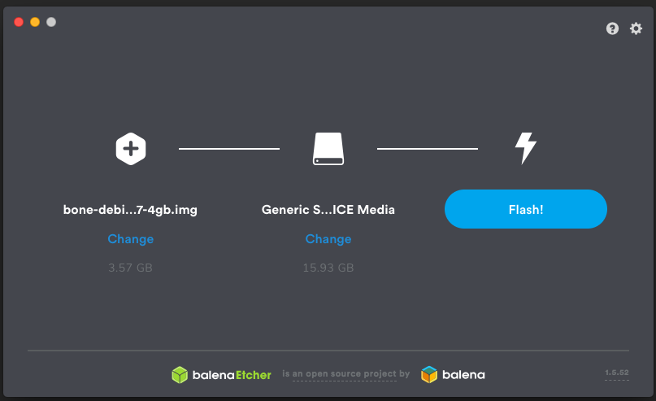
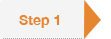
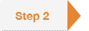
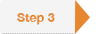
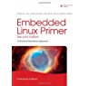

.. _beagleboard-getting-started:

Getting Started
##################

Beagles are tiny computers ideal for learning and prototyping with electronics. 
Read the step-by-step getting started tutorial below to begin developing with your Beagle in minutes.

Update board with latest software
------------------------------------

This step may or may not be necessary, depending on how old a software image you already have, 
but executing this, the longest, step will ensure the rest will go as smooth as possible.

Download the latest software image
********************************************
Download the lastest Debian image from `beagleboard.org/latest-images <https://beagleboard.org/latest-images>`_. 
The "IoT" images provide more free disk space if you don't need to use a graphical user interface (GUI). 

.. NOTE:: 
	Due to sizing necessities, this download may take 30 minutes or more. 

The Debian distribution is provied for the boards. The file you download will have an .img.xz extension. 
This is a compressed sector-by-sector image of the SD card.

|image0|

Install SD card programming utility
*********************************************
Download and install `balenaEtcher <https://www.balena.io/etcher/>`_.

|image1|
|image2|

Connect SD card to your computer
*******************************************

Use your computer's SD slot or a USB adapter to connect the SD card to your computer.

Write the image to your SD card
*****************************************

Use Etcher to write the image to your SD card. Etcher will transparently decompress the 
image on-the-fly before writing it to the SD card.

|image3|

Eject the SD card
****************************
Eject the newly programmed SD card.

Boot your board off of the SD card
********************************************
Insert SD card into your (powered-down) board, hold down the USER/BOOT button (if using Black) 
and apply power, either by the USB cable or 5V adapter. 
	
If using an original BeagleBone or PocketBeagle, you are done. 
	
If using BeagleBone Black, BeagleBone Blue, BeagleBone AI, BeagleBone AI-64 or other board with on-board eMMC 
flash and you desire to write the image to your on-board eMMC, you'll need to follow the 
instructions at http://elinux.org/Beagleboard:BeagleBoneBlack_Debian#Flashing_eMMC. 
When the flashing is complete, all 4 USRx LEDs will be steady on or off. The latest Debian 
flasher images automatically power down the board upon completion. This can take up to 45 minutes. 
Power-down your board, remove the SD card and apply power again to finish.

Start your Beagle
------------------

If any step fails, it is recommended to update to the 
`latest software image <https://beagleboard.org/latest-images>`_ 
using the instructions above.

Power and boot
----------------

Most Beagles can be powered via a USB cable, providing a convenient way to provide both power to your 
Beagle and connectivity to your computer. Be sure the cable is of good quality and your source can provide enough power.

Alternatively, your Beagle may have a barrel jack.

.. Note::
	Use only a 5V center positive adapter for all Beagles except BeagleBone Blue and BeagleBoard-X15 (12V).

If you are using your Beagle with an `SD (microSD) card <https://en.wikipedia.org/wiki/Secure_Digital>`_, make sure it is inserted ahead of providing power. 
Most Beagles include programmed on-board flash and therefore do not require an SD card to be inserted.

You'll see the power (PWR or ON) LED lit steadily. Within a minute or so, you should see the other LEDs 
blinking in their default configurations. Consult the Quick Start Guide (QSG) or System Reference 
Manual (SRM) for your board to locate these LEDs.

- USR0 is typically configured at boot to blink in a heartbeat pattern.
- USR1 is typically configured at boot to light during SD (microSD) card accesses.
- USR2 is typically configured at boot to light during CPU activity.
- USR3 is typically configured at boot to light during eMMC accesses.
- USR4/WIFI is typically configured at boot to light with WiFi (client) network association (BeagleBone Blue and BeagleBone AI only).

Enable a network connection
----------------------------

If connected via USB, a network adapter should show up on your computer. 
Your Beagle should be running a DHCP server that will provide your computer 
with an IP address of either 192.168.7.1 or 192.168.6.1, depending on the 
type of USB network adapter supported by your computer's operating system. 
Your Beagle will reserve 192.168.7.2 or 192.168.6.2 for itself.

If your Beagle includes WiFi, an access point called "BeagleBone-XXXX" where "XXXX" 
varies between boards. The access point password defaults to "BeagleBone". 
Your Beagle should be running a DHCP server that will provide your computer 
with an IP address in the 192.168.8.x range and reserve 192.168.8.1 for itself.

If your Beagle is connected to your local area network (LAN) via either Ethernet or WiFi, 
it will utilize `mDNS <https://en.wikipedia.org/wiki/Multicast_DNS>`_ to broadcast itself 
to your computer. If your computer supports mDNS, you should see your Beagle as beaglebone.local. 
Non-BeagleBone boards will utilize alternate names. Multiple BeagleBone boards on the same 
network will add a suffix such as beaglebone-2.local.

The below table summarizes the typical addresses.

.. list-table::
    :header-rows: 1

    * - List table
      - Connection type
      - Operating System(s)
      - Status
    * - http://192.168.7.2
      - USB
      - Windows
      - Inactive
    * - http://192.168.6.2
      - USB
      - Mac OS X, Linux
      - Inactive
    * - http://192.168.8.1
      - WiFi
      - all
      - Inactive
    * - http://beaglebone.local
      - all
      - mDNS enabled
      - Inactive
    * - http://beaglebone-2.local
      - all
      - mDNS enabled
      - Inactive

Browse to your beagle
----------------------

Use either `Firefox <http://www.mozilla.org/firefox>`_ or `Chrome <https://www.google.com/chrome>`_ 
(Internet Explorer will NOT work), browse to the web server running on your board. It will load a presentation 
showing you the capabilities of the board. Use the arrow keys on your keyboard to navigate the presentation.

Click here to launch: https://192.168.7.2 Older software images require you to EJECT the BEAGLE_BONE 
drive to start the network. With the latest software image, that step is no longer required.

Troubleshooting
------------------

Do not use Internet Explorer.

Virtual machines are not recommended when using the direct USB connection. 
It is recommended you use only network connections to your board if you are using a virtual machine.

When using 'ssh' with the provided image, the username is 'debian' and the password is 'temppwd'.

With the latest images, it should no longer be necessary to install drivers for your operating 
system to give you network-over-USB access to your Beagle. In case you are running an older image, 
an older operating system or need additional drivers for serial access to older boards, links to the old drivers are below.

.. list-table::
    :header-rows: 1

    * - Operating system
      - USB Driver
      - Comments
    * - Windows (64-bit)
      - `64-bit installer <https://beagleboard.org/static/Drivers/Windows/BONE_D64.exe>`_
      - If in doubt, try the 64-bit installer first.
    * - Windows (32-bit)
      - `32-bit installer <https://beagleboard.org/static/Drivers/Windows/BONE_DRV.exe>`_
      - 
    * - Mac OS X
      - `Network Serial <https://beagleboard.org/static/Drivers/MacOSX/FTDI/EnergiaFTDIDrivers2.2.18.pkg>`_
      - Install both sets of drivers.
    * - Linux
      - `mkudevrules.sh <https://beagleboard.org/static/Drivers/Linux/FTDI/mkudevrule.sh>`_
      - Driver installation isn't required, but you might find a few udev rules helpful.

.. Note::
	For Windows (64-bit):

	1. Windows Driver Certification warning may pop up two or three times. Click "Ignore", "Install" or "Run".
	2. To check if you're running 32 or 64-bit Windows see this:  `support.microsoft.com/kb/827218 <https://support.microsoft.com/kb/827218>`_.
	3. On systems without the latest service release, you may get an error (0xc000007b). In that case, please install the following and retry: https://www.microsoft.com/en-us/download/confirmation.aspx?id=13523
	4. You may need to reboot Windows.
	5. These drivers have been tested to work up to Windows 10

	Additional FTDI USB to serial/JTAG information and drivers are available from https://www.ftdichip.com/Drivers/VCP.htm

	Additional USB to virtual Ethernet information and drivers are available from https://www.linux-usb.org/gadget/ and https://joshuawise.com/horndis

	Visit https://beagleboard.org/support for additional debugging tips.

Other currently available software images
------------------------------------------

Some of the starting images below involve multiple steps to produce an SD card image or otherwise 
change some of the steps above, so be sure to read all the instructions on their pages. 
Choose the starting point you want, download or produce the SD card image and follow the steps above.

At the time of release, not all of these distributions support BeagleBone Black, but should soon.

- Texas Instruments releases: `Android <https://beagleboard.org/project/android/>`_, `Linux <https://beagleboard.org/project/amsdk/>`_, `StarterWare (no OS) <https://beagleboard.org/project/starterware/>`_
- Linux: `Debian <https://beagleboard.org/project/Debian/>`_, `Angstrom Distribution <https://beagleboard.org/project/angstrom>`_, `Ubuntu <https://beagleboard.org/project/ubuntu/>`_, `ArchLinux <https://beagleboard.org/project/AM/>`_, `Gentoo <https://beagleboard.org/project/Gentoo/>`_, `Sabayon <https://beagleboard.org/project/sabayon/>`_, `Buildroot <https://beagleboard.org/project/buildroot/>`_, `Erlang <https://beagleboard.org/project/Nerves/>`_, `Fedora <https://beagleboard.org/project/fedora/>`_
- Other: `QNX <https://beagleboard.org/project/QNX+Neutrino+on+OMAP/>`_, `FreeBSD <https://beagleboard.org/project/freebsd/>`_
- `Project page<https://beagleboard.org/project>`_

Hardware documentation
--------------------------

Time to read that manual and check out the design materials: `BeagleBoard <https://github.com/beagleboard/beagleboard>`_, 
`BeagleBoard-xM <https://github.com/beagleboard/beagleboard-xm>`_, 
`BeagleBoard-x15 <https://github.com/beagleboard/beagleboard-x15>`_, 
`BeagleBone <https://github.com/beagleboard/beaglebone>`_, 
`BeagleBone Black <https://github.com/beagleboard/beaglebone-black>`_,  
`BeagleBone Black Wireless <https://github.com/beagleboard/beaglebone-black-wireless>`_, 
`BeagleBone Blue <https://github.com/beagleboard/beaglebone-blue>`_, 
`PocketBeagle <https://github.com/beagleboard/pocketbeagle>`_, 
`BeagleBone AI <https://github.com/beagleboard/beaglebone-ai>`_, 
`BeagleBone AI-64 <https://github.com/beagleboard/beaglebone-ai-64>`_

Other links to design materials for various releases can be found at https://beagleboard.org/hardware/design

Books
-----

For a complete list of books on BeagleBone, see `beagleboard.org/books <https://beagleboard.org/books>`_.

`Bad to the Bone <https://bbb.io/bad-to-the-bone>`_

Perfect for high-school seniors or freshman univerisity level text, consider using "Bad to the Bone"

`BeagleBone Cookbook <https://bbb.io/cookbook>`_

A lighter treatment suitable for a bit broader audience without the backgrounders on programming and 
electronics, consider "BeagleBone Cookbook"

`Exploring BeaglebBone <https://bbb.io/ebb>`_ and `Embedded Linux Primer <https://bbb.io/elp>`_

To take things to the next level of detail, consider "Exploring BeagleBone" which can be considered 
the missing software manual and utilize "Embedded Linux Primer" as a companion textbook to provide 
a strong base on embedded Linux suitable for working with any hardware that will run Linux.

